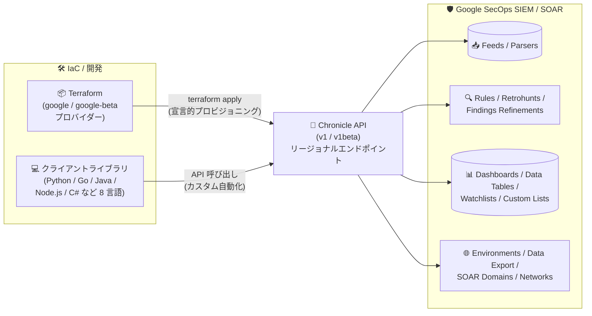

# Google SecOps SIEM: Chronicle API 対応の Terraform プロバイダーとクライアントライブラリ

**リリース日**: 2026-10-05

**サービス**: Google SecOps SIEM

**機能**: Chronicle API を使用した複数機能向けの Terraform プロバイダーとクライアントライブラリ

**ステータス**: Feature (Spotlight Feature)

📊 [このアップデートのインフォグラフィックを見る](https://takech9203.github.io/google-cloud-news-summary/20261005-google-secops-siem-terraform-client-libraries.html)

## 概要

Google SecOps SIEM の複数の機能について、Chronicle API を利用した Terraform プロバイダーと Google Cloud クライアントライブラリが利用可能になりました。対象となる機能は、Feeds (フィード)、Parsers (パーサー)、Rules (検出ルール)、Findings Refinements、Retrohunts、Dashboards (ダッシュボード)、Data Tables、Watchlists、Custom Lists、Environments、Environment Groups、Data Export、SOAR Domains、SOAR Networks と多岐にわたります。

Terraform プロバイダーにより、Google SecOps リソースをコードとして (Infrastructure as Code) プログラマブルにプロビジョニング・管理できるようになります。また、クライアントライブラリにより、開発者は好みのプログラミング言語で Google SecOps のカスタムインテグレーションを構築し、ワークフローを自動化できます。

Chronicle API は Google SecOps の新世代統合 API であり、Google の API Improvement Proposals (AIP) 標準に基づいて構築されています。リソース指向の一貫した設計により、インテグレーションを簡素化し、イディオマティックなクライアントライブラリによって開発を加速します。SOC (Security Operations Center) の構成を Git 管理したい SecOps チームや、Detection-as-Code を実践したいセキュリティエンジニアにとって重要なアップデートです。

**アップデート前の課題**

- Google SecOps のフィード設定、検出ルール、ダッシュボードなどのリソースは、主に UI または REST API (旧世代の Backstory API を含む) を通じた個別の手動管理が中心だった
- 旧世代の Backstory API は 2027 年 7 月 20 日に廃止予定であり、Google 管理のサービスアカウント (JSON キー) による認証が必要など、モダンな Google Cloud の認証・管理モデルと統合されていなかった
- 複数の環境 (開発・本番、マルチテナント) 間で SecOps の構成を一貫して複製・管理する標準的な IaC の仕組みがなかった

**アップデート後の改善**

- `google_chronicle_feed`、`google_chronicle_rule`、`google_chronicle_watchlist` などの Terraform リソースにより、SecOps の構成をコードとして宣言的に管理し、バージョン管理やレビュープロセスに組み込めるようになった
- C++、C#、Go、Java、Node.js、PHP、Python、Ruby の 8 言語の公式クライアントライブラリにより、認証・トークンリフレッシュ・トランスポート処理が自動化され、カスタムインテグレーションの開発工数が削減された
- Chronicle API (v1 / v1beta) ベースの統一されたリソースモデルにより、IAM ロール (Chronicle API Viewer / Editor) や Workload Identity Federation など Google Cloud 標準のセキュリティ機構を利用できるようになった

## アーキテクチャ図



Terraform とクライアントライブラリの双方が Chronicle API を経由して Google SecOps の各リソース (フィード、ルール、ダッシュボード、SOAR 設定など) をプログラマブルに管理する構成です。

## サービスアップデートの詳細

### 主要機能

1. **Terraform プロバイダー対応 (Infrastructure as Code)**
   - HashiCorp の `google` プロバイダー (Chronicle API v1) および `google-beta` プロバイダー (Chronicle API v1beta) で Google SecOps リソースを管理可能
   - `google_chronicle_feed`、`google_chronicle_parser`、`google_chronicle_parser_extension`、`google_chronicle_rule`、`google_chronicle_rule_deployment`、`google_chronicle_retrohunt`、`google_chronicle_findings_refinement`、`google_chronicle_findings_refinement_deployment`、`google_chronicle_native_dashboard`、`google_chronicle_dashboard_chart`、`google_chronicle_data_table`、`google_chronicle_data_table_row`、`google_chronicle_watchlist`、`google_chronicle_custom_list`、`google_chronicle_reference_list`、`google_chronicle_environment`、`google_chronicle_environment_group`、`google_chronicle_data_export`、`google_chronicle_soar_domain`、`google_chronicle_soar_network`、`google_chronicle_data_access_label`、`google_chronicle_data_access_scope` などのリソースが利用可能

2. **8 言語の Google Cloud クライアントライブラリ**
   - C++、C#、Go、Java、Node.js、PHP、Python、Ruby に対応
   - 認証、トークンリフレッシュ、トランスポートの詳細を自動処理し、記述すべきコード量を大幅に削減
   - 例: Python は `pip install --upgrade google-cloud-chronicle`、Go は `go get cloud.google.com/go/chronicle/apiv1`、Node.js は `npm install @google-cloud/chronicle` でインストール

3. **Chronicle API による統一されたリソースモデル**
   - Google の API Improvement Proposals (AIP) 標準に基づくリソース指向設計
   - リソースは `projects/{project}/locations/{location}/instances/{instance}` 配下の階層で表現され、Google Cloud プロジェクトの IAM と統合
   - UDM 検索、検出ルール、インシデント対応ワークフローを含む製品スイート全体を単一の統一 API で管理

## 技術仕様

### 対象機能と Terraform リソースの対応

| 対象機能 | 主な Terraform リソース |
|------|------|
| Feeds (データ取り込みフィード) | `google_chronicle_feed` |
| Parsers (パーサー / パーサー拡張) | `google_chronicle_parser`, `google_chronicle_parser_extension` |
| Rules (検出ルールとデプロイ) | `google_chronicle_rule`, `google_chronicle_rule_deployment` |
| Findings Refinements | `google_chronicle_findings_refinement`, `google_chronicle_findings_refinement_deployment` |
| Retrohunts (過去データへのルール適用) | `google_chronicle_retrohunt` |
| Dashboards | `google_chronicle_native_dashboard`, `google_chronicle_dashboard_chart` |
| Data Tables | `google_chronicle_data_table`, `google_chronicle_data_table_row` |
| Watchlists | `google_chronicle_watchlist` |
| Custom Lists / Reference Lists | `google_chronicle_custom_list`, `google_chronicle_reference_list` |
| Environments / Environment Groups | `google_chronicle_environment`, `google_chronicle_environment_group` |
| Data Export | `google_chronicle_data_export` |
| SOAR Domains / SOAR Networks | `google_chronicle_soar_domain`, `google_chronicle_soar_network` |

### クライアントライブラリの対応言語とインストール方法

| 言語 | インストール方法 |
|------|------|
| C++ | GitHub の google-cloud-cpp Quickstart に従う |
| C# | NuGet パッケージ `Google.Cloud.Chronicle.V1` |
| Go | `go get cloud.google.com/go/chronicle/apiv1` |
| Java | Maven/Gradle で `com.google.cloud:google-cloud-chronicle` (libraries-bom 経由) |
| Node.js | `npm install @google-cloud/chronicle` |
| PHP | `composer require google/cloud-chronicle` |
| Python | `pip install --upgrade google-cloud-chronicle` |
| Ruby | `gem install google-cloud-chronicle-v1` |

### 認証とエンドポイント

- **IAM ロール**: Chronicle API Viewer / Chronicle API Editor などの事前定義ロールまたはカスタムロールを Google Cloud プロジェクトで付与
- **OAuth スコープ**: `https://www.googleapis.com/auth/chronicle` (または広範な `https://www.googleapis.com/auth/cloud-platform`)。レガシースコープ `chronicle-backstory` ではアクセス不可
- **リージョナルエンドポイント**: Chronicle API はリージョナルサービスであり、SecOps インスタンスのリージョンに合わせたエンドポイント (例: `us-chronicle.googleapis.com`、`europe-west3-chronicle.googleapis.com`) を指定する必要がある
- **認証方式**: サービスアカウントまたは Workload Identity Federation に対応 (レガシーの Google 管理サービスアカウントは使用不可)

## 設定方法

### 前提条件

1. Google SecOps インスタンスが自身の Google Cloud プロジェクトにリンクされていること
2. 使用するサービスアカウントまたは外部 ID プリンシパルに Chronicle API の IAM ロール (Chronicle API Editor など) が付与されていること

### 手順

#### ステップ 1: クライアントライブラリのインストール (Python の例)

```bash
pip install --upgrade google-cloud-chronicle
```

ライブラリが認証・トークンリフレッシュ・トランスポートを自動的に処理します。`GOOGLE_APPLICATION_CREDENTIALS` 環境変数で認証情報を指定します。

#### ステップ 2: クライアントライブラリによるリソース操作 (Go の例: Reference List の一覧取得)

```go
client, err := chronicle.NewReferenceListClient(ctx,
    option.WithEndpoint("us-chronicle.googleapis.com:443"))
parent := fmt.Sprintf("projects/%s/locations/%s/instances/%s",
    project, location, instance)
req := &chroniclepb.ListReferenceListsRequest{Parent: parent}
it := client.ListReferenceLists(ctx, req)
```

リソースは `projects/{project}/locations/{location}/instances/{instance}` 形式の親リソース名で指定します。

#### ステップ 3: Terraform でのリソース管理

Terraform の `google` プロバイダー (v1 API) または `google-beta` プロバイダー (v1beta API) で、`google_chronicle_feed` や `google_chronicle_rule` などのリソースブロックを定義し、`terraform apply` でプロビジョニングします。各リソースの詳細な引数は Terraform Registry のドキュメントを参照してください。

## メリット

### ビジネス面

- **構成管理の標準化と監査性向上**: SecOps の構成 (検出ルール、フィード、ウォッチリストなど) を Git でバージョン管理し、変更レビュー・承認プロセスに組み込むことで、監査証跡とガバナンスを強化できる
- **マルチ環境展開の効率化**: Environments / Environment Groups を含む構成をコード化することで、複数環境・複数テナントへの一貫した展開を自動化し、運用コストを削減できる

### 技術面

- **Detection-as-Code の実現**: 検出ルール (`google_chronicle_rule`) とそのデプロイ (`google_chronicle_rule_deployment`)、Retrohunt までをコードとして管理し、CI/CD パイプラインに統合できる
- **開発工数の削減**: 8 言語のイディオマティックなクライアントライブラリが認証やトランスポートの詳細を抽象化し、生の REST リクエストを記述する場合に比べてコード量を大幅に削減できる
- **Google Cloud 標準のセキュリティ統合**: IAM ロールによるきめ細かなアクセス制御や Workload Identity Federation によるキーレス認証を利用できる

## デメリット・制約事項

### 制限事項

- Chronicle API はリージョナルサービスのため、SecOps インスタンスのリージョンと一致するエンドポイントを指定する必要がある (不一致の場合は接続エラーや 404 となる)
- 一部のリソースは `google-beta` プロバイダー (Chronicle API v1beta) でのみ提供されるものがあり、v1 と v1beta でリソースの提供範囲が異なる
- Feeds には読み取り専用 (read-only) のものが存在し、作成・更新・削除ができない場合がある

### 考慮すべき点

- レガシーの Backstory API / Ingestion API は 2027 年 7 月 20 日に廃止予定のため、既存のカスタムインテグレーションは Chronicle API ベースへの移行を計画する必要がある
- レガシー OAuth スコープ (`chronicle-backstory`) やレガシーサービスアカウントは Chronicle API では使用できないため、認証まわりの移行作業が必要
- UI での手動変更と Terraform 管理が混在すると構成ドリフトが発生するため、管理方針 (どのリソースを IaC 管理とするか) を明確にする必要がある

## ユースケース

### ユースケース 1: Detection-as-Code による検出ルールの CI/CD 管理

**シナリオ**: SOC チームが YARA-L 検出ルールを Git リポジトリで管理し、プルリクエストベースのレビューを経て本番の Google SecOps インスタンスにデプロイしたい。

**実装例**:
```hcl
resource "google_chronicle_rule" "suspicious_login" {
  project  = var.project_id
  location = "us"
  instance = var.secops_instance_id
  text     = file("${path.module}/rules/suspicious_login.yaral")
}

resource "google_chronicle_rule_deployment" "suspicious_login" {
  project  = var.project_id
  location = "us"
  instance = var.secops_instance_id
  rule     = google_chronicle_rule.suspicious_login.rule_id
  enabled  = true
}
```

**効果**: ルールの変更履歴が Git に残り、レビュー済みのルールのみが CI/CD パイプライン経由で自動デプロイされるため、検出品質とガバナンスが向上する。

### ユースケース 2: クライアントライブラリによる SecOps 運用の自動化

**シナリオ**: 脅威インテリジェンスチームが、外部の脅威フィードから取得した IoC (侵害指標) を Python スクリプトで定期的に Google SecOps の Reference List / Watchlist に反映したい。

**効果**: `google-cloud-chronicle` ライブラリが認証・リトライ・トランスポートを処理するため、少ないコードで信頼性の高い自動化が実現でき、手動でのリスト更新作業が不要になる。

### ユースケース 3: マルチ環境の SecOps 構成の複製

**シナリオ**: MSSP (マネージドセキュリティサービスプロバイダー) が、Environments / Environment Groups、フィード、パーサー、SOAR Domains / Networks を含む標準構成を複数の顧客環境に展開したい。

**効果**: Terraform モジュール化により、標準化された SecOps 構成を変数の差し替えだけで一貫して展開でき、環境構築のリードタイムと設定ミスを削減できる。

## 料金

Terraform プロバイダーおよびクライアントライブラリ自体の利用に追加料金は発表されていません。Google SecOps 自体の料金は、Google SecOps のパッケージ (ライセンス) 体系に基づきます。詳細は [Google SecOps の料金ページ](https://cloud.google.com/security/products/security-operations) を参照してください。

## 利用可能リージョン

Chronicle API はリージョナルサービスとして提供され、Google SecOps インスタンスが稼働する各リージョンのエンドポイント (例: `us-chronicle.googleapis.com`、`europe-west3-chronicle.googleapis.com`) を通じて利用します。利用可能なリージョンの一覧は [サービスエンドポイントのリファレンス](https://docs.cloud.google.com/chronicle/docs/reference/rest) を参照してください。

## 関連サービス・機能

- **Google SecOps SOAR**: 今回のアップデートで SOAR Domains / SOAR Networks も Terraform / クライアントライブラリの管理対象となり、SIEM と SOAR の構成を統一的にコード管理できる
- **Terraform on Google Cloud**: Google Cloud 全体の IaC 基盤。既存の Google Cloud リソース (VPC、IAM など) と SecOps リソースを同一の Terraform 構成で管理可能
- **Cloud IAM**: Chronicle API へのアクセス制御に Chronicle API Viewer / Editor などの IAM ロールを使用
- **Workload Identity Federation**: サービスアカウントキーを使わないキーレス認証で CI/CD パイプラインから Chronicle API を安全に呼び出し可能

## 参考リンク

- 📊 [インフォグラフィック](https://takech9203.github.io/google-cloud-news-summary/20261005-google-secops-siem-terraform-client-libraries.html)
- [公式リリースノート](https://docs.cloud.google.com/release-notes#October_05_2026)
- [Terraform reference (Google SecOps)](https://docs.cloud.google.com/chronicle/docs/terraform)
- [Client libraries (Google SecOps)](https://docs.cloud.google.com/chronicle/docs/libraries)
- [Google SecOps APIs and libraries overview](https://docs.cloud.google.com/chronicle/docs/reference/google-secops-api-libraries-overview)
- [Migrate from legacy SIEM API to Chronicle API](https://docs.cloud.google.com/chronicle/docs/administration/migrate-from-legacy-api-to-chronicle-api)

## まとめ

Google SecOps SIEM の主要リソースが Terraform と 8 言語のクライアントライブラリで管理可能になり、SOC 構成の IaC 化と Detection-as-Code の実践が公式にサポートされました。レガシー Backstory API の 2027 年 7 月の廃止も控えているため、既存のカスタムインテグレーションを持つチームは Chronicle API ベースのクライアントライブラリへの移行を早期に計画し、あわせて検出ルールやフィード構成の Terraform 管理への移行を検討することを推奨します。

---

**タグ**: Google SecOps, SIEM, SOAR, Chronicle API, Terraform, Infrastructure as Code, クライアントライブラリ, Detection as Code, セキュリティ運用
