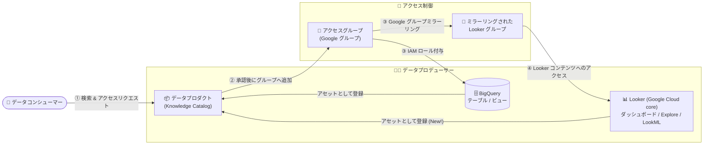

# Knowledge Catalog: データプロダクトの Looker (Google Cloud core) アセット対応 (GA)

**リリース日**: 2026-10-05

**サービス**: Knowledge Catalog

**機能**: データプロダクトにおける Looker (Google Cloud core) アセットのサポート

**ステータス**: GA (一般提供)

📊 [このアップデートのインフォグラフィックを見る](https://takech9203.github.io/google-cloud-news-summary/20261005-knowledge-catalog-looker-data-products.html)

## 概要

Knowledge Catalog (旧 Dataplex Universal Catalog) のデータプロダクト機能が、Looker (Google Cloud core) アセットに対応し、一般提供 (GA) となりました。これにより、Looker (Google Cloud core) のダッシュボード、ダッシュボードエレメント、Look、Explore、および LookML プロジェクト・モデル・ビューをデータプロダクトとしてパッケージ化し、ガバナンスを適用した上で組織内に共有できるようになります。

アクセス制御には、Looker (Google Cloud core) の Google グループミラーリングと IAM アクセス制御を組み合わせて使用します。データプロダクトの消費者 (コンシューマー) がアクセスをリクエストして承認されると、アクセスグループにマッピングされた Google グループへ自動的に追加され、Looker 側ではそのグループをミラーリングした Looker グループを通じてコンテンツへのアクセスが付与されます。

このアップデートは、BigQuery のテーブルやビューなどの「データ」だけでなく、その上に構築された BI レイヤー (ダッシュボードやセマンティックモデル) までを 1 つのデータプロダクトとして束ねて提供したい、データメッシュやデータプロダクト運用を進めるデータプラットフォームチームにとって重要な機能強化です。

**アップデート前の課題**

- データプロダクトに含められるアセットは BigQuery データセット/テーブル/ビュー、Cloud Storage バケット、Iceberg REST Catalog などのデータアセットが中心で、Looker (Google Cloud core) の BI アセットをデータプロダクトとしてパッケージ化できなかった
- Looker コンテンツへのアクセス付与は、データプロダクトのアクセス承認ワークフローとは別に、Looker インスタンス側で個別にユーザー・グループ管理を行う必要があった
- データ (BigQuery など) とその可視化レイヤー (Looker ダッシュボードなど) を一体として発見・共有する仕組みがなく、消費者はデータとダッシュボードを別々に探す必要があった

**アップデート後の改善**

- Looker (Google Cloud core) のダッシュボード、ダッシュボードエレメント、Look、Explore、LookML プロジェクト・モデル・ビューをデータプロダクトのアセットとして登録できるようになった
- Google グループミラーリングと IAM を利用し、データプロダクトのアクセスリクエスト承認ワークフローを通じて Looker コンテンツへのアクセスを一元的に管理できるようになった
- BigQuery テーブルと Looker ダッシュボードを同一のデータプロダクトに含め、「データ + BI」をまとめて検索・共有・ガバナンスできるようになった
- GA となり、本番環境での利用が正式にサポートされた

## アーキテクチャ図



データプロデューサーは BigQuery アセットと Looker アセットを 1 つのデータプロダクトにパッケージ化し、コンシューマーのアクセスリクエストが承認されると、Google グループへの追加と Looker のグループミラーリングを通じてデータと BI コンテンツの両方へのアクセスが付与されます。

## サービスアップデートの詳細

### 主要機能

1. **Looker (Google Cloud core) アセットのデータプロダクトへの登録**
   - ダッシュボード、ダッシュボードエレメント、Look、Explore、LookML プロジェクト、LookML モデル、LookML ビューをデータプロダクトのアセットとして追加可能
   - BigQuery データセット/テーブル/ビュー/ルーティン/モデル、Cloud Storage バケット、Iceberg REST Catalog カタログ/ネームスペース/テーブルなど、既存のサポート対象アセットと同一のデータプロダクトに混在させることが可能

2. **Google グループミラーリングによるアクセス制御**
   - データプロダクトのアクセスグループに Google グループをマッピングし、Looker (Google Cloud core) 側で Google OAuth 認証とミラーリンググループを有効化することで、Google グループのメンバーシップが Looker グループに自動反映される
   - アクセス承認されたコンシューマーは Google グループに追加され、ミラーリングされた Looker グループを通じて Looker コンテンツ (フォルダアクセスレベル、Looker ロール) にアクセスできる

3. **統合されたアクセスリクエスト・承認ワークフロー**
   - コンシューマーは Knowledge Catalog の検索でデータプロダクトを発見し、Google Cloud コンソールまたは REST API (`:requestAccess`) からビジネス上の正当性 (justification) を添えてアクセスをリクエスト可能
   - データプロダクトオーナーが承認すると、バックエンドでグループへの追加と権限のプロビジョニングが自動的に行われ、ステータスはメール通知される

## 技術仕様

### サポートされる Looker (Google Cloud core) アセット

| アセットタイプ | 説明 |
|------|------|
| ダッシュボード | Looker ダッシュボード全体 |
| ダッシュボードエレメント | ダッシュボード内の個別タイル |
| Look | 保存された単一のビジュアライゼーション |
| Explore | クエリ可能なデータ探索の起点 |
| LookML プロジェクト | LookML コードのプロジェクト単位 |
| LookML モデル | Explore とデータ接続を定義するモデル |
| LookML ビュー | ディメンション・メジャーを含むビュー |

### 主な前提・制約

| 項目 | 詳細 |
|------|------|
| ロケーション | データプロダクトと配下のアセットは同一の Google Cloud ロケーションに存在する必要がある |
| カタログエントリ | Looker リソースのカタログエントリが、データプロダクトと同じリージョンの Knowledge Catalog に存在している必要がある (Looker と Knowledge Catalog の統合により自動取り込み) |
| 認証 | Looker (Google Cloud core) インスタンスで Google OAuth 認証とミラーリンググループの有効化が必要 |
| アクセスグループ | 1 データプロダクトあたり最大 3 アクセスグループ |

### 必要な IAM ロール (データプロダクトオーナー、Looker アセット関連)

| ロール | 用途 |
|------|------|
| `roles/dataplex.dataProductsAdmin` | データプロダクトの作成・更新・削除・権限管理・アクセスリクエスト承認 |
| `roles/dataplex.catalogViewer` | アセットの検索と追加 |
| `roles/looker.schemaViewer` | Knowledge Catalog 内の Looker メタデータへのアクセス (Looker インスタンスをホストするプロジェクトで付与) |
| `roles/resourcemanager.projectIamAdmin` | アクセスグループの Google グループへの `roles/looker.instanceUser` の付与 (Looker インスタンスをホストするプロジェクトで付与) |

## 設定方法

### 前提条件

1. Dataplex API および BigQuery API が有効化されていること
2. Looker (Google Cloud core) インスタンスで Knowledge Catalog 統合が有効であり、対象アセットのカタログエントリがデータプロダクトと同じリージョンに存在すること
3. Looker (Google Cloud core) インスタンスで Google OAuth 認証とミラーリンググループが有効化されていること
4. アクセスグループに使用する Google グループが作成済みであること

### 手順

#### ステップ 1: Looker (Google Cloud core) 側の準備

Looker インスタンスで Google OAuth とミラーリンググループを有効化し、ミラーリングされる Looker グループに対してフォルダアクセスレベルと Looker ロールを割り当てます。

```bash
# Knowledge Catalog 統合が有効なことを確認 (デフォルトで有効)
gcloud looker instances describe INSTANCE_NAME --region=REGION
```

#### ステップ 2: データプロダクトの作成と Looker アセットの追加

Google Cloud コンソールの「Knowledge Catalog > Data products」ページ、または REST API でデータプロダクトを作成し、Looker アセットを追加します。

```bash
# データアセットの追加 (REST API)
curl -X POST \
  -H "Authorization: Bearer $(gcloud auth print-access-token)" \
  -H "Content-Type: application/json" \
  -d '{"resource": "RESOURCE_NAME"}' \
  "https://dataplex.googleapis.com/v1/projects/PROJECT_ID/locations/LOCATION/dataProducts/DATA_PRODUCT_ID/dataAssets?data_asset_id=DATA_ASSET_ID"
```

#### ステップ 3: アクセスグループの構成

データプロダクトの「Access groups & permissions」タブでアクセスグループを作成し、識別子として Google グループのメールアドレスを設定します。Looker アセットについては、Looker インスタンス内でミラーリンググループに対する権限設定を手動で行います。

#### ステップ 4: コンシューマーによるアクセスリクエスト

```bash
# アクセスリクエストの送信 (REST API)
curl -X POST \
  -H "Authorization: Bearer $(gcloud auth print-access-token)" \
  -H "Content-Type: application/json" \
  -d '{
    "parent": "projects/PROJECT_ID/locations/LOCATION/dataProducts/DATA_PRODUCT_ID",
    "change_request": {
      "justification": "JUSTIFICATION_TEXT",
      "data_product_access_request": {
        "parent": "projects/PROJECT_ID/locations/LOCATION/dataProducts/DATA_PRODUCT_ID",
        "access_group_id": "ACCESS_GROUP_ID"
      }
    }
  }' \
  "https://dataplex.googleapis.com/v1/projects/PROJECT_ID/locations/LOCATION/dataProducts/DATA_PRODUCT_ID:requestAccess"
```

データプロダクトオーナーが承認すると、コンシューマーは Google グループに追加され、Looker コンテンツへのアクセスが可能になります。

## メリット

### ビジネス面

- **データとインサイトの一体提供**: 生データ (BigQuery) だけでなく、キュレーション済みのダッシュボードやセマンティックモデルまでを 1 つのプロダクトとして提供でき、データ活用の立ち上がりが早くなる
- **ガバナンスの一元化**: 承認ワークフロー、ビジネス上の正当性の記録、アクセスの追跡がデータプロダクト単位に統合され、監査・コンプライアンス対応が容易になる
- **データメッシュの実現**: ドメインチームが「データ + BI」のプロダクトをセルフサービスで公開・共有でき、データプロダクト指向の組織運営を後押しする

### 技術面

- **アクセス制御の自動化**: 承認時の Google グループへの追加と Looker グループミラーリングにより、Looker 側のユーザー個別管理が不要になる
- **IAM との統合**: BigQuery アセットへの IAM ロール付与と Looker アセットへのアクセス付与を同じアクセスグループで扱える
- **GA 品質**: 一般提供となり、SLA を含む本番環境での利用が正式にサポートされる

## デメリット・制約事項

### 制限事項

- **サービスアカウント非対応**: Looker (Google Cloud core) の Google グループミラーリングは人間のユーザー ID のみをサポートするため、Looker アセットを含むアクセスグループにサービスアカウントのプリンシパルを含めることはできない
- **デフォルトロール非対応**: アクセスグループレベルで設定したデフォルト IAM ロールは Looker アセットには適用されず「Unsupported」と表示される。Looker アセットごとに明示的にアクセスグループ権限を構成する必要がある
- **Looker 内の権限は手動同期**: データプロダクト上で Looker アセットに設定したロール名はコンシューマー向けの情報提供用プレースホルダーであり、実際のフォルダアクセスレベルや Looker ロールは、プロデューサーが Looker インスタンス内でミラーリンググループに対して手動で構成・維持する必要がある
- **ロケーション制約**: データプロダクトとアセットは同一の Google Cloud ロケーションに存在する必要がある

### 考慮すべき点

- Looker メタデータの Knowledge Catalog への同期はバッチ処理 (約 4 時間ごとの同期、約 1 時間ごとの反映) のため、LookML の変更が即座にカタログへ反映されるわけではない
- アクセスグループは 1 データプロダクトあたり最大 3 つのため、ロール設計 (例: Viewer / Analyst / Developer) を事前に整理しておく必要がある
- データプロダクト API のレート制限・容量クォータはドキュメントの「Quotas for data products API requests」を確認する

## ユースケース

### ユースケース 1: 売上分析データプロダクトの全社共有

**シナリオ**: 営業企画チームが、BigQuery 上の売上データマートと、それを可視化する Looker ダッシュボード・Explore を 1 つの「売上分析データプロダクト」として全社に公開したい。

**実装例**:
```
1. BigQuery の売上データセット (テーブル / ビュー) をデータプロダクトに追加
2. Looker の売上ダッシュボード、Explore、LookML モデルを同じデータプロダクトに追加
3. アクセスグループ「Analyst」に Google グループ sales-analysts@example.com をマッピング
   (BigQuery アセットには BigQuery Data Viewer を付与、Looker アセットは Looker 側でミラーリンググループに権限設定)
4. 利用者は Knowledge Catalog で検索し、正当性を添えてアクセスをリクエスト
```

**効果**: 利用者は 1 回のアクセスリクエストでデータとダッシュボードの両方にアクセスでき、オーナーは承認履歴を一元管理できる。

### ユースケース 2: データメッシュにおけるドメイン BI プロダクトの公開

**シナリオ**: データメッシュを採用する企業で、各ドメインチームが自ドメインのセマンティックモデル (LookML プロジェクト・モデル・ビュー) をデータプロダクトとして公開し、他ドメインの開発者が再利用する。

**効果**: LookML レベルでのセマンティックレイヤーの共有により、指標定義の重複や不整合を防ぎ、ドメイン間でのガバナンスされた再利用が実現する。

## 料金

データプロダクト機能自体は Knowledge Catalog の料金体系に含まれます。Knowledge Catalog はメタデータストレージ (月平均 1 MiB まで無料、超過分は $2/GiB/月〜)、API 呼び出し (月 100 万回まで無料、超過分は $10/10 万回〜)、処理 (DCU 時間課金) などの従量課金制です。

### 料金例 (Knowledge Catalog の主な課金項目)

| 項目 | 料金 (USD、概算) |
|--------|-----------------|
| メタデータストレージ (月平均 1 MiB まで) | 無料 |
| メタデータストレージ (1 MiB 超過分) | $2/GiB/月〜 |
| API 呼び出し (月 100 万回まで) | 無料 |
| API 呼び出し (100 万回超過分) | $10/10 万回〜 |

Looker (Google Cloud core) は別途 Looker のライセンス体系に基づいて課金されます。最新の料金は [Knowledge Catalog 料金ページ](https://cloud.google.com/dataplex/pricing) を参照してください。

## 利用可能リージョン

データプロダクトとアセットは同一ロケーションに存在する必要があります。リージョンごとの提供状況は [Knowledge Catalog のドキュメント](https://docs.cloud.google.com/knowledge-catalog/docs/data-products-overview) を参照してください。

## 関連サービス・機能

- **Looker (Google Cloud core)**: 本アップデートの対象 BI プラットフォーム。Knowledge Catalog 統合により LookML・ダッシュボードメタデータが自動的にカタログへ取り込まれる
- **BigQuery**: データプロダクトの中核となるデータアセット。Looker アセットと同一のデータプロダクトに含めることで「データ + BI」を一体化できる
- **Cloud IAM / Google グループ**: アクセスグループの実体。承認されたコンシューマーのグループ追加と IAM ロール付与を担う
- **データリネージ (Data Lineage)**: BigQuery から Looker ダッシュボードまでのデータフローを可視化し、影響分析や変更管理に活用できる
- **VPC Service Controls**: データプロダクトと組み合わせてセキュリティ境界を構成可能

## 参考リンク

- 📊 [インフォグラフィック](https://takech9203.github.io/google-cloud-news-summary/20261005-knowledge-catalog-looker-data-products.html)
- [公式リリースノート](https://docs.cloud.google.com/release-notes#October_05_2026)
- [About data products (データプロダクトの概要)](https://docs.cloud.google.com/knowledge-catalog/docs/data-products-overview)
- [Create data products (データプロダクトの作成)](https://docs.cloud.google.com/knowledge-catalog/docs/create-data-products)
- [Manage data products (データプロダクトの管理)](https://docs.cloud.google.com/knowledge-catalog/docs/manage-data-products)
- [Manage Looker (Google Cloud core) resources with Knowledge Catalog](https://docs.cloud.google.com/knowledge-catalog/docs/manage-looker-core-metadata)
- [料金ページ](https://cloud.google.com/dataplex/pricing)

## まとめ

Knowledge Catalog のデータプロダクトが Looker (Google Cloud core) アセットに GA 対応したことで、BigQuery などのデータと Looker の BI コンテンツを 1 つのプロダクトとしてパッケージ化し、統合されたアクセス承認ワークフローで共有できるようになりました。データメッシュやデータプロダクト運用を進めている組織は、Looker インスタンスの Google OAuth・グループミラーリングの有効化状況を確認し、既存データプロダクトへの BI アセット追加を検討することを推奨します。サービスアカウント非対応や Looker 内権限の手動同期といった制約を踏まえた権限設計がポイントです。

---

**タグ**: Knowledge Catalog, Looker, Data Products, Dataplex, GA, データガバナンス, データメッシュ, BI, IAM
