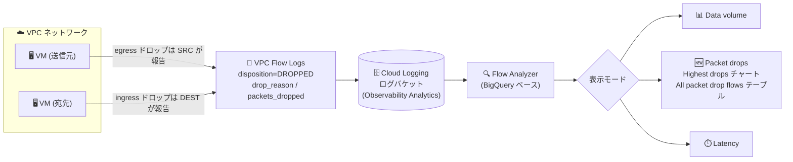

# Network Intelligence Center: Flow Analyzer パケットドロップ表示モード

**リリース日**: 2026-10-05

**サービス**: Network Intelligence Center

**機能**: Flow Analyzer のパケットドロップ (Packet drops) 表示モード

**ステータス**: Feature (リリース済み)

📊 [このアップデートのインフォグラフィックを見る](https://takech9203.github.io/google-cloud-news-summary/20261005-network-intelligence-center-flow-analyzer-packet-drops.html)

## 概要

Network Intelligence Center の Flow Analyzer に、パケットドロップを表示する新しい表示モード「Packet drops」が追加されました。これにより、トラフィックフロー内のパケットロスを Flow Analyzer の UI 上で直接分析できるようになります。

Flow Analyzer は、Cloud Logging のログバケット (Observability Analytics 対応) に保存された VPC Flow Logs を、複雑な SQL クエリを書かずに 5-tuple (送信元 IP、宛先 IP、送信元ポート、宛先ポート、プロトコル) の粒度で分析できるツールです。今回のアップデートにより、従来の「Data volume (データ量)」「Latency (レイテンシ)」に加えて「Packet drops (パケットドロップ)」が表示モードとして選択可能になり、ドロップ率・ドロップ数の時系列チャートと、ドロップ理由 (Drop reason) 付きのフロー一覧テーブルで、パケットロスの原因調査ができるようになりました。

ネットワークのトラブルシューティングを担当する SRE やネットワーク管理者にとって、「どのフローで」「どれだけ」「なぜ」パケットがドロップされているかを一画面で把握できる、実用性の高いアップデートです。

**アップデート前の課題**

- Flow Analyzer の表示モードは Data volume (バイト数・パケット数) と Latency (RTT) であり、パケットロスの分析は UI の表示モードとしてサポートされていなかった
- VPC Flow Logs はドロップトラフィックのログレコード (`disposition=DROPPED`、`drop_reason` など) を生成するが、その分析にはログレコードを直接クエリする必要があった
- ドロップの発生箇所 (送信側/受信側) や理由をフロー単位で横断的に可視化する手段が Flow Analyzer 内になかった

**アップデート後の改善**

- 表示モードで「Packet drops」を選択するだけで、ドロップされたパケット数・バイト数、ドロップ率 (%) を時系列チャート (Highest drops) とテーブル (All packet drop flows) で可視化できるようになった
- サンプリングポイントを調整して、送信元のみ (egress ドロップ) または宛先のみ (ingress ドロップ) のデータに絞った分析が可能になった
- All packet drop flows テーブルに「Drop reason」列が追加され、ドロップ理由をクリックすると根本原因を含む詳細情報を確認できるようになった

## アーキテクチャ図



VPC Flow Logs が生成するドロップトラフィックのログレコードをログバケットに保存し、Flow Analyzer の新しい Packet drops 表示モードでドロップ率・ドロップ数・ドロップ理由を可視化するデータフローです。

## サービスアップデートの詳細

### 主要機能

1. **Packet drops 表示モード**
   - 表示モードとして Data volume (デフォルト)、Latency に加えて Packet drops を選択可能
   - 選択すると、クエリ結果が「Highest drops」チャートと「All packet drop flows」テーブルに切り替わる

2. **メトリクスタイプとタイムライン表示**
   - メトリクスタイプ: Packets sent (デフォルト、ドロップされたパケット数) / Bytes sent (ドロップされたバイト数)
   - タイムライン: Drop rate (%) (デフォルト、選択したアライメント期間内にドロップされたパケットまたはバイトの割合) / Drop count (ドロップ数)

3. **サンプリングポイントの調整**
   - デフォルトでは、フローの送信元または宛先のいずれかが報告したパケットロスデータを表示
   - 送信元のみ (egress ドロップ)、宛先のみ (ingress ドロップ) に絞った表示に変更可能

4. **Drop reason 列によるトラブルシューティング**
   - All packet drop flows テーブルに Drop reason 列が表示される
   - ドロップ理由をクリックすると、ドロップされたトラフィックの根本原因を含む詳細情報を確認できる

## 技術仕様

### データソース: VPC Flow Logs のドロップトラフィックレコード

Flow Analyzer のパケットドロップ分析は、VPC Flow Logs が生成するドロップトラフィック用ログレコードに基づきます。

| 項目 | 詳細 |
|------|------|
| `disposition` | ドロップを記録するログレコードでは `DROPPED` に設定される |
| `drop_reason` | ドロップ理由 (例: `FIREWALL_DENY`、`NO_MATCHING_ROUTE`、`QUEUE_OVERFLOW` など) |
| `bytes_dropped` / `packets_dropped` | ドロップされたバイト数 / パケット数の推定値 |
| `throughput_inclusion` | ドロップされたトラフィックが同一レポーターの `bytes_sent` / `packets_sent` に含まれるか (`INCLUDED` / `EXCLUDED`) |
| 集約 | ドロップはフローとドロップ理由ごとに集約され、同一理由のドロップは集約間隔内で 1 つのログレコードに統合される |
| レポーター | egress ドロップは送信元 (`SRC` / `SRC_GATEWAY`)、ingress ドロップは宛先 (`DEST` / `DEST_GATEWAY`) が報告 |

### 代表的なドロップ理由 (drop_reason)

| 報告側 | ドロップ理由 (例) | 説明 |
|--------|------------------|------|
| 送信元 (SRC) | `FIREWALL_DENY` | egress ファイアウォールルールの deny により送信トラフィックがドロップ |
| 送信元 (SRC) | `NO_MATCHING_ROUTE` | 宛先に一致するルートがないためドロップ |
| 送信元 (SRC) | `SPOOFED_SOURCE` | パケットの送信元が VM の NIC に関連付けられておらず、IP 転送が無効 |
| 宛先 (DEST) | `FIREWALL_DENY` | ingress ファイアウォールルールの deny により受信トラフィックがドロップ |
| 宛先 (DEST) | `PSC_NAT_OUT_OF_PORTS` | Private Service Connect の NAT ポート枯渇によるドロップ |
| 両側 | `QUEUE_OVERFLOW` / `TOO_MANY_CONNECTIONS` | ホストのパケット処理ソフトウェアの CPU 容量超過やフローレート超過によるドロップ |

ドロップ理由の全一覧は [VPC Flow Logs レコードのドキュメント](https://docs.cloud.google.com/vpc/docs/about-flow-logs-records#drop-reason)を参照してください。

## 設定方法

### 前提条件

1. VPC Flow Logs が有効化されており、ログが Cloud Logging のログバケット (Observability Analytics 対応) に保存されていること
2. VPC Flow Logs を含むログバケットがあるプロジェクトを選択していること

### 手順

#### ステップ 1: クエリの作成と実行

Google Cloud コンソールで Flow Analyzer を開き、[クエリを作成して実行](https://docs.cloud.google.com/network-intelligence-center/docs/flow-analyzer/analyze-traffic-flows#build-query)します。

#### ステップ 2: Packet drops モードの設定

1. **Display options** パネルで、必要に応じて **Alignment period** を確認・変更する
2. 表示モードとして **Packet drops** を選択する
3. **Metric type** で **Packets sent** または **Bytes sent** を選択する
4. **Show timeline** で **Drop rate (%)** または **Drop count** を選択する
5. **Advanced settings** セクションの **Sampling points** オプションで、**Source endpoint** (egress ドロップ)、**Destination endpoint** (ingress ドロップ)、**Source and destination** (いずれかのエンドポイント) を選択する
6. **Run new query** をクリックする

#### ステップ 3: 結果の分析

**Highest drops** チャートでドロップの時系列傾向を確認し、**All packet drop flows** テーブルの **Drop reason** 列からドロップ理由をクリックして、根本原因を含む詳細情報を確認します。

## メリット

### ビジネス面

- **トラブルシューティング時間の短縮**: パケットロスの発生フローと理由が UI 上で直接特定できるため、障害の原因切り分けが迅速化する
- **SQL スキル不要**: 複雑な SQL クエリを書かずにパケットロスの分析ができ、運用チームの学習コストを低減できる

### 技術面

- **ドロップ理由による根本原因分析**: `FIREWALL_DENY` や `NO_MATCHING_ROUTE` などのドロップ理由から、ファイアウォール設定ミスやルーティング不備といった原因を直接特定できる
- **egress/ingress の切り分け**: サンプリングポイントの調整により、送信側で落ちているのか受信側で落ちているのかを区別して分析できる
- **既存のクエリ機能との統合**: Flow Analyzer の基本フィルタ・SQL フィルタ・時間範囲選択と組み合わせて、特定のフローに絞ったドロップ分析ができる

## デメリット・制約事項

### 考慮すべき点

- Flow Analyzer を使用するには、VPC Flow Logs を含むログバケットがあるプロジェクトを選択する必要がある
- VPC Flow Logs はサンプリングされたデータであり、分析結果は推定値に基づく
- ドロップトラフィックのログレコードでは `bytes_sent` / `packets_sent` や RTT 関連フィールドは記録されない (ドロップ専用フィールドで記録される)

## ユースケース

### ユースケース 1: ファイアウォール設定ミスによる通信断の調査

**シナリオ**: アプリケーション間の通信が断続的に失敗しており、原因がネットワーク層かアプリケーション層か切り分けたい。

**実装例**:
```
1. Flow Analyzer で対象の送信元/宛先 IP をフィルタに設定
2. 表示モードを Packet drops、タイムラインを Drop rate (%) に設定してクエリを実行
3. All packet drop flows テーブルの Drop reason 列を確認
4. FIREWALL_DENY が表示された場合、該当のファイアウォールルールを修正
```

**効果**: ログを手動でクエリすることなく、ドロップの発生有無と理由を数クリックで特定できる。

### ユースケース 2: VM のパケット処理能力不足の検出

**シナリオ**: 高トラフィックな VM でパフォーマンス劣化が報告されており、ホスト側のパケットドロップが疑われる。

**効果**: Packet drops モードで `QUEUE_OVERFLOW` や `TOO_MANY_CONNECTIONS` のドロップを検出した場合、より高帯域な VM (Tier_1 ネットワーキング) への変更や、ワークロードの複数 VM への分散といった対策につなげられる。

## 料金

Network Intelligence Center の料金はモジュールごとに異なります。詳細は公式の料金ページを参照してください。

- [Network Intelligence Center 料金ページ](https://cloud.google.com/products/network-intelligence-center/pricing)

なお、Flow Analyzer は VPC Flow Logs のデータ (Cloud Logging のログバケットに保存) を分析するため、VPC Flow Logs / Cloud Logging 側の費用も考慮が必要です。

## 関連サービス・機能

- **VPC Flow Logs**: Flow Analyzer のデータソース。ドロップトラフィック用のログレコード (`disposition=DROPPED`、`drop_reason` など) を生成する
- **Cloud Logging (Observability Analytics)**: VPC Flow Logs の保存先。Observability Analytics 対応のログバケットに保存されたログを Flow Analyzer がクエリする
- **BigQuery**: Flow Analyzer のクエリ基盤。SQL フィルタでは BigQuery SQL 構文を使用できる
- **Connectivity Tests (Network Intelligence Center)**: `NO_MATCHING_ROUTE` などのドロップ原因の調査時に、エンドポイント間の接続性を診断する補完ツールとして利用できる

## 参考リンク

- 📊 [インフォグラフィック](https://takech9203.github.io/google-cloud-news-summary/20261005-network-intelligence-center-flow-analyzer-packet-drops.html)
- [公式リリースノート](https://docs.cloud.google.com/release-notes#October_05_2026)
- [Display flows in packet drop mode (公式ドキュメント)](https://docs.cloud.google.com/network-intelligence-center/docs/flow-analyzer/analyze-traffic-flows#display-packet-drops)
- [Flow Analyzer の概要](https://docs.cloud.google.com/network-intelligence-center/docs/flow-analyzer/overview)
- [VPC Flow Logs のレコード形式 (ドロップ理由一覧)](https://docs.cloud.google.com/vpc/docs/about-flow-logs-records#drop-reason)
- [料金ページ](https://cloud.google.com/products/network-intelligence-center/pricing)

## まとめ

Flow Analyzer の Packet drops 表示モードにより、VPC 内のパケットロスを「どのフローで・どれだけ・なぜ」という観点で SQL なしに分析できるようになりました。VPC Flow Logs を運用しているチームは、トラブルシューティングの初動として Flow Analyzer のドロップ分析を標準手順に組み込むことを推奨します。まずは主要なワークロードのサブネットで VPC Flow Logs が有効になっているかを確認し、Packet drops モードでベースラインのドロップ状況を把握しておくとよいでしょう。

---

**タグ**: Network Intelligence Center, Flow Analyzer, VPC Flow Logs, パケットドロップ, ネットワーク監視, トラブルシューティング
