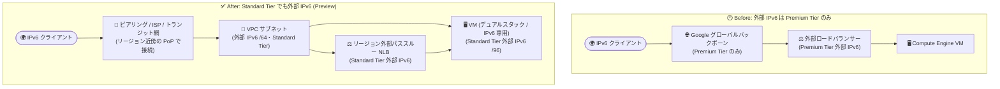

# Network Service Tiers: Standard Tier で外部 IPv6 アドレスをサポート (Preview)

**リリース日**: 2026-10-05

**サービス**: Network Service Tiers / Cloud Load Balancing / Compute Engine / Virtual Private Cloud (VPC)

**機能**: Standard Tier における外部 IPv6 アドレスのサポート

**ステータス**: Preview

📊 [このアップデートのインフォグラフィックを見る](https://takech9203.github.io/google-cloud-news-summary/20261005-network-service-tiers-standard-tier-external-ipv6.html)

## 概要

Google Cloud の Network Service Tiers において、**Standard Tier で外部 IPv6 アドレスがサポート**されました (Preview)。これまで外部 IPv6 アドレス (グローバルユニキャストアドレス、GUA) は Premium Tier のみで利用可能でしたが、今回のアップデートにより、コスト最適化を目的とした Standard Tier でも IPv6 でインターネットに公開するワークロードを構築できるようになります。

このアップデートは **Network Service Tiers、Cloud Load Balancing、Compute Engine、VPC の 4 プロダクトの Release Notes に同一内容が掲載された横断アップデート**です。具体的には、VPC サブネットの外部 IPv6 範囲、Compute Engine VM のデュアルスタック / IPv6 専用ネットワークインターフェース、Cloud Load Balancing のリージョン外部ロードバランサーの転送ルールといった、外部 IPv6 アドレスを使用する複数のリソースが Standard Tier の対象になります。

対象ユーザーは、レイテンシや性能よりもネットワークコストを重視するワークロード (単一リージョン構成の Web サービス、検証環境、大量の外部向けデータ転送を行うシステムなど) を運用しつつ、IPv6 対応 (デュアルスタック化や IPv6 専用構成) を進めたい組織です。

**アップデート前の課題**

- 外部 IPv6 アドレス (グローバル / リージョン) は Premium Tier のみのサポートで、Standard Tier では外部 IPv4 アドレスしか利用できなかった
- IPv6 でインターネットに公開するワークロードは、コストを重視する場合でも Premium Tier のデータ転送料金を支払う必要があった
- IPv4 は Standard Tier、IPv6 は Premium Tier という構成差分が生じ、デュアルスタック移行時のコスト見積もりや設計が複雑になっていた

**アップデート後の改善**

- Standard Tier でリージョン外部 IPv6 アドレスとグローバル外部 IPv6 アドレスが利用可能になった (いずれも Preview)
- VM インスタンス、リージョン外部パススルーネットワークロードバランサーなど、外部 IPv6 を使用する対象リソースを Standard Tier の低価格なデータ転送料金で運用できるようになった
- 既存サブネットで IPv6 を有効化する際に、サブネットのネットワークサービスティアを選択できるようになり、IPv4/IPv6 を通じてティアを統一した設計が可能になった

## アーキテクチャ図



従来は外部 IPv6 を使う場合 Premium Tier (Google グローバルバックボーン経由) しか選択できませんでしたが、今回のアップデートにより、リージョン近傍のピアリング / ISP 網を経由する低コストな Standard Tier でも VM やリージョン外部ロードバランサーに外部 IPv6 アドレスを割り当てられるようになりました。

## サービスアップデートの詳細

### 主要機能

1. **Standard Tier でのリージョン外部 IPv6 アドレス (Preview)**
   - 単一リージョン内の Google Cloud リソースで使用する、パブリックにルーティング可能な IPv6 アドレスが Standard Tier で利用可能に
   - VM インスタンス (GKE ノード VM を含む) のデュアルスタック / IPv6 専用ネットワークインターフェースや、リージョン外部パススルーネットワークロードバランサー・外部プロトコル転送の転送ルールで使用

2. **Standard Tier でのグローバル外部 IPv6 アドレス (Preview)**
   - パブリックにルーティング可能な anycast IPv6 アドレスも Standard Tier でサポート (Preview)

3. **サブネット単位でのネットワークサービスティア選択**
   - 既存サブネットで IPv6 を有効化する際に、そのサブネットのネットワークサービスティアを選択可能
   - サブネットの外部 IPv6 範囲は Google 提供のリージョン外部 IPv6 範囲 (/64 GUA) から自動割り当て、または BYOIP サブプレフィックスから割り当て
   - 一度設定 (またはプロジェクトから継承) したサブネットのティアは後から変更不可

4. **4 プロダクトにまたがる横断アップデート**
   - **VPC**: サブネットの外部 IPv6 範囲 (IPv6 アクセスタイプ: External) がティア選択に対応
   - **Compute Engine**: VM の外部 IPv6 /96 範囲を Standard Tier で割り当て可能
   - **Cloud Load Balancing**: リージョン外部ロードバランサーの IPv6 転送ルールを Standard Tier で構成可能
   - **Network Service Tiers**: 外部 IPv6 アドレスタイプのティア対応表が更新

## 技術仕様

### Premium Tier と Standard Tier の外部 IP アドレス対応

| 外部 IP アドレスタイプ | Premium Tier | Standard Tier |
|------|------|------|
| グローバル外部 IPv4 / IPv6 (anycast) | サポート | サポート (**Preview**) |
| リージョン外部 IPv4 | サポート | 対象リソースで使用する場合にサポート |
| リージョン外部 IPv6 | サポート | サポート (**Preview**) |

### 外部 IPv6 アドレスの割り当て構造

| 項目 | 詳細 |
|------|------|
| サブネットの外部 IPv6 範囲 | /64 の GUA (Google 提供範囲から自動割り当て、または BYOIP) |
| VM 用の範囲 | /64 の前半 (/65) を VM ネットワークインターフェースに割り当て |
| Cloud Load Balancing 用の範囲 | /64 の後半 (/65) を転送ルール (外部プロトコル転送、リージョン外部パススルー NLB) に割り当て |
| VM ネットワークインターフェース | /96 の外部 IPv6 範囲を割り当て (先頭アドレスを DHCPv6 で付与) |
| 対応スタックタイプ | デュアルスタック (IPv4 + IPv6)、IPv6 専用 |
| VPC ネットワークモード | カスタムモード VPC のみ (自動モード・レガシーネットワークは非対応) |

### Standard Tier の特性 (従来からの仕様)

| 項目 | Premium Tier | Standard Tier |
|------|------|------|
| ルーティング | Google グローバルバックボーン経由 | リージョン近傍のピアリング / ISP / トランジット網経由 |
| 対応ネットワークサービス | すべての機能 (グローバル LB、Cloud CDN など) | 基礎的な機能セット (Cloud NAT、リージョン外部 ALB、リージョン外部パススルー NLB など) |
| SLA | 99.99% | 99.9% |
| 料金 ($/GB) | Standard Tier より高い | Premium Tier より低い |

## 設定方法

### 前提条件

1. カスタムモードの VPC ネットワークを使用していること (IPv6 サブネット範囲は自動モード VPC では非対応)
2. 対象リソース (VM、リージョン外部ロードバランサー) が Standard Tier の対象リソースであること
3. Preview 機能のため、本番環境への適用前に動作を検証すること

### 手順

#### ステップ 1: 外部 IPv6 範囲を持つデュアルスタックサブネットを Standard Tier で作成

```bash
gcloud compute networks subnets create ipv6-standard-subnet \
    --network=my-custom-vpc \
    --region=us-central1 \
    --range=10.10.0.0/24 \
    --stack-type=IPV4_IPV6 \
    --ipv6-access-type=EXTERNAL
```

サブネットのネットワークサービスティアは、サブネット作成・IPv6 有効化時に選択します (設定後は変更できないため注意)。詳細は [Choose a subnet's network service tier](https://docs.cloud.google.com/vpc/docs/create-modify-vpc-networks#choose-service-tier) を参照してください。

#### ステップ 2: Standard Tier の外部 IPv6 アドレスを持つ VM を作成

```bash
gcloud compute instances create ipv6-standard-vm \
    --zone=us-central1-a \
    --subnet=ipv6-standard-subnet \
    --stack-type=IPV4_IPV6 \
    --network-tier=STANDARD
```

VM のネットワークインターフェースには、サブネットの /64 範囲の前半 (/65) から外部 IPv6 /96 範囲が割り当てられます。

#### ステップ 3: (必要に応じて) 静的なリージョン外部 IPv6 アドレスを予約

```bash
gcloud compute addresses create ipv6-standard-address \
    --region=us-central1 \
    --subnet=ipv6-standard-subnet \
    --ip-version=IPV6 \
    --endpoint-type=VM
```

リージョン外部パススルーネットワークロードバランサーの転送ルールで使用する場合は、/64 範囲の後半 (/65) から割り当てられるアドレスを使用します。

## メリット

### ビジネス面

- **ネットワークコストの削減**: 外部 IPv6 トラフィックに対して、Premium Tier より低い $/GB の Standard Tier 料金を適用できる。Standard Tier には利用リージョンごとに月間 200 GB の無料枠 (SKU 単位) も用意されている
- **IPv6 移行の推進**: コスト重視のワークロードでも IPv6 対応 (デュアルスタック化・IPv6 専用化) を進めやすくなり、IPv4 アドレス枯渇対策や各国の IPv6 対応要件への準拠を低コストで実現できる

### 技術面

- **IPv4/IPv6 でのティア統一**: これまで「IPv4 は Standard、IPv6 は Premium」と分かれていた構成を Standard Tier に統一でき、ネットワーク設計とコスト管理がシンプルになる
- **リソース単位の柔軟なティア選択**: ティアはリソース (IP アドレス) 単位で選択できるため、性能重視のサービスは Premium Tier、コスト重視のサービスは Standard Tier と IPv6 でも使い分けられる
- **複数プロダクトでの一貫したサポート**: VPC サブネット、Compute Engine VM、Cloud Load Balancing の転送ルールまで一貫して Standard Tier の外部 IPv6 を使用できる

## デメリット・制約事項

### 制限事項

- 本機能は **Preview** であり、GA 前の機能に適用される利用条件のもとで提供される
- Standard Tier はリージョンサービスのため、グローバル外部アプリケーションロードバランサー、グローバル外部プロキシネットワークロードバランサー、Cloud CDN、Cloud VPN などは利用できない
- IPv6 サブネット範囲はカスタムモード VPC のみ対応 (自動モード VPC・レガシーネットワークは非対応)
- サブネットのネットワークサービスティアおよび IPv6 アクセスタイプ (internal/external) は設定後に変更できない
- Premium Tier と Standard Tier では外部 IP アドレスのプールが分離されており、ティアを変更すると IP アドレスも変わる (プール間のアドレス移動は不可)

### 考慮すべき点

- Standard Tier はリージョン近傍のピアリング PoP でインターネットと接続するため、遠方のユーザーに対しては Premium Tier よりレイテンシが大きくなる可能性がある (性能最適化はされない)
- SLA は Premium Tier の 99.99% に対し Standard Tier は 99.9% であり、可用性要件との整合を確認する必要がある
- マルチリージョン展開では、リージョンごとのロードバランサーと DNS による振り分けが必要になる

## ユースケース

### ユースケース 1: 単一リージョンの IPv6 対応 Web サービスをコスト最適化

**シナリオ**: 国内ユーザー向けの Web サービスを単一リージョンで運用しており、モバイルキャリア網からの IPv6 アクセスに対応する必要がある。レイテンシ要件は厳しくなく、外部向けデータ転送コストを抑えたい。

**実装例**:
```bash
# Standard Tier の外部 IPv6 を持つリージョン外部パススルー NLB の転送ルールを作成
gcloud compute forwarding-rules create ipv6-standard-fr \
    --region=us-central1 \
    --load-balancing-scheme=EXTERNAL \
    --network-tier=STANDARD \
    --ip-version=IPV6 \
    --subnet=ipv6-standard-subnet \
    --ports=443 \
    --backend-service=my-backend-service
```

**効果**: IPv6 クライアントからのトラフィックを Standard Tier の低価格なデータ転送料金で処理でき、デュアルスタック対応とコスト削減を両立できる。

### ユースケース 2: 開発・検証環境の IPv6 デュアルスタック化

**シナリオ**: 本番は Premium Tier で運用しつつ、開発・検証環境では IPv6 の疎通試験やアプリケーションの IPv6 対応検証を低コストで行いたい。

**効果**: 検証環境の VM に Standard Tier の外部 IPv6 アドレスを割り当てることで、月間 200 GB の無料枠も活用しながら、本番前の IPv6 対応検証をコストを抑えて実施できる。

## 料金

外部 IPv6 アドレス経由のインターネット向けデータ転送には、選択したネットワークサービスティアの料金が適用されます。

- **Standard Tier は Premium Tier より低い $/GB で課金**される (コスト最適化向け)
- Standard Tier には **無料枠**があり、利用する各リージョンで月間 200 GB (SKU 単位、課金アカウント内の全プロジェクト合算) まで無料で利用できる
- 具体的な単価はリージョンにより異なるため、[Network Service Tiers の料金ページ](https://cloud.google.com/network-tiers/pricing) を参照

## 利用可能リージョン

IPv6 アドレス範囲を持つサブネットは全リージョンで利用可能です。Standard Tier の外部 IPv6 サポート (Preview) の提供状況の詳細は、[Network Service Tiers overview](https://docs.cloud.google.com/network-tiers/docs/overview) および [VPC subnets ドキュメント](https://docs.cloud.google.com/vpc/docs/subnets#ipv6-ranges) を参照してください。

## 関連サービス・機能

- **Virtual Private Cloud (VPC)**: サブネットの外部 IPv6 範囲 (/64 GUA) の割り当てとネットワークサービスティア選択を提供。BYOIP による独自 IPv6 範囲の持ち込みにも対応
- **Compute Engine**: デュアルスタック / IPv6 専用ネットワークインターフェースを持つ VM に外部 IPv6 /96 範囲を割り当て。GKE ノード VM も対象
- **Cloud Load Balancing**: リージョン外部アプリケーションロードバランサー、リージョン外部パススルーネットワークロードバランサー、外部プロトコル転送が Standard Tier の対象
- **Cloud NAT**: Standard Tier でサポートされる基礎的なネットワーク機能の 1 つ。NAT64 と組み合わせた IPv6 専用 VM からの IPv4 宛て通信にも関連

## 参考リンク

- 📊 [インフォグラフィック](https://takech9203.github.io/google-cloud-news-summary/20261005-network-service-tiers-standard-tier-external-ipv6.html)
- [公式リリースノート](https://docs.cloud.google.com/release-notes#October_05_2026)
- [Network Service Tiers overview (Standard Tier)](https://docs.cloud.google.com/network-tiers/docs/overview#standard_tier)
- [IPv6 subnet ranges (VPC ドキュメント)](https://docs.cloud.google.com/vpc/docs/subnets#ipv6-ranges)
- [Network Service Tiers 料金ページ](https://cloud.google.com/network-tiers/pricing)

## まとめ

Standard Tier での外部 IPv6 サポート (Preview) により、これまで Premium Tier が前提だった IPv6 公開ワークロードをコスト最適化されたネットワーク経路で運用できるようになりました。VPC・Compute Engine・Cloud Load Balancing にまたがる横断的なアップデートであり、デュアルスタック / IPv6 専用構成への移行を検討している組織は、まず開発・検証環境で Standard Tier の IPv6 サブネットを作成し、レイテンシとコストのバランスを評価することを推奨します。

---

**タグ**: Network Service Tiers, Cloud Load Balancing, Compute Engine, VPC, IPv6, Standard Tier, Preview, ネットワーキング, コスト最適化
