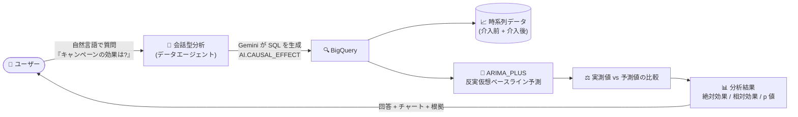

# BigQuery: 会話型分析での AI.CAUSAL_EFFECT 関数サポート

**リリース日**: 2026-10-06

**サービス**: BigQuery

**機能**: 会話型分析 (Conversational analytics) での AI.CAUSAL_EFFECT 関数サポート

**ステータス**: Preview

📊 [このアップデートのインフォグラフィックを見る](https://takech9203.github.io/google-cloud-news-summary/20261006-bigquery-ai-causal-effect.html)

## 概要

BigQuery の会話型分析 (Conversational analytics) が、`AI.CAUSAL_EFFECT` 関数をサポートしました。この機能は Preview として提供されます。`AI.CAUSAL_EFFECT` は、時系列データに対する特定の介入 (インターベンション) がもたらした影響を定量化する関数です。たとえば「特定の日に開始したマーケティングキャンペーンによって、売上がどれだけ増加したか」を、キャンペーンがなかった場合の反実仮想 (counterfactual) の予測値と実測値を比較することで測定できます。

今回のアップデートにより、データエージェントとの自然言語チャットの中で因果効果分析 (Causal effect analysis) を実行できるようになりました。たとえば「2020 年 3 月 11 日の COVID-19 パンデミック宣言がタクシーの 1 日あたりの乗車数に与えた影響を定量化して」といった質問を投げかけるだけで、エージェントが `AI.CAUSAL_EFFECT` を使った SQL を生成し、統計的に有意な効果かどうかを含めて回答します。

対象ユーザーは、SQL や統計モデリングの専門知識を持たないビジネスユーザーからデータアナリスト、データサイエンティストまで幅広く、施策の効果測定を自然言語ベースで民主化できる点が主要な価値提案です。

**アップデート前の課題**

- 介入の効果測定 (因果推論) を行うには、`AI.CAUSAL_EFFECT` 関数の構文を理解して SQL を自分で記述するか、ARIMA_PLUS モデルを自前で構築して反実仮想の予測と実測値を比較する必要があった
- 会話型分析がサポートする時系列分析は予測 (AI.FORECAST)、異常検知 (AI.DETECT_ANOMALIES)、トレンド/季節性分析などに限られ、「この施策の効果はどれだけか」という因果の問いには自然言語で答えられなかった
- 効果測定には統計的有意性 (p 値) の解釈など専門知識が必要で、ビジネスユーザーが自力で実施するのは難しかった

**アップデート後の改善**

- データエージェントや直接会話の中で、自然言語の質問から `AI.CAUSAL_EFFECT` を使った因果効果分析を実行できるようになった
- 介入前後のデータ分割、ARIMA_PLUS による反実仮想ベースラインの予測、絶対効果・相対効果・p 値の算出までをエージェントが自動で行う
- 検証済みクエリ (verified query) に `AI.CAUSAL_EFFECT` を組み込み、定型的な効果測定レポートを自動化できるようになった

## アーキテクチャ図



ユーザーが自然言語で介入効果について質問すると、データエージェントが `AI.CAUSAL_EFFECT` を含む SQL を生成し、介入タイムスタンプを境にデータを分割、ARIMA_PLUS による反実仮想予測と実測値を比較して効果の大きさと統計的有意性を回答します。

## サービスアップデートの詳細

### 主要機能

1. **自然言語による因果効果分析**
   - データエージェントとの会話や、データソースとの直接会話で「〇月〇日の施策がメトリクスに与えた影響を定量化して」といった質問が可能
   - エージェントが `AI.CAUSAL_EFFECT` を使った SQL を生成し、結果の解釈 (reasoning) とチャートを含めて回答する
   - 検証済みクエリ (verified query) に組み込むことで、定期的な効果測定レポートを標準化・自動化できる

2. **AI.CAUSAL_EFFECT 関数の分析機能**
   - **時系列セグメンテーション**: 指定した介入タイムスタンプで、データを介入前と介入後の期間に自動分割し、絶対効果・相対効果・統計的有意性を計算
   - **並列処理**: `id_cols` 引数で複数の時系列を 1 回の呼び出しで並列分析可能
   - **単変量時系列モデリング**: ARIMA_PLUS 予測を使って反実仮想ベースラインを構築。コントロール系列や外部共変量を必要とせず、実験のスピルオーバー効果によるバイアスを防げる

3. **柔軟な出力制御**
   - デフォルトでは時系列ごとに 1 行のサマリービュー (p 値、因果効果の確率、絶対効果、相対効果) を返す
   - `output_time_series => TRUE` を指定すると、タイムスタンプごとの実測値・予測値・予測区間 (上限/下限) を含む詳細ビューを返す
   - `num_post_intervention_points` で分析対象とする介入後のデータポイント数を制御可能

## 技術仕様

### AI.CAUSAL_EFFECT 関数の引数

| 引数 | 必須/任意 | 詳細 |
|------|------|------|
| `TABLE` / `query_statement` | 必須 | 介入前後のデータを含むテーブルまたは GoogleSQL クエリ |
| `data_col` | 必須 | 分析対象の時系列値の列名 (INT64 / NUMERIC / BIGNUMERIC / FLOAT64) |
| `timestamp_col` | 必須 | タイムスタンプの列名 (TIMESTAMP / DATE / DATETIME) |
| `intervention_timestamp` | 必須 | 介入が発生した時点。この時刻でデータを介入前/介入後に分割 |
| `id_cols` | 任意 | 複数時系列を識別する列名の配列 (STRING / INT64)。並列分析に使用 |
| `confidence_level` | 任意 | 予測区間の信頼水準 [0, 1)。デフォルトは 0.95 |
| `output_time_series` | 任意 | TRUE で時系列の詳細ビューを出力。デフォルトは FALSE (サマリービュー) |
| `num_post_intervention_points` | 任意 | 分析に含める介入後のデータポイント数。未指定時は末尾まですべて使用 |

### 出力 (サマリー統計)

| 列 | 詳細 |
|------|------|
| `p_value` | 介入後期間全体に対する帰無仮説の両側 p 値 (ARIMA_PLUS の標準誤差ベースで保守的に算出) |
| `prob_causal_effect` | 因果効果が存在する確率 (1 - p_value) |
| `absolute_effect` | 介入後期間の SUM(実測値 - 期待値) |
| `relative_effect` | SUM(実測値 - 期待値) / SUM(期待値) |
| `status` | 予測ステータス (成功時は空。データ不足時は "The time series data is too short" 等のエラー文字列) |

### 使用例

```sql
SELECT pickup_date, trip_count, predicted_trip_count, lower_bound, upper_bound
FROM AI.CAUSAL_EFFECT(
  (
    SELECT DATE(pickup_datetime) AS pickup_date, COUNT(*) AS trip_count
    FROM `bigquery-public-data.new_york_taxi_trips.tlc_yellow_trips_2020`
    WHERE EXTRACT(YEAR FROM pickup_datetime) = 2020
    GROUP BY pickup_date
  ),
  data_col => 'trip_count',
  timestamp_col => 'pickup_date',
  intervention_timestamp => '2020-03-11',  -- WHO が COVID-19 をパンデミックと宣言
  num_post_intervention_points => 120,
  output_time_series => TRUE);
```

会話型分析では、同じ分析を次のような自然言語プロンプトで実行できます。

> "Quantify the impact of the COVID-19 pandemic declaration on March 11, 2020 on daily taxi trips."

## 設定方法

### 前提条件

1. Gemini in BigQuery (会話型分析) が利用可能なプロジェクトであること
2. 会話型分析の利用に必要な IAM ロールが付与されていること
   - Gemini Data Analytics Data Agent Creator (`roles/geminidataanalytics.dataAgentCreator`): データエージェントの作成
   - Gemini for Google Cloud User (`roles/cloudaicompanion.user`): ステートフルなチャットの利用
   - BigQuery User (`roles/bigquery.user`): BigQuery データへのアクセス
3. 分析対象の時系列データに介入前・介入後の両方の期間が含まれ、予測に十分な履歴 (最低 3 データポイント以上) があること

### 手順

#### ステップ 1: データエージェントまたは直接会話を開始

Google Cloud コンソールの BigQuery Studio で、分析対象テーブルを知識ソースとするデータエージェントを作成するか、データソースとの直接会話を開始します。

#### ステップ 2: 自然言語で因果効果分析を依頼

```text
「2026 年 9 月 1 日に開始したキャンペーンが日次売上に与えた影響を定量化して」
```

エージェントが `AI.CAUSAL_EFFECT` を含む SQL を生成し、効果の大きさと統計的有意性を回答します。

#### ステップ 3: (任意) 検証済みクエリとして登録

定期的に実施する効果測定は、`AI.CAUSAL_EFFECT` を使った SQL を検証済みクエリ (verified query) としてエージェントに登録することで、回答の精度と再現性を高められます。

## メリット

### ビジネス面

- **効果測定の民主化**: マーケティングキャンペーン、価格変更、障害、外部イベントなどの影響を、SQL や統計の専門知識なしに自然言語で定量化できる
- **意思決定の高速化**: 「施策は効いたのか」という問いに p 値付きの統計的な裏付けのある回答が即座に得られ、次のアクションの判断が速くなる

### 技術面

- **コントロール群が不要**: ARIMA_PLUS による単変量モデリングで反実仮想ベースラインを構築するため、コントロール系列や外部共変量を用意する必要がなく、実験のスピルオーバーによるバイアスも回避できる
- **スケーラブルな並列分析**: `id_cols` により複数の時系列 (店舗別、商品別など) を 1 クエリでまとめて分析できる
- **保守的な有意性判定**: p 値は ARIMA_PLUS の標準誤差に基づいて算出されるため、偽陽性が少ない保守的な効果推定が得られる

## デメリット・制約事項

### 制限事項

- Preview 機能であり、Pre-GA Offerings Terms が適用される (サポートが限定的で、仕様変更の可能性がある)
- 時系列に十分な履歴データが必要 (最低 3 データポイント。不足すると "The time series data is too short" エラーになる)
- 単変量時系列モデリングのため、介入と同時期に発生した別の要因の影響を分離することはできない

### 考慮すべき点

- Gemini for Google Cloud が生成する回答はもっともらしく見えても誤りを含む可能性があるため、重要な意思決定の前には生成された SQL と結果の検証が推奨される
- 介入タイムスタンプの指定が分析結果を大きく左右するため、介入の正確な発生時点を把握しておく必要がある
- 会話型分析が実行する BigQuery ジョブには `ca-bq-job: true` などのラベルが付与されるため、コスト管理や監査にはラベルによるフィルタリングを活用するとよい

## ユースケース

### ユースケース 1: マーケティングキャンペーンの増分効果測定

**シナリオ**: 小売企業が特定の日に開始した広告キャンペーンについて、「キャンペーンがなかった場合」と比較した増分売上を測定したい。

**実装例**:
```sql
SELECT *
FROM AI.CAUSAL_EFFECT(
  TABLE `project.dataset.daily_sales`,
  data_col => 'sales_amount',
  timestamp_col => 'sales_date',
  intervention_timestamp => '2026-09-01',
  id_cols => ['store_id']);
```

**効果**: 店舗ごとの絶対効果・相対効果と p 値が 1 クエリで得られ、キャンペーンが統計的に有意な効果を持った店舗を特定できる。会話型分析ではこの分析を「9 月 1 日のキャンペーンの店舗別の効果を教えて」という質問だけで実行できる。

### ユースケース 2: 外部イベントの影響分析

**シナリオ**: 公式ドキュメントの例では、2023 年のノーベル賞発表が Wikipedia の関連ページビューに与えた影響を分析し、「Attosecond」ページで +2,197% (p 値 0.0) という有意な効果を検出。一方で「Physics」などの一般的なページには有意な効果がなかったことを確認している。

**効果**: イベントの影響が及んだ対象と及ばなかった対象を統計的に切り分けられ、イベントドリブンな需要変動の把握やインシデント影響範囲の定量化に応用できる。

### ユースケース 3: ビジネスユーザーによるセルフサービス効果測定

**シナリオ**: データサイエンティストが `AI.CAUSAL_EFFECT` を使った検証済みクエリをデータエージェントに登録し、ビジネスユーザーは自然言語の質問だけで定型の効果測定レポートを取得する。

**効果**: 分析チームへの依頼を介さずに施策効果を確認でき、分析チームはより高度な分析に集中できる。

## 料金

`AI.CAUSAL_EFFECT` は内部的に ARIMA_PLUS 予測を使用する BigQuery の AI/ML 関数であり、クエリの実行はエディション (スロット) またはオンデマンド (処理バイト数) で課金されます。会話型分析の利用には Gemini in BigQuery が必要です。Preview 期間中の正確な料金は、BigQuery ML pricing セクションを含む公式料金ページを参照してください。

- [BigQuery の料金 (BigQuery ML pricing を含む)](https://cloud.google.com/bigquery/pricing#bqml)

## 利用可能リージョン

公式ドキュメントではリージョンごとの提供状況が明示されていません。Gemini in BigQuery のデータ処理ロケーションについては [Where Gemini in BigQuery processes your data](https://docs.cloud.google.com/bigquery/docs/gemini-locations) を参照してください。

## 関連サービス・機能

- **Gemini in BigQuery / Conversational Analytics API**: 会話型分析の基盤。データエージェントの作成、ステートフルなチャット、検証済みクエリの管理を提供
- **AI.FORECAST / AI.DETECT_ANOMALIES**: 会話型分析がサポートする他の時系列分析関数。予測・異常検知と組み合わせることで、予測 → 施策実施 → 効果測定という一連のサイクルを BigQuery 内で完結できる
- **ML.TREND / ML.SEASONALITY / ML.DETECT_CHANGE_POINTS**: トレンド分析・季節性分析・変化点検知。介入の影響を多角的に裏付ける補完的な分析手法
- **AI.KEY_DRIVERS**: 期間間のメトリクス変化の主要因を特定する関数。因果効果の「大きさ」に加えて「要因」を掘り下げる際に併用できる
- **ARIMA_PLUS (BigQuery ML)**: `AI.CAUSAL_EFFECT` が反実仮想ベースラインの構築に使用する時系列予測モデル

## 参考リンク

- 📊 [インフォグラフィック](https://takech9203.github.io/google-cloud-news-summary/20261006-bigquery-ai-causal-effect.html)
- [公式リリースノート](https://docs.cloud.google.com/release-notes#October_06_2026)
- [AI.CAUSAL_EFFECT 関数リファレンス](https://docs.cloud.google.com/bigquery/docs/reference/standard-sql/bigqueryml-syntax-causal-effect)
- [Conversational analytics overview](https://docs.cloud.google.com/bigquery/docs/conversational-analytics)
- [BigQuery の料金](https://cloud.google.com/bigquery/pricing#bqml)

## まとめ

今回のアップデートにより、「施策は本当に効いたのか」という因果の問いに、BigQuery の会話型分析が自然言語だけで統計的な裏付け付きの回答を返せるようになりました。コントロール群を用意せずに ARIMA_PLUS の反実仮想予測で効果を定量化できるため、A/B テストが難しい全体施策や外部イベントの影響分析に特に有効です。まずは公開データセットを使ったサンプルプロンプト (COVID-19 のタクシー乗車数への影響分析など) で動作を確認し、自社の効果測定ワークフローへの組み込みを検討することをおすすめします。

---

**タグ**: BigQuery, Conversational Analytics, AI.CAUSAL_EFFECT, 因果推論, 時系列分析, ARIMA_PLUS, Gemini, BigQuery ML, Preview
