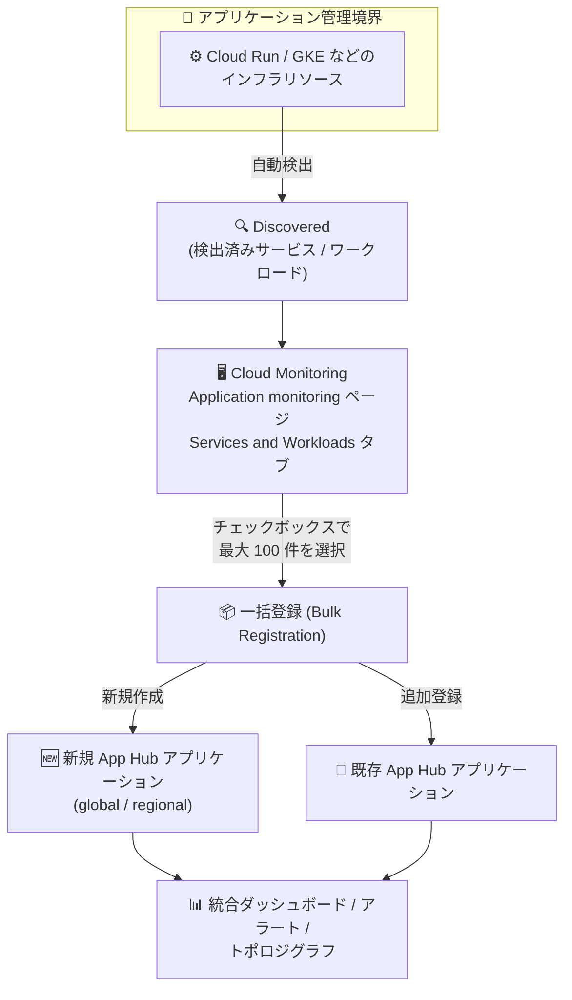

# Cloud Monitoring: App Hub アプリケーションへのサービス・ワークロード一括登録が GA

**リリース日**: 2026-10-06

**サービス**: Cloud Monitoring

**機能**: 検出されたサービスとワークロードの App Hub アプリケーションへの一括登録 (Bulk Registration)

**ステータス**: GA (一般提供)

📊 [このアップデートのインフォグラフィックを見る](https://takech9203.github.io/google-cloud-news-summary/20261006-cloud-monitoring-app-hub-bulk-registration.html)

## 概要

Cloud Monitoring の Application Monitoring ページから、検出 (Discovered) 状態のサービスとワークロードを App Hub アプリケーションへ一括登録 (Bulk Registration) する機能が一般提供 (GA) になりました。Google Cloud コンソールの「Application monitoring」ページの「Services and Workloads」タブで複数のサービス・ワークロードをチェックボックスで選択し (最大 100 件)、新規または既存の App Hub アプリケーションにまとめて登録できます。

App Hub は、Google Cloud のインフラストラクチャリソースを「サービス」と「ワークロード」としてアプリケーション単位にグループ化して管理するサービスです。アプリケーション管理境界 (Application Management Boundary) 内のリソースは自動的に「検出」され、登録することで Application Monitoring がアプリケーション固有のラベルと属性を使ったログ・メトリクス・トレースの統合ダッシュボードを提供します。

本アップデートの対象ユーザーは、多数のマイクロサービスやワークロードを運用し、アプリケーション中心のオブザーバビリティを導入したい SRE・運用チームです。多数のリソースを抱える環境でも、モニタリング画面から離れることなく短時間でアプリケーションの構成を整備できます。

**アップデート前の課題**

- Cloud Monitoring の Application Monitoring ページでは、「Application」列の「Register」から検出済みサービス・ワークロードを 1 件ずつ登録する必要があった
- App Hub コンソール側の登録フローでは、1 回の操作で選択できるリソースは最大 10 件であり、大規模環境では登録作業の繰り返しが必要だった
- 未登録 (Discovered) のままでは、Application Monitoring のダッシュボードは Cloud Asset Inventory のアセット名からリソースタイプを推定したログ・メトリクスの表示にとどまり、アプリケーション固有のラベル・属性を使った統合ビュー (トレースを含む) が得られなかった

**アップデート後の改善**

- 「Services and Workloads」タブでチェックボックスにより最大 100 件のサービス・ワークロードを選択し、一括で登録できるようになった
- 登録ダイアログで「新規アプリケーションの作成」と「既存アプリケーションへの追加」を選択でき、モニタリング画面から離れずにアプリケーション構成を整備できるようになった
- 登録済みになることで、アプリケーション固有のラベルと属性に基づくログ・メトリクス・トレースの統合ダッシュボードやアラート、トポロジ表示を活用できるようになった

## アーキテクチャ図



アプリケーション管理境界内で検出されたサービス・ワークロードを、Cloud Monitoring の画面から最大 100 件まとめて選択し、新規または既存の App Hub アプリケーションに一括登録するフローです。登録後はアプリケーション単位の統合モニタリングが利用できます。

## サービスアップデートの詳細

### 主要機能

1. **複数サービス・ワークロードの一括選択と登録**
   - 「Services and Workloads」タブで各行のチェックボックスを選択し、テーブル選択バナーの「Register」から一括登録する
   - 1 回の操作で最大 100 件まで選択可能
   - チェックボックスが無効化されている場合、そのサービス・ワークロードはすでに登録済み

2. **新規アプリケーション作成と既存アプリケーションへの登録の両対応**
   - 登録ダイアログで「新規アプリケーション」か「既存アプリケーション」を選択
   - 新規作成時はアプリケーションのロケーションを `global` または `regional` に設定する。選択したサービス・ワークロードが複数ロケーションにまたがる場合は `global` を使用する必要がある
   - 既存アプリケーションのロケーションが `global` の場合は任意のサービス・ワークロードを登録可能。特定リージョンのアプリケーションには同じロケーションのものだけ登録できる

3. **単一登録フローも引き続き利用可能**
   - 1 件だけ登録する場合は「Application」列の「Register」を選択する従来のフローを使用できる

### 登録ステータスとダッシュボードの違い

| 登録ステータス | 説明 | ダッシュボードで表示されるデータ |
|------|------|------|
| Discovered (検出済み) | アプリケーション管理境界内にあり登録可能な状態 | Cloud Asset Inventory のアセット名からリソースタイプを推定し、対応インフラのログ・メトリクスを表示 |
| Registered (登録済み) | App Hub アプリケーションに登録され管理されている状態 | アプリケーション固有のラベル・属性を使用し、ログ・メトリクス・トレースを表示 |
| Detached (切り離し) | 登録済みだが、基盤リソースが管理境界外に移動・削除され管理できない状態 | 登録解除するまでアプリケーション内に残る |

## 技術仕様

| 項目 | 詳細 |
|------|------|
| 操作場所 | Google Cloud コンソール「Application monitoring」ページ (Monitoring) の「Services and Workloads」タブ |
| 対象プロジェクト | App Hub ホストプロジェクトまたは管理プロジェクト (app-enabled folder 構成にも対応) |
| 一括選択の上限 | 1 回の操作で最大 100 件 |
| 検出リソースの表示上限 | サポートされる App Hub リージョンごとに、検出済みサービス最大 100 件・検出済みワークロード最大 100 件を表示 |
| 登録先 | 新規アプリケーション (global / regional) または既存アプリケーション |
| ロケーション制約 | 複数ロケーションにまたがる場合は global アプリケーションが必須。regional アプリケーションには同一ロケーションのリソースのみ登録可能 |

## 設定方法

### 前提条件

1. App Hub のセットアップ (ホストプロジェクトまたは管理プロジェクトとアプリケーション管理境界の構成) が完了していること
2. 登録対象のリソースがアプリケーション管理境界内にあり、「Discovered」ステータスで表示されていること

### 手順

#### ステップ 1: Services and Workloads タブを開く

1. Google Cloud コンソールで「Application monitoring」ページ (サブヘッダーが「Monitoring」の検索結果) に移動する
2. ツールバーで App Hub ホストプロジェクトまたは管理プロジェクトを選択する
3. 「Services and Workloads」タブを選択する

#### ステップ 2: 一括登録を実行する

1. 登録したい各サービス・ワークロードのチェックボックスを選択する (最大 100 件)
2. テーブル選択バナーの「Register」を選択する
3. 登録ダイアログで「新規アプリケーションの作成」または「既存アプリケーションの選択」を行い、ダイアログを完了する
   - 新規作成の場合: アプリケーションの詳細を入力し、ロケーションを `global` または `regional` に設定する

## メリット

### ビジネス面

- **オンボーディングの迅速化**: 大規模環境でもアプリケーション中心のモニタリング体制を短時間で整備でき、App Hub 導入の初期コストを削減できる
- **運用の一元化**: モニタリング担当者が Cloud Monitoring の画面内で登録まで完結でき、ツール間の往復が不要になる

### 技術面

- **1 回で最大 100 件の登録**: 1 件ずつの登録や App Hub コンソールでの 10 件単位の登録と比べ、操作回数を大幅に削減できる
- **登録による可観測性の向上**: 登録済みになることで、アプリケーション固有のラベル・属性に基づくログ・メトリクス・トレースの統合ダッシュボード、アラート、トポロジグラフを利用できる

## デメリット・制約事項

### 制限事項

- 1 回の一括登録で選択できるのは最大 100 件
- 「Services and Workloads」タブに表示される検出済みリソースは、サポートされる App Hub リージョンごとに検出済みサービス 100 件・検出済みワークロード 100 件まで
- regional アプリケーションには同一ロケーションのサービス・ワークロードしか登録できない (複数ロケーションにまたがる場合は global アプリケーションが必要)

### 考慮すべき点

- 排他的サービス (exclusive service) は 1 つのアプリケーションにのみ登録可能 (共有サービスは複数アプリケーションに登録可能)
- 基盤リソースが削除されたり管理境界外に移動すると、登録済みのサービス・ワークロードは「Detached」ステータスになり、登録解除するまでアプリケーション内に残る

## ユースケース

### ユースケース 1: マイクロサービス群のアプリケーション単位モニタリングの立ち上げ

**シナリオ**: 数十のサービス・ワークロード (Cloud Run、GKE など) で構成されるシステムを運用しており、App Hub を使ったアプリケーション中心のモニタリングを導入したい。

**実装例**:
```
1. Application monitoring ページ → Services and Workloads タブを開く
2. フィルタで対象システムのサービス・ワークロードを絞り込む
3. チェックボックスで一括選択 (最大 100 件) → Register
4. 「新規アプリケーション」を選択し、複数リージョンにまたがる場合は
   ロケーションを global に設定して登録
```

**効果**: 従来 1 件ずつ、または 10 件単位で繰り返していた登録作業が 1 回の操作で完了し、アプリケーション単位の統合ダッシュボードとトポロジ表示をすぐに利用開始できる。

### ユースケース 2: 未登録リソースの定期的な棚卸しと取り込み

**シナリオ**: 新しいサービスやワークロードが継続的にデプロイされる環境で、未登録 (Discovered) のまま放置されたリソースを定期的に既存アプリケーションへ取り込みたい。

**効果**: 「Services and Workloads」タブで Discovered のリソースをまとめて選択し既存アプリケーションに一括登録することで、アプリケーション固有ラベルに基づく統合ビューから漏れるリソースを減らし、監視のカバレッジを維持できる。

## 料金

一括登録機能自体に追加料金はありません。App Hub を使って既存リソースをアプリケーションとして整理する操作は、管理プロジェクトに請求先アカウントをリンクしなくても無料で実行できます。

Application Monitoring で扱うログ・メトリクス・トレースなどのテレメトリーには Google Cloud Observability の料金体系が適用され、無料枠 (free data usage allotments) を超えるデータの収集・利用には課金が発生します。詳細は [Google Cloud Observability の料金ページ](https://cloud.google.com/stackdriver/pricing) を参照してください。

## 関連サービス・機能

- **App Hub**: サービスとワークロードをアプリケーション単位にグループ化して管理するサービス。本機能の登録先となる
- **Cloud Asset Inventory**: 検出済み (未登録) のサービス・ワークロードについて、アセット名からリソースタイプを推定しダッシュボードやアラートの関連付けに利用される
- **Cloud Trace / Application Topology**: 登録済み・検出済みのサービスとワークロードの関係をトレースデータに基づく動的トポロジグラフとして表示する
- **Cloud Logging**: アプリケーション・サービス・ワークロードのログデータを統合ダッシュボードに表示する

## 参考リンク

- 📊 [インフォグラフィック](https://takech9203.github.io/google-cloud-news-summary/20261006-cloud-monitoring-app-hub-bulk-registration.html)
- [公式リリースノート](https://docs.cloud.google.com/release-notes#October_06_2026)
- [ドキュメント: Register one or more discovered services or workloads](https://docs.cloud.google.com/monitoring/docs/application-monitoring#register)
- [ドキュメント: App Hub overview](https://docs.cloud.google.com/app-hub/docs/overview)
- [ドキュメント: Register App Hub resources](https://docs.cloud.google.com/app-hub/docs/register-resources)
- [料金ページ: Google Cloud Observability pricing](https://cloud.google.com/stackdriver/pricing)

## まとめ

Cloud Monitoring の Application Monitoring ページから、検出済みのサービス・ワークロードを最大 100 件まとめて App Hub アプリケーションに登録できる一括登録機能が GA になりました。大規模環境でアプリケーション中心のオブザーバビリティを導入する際の初期セットアップ負荷が大きく下がるため、未登録のまま残っているサービス・ワークロードの棚卸しと一括登録から始めることをおすすめします。

---

**タグ**: #CloudMonitoring #AppHub #ApplicationMonitoring #Observability #GA
