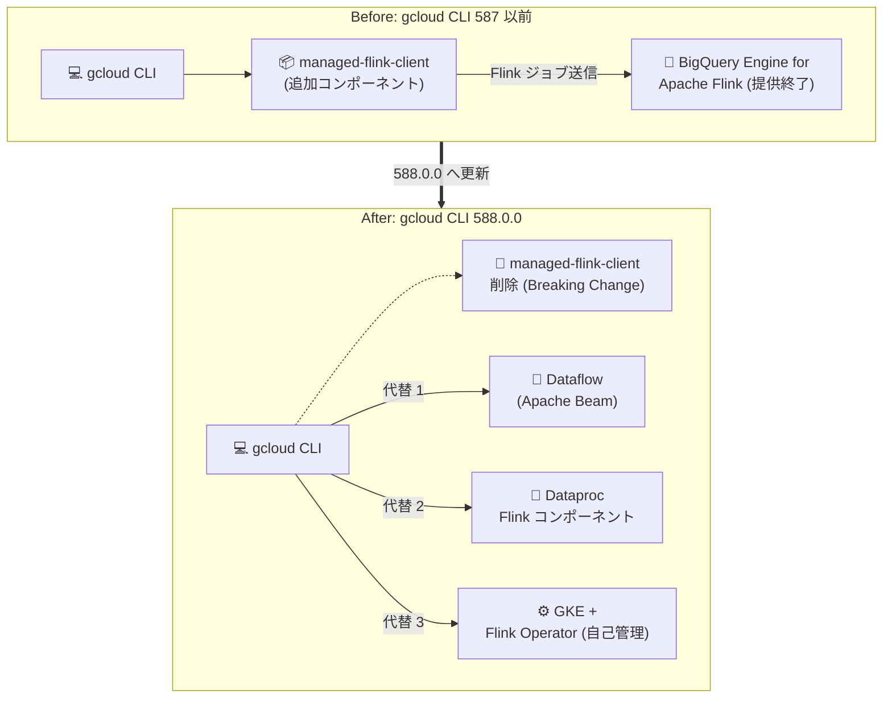

# Cloud SDK (gcloud CLI): 588.0.0 リリース - Managed Flink Client コンポーネントの削除 (Breaking Change)

**リリース日**: 2026-10-06

**サービス**: Cloud SDK (gcloud CLI)

**機能**: バージョン 588.0.0 リリース (Managed Flink Client コンポーネント削除、Agent Identity IAM コマンド追加、Apigee apis import GA など)

**ステータス**: GA (Breaking Change を含む)

📊 [このアップデートのインフォグラフィックを見る](https://takech9203.github.io/google-cloud-news-summary/20261006-cloud-sdk-588-managed-flink-client-removal.html)

## 概要

2026 年 10 月 6 日、Google Cloud CLI (gcloud CLI) のバージョン 588.0.0 がリリースされました。本リリースの最大のポイントは、**Breaking Change として Managed Flink Client コンポーネント (`managed-flink-client`) が gcloud CLI から削除された**ことです。このコンポーネントは、BigQuery Engine for Apache Flink (Cloud Managed Flink) に Flink ジョブを送信するためのクライアントであり、同サービスの提供終了に伴い CLI からも撤去されました。CI/CD パイプラインやローカル環境で `managed-flink-client` をインストール・利用しているユーザーは影響を受けるため、注意が必要です。

Breaking Change 以外にも注目すべき変更が多数含まれています。Agent Identity に IAM ポリシー管理コマンド群 (alpha/beta) が追加され、Apigee では YAML テンプレートまたはプロキシバンドル ZIP から API プロキシをインポートする `gcloud apigee apis import` が GA に昇格しました。また、BigLake の Hive カタログ/データベース/テーブル関連コマンドの GA 昇格、Compute Engine の alpha/beta リリーストラックの開発凍結 (今後のプレビュー機能は `gcloud preview compute` に移行) など、Solutions Architect として把握しておくべき変更が含まれています。

本レポートは、gcloud CLI を日常的に利用するすべてのユーザー、特にストリーミング処理基盤や API 管理、IaC/CI/CD パイプラインを運用するエンジニアを対象としています。

**アップデート前の課題**

- 提供終了が発表された BigQuery Engine for Apache Flink 向けの `managed-flink-client` コンポーネントが gcloud CLI に残存しており、利用者が終了済みサービスへの依存を継続するリスクがあった
- Apigee の API プロキシインポート機能 (`gcloud apigee apis import`) は GA 前のステータスであり、本番環境の CI/CD パイプラインへの組み込みに慎重な判断が必要だった
- `gcloud apigee apis import --from-template` には、EventFlow の出力位置、defaultEndpoint/defaultTarget の部分適用、ポリシー名のプレフィックス衝突など多数の不具合が存在した
- Agent Identity の認証プロバイダー認可リソースに対する IAM ポリシーを gcloud CLI から直接管理するコマンドがなかった

**アップデート後の改善**

- `managed-flink-client` コンポーネントが削除され、終了済みサービスへの依存が CLI レベルで解消された (Dataflow や Dataproc Flink コンポーネントなどの代替への移行が明確化)
- `gcloud apigee apis import` が GA となり、YAML テンプレート (`--from-template`) またはバンドル ZIP (`--from-bundle`) からの API プロキシインポートを本番運用で利用可能になった
- テンプレートインポートの多数の不具合 (EventFlow の扱い、defaultEndpoint/defaultTarget の適用、ポリシー名の衝突、metadata.js の未生成など) が修正された
- `gcloud alpha|beta agent-identity auth-providers authorizations` 配下に `get-iam-policy`、`set-iam-policy`、`add-iam-policy-binding`、`remove-iam-policy-binding`、`test-iam-permissions` が追加され、Agent Identity の認可管理が CLI で完結するようになった

## アーキテクチャ図



gcloud CLI 588.0.0 では、提供終了となった BigQuery Engine for Apache Flink 向けの `managed-flink-client` コンポーネントが削除されました。Apache Flink ベースのストリーミング処理は、Dataflow、Dataproc の Flink コンポーネント、または GKE 上の自己管理 Flink などへの移行が選択肢となります。

## サービスアップデートの詳細

### 主要機能

1. **【Breaking Change】Managed Flink Client コンポーネントの削除 (Cloud Managed Flink)**
   - `managed-flink-client` コンポーネントが gcloud CLI から削除された
   - このコンポーネントは BigQuery Engine for Apache Flink (Cloud Managed Flink) へ Flink ジョブをコンパイル・送信するためのクライアントだった
   - 対象サービスの公式ドキュメントページはすでに公開を終了しており、サービス終了に伴うクリーンアップと位置付けられる
   - このコンポーネントに依存するスクリプトや CI/CD パイプラインは 588.0.0 以降動作しなくなる

2. **Agent Identity: IAM ポリシー管理コマンドの追加 (alpha/beta)**
   - `gcloud alpha|beta agent-identity auth-providers authorizations` 配下に以下のコマンドが追加された
     - `get-iam-policy` / `set-iam-policy`: IAM ポリシーの取得・設定
     - `add-iam-policy-binding` / `remove-iam-policy-binding`: ロールバインディングの追加・削除
     - `test-iam-permissions`: 権限のテスト
   - AI エージェントの認証プロバイダー認可リソースに対するアクセス制御を CLI で管理可能になった

3. **Apigee: `gcloud apigee apis import` の GA 昇格と多数の不具合修正**
   - YAML テンプレート (`--from-template`) またはプロキシバンドル ZIP (`--from-bundle`) から API プロキシをインポートするコマンドが GA に昇格
   - EventFlow が汎用 `<Flows>` コンテナ内に出力され通常の条件付きフローとして扱われる問題を修正 (トップレベル要素として `content-type` 属性付きで出力、デフォルトは `text/event-stream`)
   - feature の `defaultEndpoint` が部分適用され routes や faultRules が欠落する問題、フローステップが二重実行される問題を修正
   - feature の `defaultTarget` が無視され、生成されたターゲットエンドポイントに PostFlow/EventFlow/DefaultFaultRule が欠落する問題を修正
   - `uid` を宣言しない feature のポリシー名・リソース名の衝突問題を修正
   - `apiproxy/resources/jsc/metadata.js` が生成されない問題、ポリシー子要素の出力順序の問題、`displayName` を持つテンプレートが拒否される問題などを修正
   - `gcloud beta apigee apis deploy` に `--service-account` フラグを追加 (デプロイしたプロキシにサービスアカウントとして動作する権限を付与)

4. **Anthos: anthos-cli の更新**
   - anthos-cli が新しい Go バージョンとライブラリ依存関係で更新された (セキュリティ・保守性の向上)

5. **その他の注目すべき変更**
   - **BigLake**: `gcloud biglake hive catalogs|databases|tables` が GA に昇格
   - **Cloud Dataplex**: `gcloud dataplex data-products` が GA に昇格
   - **Cloud IAM**: `gcloud iam workforce-pools subjects revoke-sessions` を追加 (Workforce Pool サブジェクトの全セッションを失効)
   - **Compute Engine**: alpha/beta リリーストラックの開発を凍結。既存コマンドはサポート継続、新しいプレビュー機能は今後 `gcloud preview compute` で提供
   - **Compute Engine**: `--metadata-from-file` でファイルパスに `-` を指定して標準入力からメタデータ値を読み取り可能に
   - **Certificate Authority Service**: `gcloud privateca certificates create` に `--key-algorithm` フラグを追加
   - **Cloud SQL**: `cloud-sql-proxy` 同梱コンポーネントを Cloud SQL Proxy 2.26.0 に更新
   - **Cloud Bigtable / Bigtable Emulator**: CVE-2026-33818 対応のため Go バージョン更新・再ビルド。エミュレータはマイクロ秒精度タイムスタンプをサポート
   - **Kubernetes Engine**: デフォルト kubectl を 1.35.8 から 1.35.9 に更新
   - **Network Security**: `gcloud beta network-security server-tls-policies create|update` を追加
   - **Cloud Resource Manager / IAM**: `gcloud beta projects delete` などの `--recommend` フラグは変更リスク推奨機能の廃止に伴い無効化

## 技術仕様

### 588.0.0 の主な変更一覧

| カテゴリ | 変更内容 | 影響度 |
|------|------|------|
| Cloud Managed Flink | `managed-flink-client` コンポーネント削除 | **Breaking Change** |
| Agent Identity | 認可リソースの IAM 管理コマンド追加 | alpha/beta |
| Apigee | `apis import` GA 昇格 + テンプレート関連の多数の修正 | GA |
| BigLake | `hive catalogs/databases/tables` GA 昇格 | GA |
| Compute Engine | alpha/beta トラック凍結、新機能は `gcloud preview compute` へ | 運用上の注意 |
| Cloud Bigtable | CVE-2026-33818 対応の再ビルド | セキュリティ |
| Kubernetes Engine | kubectl 1.31.14 / 1.32.13 / 1.33.13 / 1.34.12 / 1.35.9 / 1.36.5 / 1.37.1 を同梱 | 通常更新 |

### Breaking Change の影響確認

```bash
# インストール済みコンポーネントの確認
gcloud components list

# managed-flink-client がインストールされている環境で 588.0.0 に更新した場合、
# 当該コンポーネントは利用できなくなる
# (関連する gcloud managed-flink コマンドによるジョブ送信も不可)
```

## 設定方法

### 前提条件

1. gcloud CLI がインストールされていること (パッケージマネージャー経由の場合はコンポーネントマネージャーが無効のため、APT/YUM パッケージで管理)
2. `managed-flink-client` を利用していた場合は、代替サービス (Dataflow、Dataproc Flink コンポーネントなど) への移行計画があること

### 手順

#### ステップ 1: gcloud CLI を 588.0.0 に更新

```bash
# インストール済みコンポーネントをすべて最新版に更新
gcloud components update

# バージョン確認
gcloud version
```

直接インストール (インタラクティブインストーラーなど) の環境では `gcloud components update` で更新します。APT/YUM 環境では各パッケージマネージャーで更新してください。

#### ステップ 2: Breaking Change の影響を確認

```bash
# CI/CD スクリプト内で managed-flink-client / managed-flink コマンドへの
# 依存がないか確認
grep -rE "managed-flink" ./scripts ./cicd 2>/dev/null

# コンポーネントの状態を確認
gcloud components list
```

`managed-flink-client` に依存する処理が見つかった場合は、Dataflow (Apache Beam) や Dataproc の Flink コンポーネントなどへの移行を検討します。

#### ステップ 3: (必要に応じて) 旧バージョンへのロールバック

```bash
# 直接インストールの場合のみ: 既知の正常バージョンに戻す
gcloud components update --version 587.0.0
```

移行作業の猶予が必要な場合、直接インストール環境では一時的に旧バージョンへ戻すことができます。ただし提供終了サービスへの依存は早期に解消すべきです。

#### ステップ 4: GA 昇格した Apigee インポートコマンドの利用例

```bash
# バンドル ZIP から API プロキシをインポート
gcloud apigee apis import helloworld --from-bundle=./helloworld.zip

# YAML テンプレートから API プロキシをインポート
gcloud apigee apis import helloworld --from-template=./helloworld.yaml

# インポート後、新しいリビジョンを環境にデプロイ
gcloud apigee apis deploy
```

## メリット

### ビジネス面

- **終了済みサービスへの依存リスクの解消**: 提供終了した BigQuery Engine for Apache Flink への依存が CLI レベルで明示的に断ち切られ、移行の意思決定を促進する
- **API 管理の自動化を本番品質で実現**: `gcloud apigee apis import` の GA 昇格により、API プロキシのコード管理 (YAML テンプレート) と CI/CD 統合を SLA のある GA 機能として採用できる
- **セキュリティ姿勢の維持**: CVE-2026-33818 対応 (Bigtable 関連ツール) や Cloud SQL Proxy 2.26.0 への更新など、CLI 同梱ツールのセキュリティが継続的に維持される

### 技術面

- **CLI インストールのスリム化**: 不要になったコンポーネントの削除により、インストールサイズと保守対象が削減される
- **Apigee テンプレートインポートの品質向上**: EventFlow、defaultEndpoint/defaultTarget、ポリシー名衝突など多数の不具合修正により、テンプレート生成されるプロキシバンドルの正確性が向上
- **Agent Identity の IAM 管理を CLI で完結**: コンソールや API を直接叩かずに、認可リソースへの IAM ポリシーバインディングをスクリプト化できる

## デメリット・制約事項

### 制限事項

- `managed-flink-client` の削除は Breaking Change であり、588.0.0 以降は再インストールできない
- Agent Identity の IAM コマンドは alpha/beta トラックのみの提供であり、GA ではない
- Compute Engine の alpha/beta トラックは開発凍結となり、新しいプレビュー機能は `gcloud preview compute` コンポーネントの別途インストールが必要になる

### 考慮すべき点

- `gcloud apigee apis import --from-template` の修正の一部は生成されるバンドルの内容を変更する (例: `uid` を宣言しない feature のポリシー名が変わる、feature がアウトバウンド側に適用されることで Extensible API proxy となり Base environment にデプロイできなくなる場合がある)。既存テンプレートの再インポート時は差分を確認すること
- `gcloud beta projects delete` などの `--recommend` フラグは機能が廃止され無効 (no-op) となったため、変更リスク推奨に依存した運用フローは見直しが必要
- パッケージマネージャー (APT/YUM) でインストールした環境ではコンポーネントマネージャーが使えないため、更新手段が異なる

## ユースケース

### ユースケース 1: CI/CD パイプラインの gcloud CLI 更新前チェック

**シナリオ**: 毎週 gcloud CLI を自動更新している CI/CD 環境で、588.0.0 への更新による Breaking Change の影響を事前に確認したい。

**実装例**:
```bash
# パイプライン定義とスクリプトから managed-flink 依存を検出
grep -rE "managed-flink(-client)?" .github/ scripts/ || echo "依存なし: 更新可能"

# 更新実行
gcloud components update --quiet
```

**効果**: Breaking Change による予期しないパイプライン障害を未然に防ぎ、必要な場合は Dataflow などへの移行タスクを事前に計画できる。

### ユースケース 2: Apigee API プロキシの GitOps 運用

**シナリオ**: API プロキシの構成を YAML テンプレートとして Git リポジトリで管理し、マージ時に自動でインポート・デプロイしたい。

**実装例**:
```bash
# テンプレートからインポート (feature ファイルはテンプレートと同一ディレクトリに配置)
gcloud apigee apis import my-api \
  --organization=my-org \
  --from-template=./apiproxies/my-api/template.yaml \
  --format=json

# 新リビジョンを環境にデプロイ (サービスアカウント権限付与は beta)
gcloud beta apigee apis deploy --service-account=proxy-sa@my-project.iam.gserviceaccount.com
```

**効果**: GA 機能としてサポートされた状態で API プロキシの宣言的管理と CI/CD 統合を実現できる。588.0.0 の多数の修正により、テンプレートから生成されるプロキシの挙動が宣言どおりになる。

### ユースケース 3: Workforce Identity のインシデント対応

**シナリオ**: 従業員の認証情報漏えいが疑われるとき、該当する Workforce Pool サブジェクトのセッションを即時に無効化したい。

**実装例**:
```bash
gcloud iam workforce-pools subjects revoke-sessions SUBJECT_ID \
  --workforce-pool=my-pool --location=global
```

**効果**: 新コマンドにより、インシデント対応時のセッション失効を 1 コマンドで実行でき、対応時間を短縮できる。

## 料金

gcloud CLI (Cloud SDK) 自体は無料で利用できます。CLI から操作する各 Google Cloud サービス (Apigee、BigLake、Compute Engine など) の利用には、それぞれのサービスの料金が適用されます。

- [Google Cloud の料金](https://cloud.google.com/pricing)

## 利用可能リージョン

gcloud CLI はクライアントツールのためリージョンの制約はありません。各コマンドが操作するサービスのリージョン提供状況に従います。なお、本リリースでは `gcloud looker` のリージョナルエンドポイントサポートが追加されています。

## 関連サービス・機能

- **Dataflow**: BigQuery Engine for Apache Flink の主要な移行先候補。Apache Beam ベースのフルマネージドなストリーミング/バッチ処理サービス
- **Dataproc (Flink コンポーネント)**: Apache Flink の API をそのまま使いたい場合の移行先候補。`gcloud dataproc clusters create --optional-components=FLINK` で Flink クラスタを作成し、`gcloud dataproc jobs submit flink` でジョブを送信できる
- **Apigee**: `apis import` の GA 昇格により、YAML テンプレートによる API プロキシの宣言的管理が本番利用可能になった
- **Workforce Identity Federation**: `revoke-sessions` コマンドの追加により、サブジェクト単位のセッション失効が CLI から可能になった
- **Cloud SQL Auth Proxy**: 同梱コンポーネントが 2.26.0 に更新され、Cloud SQL への安全な接続を提供

## 参考リンク

- 📊 [インフォグラフィック](https://takech9203.github.io/google-cloud-news-summary/20261006-cloud-sdk-588-managed-flink-client-removal.html)
- [公式リリースノート (2026-10-06)](https://docs.cloud.google.com/release-notes#October_06_2026)
- [Cloud SDK リリースノート](https://docs.cloud.google.com/sdk/docs/release-notes)
- [gcloud CLI コンポーネントの管理](https://docs.cloud.google.com/sdk/docs/components)
- [gcloud apigee apis import リファレンス](https://docs.cloud.google.com/sdk/gcloud/reference/apigee/apis/import)
- [Dataproc の Flink コンポーネント](https://docs.cloud.google.com/managed-spark/docs/concepts/components/flink)

## まとめ

gcloud CLI 588.0.0 は、提供終了した BigQuery Engine for Apache Flink のクライアントコンポーネント削除という Breaking Change を含むリリースです。`managed-flink-client` に依存する環境は更新前に影響を確認し、Dataflow や Dataproc Flink コンポーネントへの移行を進めてください。あわせて、Apigee の `apis import` GA 昇格や Compute Engine の alpha/beta トラック凍結など運用に影響する変更も含まれるため、CI/CD パイプラインの gcloud 更新ポリシーの見直しを推奨します。

---

**タグ**: #CloudSDK #gcloudCLI #BreakingChange #ManagedFlink #Apigee #AgentIdentity #BigLake #ComputeEngine
