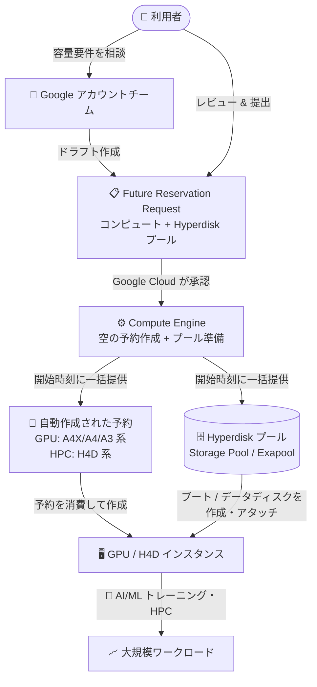

# Compute Engine / AI Hypercomputer: アカウントチーム経由の容量予約で Hyperdisk プールの同時予約が GA

**リリース日**: 2026-10-06

**サービス**: Compute Engine / AI Hypercomputer

**機能**: GPU / H4D インスタンス向け容量予約への Hyperdisk プール追加 (Future Reservation for Capacity Blocks)

**ステータス**: GA (一般提供)

📊 [このアップデートのインフォグラフィックを見る](https://takech9203.github.io/google-cloud-news-summary/20261006-compute-engine-hyperdisk-pool-reservations.html)

## 概要

Google Cloud は、アカウントチーム経由でコンピュート容量を予約する際 (Future Reservation Request for Capacity Blocks)、同じリクエスト内または後続のリクエストで **Hyperdisk プール** を併せて予約できる機能を一般提供 (GA) としました。本機能は 2 つのサービスで同時に発表されています。

- **AI Hypercomputer**: GPU インスタンス (A4X Max / A4X / A4 / A3 Ultra / A3 Mega / A3 High) の容量予約に Hyperdisk プールを含められるようになり、AI/ML ワークロードが必要とするストレージリソースを GPU インスタンスの近くに確保できます。
- **Compute Engine**: HPC 向け H4D インスタンス (h4d-standard-192 / h4d-highmem-192 / h4d-highmem-192-lssd) の容量予約に Hyperdisk プールを含められるようになり、HPC ワークロードに必要なストレージをコンピュートインスタンスの近くに確保できます。

リクエストが承認されると、Compute Engine は空の予約を作成して Hyperdisk プールを準備し、指定した開始時刻にコンピュート容量と Hyperdisk プールを **一括でプロビジョニング** します。大規模な AI/ML トレーニングや HPC シミュレーションにおいて、「GPU は確保できたがストレージが足りない」というリソースのミスマッチを防ぎ、計画的なキャパシティ確保を実現します。

**アップデート前の課題**

- 容量ブロックの将来予約 (Future Reservation) で確保できるのはコンピュートリソースが中心で、大規模ワークロードに必要な Hyperdisk ストレージ容量は別途計画・調達する必要があった
- GPU / H4D インスタンスの確保時点で、同一ゾーンに十分な Hyperdisk 容量・性能 (IOPS / スループット) が存在する保証がなく、ワークロード開始時にストレージがボトルネックになるリスクがあった
- コンピュートとストレージの提供タイミングを手動で揃える運用負荷があった

**アップデート後の改善**

- GPU / H4D インスタンスの容量予約と同じリクエスト (または後続リクエスト) で Hyperdisk プールを予約でき、コンピュートとストレージが指定した開始時刻に一括で提供されるようになった
- 予約済みコンピュートインスタンスの近く (同一ゾーン) にストレージリソースが確保されるため、AI/ML・HPC ワークロードの I/O 性能を計画どおりに担保できるようになった
- Hyperdisk Exapool については後続の将来予約リクエストで既存プールへの容量追加も可能になり、段階的な拡張計画を立てやすくなった

## アーキテクチャ図



アカウントチーム経由の将来予約リクエストにコンピュート容量と Hyperdisk プールを含めると、承認後、指定した開始時刻に予約と Hyperdisk プールが一括でプロビジョニングされ、インスタンスの近くにストレージを確保した状態でワークロードを開始できます。

## サービスアップデートの詳細

### 主要機能

1. **コンピュート容量と Hyperdisk プールの一括予約**
   - アカウントチーム経由の将来予約リクエスト (Future Reservation for Capacity Blocks) に Hyperdisk プールを含められる
   - 同じリクエストでも、後続の別リクエストでも追加可能
   - 承認後、指定した開始時刻にコンピュート容量が自動作成された予約に、ストレージ容量が Hyperdisk プールに一括でプロビジョニングされる

2. **対象マシンタイプ**
   - **AI Hypercomputer (GPU)**: A4X Max (`a4x-maxgpu-4g-metal`)、A4X (`a4x-highgpu-4g`)、A4 (`a4-highgpu-8g`)、A3 Ultra (`a3-ultragpu-8g`)、A3 Mega (`a3-megagpu-8g`)、A3 High (`a3-highgpu-8g`)
   - **Compute Engine (HPC)**: H4D (`h4d-standard-192`、`h4d-highmem-192`、`h4d-highmem-192-lssd`)
   - いずれも Dense デプロイメントタイプ (アクセラレータを物理的に近接配置し、ネットワークホップとレイテンシを最小化) を指定

3. **2 種類の Hyperdisk プールに対応**
   - **Hyperdisk Storage Pool**: 20 TiB 以上〜最大 5 PiB の容量をバルク購入する標準的なプール。予約では新規プールが自動作成される (既存プールへの容量予約は不可)
   - **Hyperdisk Exapool**: 500 TiB〜2.5 EiB の超大規模ワークロード向けプール。後続の将来予約リクエストで既存 Exapool への容量追加が可能

4. **ライフサイクルの自動管理**
   - Hyperdisk プールの開始時刻は、コンピュートインスタンスの開始時刻と同時またはそれ以前に設定する必要がある
   - コンピュート容量と Hyperdisk プール容量の予約終了時刻は一致させる必要がある
   - 予約期間終了時に、自動作成された予約と空の Hyperdisk プールを自動削除する設定が可能

## 技術仕様

### 予約リクエストの主な指定項目

| 項目 | 詳細 |
|------|------|
| プロジェクト番号 | アカウントチームがリクエストを作成し、容量がプロビジョニングされるプロジェクト |
| マシンタイプ | GPU 系 (A4X Max / A4X / A4 / A3 Ultra / A3 Mega / A3 High) または H4D 系 |
| ゾーン | 容量を予約するゾーン (マシンタイプの提供ゾーンに依存) |
| デプロイメントタイプ | Dense (低レイテンシのための物理的近接配置) |
| 合計台数 | GPU インスタンスは 2 の倍数で指定。ブロックサイズはマシンタイプと空き状況に依存 |
| 開始時刻 | RFC 3339 形式。Hyperdisk プールはコンピュートの開始時刻と同時またはそれ以前 |
| 終了時刻 | RFC 3339 形式。コンピュートと Hyperdisk プールの終了時刻は一致が必須 |
| 予約名 | 特定ターゲット予約 (specifically targeted reservation) として作成される |
| 自動削除 | 期間終了時に予約と関連 Hyperdisk プールを自動削除するかどうか |
| メンテナンススケジュール | `GROUPED` (ブロック内で同期) または `INDEPENDENT` (個別) ※H4D の場合 |

### Hyperdisk プールタイプの比較

| 項目 | Hyperdisk Storage Pool | Hyperdisk Exapool |
|------|------------------------|-------------------|
| 想定規模 | 20 TiB 以上/ゾーン | 500 TiB〜2.5 EiB/ゾーン |
| 最大容量 | 5 PiB | 2.5 EiB |
| 最大スループット | 1 TiB/s (Balanced) | 1 TiB/s 以上の要件に対応 |
| 予約での扱い | 新規プールが自動作成 (既存プールへの予約は不可) | 後続リクエストで既存プールへの容量追加が可能 |
| CUD (確約利用割引) | 対象外 | リソースベース CUD (1 年/3 年) の対象 |

## 設定方法

### 前提条件

1. Google Cloud アカウントチームとの契約関係があること (本機能はセルフサービスではなくアカウントチーム経由のリクエストで利用)
2. 対象マシンタイプ (GPU 系 / H4D) が提供されているゾーンを選定していること
3. ワークロードに必要なストレージ容量・性能 (IOPS / スループット) の見積もりが完了していること

### 手順

#### ステップ 1: アカウントチームへの容量リクエスト

アカウントチームに連絡し、マシンタイプ・ゾーン・台数・期間 (開始/終了時刻)・Hyperdisk プールの容量と性能要件を伝えます。Hyperdisk プールは同じリクエストに含めることも、後からの追加リクエストにすることもできます。

#### ステップ 2: ドラフトリクエストのレビューと提出

Google が作成したドラフトの将来予約リクエストの内容 (開始/終了時刻、台数、プール容量、自動削除設定など) を確認して提出します。承認後はリクエスト内容を変更できないため、提出前の確認が重要です。

#### ステップ 3: 開始時刻以降に予約を消費してインスタンスを作成

開始時刻になると、自動作成された予約にコンピュート容量が、Hyperdisk プールにストレージ容量がプロビジョニングされます。予約を指定してインスタンスを作成し、プール内にディスクを作成してブートディスクやデータディスクとしてアタッチします。

```bash
# 自動作成された特定ターゲット予約を消費してインスタンスを作成する例
gcloud compute instances create my-gpu-instance \
    --zone=ZONE \
    --machine-type=a4-highgpu-8g \
    --reservation-affinity=specific \
    --reservation=RESERVATION_NAME
```

## メリット

### ビジネス面

- **キャパシティの確実性**: 大規模 AI/ML・HPC プロジェクトで、コンピュートとストレージの両方を開始日から確実に利用できることをコミットでき、プロジェクト計画の精度が向上する
- **調達の一元化**: コンピュートとストレージの調達をひとつの予約リクエストに統合でき、調達・契約プロセスが簡素化される
- **コスト効率**: プール方式により容量と性能をバルク購入でき、個別ディスク単位の過剰プロビジョニングを回避できる。Exapool はリソースベース CUD (1 年/3 年) の対象

### 技術面

- **ストレージの近接配置**: Hyperdisk プールが GPU / H4D インスタンスと同じゾーンに確保され、I/O レイテンシとスループットを計画どおりに担保できる
- **一括プロビジョニング**: 開始時刻にコンピュートとストレージが同時に利用可能になるため、提供タイミングのずれによるワークロード開始遅延がなくなる
- **シンプロビジョニングと性能共有**: Storage Pool の Advanced プロビジョニングでは、ディスク個別のピークではなくプール全体の同時ピークに合わせた性能購入が可能

## デメリット・制約事項

### 制限事項

- 本機能はアカウントチーム経由のリクエストが必須で、Google Cloud コンソールや gcloud からのセルフサービスでは予約リクエストを作成できない
- Hyperdisk Storage Pool は既存プールへの容量予約ができず、予約の提供時に必ず新規プールが自動作成される (Exapool は後続リクエストでの容量追加が可能)
- リクエスト提出・承認後は内容を変更できず、状態が `PROVISIONING` になった後はキャンセル・削除もできない。利用の有無にかかわらず開始時刻から容量分の支払い義務が発生する
- 自動作成された予約と Hyperdisk プールは手動で削除できない (期間終了後に保持を選んだ場合、削除にはアカウントチームへの連絡が必要)
- 予約や プールのリソース増加 (インスタンス数・プール容量) にはアカウントチームへの連絡が必要
- 自動作成されるのは特定ターゲット予約 (specifically targeted reservation) のみ

### 考慮すべき点

- Hyperdisk プールの開始時刻はコンピュートの開始時刻と同時またはそれ以前、終了時刻は一致させる必要があり、スケジュール設計に注意が必要
- 予約期間終了時には、自動作成された予約と空の Hyperdisk プールが削除され、インスタンスは指定した終了アクション (停止/削除) に従って処理されるため、データ退避計画が必要
- 予約にリソースベースのコミットメントが付随する場合、コミットメント有効化前に利用するとオンデマンド料金が適用される (CUD を受けるにはコミットメント有効化後に利用開始)
- Storage Pool は CUD / SUD の対象外である点をコスト計画に織り込む必要がある

## ユースケース

### ユースケース 1: 大規模 LLM トレーニングのための GPU + ストレージ一括確保

**シナリオ**: 数千台規模の A4 / A3 系 GPU インスタンスで数か月間の基盤モデルトレーニングを計画しており、ブートディスクとスクラッチ領域として数 PiB 規模の Hyperdisk Balanced が必要。

**実装例**:
```text
アカウントチームへのリクエスト内容 (例):
- マシンタイプ: a4-highgpu-8g、台数: 2 の倍数で指定
- デプロイメントタイプ: Dense
- Hyperdisk プール: Exapool (Hyperdisk Balanced)、容量 2 PiB、
  スループット 500 GiB/s 規模の同時集約性能
- 開始時刻: プールをコンピュートと同時またはそれ以前に設定
- 終了時刻: コンピュートとプールで一致させる
```

**効果**: トレーニング開始日に GPU とストレージが同時に利用可能となり、ストレージ調達の遅延やゾーン内の容量不足によるプロジェクト遅延リスクを排除できる。Exapool の CUD によりストレージコストも最適化できる。

### ユースケース 2: H4D クラスタによる HPC シミュレーション基盤

**シナリオ**: 製造業の CFD / 構造解析など、H4D インスタンスの大規模クラスタで実行する HPC ワークロードに、高スループットの共有ストレージ基盤 (並列ファイルシステムのバックエンド) が必要。

**効果**: H4D の容量ブロックと Hyperdisk プールを同一ゾーンに一括確保することで、計算ノードとストレージ間のレイテンシを最小化し、計画した期間内で安定した I/O 性能のもとシミュレーションを実行できる。`GROUPED` メンテナンススケジュールと組み合わせれば、クラスタ全体のメンテナンス影響も同期管理できる。

## 料金

Hyperdisk プールは、プールに対して購入した容量と性能 (IOPS / スループット) に基づいて課金されます。プール内に作成した個々のディスクのプロビジョニング容量・性能には課金されません。

- **Standard 容量 / Standard 性能の Storage Pool**: 単体の Hyperdisk と同じ単価
- **Advanced 容量 / Advanced 性能の Storage Pool**: シンプロビジョニングとデータ削減機能のため単価は高いが、利用効率の向上により総コストを削減できる可能性がある
- **Hyperdisk Exapool**: 1 年または 3 年のリソースベース CUD の対象。Storage Pool は CUD / SUD の対象外
- **予約の支払い義務**: 承認済みリクエストは、利用の有無にかかわらず開始時刻から容量分の支払いが発生する

詳細は [ディスク料金ページ](https://docs.cloud.google.com/compute/disks-image-pricing#section-2) を参照してください。

## 利用可能リージョン

対象マシンタイプの提供ゾーンに依存します。GPU マシンタイプは [アクセラレータの利用可能ゾーン](https://docs.cloud.google.com/compute/docs/regions-zones/accelerator-zones#view-using-table)、H4D は [利用可能リージョンとゾーン](https://docs.cloud.google.com/compute/docs/regions-zones#available) を参照してください。

## 関連サービス・機能

- **AI Hypercomputer**: GPU / TPU クラスタの統合的なキャパシティ管理フレームワーク。本機能は AI Hypercomputer の容量予約フローの一部として提供される
- **Cluster Director**: 容量ブロックを使った HPC / AI クラスタの管理機能。将来予約で確保した容量ブロック上にクラスタを構築できる
- **Compute Engine 予約 (Reservations)**: 本機能で自動作成されるのは特定ターゲット予約。共有タイプや消費プロジェクトの変更は予約作成後も可能
- **Vertex AI**: 自動作成された予約は Vertex AI での予約利用の有効化/無効化が可能 (GPU 予約の場合)
- **Hyperdisk Balanced / Hyperdisk Throughput**: Hyperdisk プール内に作成できるディスクタイプ。ブートディスク・データディスクとして利用可能
- **確約利用割引 (CUD)**: Exapool はリソースベース CUD の対象。予約に付随するコミットメントは更新・延長・分割などが不可

## 参考リンク

- 📊 [インフォグラフィック](https://takech9203.github.io/google-cloud-news-summary/20261006-compute-engine-hyperdisk-pool-reservations.html)
- [公式リリースノート](https://docs.cloud.google.com/release-notes#October_06_2026)
- [Reserve capacity through your account team (AI Hypercomputer)](https://docs.cloud.google.com/ai-hypercomputer/docs/reserve-capacity)
- [Reserve capacity through your account team (H4D / HPC)](https://docs.cloud.google.com/compute/docs/hpc/reserve-capacity-account-team)
- [Hyperdisk プールの概要](https://docs.cloud.google.com/compute/docs/disks/pools)
- [Hyperdisk Storage Pools](https://docs.cloud.google.com/compute/docs/disks/storage-pools)
- [Hyperdisk Exapools](https://docs.cloud.google.com/compute/docs/disks/hyperdisk-exapools)
- [料金ページ (ディスク料金)](https://docs.cloud.google.com/compute/disks-image-pricing#section-2)

## まとめ

GPU / H4D インスタンスの容量予約に Hyperdisk プールを含められるようになったことで、大規模 AI/ML・HPC ワークロードのコンピュートとストレージを一括で計画・確保できるようになりました。数百〜数千台規模のアクセラレータクラスタを計画している組織は、ストレージ容量・性能の見積もりを事前に行い、アカウントチームとの容量予約リクエストに Hyperdisk プールを含めることを検討してください。承認後の変更・キャンセルができない点を踏まえ、開始/終了時刻と容量の設計は提出前に十分に確認することが重要です。

---

**タグ**: #ComputeEngine #AIHypercomputer #Hyperdisk #StoragePool #Exapool #Reservations #GPU #H4D #HPC #AIML #GA
