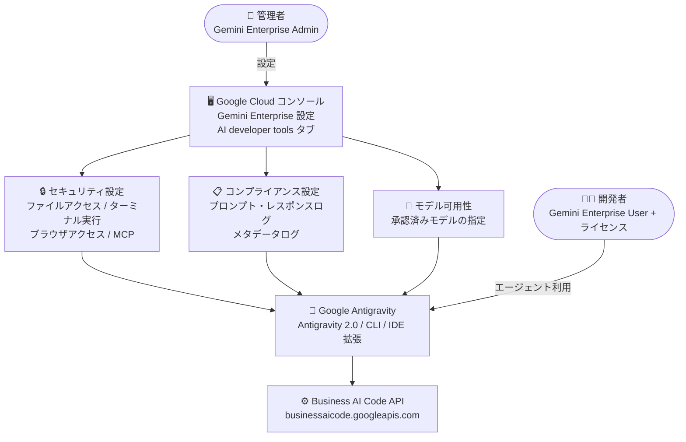

# Gemini Enterprise: Google Antigravity 機能へのアクセス制御が GA

**リリース日**: 2026-10-06

**サービス**: Gemini Enterprise

**機能**: Google Antigravity 機能へのアクセス制御 (Configure feature settings)

**ステータス**: GA (一般提供)

📊 [このアップデートのインフォグラフィックを見る](https://takech9203.github.io/google-cloud-news-summary/20261006-gemini-enterprise-antigravity-access-control.html)

## 概要

Gemini Enterprise において、組織内のユーザーが Google Antigravity 機能にアクセスできるかどうかを管理者が制御できる機能が一般提供 (GA) になりました。管理者は Google Cloud コンソールの Gemini Enterprise 設定にある「AI developer tools」ページから、Antigravity を含む AI 開発者ツールの有効化・無効化に加え、セキュリティポリシー、コンプライアンス (ログ記録)、利用可能なモデルを組織単位で一元管理できます。

Google Antigravity は、自律型 AI エージェントを活用してアプリケーション開発を支援する AI 開発環境です (Antigravity 2.0、Antigravity CLI、IDE 拡張機能などのサーフェスを提供)。今回の GA により、企業の管理者はエージェントによるファイルアクセス、ターミナルコマンドの自動実行、外部 Web アクセス、MCP サーバー接続といった挙動を組織のセキュリティポリシーに沿って統制したうえで、開発者に Antigravity を展開できるようになります。

対象ユーザーは、Gemini Enterprise Standard / Plus / Standard Emerging Market / Pay-as-you-go エディションを利用し、Antigravity を組織的に導入したい企業の管理者 (Gemini Enterprise Admin) です。

**アップデート前の課題**

- 自律型 AI エージェントがローカルファイルへアクセスしたり、ターミナルコマンドを実行したりする挙動を、組織ポリシーとして統制する GA の仕組みが Gemini Enterprise 管理者に提供されていなかった
- エージェントの外部 Web アクセスや MCP サーバー接続を組織単位で許可リスト管理する手段が確立されていなかった
- 規制業界で求められるプロンプト・レスポンスの監査ログを、組織のプロジェクト内に保持する設定が標準化されていなかった

**アップデート後の改善**

- 管理者が Google Cloud コンソールの「AI developer tools」設定から、Antigravity 機能へのアクセス可否を組織単位・ロケーション単位で制御できるようになった (GA)
- ファイルアクセスポリシー、ターミナル自動実行モード、サンドボックスモード、ブラウザアクセス、許可 URL リスト、MCP サーバー許可リストなどのセキュリティ設定を一元管理できるようになった
- プロンプト・レスポンスのログ記録とメタデータログ記録を有効化し、組織のプロジェクト内に安全に監査証跡を保持できるようになった (Google がモデル学習や人間によるレビューに利用することはない)
- Antigravity が利用できる AI モデルを管理者が承認制で制御できるようになった

## アーキテクチャ図



管理者が Google Cloud コンソールで定義したセキュリティ・コンプライアンス・モデル可用性のポリシーが、組織内の開発者が利用する Antigravity の各サーフェス (Antigravity 2.0、CLI、IDE 拡張) に適用される構成です。

## サービスアップデートの詳細

### 主要機能

1. **AI developer tools の有効化・無効化制御**
   - 管理者が Google Cloud コンソールの Gemini Enterprise 設定「AI developer tools」タブのトグルで、ロケーションごとに Antigravity を含む AI 開発者ツールを有効化・無効化できる
   - 新規の Standard / Plus / Pay-as-you-go サブスクリプションでは、サポート対象ロケーションであれば購入したロケーションでデフォルトで有効
   - 既存サブスクリプションでは、管理者がロケーションごとに手動で有効化する必要がある

2. **セキュリティポリシーの統制**
   - **作業フォルダ外ファイルアクセスポリシー**: Deny (拒否) / Always ask (毎回確認) / Allow (許可) から選択。デフォルトは Deny
   - **ターミナル自動実行モード**: Require review (実行前にレビュー要求) / Proceed in sandbox (サンドボックス内で自動実行) / Always proceed (常に自動実行) から選択。デフォルトは Always proceed
   - **サンドボックスモード**: エージェントのツール実行を分離されたローカルサンドボックスに制限 (デフォルト: 無効)

3. **外部 Web アクセスの統制**
   - **ブラウザアクセス**: エージェントの外部 Web アクセスを制御し、データ漏えいを防止 (デフォルト: 無効)
   - **許可 URL リスト**: Antigravity のブラウザエージェントがアクセスできる URL を許可リストで限定。設定するとリスト外の URL はすべてブロックされる
   - **ブラウザ JavaScript 自動実行モード**: Disabled / Request review / Allowed から選択 (デフォルト: Disabled)

4. **MCP サーバーの許可リスト管理**
   - エージェントが接続できる MCP (Model Context Protocol) サーバーへのアクセスを管理 (デフォルト: 無効)
   - ローカル MCP サーバー (`local_servers`) とリモート MCP サーバー (`remote_servers`) を JSON 形式の許可リストで定義でき、UI でリアルタイム検証される

5. **コンプライアンス (ログ記録) 設定**
   - **プロンプト・レスポンスログ**: 開発者と AI のやり取りを記録し、使用状況メトリクスの算出とセキュリティレビュー用の監査証跡を維持 (デフォルト: 無効)
   - **メタデータログ**: 組織全体の利用状況・分析のためのプロダクトメタデータを記録 (デフォルト: 無効)
   - ログは組織のプロジェクト内に安全に保存され、Google がモデル学習や人間によるレビューのためにアクセスすることはない

6. **モデル可用性の制御**
   - **Antigravity authorized models**: プロジェクト内で Antigravity が利用を許可される AI モデルを指定できる
   - Gemini Enterprise の AI developer tools で利用できるのは Google 製モデルのみ

## 技術仕様

### 前提条件・要件

| 項目 | 詳細 |
|------|------|
| 課金アカウント | 請求書払い (invoiced) の Cloud Billing アカウントが必要 (月次請求を受領しているアカウントのみ対象) |
| 対応エディション | Gemini Enterprise Standard / Plus / Standard Emerging Market / Pay-as-you-go |
| 必要なロール (管理者) | Gemini Enterprise Admin (`roles/discoveryengine.agentspaceAdmin`) |
| 必要なロール (利用者) | Gemini Enterprise User ロール + 有効なライセンス (Admin ロールを持っていても User ロールの明示的な付与が必要) |
| 必要な API | Gemini Enterprise API (`discoveryengine.googleapis.com`)、Business AI Code API (`businessaicode.googleapis.com`) |
| API の自動有効化 | コンソールで AI developer tools のトグルを有効化すると、未有効の必須 API は自動的に有効化される |

### MCP サーバー許可リストの設定例

```json
{
  "mcpServers": {
    "local_servers": [
      {
        "id": "gopls-mcp-server",
        "command": "go",
        "args": ["run", "golang.org/x/tools/gopls@latest", "mcp"]
      }
    ],
    "remote_servers": [
      { "id": "bigquery" },
      { "id": "custom-remote-server", "url": "https://mcp.example.com/mcp" }
    ]
  }
}
```

## 設定方法

### 前提条件

1. 請求書払いの Cloud Billing アカウントにプロジェクトがリンクされていること
2. Gemini Enterprise Standard / Plus / Standard Emerging Market / Pay-as-you-go エディションのサブスクリプションがあること
3. 管理者が Gemini Enterprise Admin (`roles/discoveryengine.agentspaceAdmin`) ロールを持っていること

### 手順

#### ステップ 1: AI developer tools を有効化する

1. Google Cloud コンソールで **Gemini Enterprise** に移動する
2. **Settings** をクリックし、**AI developer tools** タブを選択する
3. **AI developer tools** のトグルをオンにする (必須 API が未有効の場合は自動的に有効化される)

#### ステップ 2: 各セクションの設定を構成する

1. **Security** セクションで、ファイルアクセスポリシー、ターミナル自動実行モード、サンドボックスモード、ブラウザアクセス、許可 URL、MCP サーバーの許可リストを構成する
2. **Compliance** セクションで、プロンプト・レスポンスログとメタデータログの有効化を検討する
3. **Model availability** セクションで、Antigravity が利用できる承認済みモデルを指定する

#### ステップ 3: ユーザーにアクセス権を付与する

Antigravity を利用する開発者に、有効なライセンスと Gemini Enterprise User ロールを付与する。API の有効化だけではユーザーアクセスは付与されない点に注意する。

## メリット

### ビジネス面

- **統制されたエージェント導入**: 自律型 AI エージェントによる開発支援を、組織のセキュリティ・コンプライアンス要件を満たした形で全社展開できる
- **監査対応**: プロンプト・レスポンスのログを組織のプロジェクト内に保持でき、規制業界の監査要件や社内ポリシーに対応しやすくなる
- **GA による本番利用**: 管理者向け設定が GA となり、本番環境での組織的な利用判断がしやすくなった

### 技術面

- **きめ細かなポリシー制御**: ファイルアクセス、ターミナル実行、ブラウザアクセス、JavaScript 実行、MCP 接続をそれぞれ個別のポリシーで制御できる
- **データ漏えい対策**: 許可 URL リストとブラウザアクセス制御により、エージェント経由のデータ持ち出しリスクを低減できる
- **モデルガバナンス**: 組織が承認したモデルのみを Antigravity で利用させることができ、プレビューモデルの利用可否も管理者が判断できる

## デメリット・制約事項

### 制限事項

- 請求書払いの Cloud Billing アカウントのみが対象 (セルフサービスアカウントは利用不可)
- Gemini Enterprise の AI developer tools では Google 製モデルのみ利用可能
- プレビューモデルおよび Gemini 3 Pro Image モデルは global リージョンのみで提供され、US / EU マルチリージョンのデータレジデンシー (DRZ) や ML リージョナル処理コミットメントには対応しない
- Antigravity in Gemini Enterprise は、Access Transparency (AXT)、FedRAMP (Moderate / High)、IL4 / IL5、ISO 27001 / ISO 42001、ITAR、SOC 1 / 2 / 3 の各コンプライアンス認証・セキュリティ管理に対応していない
- Android Studio はサードパーティ ID プロバイダに対応していないため、該当ロケーションのユーザーは Android Studio で AI developer tools を利用できない

### 考慮すべき点

- 初回設定時、「作業フォルダ外ファイルアクセスポリシー」のデフォルトが想定の「Always ask」ではなく「Deny」になる既知の問題がある。確認プロンプトを出したい場合は明示的に「Always ask」へ変更する必要がある
- 「ターミナル自動実行モード」のデフォルトは「Always proceed (常に自動実行)」のため、より厳格な統制が必要な組織は「Require review」や「Proceed in sandbox」への変更を検討すべき
- 必須 API を有効化する前に新規サブスクリプションを購入すると、購入やプロビジョニングが失敗する場合がある。API 有効化後、約 5 分待ってから購入を完了する
- Gemini Enterprise でモデルを有効化しても組織ポリシーは上書きされないため、両プラットフォームで許可モデルを一致させる必要がある
- Antigravity はバックグラウンドタスクに Gemini Flash Lite、画像生成に Gemini 3 Pro Image を使用し、これらの利用には課金が発生する場合がある

## ユースケース

### ユースケース 1: 規制業界での監査証跡付き Antigravity 展開

**シナリオ**: 金融機関の開発部門が Antigravity を導入したいが、社内規程により AI とのやり取りの監査ログ保持が必須となっている。

**実装例**: Compliance セクションで「Prompts and responses logging」と「Metadata logging」を有効化し、ログを自組織のプロジェクト内に保持する。Security セクションでターミナル自動実行を「Require review」に設定する。

**効果**: 監査証跡を確保しながらエージェント開発を導入でき、Google がログをモデル学習や人間によるレビューに使用しないことも保証される。

### ユースケース 2: データ漏えいを防ぐエージェントの外部アクセス制限

**シナリオ**: 機密コードを扱う組織で、ブラウザエージェントが任意の外部サイトへアクセスすることによるデータ持ち出しを防ぎたい。

**実装例**: 「Browser access」を有効化し、「Allowed URLs」に社内ドキュメントサイトや承認済みのパッケージレジストリのみを登録する。「Browser JavaScript auto-execution mode」は「Disabled」のまま運用する。

**効果**: エージェントのアクセス先が許可リスト内に限定され、リスト外の URL はすべてブロックされるため、データ漏えいリスクを低減できる。

### ユースケース 3: 承認済み MCP サーバー・モデルのみを許可した標準開発環境

**シナリオ**: プラットフォームチームが、全開発者に対して承認済みのツール (MCP サーバー) とモデルのみを利用させたい。

**実装例**: 「MCP servers」を有効化し、JSON 許可リストに社内承認済みのローカル / リモート MCP サーバーのみを定義する。「Antigravity authorized models」で利用可能なモデルを限定する。

**効果**: 開発者ごとの野良設定を排除し、組織として承認されたツールチェーンとモデルに統一した標準開発環境を提供できる。

## 料金

AI developer tools (Antigravity を含む) の利用には、Gemini Enterprise Standard / Plus / Standard Emerging Market / Pay-as-you-go エディションのサブスクリプションと、請求書払いの Cloud Billing アカウントが必要です。また、Antigravity はバックグラウンドタスクに Gemini Flash Lite、画像生成に Gemini 3 Pro Image を使用し、これらのモデル利用には課金が発生する場合があります。具体的な料金は以下を参照してください。

- [Gemini Enterprise の料金](https://cloud.google.com/gemini-enterprise)
- [コストの確認 (View costs)](https://docs.cloud.google.com/gemini/enterprise/docs/view-costs)

## 利用可能リージョン

リージョンごとの提供状況と機能制限は、[Gemini Enterprise のデータレジデンシー](https://docs.cloud.google.com/gemini/enterprise/docs/locations) を参照してください。なお、プレビューモデルと Gemini 3 Pro Image モデルは global リージョンのみで提供されます。

## 関連サービス・機能

- **Google Antigravity (Antigravity 2.0 / CLI / IDE 拡張)**: 本設定の制御対象となる自律型エージェント開発環境。Gemini Enterprise サインインにより企業 ID (BYOID、Workforce Identity Federation を含む) で認証し、組織の IAM ポリシーや VPC Service Controls を尊重する
- **IAM (Identity and Access Management)**: Gemini Enterprise Admin / User ロールによるアクセス制御の基盤。カスタムロールで AI developer tools へのアクセスをさらに制限することも可能
- **Business AI Code API (`businessaicode.googleapis.com`)**: Antigravity in Gemini Enterprise の AI コード生成を提供する API
- **Android Studio**: Gemini Enterprise の AI developer tools として利用できる Android 開発向け IDE
- **AI developer tools メトリクス**: 組織内の利用状況・導入テレメトリを確認できる管理者向け機能

## 参考リンク

- 📊 [インフォグラフィック](https://takech9203.github.io/google-cloud-news-summary/20261006-gemini-enterprise-antigravity-access-control.html)
- [公式リリースノート](https://docs.cloud.google.com/release-notes#October_06_2026)
- [Configure AI developer tools settings (機能設定の構成)](https://docs.cloud.google.com/gemini/enterprise/docs/ai-developer-tools-settings)
- [AI developer tools の概要](https://docs.cloud.google.com/gemini/enterprise/docs/ai-developer-tools-overview)
- [Google Antigravity ドキュメント](https://antigravity.google/docs/home)
- [Gemini Enterprise](https://cloud.google.com/gemini-enterprise)

## まとめ

Gemini Enterprise 管理者による Google Antigravity 機能のアクセス制御が GA となり、自律型 AI エージェントを組織のセキュリティ・コンプライアンス要件に沿って統制しながら展開できるようになりました。Antigravity の組織導入を検討している場合は、まず「AI developer tools」設定でファイルアクセス・ターミナル実行・ブラウザアクセスのポリシーを自社要件に合わせて見直し、特にデフォルトで「Always proceed」となっているターミナル自動実行モードの扱いを確認することを推奨します。

---

**タグ**: Gemini Enterprise, Google Antigravity, AI developer tools, アクセス制御, セキュリティ, ガバナンス, GA, AI エージェント
