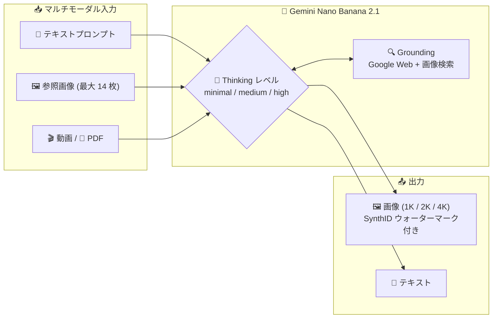

# Gemini Enterprise Agent Platform: Gemini Nano Banana 2.1 (gemini-nano-banana-2.1) が GA

**リリース日**: 2026-10-06

**サービス**: Gemini Enterprise Agent Platform

**機能**: Gemini Nano Banana 2.1 (gemini-nano-banana-2.1) 一般提供開始

**ステータス**: GA (一般提供)

📊 [このアップデートのインフォグラフィックを見る](https://takech9203.github.io/google-cloud-news-summary/20261006-gemini-nano-banana-2-1-ga.html)

## 概要

Gemini Nano Banana 2.1 (`gemini-nano-banana-2.1`) が一般提供 (GA) になりました。Nano Banana 2 (Gemini 3.1 Flash Image) のアップデート版にあたる高効率の画像生成・会話型画像編集モデルで、Flash クラスの速度とコスト効率を維持しながら、視覚品質、プロンプト追従性、マルチターンでのキャラクター一貫性、テキストレンダリングが大幅に改善されています。1K / 2K / 4K の出力解像度に対応し (デフォルトは 1K)、Nano Banana ファミリーの中では「高速・大量処理向けのワークホース」という位置付けです。プロフェッショナルなアセット制作向けの Gemini 3 Pro Image (Nano Banana Pro) を補完する、より効率重視のモデルとして提供されます。

対象ユーザーは、マーケティングアセットやサムネイル、インフォグラフィックなどの画像を大量かつ高速に生成・編集したい開発者・企業です。公式ドキュメントでは、新規プロジェクトには Nano Banana 2 (gemini-3.1-flash-image) ではなく Nano Banana 2.1 の利用が推奨されています。

**アップデート前の課題**

- 従来の Nano Banana 2 (Gemini 3.1 Flash Image) では、ワイド/パノラマ系のアスペクト比 (1:4、4:1、1:8、8:1) の 2K / 4K 出力でタイリングアーティファクト (継ぎ目状の乱れ) が発生することがあった
- インフォグラフィックやメニューなどに必要な、文字の正確なレンダリングとレイアウト精度に改善の余地があった
- Google 検索によるグラウンディングは Web 検索が中心で、画像検索との統合は提供されていなかった

**アップデート後の改善**

- 1K / 2K / 4K すべての出力解像度で視覚品質とリアリズムが向上し、ワイド/パノラマ比率 (1:4、4:1、1:8、8:1) の 2K / 4K 出力におけるタイリングアーティファクトが修正された
- テキストレンダリングとインフォグラフィックのレイアウト精度が強化された
- 最大 14 枚の参照画像を使うマルチイメージフュージョン (キャラクター一貫性は最大 4 キャラクター、オブジェクト忠実度は最大 10 オブジェクト) に対応した
- Google Web 検索に加えて Google 画像検索によるグラウンディングが統合された
- Thinking レベル (minimal / medium (デフォルト) / high) を設定可能になり、プロンプトの複雑さに応じて推論の深さを調整できるようになった

## アーキテクチャ図



テキスト・画像・動画・PDF を入力として受け取り、設定可能な Thinking プロセスと Google Web / 画像検索グラウンディングを経て、1K〜4K の画像とテキストを生成するモデル構成です。

## サービスアップデートの詳細

### 主要機能

1. **高解像度出力の品質向上 (1K / 2K / 4K)**
   - 1K (デフォルト)、2K、4K の出力解像度全体で視覚品質とリアリズムが向上
   - ワイド/パノラマアスペクト比 (1:4、4:1、1:8、8:1) の 2K / 4K 出力で発生していたタイリングアーティファクトを修正
   - なお、Gemini 3.1 Flash Image で利用可能な 512px (0.5K) 解像度は Nano Banana 2.1 ではサポートされない

2. **テキストレンダリングとインフォグラフィック精度の強化**
   - インフォグラフィック、メニュー、図表、マーケティングアセット向けに、判読可能でスタイライズされたテキストの生成精度が向上
   - レイアウト精度 (インフォグラフィックの構成要素の配置) も改善

3. **マルチイメージフュージョン (最大 14 枚の参照画像)**
   - 最大 14 枚の参照画像を組み合わせて最終画像を生成
   - キャラクター一貫性: 最大 4 キャラクター分の画像を参照可能
   - オブジェクト忠実度: 最大 10 オブジェクト分の画像を高忠実度で最終画像に反映可能

4. **Google Web 検索 + 画像検索によるグラウンディング**
   - Google 検索をツールとして使用し、事実確認やリアルタイムデータに基づく画像生成が可能
   - Nano Banana 2.1 では Web 検索に加えて Google 画像検索グラウンディングが統合
   - 画像検索グラウンディング利用時は、レスポンスの `search_suggestions` を UI に表示する必要がある (利用規約上の表示要件)

5. **設定可能な Thinking レベル**
   - `minimal` / `medium` (デフォルト) / `high` の 3 段階で推論の深さを設定可能
   - モデルは複雑なプロンプトに対して中間的な「thought image」を生成して構図を練り込む (バックエンドで確認可能だが課金対象外)

6. **動画からの画像生成 (Video-to-image)**
   - 動画のコンテキストをマルチモーダル参照として新しい画像を生成
   - 動画のサムネイル、シネマティックポスター、サマリーインフォグラフィックの作成などに有用
   - 公開 YouTube URL の直接指定、または Files API によるローカル動画のアップロードに対応

## 技術仕様

### モデル仕様 (gemini-nano-banana-2.1)

| 項目 | 詳細 |
|------|------|
| モデルコード | `gemini-nano-banana-2.1` |
| 入力データタイプ | テキスト、画像、動画、PDF |
| 出力データタイプ | 画像、テキスト |
| 入力トークン上限 | 131,072 |
| 出力トークン上限 | 32,768 |
| 出力解像度 | 1K (デフォルト) / 2K / 4K (0.5K は非対応) |
| 参照画像 | 最大 14 枚 (キャラクター一貫性 4、オブジェクト 10) |
| 画像生成 | サポート |
| 検索グラウンディング | サポート (Web 検索 + 画像検索) |
| Thinking | サポート (minimal / medium / high) |
| Batch API | サポート |
| 関数呼び出し / キャッシュ / 構造化出力 / Live API | 非サポート |
| ウォーターマーク | 生成画像すべてに SynthID を付与 |

### 画像出力トークン (Gemini API 準拠)

| 出力解像度 | 消費トークン |
|------|------|
| 1K (1024x1024px) | 1,120 トークン |
| 2K (2048x2048px) | 1,680 トークン |
| 4K (4096x4096px) | 2,520 トークン |

## 設定方法

### 手順

#### ステップ 1: 画像生成 (テキストから画像)

```python
from google import genai

client = genai.Client()

response = client.models.generate_content(
    model="gemini-nano-banana-2.1",
    contents=["Create a picture of a nano banana dish in a fancy restaurant with a Gemini theme"],
)
```

#### ステップ 2: アスペクト比と解像度の指定

```python
from google import genai
from google.genai import types

client = genai.Client()

response = client.models.generate_content(
    model="gemini-nano-banana-2.1",
    contents=[prompt],
    config=types.GenerateContentConfig(
        response_format={"image": {"aspect_ratio": "16:9", "image_size": "2K"}}
    ),
)
```

`response_format` の `image` フィールドで `aspect_ratio` と `image_size` (1K / 2K / 4K) を制御できます。デフォルトでは入力画像のサイズに合わせるか、1:1 の正方形で生成されます。

## メリット

### ビジネス面

- **大量生成のコスト効率**: Flash クラスの速度とコスト効率を維持したまま品質が向上しており、サムネイルやマーケティングアセットなど大量・高速な画像生成ワークロードに適する
- **ブランド/キャラクターの一貫性**: 最大 4 キャラクターの一貫性と最大 10 オブジェクトの高忠実度合成により、シリーズもののクリエイティブ制作で再現性を確保できる

### 技術面

- **ワイド/パノラマ出力の品質改善**: 1:4、4:1、1:8、8:1 といった特殊なアスペクト比の 2K / 4K 出力でもアーティファクトなしに生成できる
- **検索グラウンディング**: Web 検索 + 画像検索により、リアルタイム情報 (天気図、株価チャート、最近の出来事など) に基づいた画像生成が可能
- **Thinking レベルの調整**: ワークロードに応じて推論の深さ (minimal / medium / high) を選択でき、レイテンシと品質のトレードオフを制御できる

## デメリット・制約事項

### 制限事項

- 512px (0.5K) 解像度は非対応 (Gemini 3.1 Flash Image のみサポート)
- 関数呼び出し、コンテキストキャッシュ、構造化出力、Live API、音声生成は非サポート
- スタイル参照画像 (style reference) の指定は Gemini 3 Pro Image のみの機能で、Nano Banana 2.1 では利用不可

### 考慮すべき点

- 生成画像にはすべて SynthID ウォーターマークが付与される
- 画像検索グラウンディングを利用する場合、`google_search_result` ステップの `search_suggestions` を UI に表示する必要がある (利用規約上の要件)
- インターリーブされたテキストと画像の複合出力 (挿絵付きストーリーなど) では、便利プロパティ (`output_image`) がすべてのパートを捕捉しないため、ステップを手動でイテレートする必要がある

## ユースケース

### ユースケース 1: 動画サムネイル・ポスターの自動生成

**シナリオ**: 動画配信プラットフォームで、公開動画から高品質なサムネイルやシネマティックポスターを自動生成したい。

**実装例**:
```python
interaction = client.interactions.create(
    model="gemini-nano-banana-2.1",
    input=[
        {"type": "video", "uri": "https://www.youtube.com/watch?v=VIDEO_ID", "mime_type": "video/mp4"},
        {"type": "text", "text": "Generate a poster image that captures the key themes of this video."},
    ],
    response_format={"type": "image", "aspect_ratio": "16:9"},
)
```

**効果**: モデルが動画フレームを分析して視覚テーマとキーイベントを抽出し、テキストプロンプトと組み合わせてサムネイル・ポスター画像を合成できる。

### ユースケース 2: テキスト入りインフォグラフィック・マーケティングアセットの生成

**シナリオ**: インフォグラフィック、メニュー、図表、マーケティングアセットなど、判読可能なテキストを含む画像を大量に生成したい。

**効果**: 強化されたテキストレンダリングとレイアウト精度により、文字入りアセットの生成品質が向上。検索グラウンディングを併用すればリアルタイムデータに基づいた正確なコンテンツも生成できる。

## 料金

Gemini Enterprise Agent Platform における本モデルの料金は、[Generative AI 料金ページ](https://cloud.google.com/gemini-enterprise-agent-platform/generative-ai/pricing)を参照してください。

参考として、Gemini API (有料ティア) における `gemini-nano-banana-2.1` の料金は以下の通りです (USD、100 万トークンあたり)。

### 料金例 (Gemini API、有料ティア)

| 項目 | Standard | Batch |
|--------|-----------------|-----------------|
| 入力 (テキスト/画像/動画) | $1.50 / 1M トークン | $0.75 / 1M トークン |
| 出力 (テキスト + Thinking) | $7.50 / 1M トークン | $3.75 / 1M トークン |
| 出力 (画像) | $30.00 / 1M トークン | $15.00 / 1M トークン |
| 1K 画像 1 枚あたり | 約 $0.0336 | 約 $0.0168 |
| 2K 画像 1 枚あたり | 約 $0.0504 | 約 $0.0252 |
| 4K 画像 1 枚あたり | 約 $0.0756 | 約 $0.0378 |

Google Web / 画像検索グラウンディングは、月あたり 5,000 リクエストまで無料 (Gemini 3.x モデル全体で共有)、以降は 1,000 リクエストあたり $14 です。

## 利用可能リージョン

モデルごとのエンドポイント・ロケーションは [Deployment and endpoints](https://docs.cloud.google.com/gemini-enterprise-agent-platform/resources/locations) を参照してください。

## 関連サービス・機能

- **Gemini 3 Pro Image (Nano Banana Pro)**: 最高レベルの世界知識、高度なローカライゼーション、ブランド一貫性、精密なクリエイティブ制御を提供するプレミアムモデル。Nano Banana 2.1 はその高効率版の位置付け
- **Gemini 3.1 Flash Image (Nano Banana 2)**: 前世代のワークホースモデル。新規プロジェクトには Nano Banana 2.1 への移行が推奨される
- **Gemini 3.1 Flash Lite Image (Nano Banana 2 Lite)**: 速度とコストを最優先する場合の最速・最安モデル (1K のみ対応)
- **Grounding with Google Search**: Web 検索・画像検索に基づく事実性の高い画像生成を実現するツール連携
- **SynthID**: 生成画像に不可視ウォーターマークを付与する Google の AI 生成コンテンツ識別技術
- **Batch API**: 大量の画像生成を約半額の料金で非同期処理できる消費オプション

## 参考リンク

- 📊 [インフォグラフィック](https://takech9203.github.io/google-cloud-news-summary/20261006-gemini-nano-banana-2-1-ga.html)
- [公式リリースノート](https://docs.cloud.google.com/release-notes#October_06_2026)
- [Gemini Nano Banana 2.1 モデルドキュメント](https://ai.google.dev/gemini-api/docs/models/gemini-nano-banana-2.1)
- [画像生成ドキュメント (Nano Banana)](https://ai.google.dev/gemini-api/docs/image-generation)
- [Gemini Enterprise Agent Platform Generative AI 料金ページ](https://cloud.google.com/gemini-enterprise-agent-platform/generative-ai/pricing)
- [Gemini API 料金ページ](https://ai.google.dev/gemini-api/docs/pricing)

## まとめ

Gemini Nano Banana 2.1 の GA により、Flash クラスの速度とコストを維持したまま、視覚品質・テキストレンダリング・キャラクター一貫性・検索グラウンディングが強化された画像生成モデルが本番利用可能になりました。公式ドキュメントでは新規プロジェクトでの Nano Banana 2.1 利用が推奨されているため、現在 Gemini 3.1 Flash Image (Nano Banana 2) を利用中のワークロードは移行の検討をおすすめします。特にワイド/パノラマ比率の高解像度出力やテキスト入りアセット生成で課題があった場合は、品質改善の恩恵が大きいアップデートです。

---

**タグ**: #GeminiEnterpriseAgentPlatform #NanoBanana #画像生成 #GenerativeAI #GA
