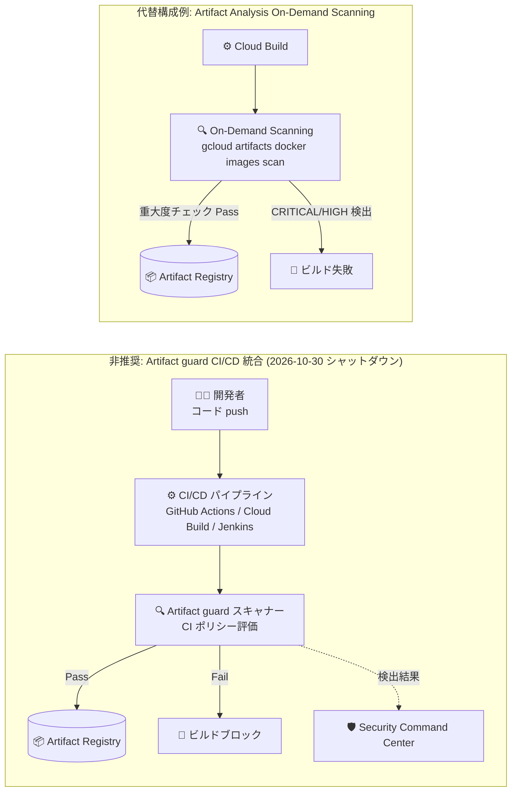

# Security Command Center: Artifact guard (CI/CD 統合) の非推奨化

**リリース日**: 2026-10-06

**サービス**: Security Command Center

**機能**: Artifact guard with CI/CD integration の非推奨化 (2026 年 10 月 30 日シャットダウン)

**ステータス**: Deprecated (非推奨)

📊 [このアップデートのインフォグラフィックを見る](https://takech9203.github.io/google-cloud-news-summary/20261006-security-command-center-artifact-guard-deprecation.html)

## 概要

Security Command Center の Artifact guard (CI/CD 統合付き) が非推奨 (Deprecated) となり、**2026 年 10 月 30 日にシャットダウン**されることが発表されました。発表からシャットダウンまでの猶予期間が約 3 週間と非常に短いため、本機能を利用しているチームは早急な対応が必要です。

Artifact guard は、コンテナイメージの脆弱性を検出・管理する Preview 段階のセキュリティサービスでした。設定可能なセキュリティポリシーに基づき、ビルド時 (CI/CD)、レジストリ保管時、ランタイム実行時という 3 つのステージでコンテナイメージを評価する機能を提供していました。特に CI/CD 統合は、GitHub Actions、Cloud Build、Jenkins のパイプラインに組み込み、イメージがレジストリに push される前にポリシー違反のビルドをブロックする仕組みでした。

本アップデートの影響を受けるのは、Artifact guard のコネクタ (Connector) と CI ポリシーを作成し、パイプラインにスキャナーイメージ (`scc-artifactguard-scan-image`) を組み込んでいる DevOps / Platform Engineering チームおよびセキュリティ管理者です。シャットダウン後はビルド時のポリシー評価が機能しなくなるため、代替手段への切り替えを検討する必要があります。

**アップデート前 (非推奨化前) の状態**

- Artifact guard は Preview (Pre-GA) 機能として提供され、CI/CD パイプライン (GitHub Actions、Cloud Build、Jenkins) でビルド時の脆弱性ポリシー評価が可能だった
- ポリシー違反時に終了コードで CI/CD ランナーにビルド失敗を通知し、違反イメージのレジストリへの push をブロックできた
- スキャン結果を Security Command Center に送信し、JSON / SARIF 形式のローカルレポートも出力できた

**アップデート後 (非推奨化後) の影響**

- Artifact guard と CI/CD 統合は非推奨となり、2026 年 10 月 30 日にシャットダウンされる
- シャットダウン後は、Artifact guard のスキャナーを組み込んだパイプラインステップが機能しなくなるため、パイプライン構成の見直しが必要になる
- ビルド時の脆弱性ゲートが必要な場合は、Artifact Analysis の On-Demand Scanning など、他のサービスでの代替構成を検討する必要がある

## アーキテクチャ図

上段は今回シャットダウンが発表された Artifact guard の CI/CD 統合によるビルド時スキャンのフロー、下段は公式ドキュメントで手順が提供されている Artifact Analysis On-Demand Scanning を使った代替のビルドブロック構成例です。

## サービスアップデートの詳細

### 非推奨となる機能

1. **Artifact guard 本体 (Preview)**
   - コンテナイメージの脆弱性を検出・管理するセキュリティサービス
   - ビルド時スキャン、レジストリの承認制御 (Binary Authorization 連携による GKE へのデプロイブロック)、GKE 上のランタイムモニタリングという 3 ステージでポリシーを適用していた

2. **CI/CD 統合**
   - GitHub Actions、Cloud Build、Jenkins に対応したビルド時スキャナー
   - コネクタ (パイプラインと Artifact guard を紐づけるリソース) と CI ポリシー (CVE、重大度、パッケージルールを定義) により、ビルド中のイメージをポリシー評価
   - ポリシー違反時は終了コードを CI/CD ランナーに返してビルドをブロック
   - スキャン結果を Security Command Center に送信し、JSON / SARIF 形式のレポートを出力

3. **関連する gcloud コマンド・リソース**
   - `gcloud alpha scc artifact-guard connectors` / `policies` 系コマンドで管理していたコネクタおよびポリシー
   - プレビルトスキャナーイメージ `us-central1-docker.pkg.dev/ci-plugin/ci-images/scc-artifactguard-scan-image:latest` を使ったパイプラインステップ

## 技術仕様

### 非推奨化のタイムライン

| 項目 | 内容 |
|------|------|
| 非推奨発表日 | 2026 年 10 月 6 日 |
| シャットダウン日 | 2026 年 10 月 30 日 |
| 猶予期間 | 約 3 週間 |
| 対象機能のステータス | Preview (Pre-GA) |
| 対応 CI/CD プラットフォーム | GitHub Actions、Cloud Build、Jenkins |

### 影響を受ける構成要素

| 構成要素 | 影響 |
|----------|------|
| CI コネクタ | パイプラインと Artifact guard の紐づけが利用不可に |
| CI ポリシー | ビルド時の CVE / 重大度 / パッケージルール評価が利用不可に |
| スキャナーイメージを使うパイプラインステップ | シャットダウン後は実行が機能しなくなるため、ステップの削除・置き換えが必要 |
| Security Command Center への検出結果送信 | Artifact guard 経由のビルド時スキャン結果の送信が停止 |

## デメリット・制約事項

### 考慮すべき点

- 発表からシャットダウンまでの期間が約 3 週間と短く、CI/CD パイプラインの改修を迅速に行う必要がある
- Artifact guard は Preview (Pre-GA) 機能であり、Pre-GA 機能は「現状のまま」提供されサポートが限定される点に留意が必要
- パイプラインに Artifact guard のスキャナーステップを残したままシャットダウンを迎えると、ステップの失敗によりビルドが影響を受ける可能性があるため、事前にステップを削除または置き換えることが望ましい

### 代替検討時のポイント

- Artifact Analysis の On-Demand Scanning は、Cloud Build パイプライン内でイメージをスキャンし、指定した重大度 (CRITICAL / HIGH など) の脆弱性が見つかった場合にビルドを失敗させる構成が公式チュートリアルとして提供されている
- Artifact Registry への push 後の継続的な脆弱性検出には、Artifact Analysis の自動スキャンや、Security Command Center の Artifact Registry vulnerability assessment (デプロイ済みイメージの HIGH / CRITICAL 脆弱性検出) が利用できる
- デプロイ時のポリシー強制 (承認制御) には Binary Authorization が利用できる

## 推奨される対応

1. **利用状況の確認**: `gcloud alpha scc artifact-guard connectors list` などで組織・プロジェクト内のコネクタ・ポリシーの利用状況を確認する
2. **パイプラインの棚卸し**: GitHub Actions / Cloud Build / Jenkins の各パイプラインから Artifact guard スキャナーイメージを使用するステップを特定する
3. **代替構成への移行**: ビルド時の脆弱性ゲートが必要な場合、Artifact Analysis On-Demand Scanning を使った重大度チェックステップへの置き換えを検討する
4. **2026 年 10 月 30 日までに切り替え完了**: シャットダウン日までにパイプラインから Artifact guard 依存を除去する

## 関連サービス・機能

- **Artifact Analysis**: Artifact Registry 内のコンテナイメージの自動スキャンと、CI/CD パイプラインに組み込める On-Demand Scanning を提供。ビルドブロック構成の代替候補
- **Artifact Registry vulnerability assessment**: Artifact Registry に保存されデプロイされたコンテナイメージの HIGH / CRITICAL 脆弱性を Security Command Center の検出結果として生成
- **Binary Authorization**: デプロイ時にポリシー非準拠イメージの GKE クラスタへのデプロイをブロックする承認制御。Artifact guard のレジストリ承認制御でも内部的に利用されていた
- **Cloud Build**: Artifact guard CI/CD 統合の対応プラットフォームの 1 つ。On-Demand Scanning との組み合わせで代替のビルド時スキャンを構成可能

## 参考リンク

- 📊 [インフォグラフィック](https://takech9203.github.io/google-cloud-news-summary/20261006-security-command-center-artifact-guard-deprecation.html)
- [公式リリースノート](https://docs.cloud.google.com/release-notes#October_06_2026)
- [Artifact guard 概要](https://docs.cloud.google.com/security-command-center/docs/artifact-guard-overview)
- [Artifact guard CI/CD 統合の構成](https://docs.cloud.google.com/security-command-center/docs/configure-cicd-integration)
- [Artifact Analysis コンテナスキャン概要](https://docs.cloud.google.com/artifact-analysis/docs/container-scanning-overview)
- [Cloud Build パイプラインでの On-Demand Scanning (ビルドブロック構成チュートリアル)](https://docs.cloud.google.com/artifact-analysis/docs/ods-cloudbuild)
- [Artifact Registry vulnerability assessment 概要](https://docs.cloud.google.com/security-command-center/docs/vulnerability-assessment-ar-overview)

## まとめ

Security Command Center の Artifact guard (CI/CD 統合) が非推奨となり、2026 年 10 月 30 日にシャットダウンされます。発表からシャットダウンまで約 3 週間と猶予が短いため、GitHub Actions / Cloud Build / Jenkins のパイプラインで本機能を利用しているチームは、直ちに利用状況を棚卸しし、Artifact Analysis On-Demand Scanning などの代替構成への移行を進めることを推奨します。

---

**タグ**: Security Command Center, Artifact guard, 非推奨, Deprecated, CI/CD, コンテナセキュリティ, 脆弱性スキャン, Artifact Analysis, Cloud Build, GitHub Actions, Jenkins
