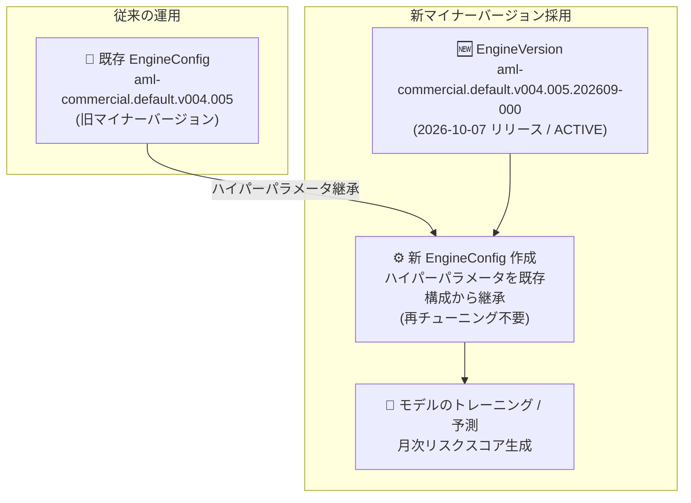

# Anti Money Laundering AI: 商用 (Commercial) 向け新マイナーエンジンバージョン v004.005.202609-000 リリース

**リリース日**: 2026-10-07

**サービス**: Anti Money Laundering AI (AML AI)

**機能**: 商用 (Commercial) ライン向けマイナーエンジンバージョン `aml-commercial.default.v004.005.202609-000`

**ステータス**: 一般提供 (Announcement)

📊 [このアップデートのインフォグラフィックを見る](https://takech9203.github.io/google-cloud-news-summary/20261007-aml-ai-commercial-v004-005-minor-engine-version.html)

## 概要

Google Cloud の Anti Money Laundering AI (AML AI) において、商用 (Commercial) ライン・オブ・ビジネス向けの新しいマイナーエンジンバージョン `aml-commercial.default.v004.005.202609-000` がリリースされました。このバージョンは v004.005 バージョンライン内のメンテナンスリリースであり、メジャーエンジンバージョンのサポート期間を延長するものです。前のマイナーバージョンと比較して機能面での大きな変更はありません。

AML AI は、小売 (Retail) および商用 (Commercial) 銀行顧客のマネーロンダリングリスクを月次でスコアリングする API サービスです。エンジンバージョンは、モデルのチューニング・トレーニング・評価の方法、AML データモデル、特徴ファミリーなど、AML AI がリスクを検出する仕組みを定義する読み取り専用リソースであり、各バージョンにはサポートライフサイクル (ACTIVE / LIMITED / DECOMMISSIONED) が設定されています。

今回のリリースにより、v004.005 系のエンジン構成 (EngineConfig) を本番運用している商用銀行の利用者は、同一メジャーバージョン内の最新マイナーバージョンへ移行することで、大きな挙動変更を伴わずにサポート期間を延長できます。モデルガバナンス要件の厳しい金融機関にとって、挙動の安定性を維持しながらサポートされたバージョンを使い続けられる点が重要です。

**アップデート前の課題**

- 商用ライン向け v004.005 バージョンラインの直近のマイナーバージョンは 2025 年 9 月 3 日リリースの `202508-000` であり、サポート期限の観点から新しいメンテナンスリリースが待たれる状況だった
- エンジンバージョンにはサポートライフサイクルがあり、古いマイナーバージョンのまま運用を続けると、将来的に制限 (LIMITED) や廃止 (DECOMMISSIONED) の影響を受けるリスクがあった

**アップデート後の改善**

- 新マイナーバージョン `aml-commercial.default.v004.005.202609-000` により、v004.005 メジャーエンジンバージョンのサポート期間が延長された
- 前のマイナーバージョンから重要な変更は含まれないため、挙動の互換性を保ったまま移行できる
- 同一チューニングバージョン (v004) 内であれば、既存のエンジン構成からハイパーパラメータを継承 (inherit) でき、再チューニングのコストと時間をかけずに新バージョンを採用できる

## アーキテクチャ図



既存の v004.005 系エンジン構成からハイパーパラメータを継承して新マイナーバージョンのエンジン構成を作成することで、再チューニングなしでサポート期間が延長されたバージョンに移行できます。

## サービスアップデートの詳細

### 主要機能

1. **メンテナンスリリースによるサポート延長**
   - `aml-commercial.default.v004.005.202609-000` は v004.005 メジャーエンジンバージョンのサポートを延長するメンテナンスリリース
   - 公式のエンジンバージョン一覧ではライフサイクルステージ「ACTIVE」として掲載 (リリース日: 2026 年 10 月 7 日)

2. **前バージョンからの挙動互換性**
   - 前のマイナーバージョン (`202508-000`、2025 年 9 月 3 日リリース) と比較して重要な変更は含まれない
   - モデルの挙動が大きく変わらないため、モデルガバナンス上の再検証負荷を抑えて移行できる

3. **ハイパーパラメータ継承による低コスト移行**
   - チューニングバージョン v004 内のエンジンバージョン間では、既存のエンジン構成からハイパーパラメータを継承可能
   - 継承を利用すればチューニング (課金対象の重い処理) を省略してエンジン構成を迅速に作成できる

## 技術仕様

### エンジンバージョンの命名規則

| 構成要素 | 今回のバージョンでの値 | 説明 |
|------|------|------|
| エンジンタイプ | `aml-commercial` | 対象のライン・オブ・ビジネス (商用) |
| エンジンサブタイプ | `default` | エンジンのサブタイプ |
| チューニングバージョン | `v004` | チューニングの世代 |
| メジャーバージョン | `005` | 機能・挙動を定義するメジャー版 |
| マイナーバージョン | `202609-000` | メンテナンス更新 (今回リリース) |

### v004.005 (商用) バージョンラインの履歴

| マイナーバージョン | リリース日 | 内容 |
|------|------|------|
| `202609-000` | 2026-10-07 | メンテナンスリリース (サポート延長) ← 今回 |
| `202508-000` | 2025-09-03 | メンテナンスリリース (サポート延長) |
| `202505-000` | 2025-06-05 | メンテナンスリリース (サポート延長) |
| `202503-000` | 2025-03-19 | メンテナンスリリース (サポート延長) |

## 設定方法

### 前提条件

1. プロジェクトに対する Financial Services Admin (`financialservices.admin`) IAM ロール (エンジンバージョン一覧の取得には `financialservices.v1engineversions.list` 権限)
2. AML AI インスタンスが作成済みであること

### 手順

#### ステップ 1: 利用可能なエンジンバージョンを一覧表示

```bash
curl -X GET \
  -H "Authorization: Bearer $(gcloud auth print-access-token)" \
  "https://financialservices.googleapis.com/v1/projects/PROJECT_ID/locations/LOCATION/instances/INSTANCE_ID/engineVersions"
```

レスポンスには各エンジンバージョンの `state` (ACTIVE など)、`expectedLimitationStartTime`、`expectedDecommissionTime`、`lineOfBusiness` が含まれるため、新バージョンの提供状況とサポート期限を確認できます。

#### ステップ 2: ハイパーパラメータを継承して新しいエンジン構成を作成

新しいエンジンバージョンを指定してエンジン構成 (EngineConfig) を作成します。同一チューニングバージョン (v004) 内の既存エンジン構成をハイパーパラメータのソースとして指定することで、再チューニングを省略できます。詳細な手順は公式ドキュメントの「[Configure an engine](https://docs.cloud.google.com/financial-services/anti-money-laundering/docs/configure-engine)」を参照してください。

なお、データセットのロジックに大きな変更を加えた場合や、新しいリージョンでモデルをトレーニングする場合は、継承ではなく再チューニングが推奨されます。

## メリット

### ビジネス面

- **サポート継続性の確保**: v004.005 系を本番利用中の金融機関は、サポートされたバージョンでの運用を継続でき、コンプライアンス・モデルガバナンス要件を満たしやすい
- **移行コストの最小化**: 重要な変更が含まれないメンテナンスリリースのため、モデル再検証や業務影響評価の負荷を抑えられる

### 技術面

- **再チューニング不要の移行**: ハイパーパラメータ継承により、課金対象で数日かかることもあるチューニング処理を省略して新バージョンを採用できる
- **挙動の安定性**: 前マイナーバージョンと機能的に同等のため、リスクスコアの出力特性を大きく変えずにバージョンを更新できる

## デメリット・制約事項

### 制限事項

- 今回のリリースは商用 (Commercial) ラインのみが対象 (小売向け v004.005 の最新マイナーは 2026 年 9 月 17 日リリースの `aml-retail.default.v004.005.202608-000`)
- 機能追加や性能改善は含まれないメンテナンスリリースであり、新機能 (例: v004.012 の小切手取引サポート強化や v004.011 のバックテスト API 改善) を利用するにはメジャーバージョンの移行が必要

### 考慮すべき点

- エンジンバージョンにはライフサイクル (ACTIVE / LIMITED / DECOMMISSIONED) があるため、`expectedLimitationStartTime` と `expectedDecommissionTime` を定期的に確認し、計画的にバージョンを更新する運用が推奨される
- v004.005 は v004 系の中では古いメジャーバージョンラインであり、長期的には新しいメジャーバージョン (v004.011 / v004.012 など) への移行検討も視野に入れるとよい

## 料金

今回のアップデート自体による料金変更はありません。AML AI の料金はチューニング、トレーニング、予測、登録パーティ数などの操作に基づいて課金されます。ハイパーパラメータ継承を利用すると、新エンジンバージョン採用時のチューニング費用を回避できます。

詳細は [AML AI 料金ページ](https://cloud.google.com/financial-services/anti-money-laundering/pricing) を参照してください。

## 利用可能リージョン

AML AI は以下のリージョンで利用可能です。

| リージョン | リージョン名 |
|------|------|
| アイオワ | us-central1 |
| サウスカロライナ | us-east1 |
| ロンドン | europe-west2 |
| スイス | europe-west6 |

## 関連サービス・機能

- **Cloud IAM**: エンジンバージョンの一覧・管理には `financialservices.admin` ロールなどの IAM 権限が必要
- **Cloud KMS (CMEK)**: AML AI インスタンスは顧客管理の暗号鍵 (CMEK) を必須とし、AML AI が生成するデータを暗号化する
- **BigQuery**: AML AI の入出力データセットの基盤として利用されるほか、Google Cloud リリースノートの公開データセットからも更新情報を参照可能

## 参考リンク

- 📊 [インフォグラフィック](https://takech9203.github.io/google-cloud-news-summary/20261007-aml-ai-commercial-v004-005-minor-engine-version.html)
- [公式リリースノート](https://docs.cloud.google.com/release-notes#October_07_2026)
- [AML AI リリースノート](https://docs.cloud.google.com/financial-services/anti-money-laundering/docs/release-notes)
- [エンジンバージョン一覧](https://docs.cloud.google.com/financial-services/anti-money-laundering/docs/reference/engine-versions)
- [エンジンバージョンの管理](https://docs.cloud.google.com/financial-services/anti-money-laundering/docs/manage-engine-versions)
- [エンジンの構成 (ハイパーパラメータ継承)](https://docs.cloud.google.com/financial-services/anti-money-laundering/docs/configure-engine)
- [料金ページ](https://cloud.google.com/financial-services/anti-money-laundering/pricing)

## まとめ

商用ライン向け AML AI の v004.005 バージョンラインに新しいマイナーエンジンバージョン `202609-000` がリリースされ、メジャーエンジンバージョンのサポート期間が延長されました。挙動変更を含まないメンテナンスリリースのため、v004.005 系を利用中の場合はハイパーパラメータ継承を活用して低コストで最新マイナーバージョンへ移行することを推奨します。あわせて、各エンジンバージョンのサポート期限 (`expectedDecommissionTime`) を確認し、計画的なバージョン管理を行いましょう。

---

**タグ**: #AMLAI #AntiMoneyLaundering #FinancialServices #EngineVersion #MaintenanceRelease #Commercial
