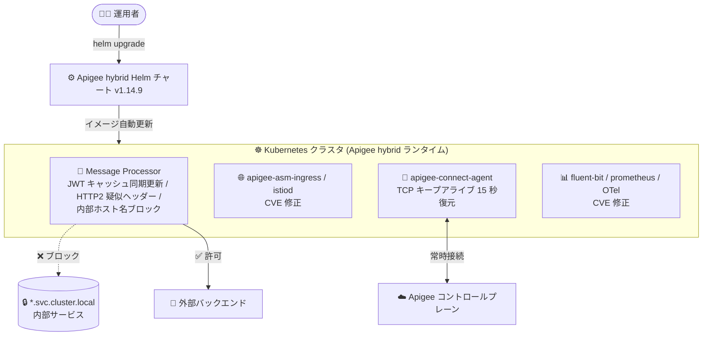

# Apigee hybrid: v1.14.9 パッチリリース (バグ修正とセキュリティ強化)

**リリース日**: 2026-10-07

**サービス**: Apigee hybrid

**機能**: v1.14.9 パッチリリース (Announcement / Fixed / Security)

**ステータス**: GA (パッチリリース)

📊 [このアップデートのインフォグラフィックを見る](https://takech9203.github.io/google-cloud-news-summary/20261007-apigee-hybrid-v1-14-9.html)

## 概要

2026 年 10 月 7 日、Apigee hybrid ソフトウェアの更新版 **v1.14.9** がリリースされました。本リリースはパッチリリースであり、コンテナイメージは Apigee hybrid の Helm チャートに統合されています。そのため、Helm チャート経由でパッチへアップグレードすると、イメージも自動的に更新され、手動でのイメージ変更は通常不要です。

今回のリリースには、JWT 検証 (VerifyJWT)、AssignMessage ポリシー、分散トレーシング、HTTP/2 疑似ヘッダー、Message Processor のアウトバウンド HTTP 検証、apigee-connect-agent の制御プレーン接続に関する 6 件のバグ修正が含まれています。特に、IdP の鍵ローテーション時に発生していた `steps.jwt.NoMatchingPublicKey` エラーの解消や、Kubernetes クラスタ内部ホスト名 (`*.svc.cluster.local`) への不正なアウトバウンドリクエストをブロックするセキュリティ強化は、本番運用中の API 基盤に直接影響する重要な修正です。

さらに Security セクションでは、`apigee-asm-ingress`、`apigee-asm-istiod`、`apigee-runtime`、`apigee-synchronizer`、`apigee-fluent-bit`、`apigee-kube-rbac-proxy` など 16 のコンポーネントに対する多数の CVE 対応 (CVE-2026-33818、CVE-2026-39821、CVE-2026-84303 など) が実施されており、Apigee hybrid 1.14 系を運用するすべてのユーザーに適用が推奨されるリリースです。

**アップデート前の課題**

- JWKS の `uriRef` を使用する VerifyJWT ポリシーで、IdP が鍵をローテーションすると、5 分間の JWKS キャッシュ TTL 失効後の最初のリクエストで `steps.jwt.NoMatchingPublicKey` エラーが返ることがあった
- AssignMessage の `AssignVariable` で空の `<Value/>` 要素から初期化した変数が、`replaceAll` などのメッセージテンプレート関数で参照された際に空文字列として扱われなかった
- 分散トレーシングで、リクエストフローのポリシーステップ実行後に、アウトバウンドのターゲットリクエストスパン属性からターゲット URL が欠落していた
- HTTP/2 通信時に、ポリシーから HTTP/2 リクエスト疑似ヘッダー (`:path`、`:authority`) を変更できなかった
- Message Processor から Kubernetes クラスタ内部ホスト名 (`*.svc.cluster.local`) へのアウトバウンド HTTP リクエストがブロックされず、クラスタ内部サービスへの意図しないアクセスのリスクがあった
- `apigee-connect-agent` の制御プレーン接続がネットワーク中継機器によってサイレントに切断された場合、最大 2 時間ハングすることがあった

**アップデート後の改善**

- JWKS キャッシュが TTL 失効時に同期的にリフレッシュされるようになり、IdP の鍵ローテーション直後でも JWT 検証が失敗しなくなった
- 空の `<Value/>` から初期化された変数がメッセージテンプレート関数内で正しく空文字列として扱われるようになった
- ポリシーステップ実行後もアウトバウンドスパン属性にターゲット URL が正しく記録され、分散トレーシングの可観測性が向上した
- ポリシーから HTTP/2 疑似ヘッダー (`:path`、`:authority`) を変更できるようになり、HTTP/2 バックエンドへのルーティング制御が柔軟になった
- Message Processor のアウトバウンド HTTP 検証が強化され、クラスタ内部ホスト名へのリクエストがブロックされるようになった (SSRF 的なアクセス経路の遮断)
- `apigee-connect-agent` に 15 秒の TCP キープアライブが復元され、制御プレーン接続の長時間ハングが解消された

## アーキテクチャ図



Helm チャート経由で v1.14.9 にアップグレードすると、各コンポーネントのコンテナイメージが自動更新されます。Message Processor は内部クラスタホスト名へのアウトバウンドリクエストをブロックするようになり、apigee-connect-agent はコントロールプレーンとの接続を TCP キープアライブで維持します。

## サービスアップデートの詳細

### 修正されたバグ (Fixed)

| Bug ID | 修正内容 |
|--------|---------|
| 565072374 | JWKS `uriRef` を使用する VerifyJWT ポリシーで、IdP の鍵ローテーション時に 5 分間の JWKS キャッシュ TTL 失効後の最初のリクエストが `steps.jwt.NoMatchingPublicKey` を返すことがある問題を修正。キャッシュは失効時に同期的にリフレッシュされるようになった |
| 564969400 | AssignMessage (`AssignVariable`) の空の `<Value/>` 要素から初期化された変数が、`replaceAll` などのメッセージテンプレート関数で参照された際に空文字列として扱われない問題を修正 |
| 558888960 | 分散トレーシングで、リクエストフローのポリシーステップ実行後にアウトバウンドのターゲットリクエストスパン属性からターゲット URL が欠落する問題を修正 |
| 554114419 | HTTP/2 通信時に、ポリシーから HTTP/2 リクエスト疑似ヘッダー (`:path` と `:authority`) を変更できるようになった |
| 548763108 | Message Processor のアウトバウンド HTTP 検証を強化し、Kubernetes クラスタ内部ホスト名 (`*.svc.cluster.local`) へのリクエストをブロックするようにした |
| 513032450 | `apigee-connect-agent` の制御プレーン接続がネットワーク中継機器によりサイレントに切断された場合に最大 2 時間ハングすることがある問題を、15 秒の TCP キープアライブを復元することで修正 |

### セキュリティ修正 (Security)

以下のコンポーネントに対して CVE 対応のセキュリティ修正が実施されました。

| コンポーネント | 対応 CVE |
|---------------|----------|
| apigee-asm-ingress | CVE-2026-33818, CVE-2026-39821, CVE-2026-56853, CVE-2026-56858, CVE-2026-56859, CVE-2026-56860, CVE-2026-56862, CVE-2026-56864, CVE-2026-56865 |
| apigee-asm-istiod | 同上 (apigee-asm-ingress と同一の 9 件) |
| apigee-connect-agent | CVE-2026-84303, CVE-2026-84304, CVE-2026-84445 |
| apigee-fluent-bit | CVE-2026-14456, CVE-2026-14457, CVE-2026-18798, CVE-2026-54874, CVE-2026-63072〜63076, CVE-2026-75803 |
| apigee-hybrid-cassandra-client | CVE-2026-81870, CVE-2026-84303, CVE-2026-84304, CVE-2026-84445 |
| apigee-kube-rbac-proxy | CVE-2026-33818, CVE-2026-39821, CVE-2026-46600, CVE-2026-56853, CVE-2026-56858〜56860, CVE-2026-56862, CVE-2026-56864, CVE-2026-56865, CVE-2026-81870, CVE-2026-84303, CVE-2026-84304, CVE-2026-84445 |
| apigee-mart-server / apigee-mint-task-scheduler / apigee-runtime | CVE-2025-46392, CVE-2026-13506, CVE-2026-19032, CVE-2026-49844, CVE-2026-68497, CVE-2026-83557, CVE-2026-8763 |
| apigee-open-telemetry-collector | CVE-2026-43871, CVE-2026-81870, CVE-2026-81871, CVE-2026-81872, CVE-2026-84303, CVE-2026-84304, CVE-2026-84445 |
| apigee-operators / apigee-watcher | CVE-2026-84303, CVE-2026-84304, CVE-2026-84445 |
| apigee-prom-prometheus | CVE-2026-33818, CVE-2026-39821, CVE-2026-46600, CVE-2026-56853, CVE-2026-56858〜56860, CVE-2026-56862, CVE-2026-56864, CVE-2026-56865 |
| apigee-prometheus-adapter / apigee-udca | CVE-2026-81870, CVE-2026-84303, CVE-2026-84304, CVE-2026-84445 |
| apigee-synchronizer | CVE-2026-13506, CVE-2026-19032, CVE-2026-49844, CVE-2026-68497, CVE-2026-83557, CVE-2026-8763 |

## 技術仕様

### リリースの位置づけ

| 項目 | 詳細 |
|------|------|
| リリース種別 | パッチリリース (バグ修正とセキュリティ脆弱性パッチ) |
| バージョン体系 | `major.minor.patch` (本リリースは 1.14 系の 9 番目のパッチ) |
| イメージ更新方式 | コンテナイメージは Helm チャートに統合。Helm チャート経由のアップグレードでイメージが自動更新され、手動のイメージ変更は通常不要 |
| サポート期間 | 対応するマイナーリリース (1.14) と同じ (初回リリース日から 12 か月) |
| パッチの提供頻度 | 必要に応じて最大月 1 回 |
| チャートリポジトリ | `oci://us-docker.pkg.dev/apigee-release/apigee-hybrid-helm-charts` (Google Artifact Registry) |

### ホットフィックスとの違い

パッチリリースではコンテナイメージが Helm チャートに統合されているのに対し、ホットフィックスリリースでは特定のコンテナイメージタグを既存デプロイメントで手動更新する必要があります (Helm チャートバイナリは通常変更されない)。v1.14.9 は通常のパッチリリースであるため、Helm チャートのアップグレードのみで完結します。

## 設定方法

### 前提条件

1. Apigee hybrid v1.14.x を Helm チャートで運用していること (1.13 以前からのアップグレードは順次アップグレードが必要)
2. `helm`、`kubectl` がインストールされ、対象クラスタへの管理権限があること
3. 現行の `overrides.yaml` ファイルが手元にあること

### 手順

#### ステップ 1: v1.14.9 の Helm チャートを取得

```bash
export CHART_REPO=oci://us-docker.pkg.dev/apigee-release/apigee-hybrid-helm-charts
export CHART_VERSION=1.14.9

helm pull $CHART_REPO/apigee-operator --version $CHART_VERSION --untar
helm pull $CHART_REPO/apigee-datastore --version $CHART_VERSION --untar
helm pull $CHART_REPO/apigee-env --version $CHART_VERSION --untar
helm pull $CHART_REPO/apigee-ingress-manager --version $CHART_VERSION --untar
helm pull $CHART_REPO/apigee-org --version $CHART_VERSION --untar
helm pull $CHART_REPO/apigee-redis --version $CHART_VERSION --untar
helm pull $CHART_REPO/apigee-telemetry --version $CHART_VERSION --untar
helm pull $CHART_REPO/apigee-virtualhost --version $CHART_VERSION --untar
```

Google Artifact Registry から v1.14.9 のチャート一式をローカルに取得します。

#### ステップ 2: CRD を更新し、各チャートをアップグレード

```bash
# CRD の更新 (dry-run で検証後に適用)
kubectl apply -k apigee-operator/etc/crds/default/ \
  --server-side --force-conflicts --validate=false --dry-run=server
kubectl apply -k apigee-operator/etc/crds/default/ \
  --server-side --force-conflicts --validate=false

# 各チャートのアップグレード例 (operator の場合)
helm upgrade operator apigee-operator/ \
  --namespace apigee \
  --atomic \
  -f overrides.yaml
```

operator → datastore → telemetry → redis → ingress-manager → org → env → virtualhost の順に、現行の overrides ファイルを指定して `helm upgrade` を実行します。各コマンドは `--dry-run=server` で事前検証することが推奨されます。詳細な手順は公式のアップグレードガイドを参照してください。

## メリット

### ビジネス面

- **API 可用性の向上**: IdP の鍵ローテーション時に発生していた JWT 検証エラー (`steps.jwt.NoMatchingPublicKey`) が解消され、認証起因の断続的な API エラーによるビジネス影響を回避できる
- **セキュリティコンプライアンス**: 16 コンポーネントにわたる多数の CVE 修正により、脆弱性管理・監査要件への対応が容易になる
- **運用コストの削減**: パッチリリースのため Helm アップグレードのみで適用でき、手動のイメージ差し替え作業が不要

### 技術面

- **SSRF 的経路の遮断**: Message Processor から `*.svc.cluster.local` へのアウトバウンドリクエストがブロックされ、API プロキシ経由でのクラスタ内部サービスへの意図しないアクセスを防止できる
- **可観測性の改善**: 分散トレーシングのアウトバウンドスパンにターゲット URL が正しく記録され、障害解析やレイテンシ分析の精度が向上する
- **HTTP/2 制御の柔軟性**: ポリシーから `:path` と `:authority` 疑似ヘッダーを変更できるようになり、HTTP/2 バックエンドへの動的ルーティングやリライトが実装しやすくなった
- **接続の信頼性向上**: apigee-connect-agent の 15 秒 TCP キープアライブにより、ネットワーク中継機器によるサイレント切断時の最大 2 時間のハングが解消された

## デメリット・制約事項

### 制限事項

- 本リリースは 1.14 系のパッチであり、新機能の追加は含まれない (バグ修正とセキュリティ修正のみ)
- Apigee hybrid は順次アップグレードのみサポートされるため、1.13 以前からの直接アップグレードはできない (1.13 → 1.14 の順に適用が必要)
- Apigee hybrid は GKE Autopilot クラスタでのインストールをサポートしていない

### 考慮すべき点

- Message Processor のアウトバウンド検証強化により、これまで API プロキシのターゲットとしてクラスタ内部ホスト名 (`*.svc.cluster.local`) を直接指定していた構成がある場合、アップグレード後にリクエストがブロックされる。該当する構成がないか事前に確認が必要
- HTTP/2 疑似ヘッダーの変更が可能になったことで、既存ポリシーの挙動 (従来はエラーまたは無視されていた操作) が変わる可能性があるため、HTTP/2 ターゲットを使用するプロキシは回帰テストを推奨
- 本番環境への適用前に、`--dry-run=server` での検証とステージング環境でのテストを行うこと

## ユースケース

### ユースケース 1: IdP 鍵ローテーション運用の安定化

**シナリオ**: 外部 IdP (Okta、Auth0、Keycloak など) の JWKS エンドポイントを `uriRef` で参照して VerifyJWT ポリシーを運用しており、IdP 側の定期的な署名鍵ローテーションのたびに、JWKS キャッシュ TTL (5 分) 失効直後のリクエストが `steps.jwt.NoMatchingPublicKey` で失敗していた。

**実装例**:
```xml
<VerifyJWT name="VJ-VerifyIdToken">
  <Algorithm>RS256</Algorithm>
  <PublicKey>
    <JWKS uriRef="idp.jwks.url"/>
  </PublicKey>
  <Issuer>https://idp.example.com/</Issuer>
</VerifyJWT>
```

**効果**: v1.14.9 ではキャッシュ失効時に JWKS が同期的にリフレッシュされるため、鍵ローテーション直後でも検証が失敗せず、リトライ実装や鍵ローテーション時間帯の調整といった回避策が不要になる。

### ユースケース 2: クラスタ内部サービスへのアクセス遮断によるセキュリティ強化

**シナリオ**: マルチテナントで API プロキシの開発を複数チームに開放しており、悪意ある、または誤った設定のプロキシが Apigee と同居する Kubernetes クラスタ内部のサービス (`*.svc.cluster.local`) にアクセスしてしまうリスクを懸念していた。

**効果**: Message Processor のアウトバウンド HTTP 検証強化により、クラスタ内部ホスト名へのリクエストがプラットフォームレベルでブロックされ、ネットワークポリシーに依存しない多層防御が実現する。

### ユースケース 3: HTTP/2 バックエンドへの動的ルーティング

**シナリオ**: gRPC や HTTP/2 ベースのバックエンドに対し、リクエスト内容に応じてパスやホストを書き換えてルーティングしたいが、従来は HTTP/2 疑似ヘッダー (`:path`、`:authority`) をポリシーから変更できなかった。

**効果**: v1.14.9 以降はポリシーから疑似ヘッダーを変更できるため、HTTP/1.1 と同様の動的リライト・ルーティングパターンを HTTP/2 ターゲットにも適用できる。

## 料金

本リリースはソフトウェアのパッチ更新であり、料金体系の変更はありません。Apigee hybrid の利用料金は Apigee の料金モデル (サブスクリプション または Pay-as-you-go) に従います。なお、Apigee hybrid ランタイムが稼働する Kubernetes クラスタ (GKE など) のインフラコストは別途発生します。

詳細は [Apigee 料金ページ](https://cloud.google.com/apigee/pricing) を参照してください。

## 利用可能リージョン

Apigee hybrid のランタイムプレーンはユーザー管理の Kubernetes クラスタ (オンプレミスまたは任意のクラウド) 上で稼働するため、特定リージョンへの制約はありません。コントロールプレーンの利用可能ロケーションは [Apigee のロケーション](https://cloud.google.com/apigee/docs/locations) を参照してください。

## 関連サービス・機能

- **Apigee X**: Google 管理のフルマネージド版 Apigee。hybrid はランタイムプレーンを自己管理したい場合の選択肢
- **Google Kubernetes Engine (GKE)**: Apigee hybrid ランタイムの代表的な稼働基盤 (GKE on AWS/Azure、OpenShift、EKS、AKS などもサポート。Autopilot は非サポート)
- **Helm / Google Artifact Registry**: Apigee hybrid のチャートは Artifact Registry (`oci://us-docker.pkg.dev/apigee-release/apigee-hybrid-helm-charts`) でホストされ、Helm でインストール・アップグレードを管理
- **Cloud Trace / OpenTelemetry**: 今回修正された分散トレーシングのスパン属性はトレース連携の精度に直結する
- **cert-manager**: Apigee hybrid の証明書管理に使用されるコンポーネント (サポートバージョンに注意)

## 参考リンク

- 📊 [インフォグラフィック](https://takech9203.github.io/google-cloud-news-summary/20261007-apigee-hybrid-v1-14-9.html)
- [公式リリースノート](https://docs.cloud.google.com/release-notes#October_07_2026)
- [Apigee hybrid リリースノート](https://docs.cloud.google.com/apigee/docs/hybrid/release-notes)
- [Apigee hybrid v1.14 へのアップグレード手順](https://docs.cloud.google.com/apigee/docs/hybrid/v1.14/upgrade)
- [Apigee リリースプロセス (コンテナイメージサポート)](https://docs.cloud.google.com/apigee/docs/release/apigee-release-process#apigee-hybrid-container-images)
- [Apigee hybrid の全体像 (The big picture)](https://docs.cloud.google.com/apigee/docs/hybrid/v1.14/big-picture)
- [料金ページ](https://cloud.google.com/apigee/pricing)

## まとめ

Apigee hybrid v1.14.9 は、JWT 検証の鍵ローテーション問題や制御プレーン接続のハングといった運用上の痛点を解消し、クラスタ内部ホスト名へのアクセス遮断や 16 コンポーネントにわたる CVE 修正でセキュリティを大幅に強化するパッチリリースです。1.14 系を運用中の環境では、内部ホスト名をターゲットに使用する構成がないことを確認したうえで、Helm チャートによる早期のアップグレード適用を推奨します。

---

**タグ**: #ApigeeHybrid #Apigee #PatchRelease #Security #CVE #Helm #Kubernetes #APIManagement #JWT #HTTP2
