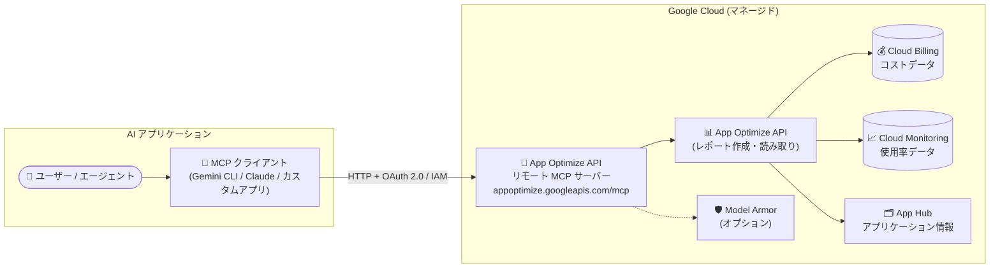

# App Optimize API: リモート MCP サーバー (Preview)

**リリース日**: 2026-10-07

**サービス**: App Optimize API

**機能**: App Optimize API リモート MCP サーバー

**ステータス**: Preview

📊 [このアップデートのインフォグラフィックを見る](https://takech9203.github.io/google-cloud-news-summary/20261007-app-optimize-api-remote-mcp-server.html)

## 概要

App Optimize API のリモート MCP (Model Context Protocol) サーバーが Preview として公開されました。App Optimize API は、Google Cloud リソースのコストと使用率 (CPU/メモリの利用状況) を構造化されたレポートとして取得できる API で、今回のアップデートにより、Gemini CLI、ChatGPT、Claude、独自開発のカスタムアプリケーションなどの AI アプリケーション・エージェントから、MCP 経由で直接コスト・使用率データにアクセスできるようになりました。

リモート MCP サーバーは Google のインフラストラクチャ上で動作し、HTTP エンドポイント (`https://appoptimize.googleapis.com/mcp`) を提供します。ローカル MCP サーバーのようにユーザー側でサーバープロセスを起動・管理する必要はありません。認証・認可には OAuth 2.0 と IAM を使用し、Model Armor によるプロンプト・レスポンス保護や集中監査ログなど、Google Cloud のマネージド MCP サーバー共通のセキュリティ機能を利用できます。

「どのプロダクトに最もコストがかかっているか」「アイドル状態の VM で最も高コストなものはどれか」といった自然言語の質問を AI エージェントに投げるだけで、プロジェクトや App Hub アプリケーションのコスト・使用率レポートを取得・分析できるため、FinOps 担当者やプラットフォームチームにとって、AI を活用したコスト最適化ワークフローの構築が容易になります。

**アップデート前の課題**

- App Optimize API のコスト・使用率データを利用するには、REST API (レポートの作成 → 非同期処理の待機 → データ読み取り) を直接呼び出すクライアントを自前で実装する必要があった
- AI エージェントからコストデータを参照するには、カスタムツールの定義や API 連携コードの開発・運用が必要だった
- MCP でデータを公開する場合も、ローカル MCP サーバーの構築・ホスティング・認証実装をユーザー自身で行う必要があった

**アップデート後の改善**

- Google がホストするリモート MCP サーバー (`https://appoptimize.googleapis.com/mcp`) に MCP クライアントを接続するだけで、AI アプリケーションからコスト・使用率レポートを作成・読み取りできるようになった
- OAuth 2.0 + IAM による認証・認可が組み込まれており、エージェント用の ID を分離してアクセス制御・監視が可能になった
- Model Armor によるツール呼び出し/レスポンスの保護、集中監査ログなど、マネージドなセキュリティ・ガバナンス機能を利用できるようになった

## アーキテクチャ図



AI アプリケーションの MCP クライアントが、OAuth 2.0 + IAM で認証した上でリモート MCP サーバーに接続し、App Optimize API を通じて Cloud Billing のコストデータ、Cloud Monitoring の使用率データ、App Hub のアプリケーション情報を集約したレポートを取得します。Model Armor によるツール呼び出しの検査をオプションで追加できます。

## サービスアップデートの詳細

### 主要機能

1. **リモート MCP サーバーによるコスト・使用率データへのアクセス**
   - AI アプリケーションから MCP ツール呼び出しでコスト・使用率レポートの作成 (create) と読み取り (read) が可能
   - 指定したプロジェクトまたは App Hub アプリケーションを対象にレポートを生成
   - App Optimize API を有効化すると、リモート MCP サーバーも有効になる

2. **マネージド HTTP エンドポイントとステートレスな MCP プロトコル**
   - エンドポイント: `https://appoptimize.googleapis.com/mcp` (トランスポート: HTTP)
   - MCP バージョン 2026-07-28 のステートレスプロトコルに対応し、`initialize`/`initialized` ハンドシェイクや `Mcp-Session-Id` が不要
   - 各リクエストは自己記述型で、HTTP ヘッダーまたは `_meta` パラメータで必要情報を伝達。ツールが追加情報を必要とする場合は MRTR (multi-round-trip requests) で要求

3. **OAuth 2.0 + IAM による認証・認可**
   - すべての Google Cloud ID で認証可能。API キーによる認証は非対応で、IAM 制御のためのプリンシパルが必須
   - エージェント専用の ID を作成し、リソースアクセスを制御・監視することが推奨されている
   - MCP ツール用の OAuth スコープ: `https://www.googleapis.com/auth/appoptimize` (レポートの作成・読み取りのみを許可)

4. **セキュリティ・ガバナンス機能**
   - Model Armor の floor settings に `GOOGLE_MCP_SERVER` を統合サービスとして追加することで、MCP ツール呼び出しとレスポンスを検査・ブロック可能
   - 集中監査ログ、きめ細かな認可、一元化されたサーバーディスカバリに対応

## 技術仕様

### MCP サーバーの基本情報

| 項目 | 詳細 |
|------|------|
| サーバー名 | App Optimize API MCP server |
| エンドポイント | `https://appoptimize.googleapis.com/mcp` |
| トランスポート | HTTP (リモート MCP サーバー) |
| MCP プロトコル | バージョン 2026-07-28 (ステートレス) |
| 認証 | OAuth 2.0 + IAM (API キーは非対応) |
| OAuth スコープ | `https://www.googleapis.com/auth/appoptimize` |
| 提供ツール | コスト・使用率レポートの作成および読み取り |
| 対象スコープ | プロジェクト、または App Hub アプリケーション |

### 必要な IAM ロール

| 用途 | ロール | 付与先 |
|------|--------|--------|
| MCP ツール呼び出し | MCP Tool User (`roles/mcp.toolUser`) | MCP サーバーを使用するプロジェクト |
| App Optimize API MCP サーバーの使用 | App Optimize Admin (`roles/appoptimize.admin`) | MCP サーバーを使用するプロジェクト |
| コストデータの取得 | `billing.resourceCosts.get` 権限を含むロール (例: Cloud Hub Operator `roles/cloudhub.operator`、Viewer `roles/viewer`) | リソースが存在するプロジェクト |
| 使用率データの取得 | Monitoring Viewer (`roles/monitoring.viewer`) | リソースが存在するプロジェクト |
| App Hub アプリケーションデータの取得 | App Hub Viewer (`roles/apphub.viewer`) | アプリケーションデータを持つプロジェクト (フォルダ単位の場合は管理プロジェクト) |

Cloud Hub Operator (`roles/cloudhub.operator`) ロールには、コストデータ・使用率データ・App Hub アプリケーションデータの取得に必要な権限が含まれています。

### ツール一覧の取得例

```json
POST /mcp HTTP/1.1
Host: appoptimize.googleapis.com
Content-Type: application/json

{
  "jsonrpc": "2.0",
  "method": "tools/list"
}
```

`tools/list` メソッドの実行には認証が必要です。MCP inspector を使用してツールを一覧表示することもできます。

## 設定方法

### 前提条件

1. 分析対象のプロジェクトにアクティブな Google Cloud リソースが存在すること (App Optimize API は課金・使用率データを必要とするため、新規・空のプロジェクトではレポートが空になる)
2. App Optimize API を有効化していること (有効化するとリモート MCP サーバーも有効になる)
3. 上記の必要な IAM ロールが付与されていること (App Hub アプリケーションを対象とする場合は、関連するすべてのプロジェクトに対する monitoring / billing 権限が必要)

### 手順

#### ステップ 1: MCP クライアントの設定

AI アプリケーション (Gemini CLI、Claude、Antigravity など) でリモート MCP サーバーの追加・接続画面を開き、以下を入力します。

- **サーバー名**: App Optimize API MCP server
- **サーバー URL**: `https://appoptimize.googleapis.com/mcp`
- **トランスポート**: HTTP
- **認証情報**: Google Cloud 認証情報、OAuth クライアント ID とシークレット、またはエージェント ID と認証情報
- **OAuth スコープ**: `https://www.googleapis.com/auth/appoptimize`

Web ベースのアプリケーションや一部のデスクトップアプリケーションでは、OAuth クライアント ID 作成時にリダイレクト URI の許可リスト登録が必要です (カスタムリダイレクト URI は非対応)。

#### ステップ 2: (オプション) Model Armor による保護の設定

```bash
gcloud model-armor floorsettings update \
  --full-uri='projects/PROJECT_ID/locations/global/floorSetting' \
  --enable-floor-setting-enforcement=TRUE \
  --add-integrated-services=GOOGLE_MCP_SERVER \
  --google-mcp-server-enforcement-type=INSPECT_AND_BLOCK \
  --enable-google-mcp-server-cloud-logging \
  --malicious-uri-filter-settings-enforcement=ENABLED \
  --add-rai-settings-filters='[{"confidenceLevel": "MEDIUM_AND_ABOVE", "filterType": "DANGEROUS"}]'
```

プロジェクトの floor settings に `GOOGLE_MCP_SERVER` を統合サービスとして追加すると、MCP ツール呼び出しとレスポンスにプロジェクト全体で一貫したセキュリティフィルタが適用されます。エージェントと MCP サーバーが異なるプロジェクトにある場合は、両方のプロジェクトで floor settings を作成でき、その場合 Model Armor は 2 回呼び出されます。

## メリット

### ビジネス面

- **AI によるコスト分析の民主化**: 自然言語の質問だけでコスト・使用率データを取得できるため、FinOps の専門知識がないメンバーもコストの可視化・分析に参加できる
- **開発・運用コストの削減**: Google がホストするマネージドエンドポイントを利用するため、MCP サーバーの構築・ホスティング・運用が不要

### 技術面

- **標準プロトコルによる相互運用性**: MCP 対応の AI アプリケーション (Gemini CLI、ChatGPT、Claude、カスタムアプリ) であれば同じ手順で接続できる
- **IAM によるきめ細かなアクセス制御**: エージェント専用 ID の分離、OAuth スコープによる操作制限 (レポート作成・読み取りのみ)、集中監査ログで安全に運用できる
- **ステートレスアーキテクチャ**: MCP 2026-07-28 仕様のステートレスプロトコルにより、セッション管理が不要でリクエストのルーティングが容易

## デメリット・制約事項

### 制限事項

- Preview 段階の機能であり、Pre-GA Offerings Terms が適用される。「現状有姿 (as is)」で提供され、サポートが限定される場合がある
- API キーによる認証は利用できず、IAM 制御のためのプリンシパルが必須
- OAuth のカスタムリダイレクト URI はサポートされない
- 生成されたレポートは作成から 24 時間後に自動削除される (App Optimize API の仕様)

### 考慮すべき点

- 新規または空のプロジェクトに対してレポートを実行しても結果は空になる (課金・使用率データが必要)
- App Hub アプリケーション (複数プロジェクトで構成される場合がある) のデータを取得するには、関連するすべてのプロジェクトに対する monitoring / billing 権限が必要
- Model Armor の floor settings 変更は MCP だけでなく Vertex AI など他の統合サービスのトラフィック検査にも影響するため、変更時は注意が必要

## ユースケース

### ユースケース 1: AI エージェントによる対話的なコスト分析

**シナリオ**: FinOps 担当者が Gemini CLI や Claude などの AI アプリケーションから、プロジェクトのコスト状況を対話的に調査する。

**実装例** (公式ドキュメントのサンプルプロンプト):
```
- 「このプロジェクトで最もコストがかかっているプロダクトはどれ?」
- 「先月最もコストがかかったリソース上位 5 件を見せて」
- 「アイドル状態の VM で最も高コストなものはどれ?」
- 「過去 30 日間でストレージコストが最も高かった BigQuery データセットまたはジョブ上位 5 件は?」
```

**効果**: REST API のレポート作成・読み取りフローを意識することなく、自然言語でコスト・使用率データを取得でき、コスト異常の調査や最適化候補の特定が迅速になる。

### ユースケース 2: App Hub アプリケーション単位のコスト把握

**シナリオ**: 複数プロジェクトにまたがる App Hub アプリケーションについて、「application-A の過去 7 日間のコストは?」のようにアプリケーション単位でコストを AI エージェントに問い合わせる。

**効果**: プロジェクト横断のアプリケーション視点でコスト・使用率を把握でき、アプリケーションオーナーがコスト責任を持つ運用モデルを支援できる。

## 料金

Preview 期間中、App Optimize API の利用 (レポートの作成、読み取り、メタデータの取得) に追加料金はかかりません。

App Optimize API にデータを提供する以下のサービスに関連するコストについては、各サービスの料金ページを参照してください。

- [Cloud Billing の料金](https://cloud.google.com/billing/v1/pricing)
- [App Hub の料金](https://cloud.google.com/app-hub/pricing)
- [Cloud Monitoring の料金](https://cloud.google.com/stackdriver/pricing#monitoring-costs)

## 利用可能リージョン

App Optimize API はレポート管理にグローバル API エンドポイントを使用します。リモート MCP サーバーのエンドポイント (`https://appoptimize.googleapis.com/mcp`) もグローバルです。エンドポイントはグローバルですが、レポートに `location` ディメンションを含めることで、リソースのリージョン・ゾーン別にコスト・使用状況を分析できます。

## 関連サービス・機能

- **App Hub**: アプリケーション単位 (サービス・ワークロード) でのコスト・使用率レポートの対象。グローバル/リージョンアプリケーションの両方に対応
- **Cloud Billing**: レポートのコストデータソース。`billing.resourceCosts.get` 権限が必要
- **Cloud Monitoring**: レポートの使用率データソース (CPU/メモリの平均・95 パーセンタイル使用率など)。`roles/monitoring.viewer` が必要
- **Model Armor**: MCP ツール呼び出し・レスポンスのプロンプトインジェクション対策や有害コンテンツ検査をオプションで提供
- **IAM**: OAuth 2.0 と組み合わせた認証・認可の基盤。`roles/mcp.toolUser` や `roles/appoptimize.admin` などで制御

## 参考リンク

- 📊 [インフォグラフィック](https://takech9203.github.io/google-cloud-news-summary/20261007-app-optimize-api-remote-mcp-server.html)
- [公式リリースノート](https://docs.cloud.google.com/release-notes#October_07_2026)
- [Use the App Optimize API remote MCP server](https://docs.cloud.google.com/app-optimize/use-app-optimize-mcp)
- [App Optimize API overview](https://docs.cloud.google.com/app-optimize/overview)
- [About App Optimize API reports](https://docs.cloud.google.com/app-optimize/about-reports)
- [App Optimize API locations](https://docs.cloud.google.com/app-optimize/locations)
- [Google Cloud MCP servers overview](https://docs.cloud.google.com/mcp/overview)

## まとめ

App Optimize API のリモート MCP サーバーにより、Gemini CLI や Claude などの AI アプリケーションから Google Cloud のコスト・使用率データへ標準プロトコル経由で安全にアクセスできるようになりました。マネージドエンドポイント、OAuth 2.0 + IAM、Model Armor 統合により、自前のサーバー運用なしで AI 駆動の FinOps ワークフローを構築できます。Preview 期間中は追加料金なしで利用できるため、まずは検証プロジェクトで App Optimize API を有効化し、普段使用している MCP クライアントからの接続を試すことをお勧めします。

---

**タグ**: #AppOptimizeAPI #MCP #ModelContextProtocol #FinOps #コスト最適化 #AIエージェント #Preview #ModelArmor #AppHub
