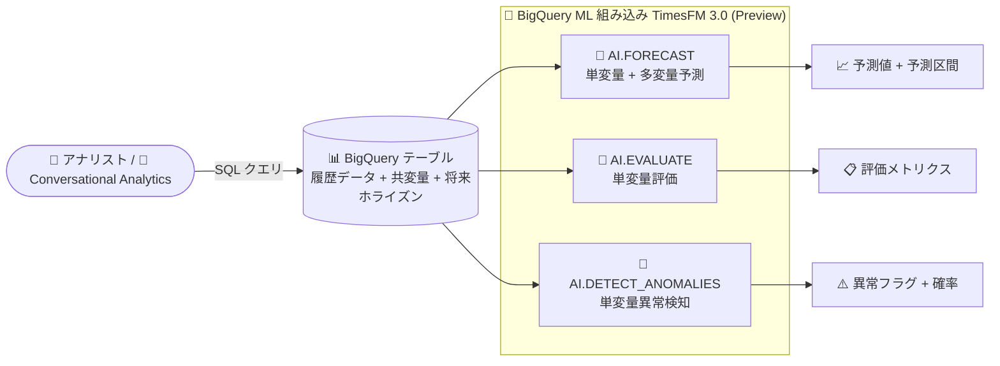

# BigQuery: 組み込み時系列予測モデル TimesFM 3.0 (多変量予測対応) (Preview)

**リリース日**: 2026-10-07

**サービス**: BigQuery

**機能**: TimesFM 3.0 組み込み時系列予測モデル (多変量予測対応)

**ステータス**: Preview

📊 [このアップデートのインフォグラフィックを見る](https://takech9203.github.io/google-cloud-news-summary/20261007-bigquery-timesfm-3-0-forecasting.html)

## 概要

BigQuery に、Google Research のオープンソース時系列基盤モデルを実装した組み込みモデル **TimesFM 3.0** が追加されました (Preview)。TimesFM は数十億の時系列データポイントで事前学習された時系列予測の基盤モデルで、ユーザーが独自にモデルを作成・学習することなく、SQL 関数を呼び出すだけで多様なドメインの予測に適用できます。予測精度は ARIMA などの従来の統計的手法に匹敵するとされています。

今回のアップデートの最大のポイントは、`AI.FORECAST` 関数での **多変量 (multivariate) 予測への対応** です。従来の単変量予測に加えて、予測対象の過去の値だけでなく、追加の共変量 (covariate) を取り込んで複数の時系列の値を同時に予測できるようになりました。また、`AI.EVALUATE` による単変量時系列の評価、`AI.DETECT_ANOMALIES` による単変量の異常検知でも TimesFM 3.0 を利用できます。BigQuery の Conversational Analytics (会話型分析) もこれらの関数での TimesFM 3.0 利用をサポートします。

対象ユーザーは、需要予測・売上予測・キャパシティプランニングなどを BigQuery 上のデータに対して手軽に実行したいデータアナリスト、データエンジニア、データサイエンティストです。

**アップデート前の課題**

- 組み込み TimesFM モデル (TimesFM 2.0/2.5) と `AI.FORECAST` 関数は単変量予測のみに対応しており、価格・天候・曜日などの外部要因 (共変量) を予測に取り込めなかった
- 共変量を使った多変量予測を行うには、`CREATE MODEL` で `ARIMA_PLUS_XREG` モデルを作成・学習する必要があり、モデル管理の手間が発生していた
- 複数のターゲット指標 (例: 商品 A と商品 B の販売数) を 1 回のクエリでまとめて予測することが難しかった

**アップデート後の改善**

- `AI.FORECAST` の `model => 'TimesFM 3.0'` 指定により、モデルの作成・学習なしで多変量予測が可能になった
- `target_cols` で複数のターゲット列、`past_covariate_cols` (過去のみ既知の共変量) と `future_covariate_cols` (将来も既知の共変量) を指定し、予測精度を向上できるようになった
- `id_cols` と組み合わせることで、複数エンティティ (店舗別・地域別など) の複数時系列を単一クエリで一括予測できるようになった
- `AI.EVALUATE` (評価) や `AI.DETECT_ANOMALIES` (異常検知)、Conversational Analytics でも TimesFM 3.0 を選択できるようになった

## アーキテクチャ図



BigQuery テーブル上の履歴データと共変量を単一の入力として、モデルの作成・学習なしに `AI.FORECAST` / `AI.EVALUATE` / `AI.DETECT_ANOMALIES` の各関数から組み込み TimesFM 3.0 を直接呼び出せます。

## サービスアップデートの詳細

### 主要機能

1. **AI.FORECAST による多変量予測 (新機能)**
   - 従来の単変量予測に加え、複数の時系列の値を履歴値と追加の共変量に基づいて予測可能
   - `target_cols`: 複数のターゲット列を同時に予測 (例: ウォッカとウイスキーの販売数)
   - `past_covariate_cols`: 過去のみ既知の共変量 (例: 平均取引額、平均乗車距離)
   - `future_covariate_cols`: 将来の値も既知の共変量 (例: 週末フラグ、祝日フラグ)
   - `id_cols`: 識別子列を指定して複数エンティティの時系列を一括予測
   - 他の多変量モデルと異なり、履歴データと将来の共変量を含む **単一の入力テーブル (またはクエリ)** を受け取る設計

2. **AI.EVALUATE による単変量時系列評価**
   - TimesFM 3.0 の予測値を実測値と比較して精度を評価

3. **AI.DETECT_ANOMALIES による単変量異常検知**
   - `model => 'TimesFM 3.0'` を指定可能 (デフォルトは `TimesFM 2.5`)
   - `anomaly_prob_threshold` (デフォルト 0.95) で異常判定のしきい値を調整
   - `target_last_n_points` または `target_start_timestamp` で履歴データと検知対象データを分割

4. **Conversational Analytics 対応**
   - BigQuery の会話型分析でも、これらの関数を通じて TimesFM 3.0 を利用可能

### ライセンスに関する注意

BigQuery 経由で TimesFM を使用する場合は Google Cloud 利用規約が適用され、**商用利用が可能** です。GitHub / Hugging Face で公開されている TimesFM 3.0 の重みに付随する非商用ライセンスは、セルフホストでのダウンロード利用のみに適用され、BigQuery 内での利用を制限しません。

## 技術仕様

### TimesFM 3.0 と TimesFM 2.5 の比較

| 項目 | TimesFM 2.5 | TimesFM 3.0 (Preview) |
|------|-------------|----------------------|
| 多変量予測 (共変量) | 非対応 (単変量のみ) | 対応 (`AI.FORECAST`) |
| コンテキストウィンドウ | 64〜15,360 (固定の 9 段階) | n × 32 (n は 2〜64 の整数、最大 2,048) |
| コンテキストウィンドウのデフォルト | 入力をカバーする最小サイズを自動選択 | 最大値 2,048 |
| モデルに渡せる最大データポイント数 | 15,360 | 2,048 |
| `AI.DETECT_ANOMALIES` の `target_last_n_points` 範囲 | [1, 10000] | [1, 2048] |
| `AI.DETECT_ANOMALIES` のデフォルトモデル | ○ (デフォルト) | 明示指定が必要 |

### AI.FORECAST (多変量) の主な引数

| 引数 | 説明 |
|------|------|
| `model` | `'TimesFM 3.0'` を指定 |
| `timestamp_col` | タイムスタンプ列 (TIMESTAMP / DATE / DATETIME) |
| `target_cols` | 予測対象列の配列 (複数指定可) |
| `past_covariate_cols` | 過去のみ既知の共変量列の配列 |
| `future_covariate_cols` | 将来も既知の共変量列の配列 (将来ホライズン行に値が必要) |
| `id_cols` | 複数時系列を識別する列の配列 (STRING / INT64 / ARRAY) |
| `horizon` | 予測期間 (ポイント数) |
| `confidence_level` | 予測区間の信頼水準 (例: 0.90, 0.95) |

### 入力データの要件 (多変量予測)

- 履歴行: タイムスタンプ、ターゲット、過去共変量が非 NULL であること
- 将来ホライズン行 (future covariate 使用時): ターゲットと過去共変量は NULL、将来共変量は値を設定
- 複数時系列の場合は `id_cols` で時系列を分離する識別子列が必要

## 設定方法

### 前提条件

1. BigQuery API が有効化されていること (新規プロジェクトでは自動で有効)
2. 必要な IAM ロール: BigQuery Data Editor (`roles/bigquery.dataEditor`)、BigQuery Job User (`roles/bigquery.jobUser`)

### 手順

#### ステップ 1: 履歴データと将来ホライズンを含む単一入力を準備

```sql
WITH historical_sales AS (
  SELECT
    date AS sales_date,
    store_number,
    SUM(IF(category_name LIKE '%VODKA%', bottles_sold, 0)) AS vodka_bottles,
    AVG(sale_dollars) AS avg_transaction_value,  -- 過去共変量
    IF(EXTRACT(DAYOFWEEK FROM date) IN (1, 7), 1.0, 0.0) AS is_weekend  -- 将来共変量
  FROM `bigquery-public-data.iowa_liquor_sales.sales`
  WHERE date BETWEEN '2023-01-01' AND '2023-06-30' AND store_number = '2633'
  GROUP BY sales_date, store_number
),
future_horizon AS (
  SELECT
    future_date AS sales_date,
    store_number,
    CAST(NULL AS INT64) AS vodka_bottles,
    CAST(NULL AS FLOAT64) AS avg_transaction_value,
    IF(EXTRACT(DAYOFWEEK FROM future_date) IN (1, 7), 1.0, 0.0) AS is_weekend
  FROM UNNEST(GENERATE_DATE_ARRAY('2023-07-01', '2023-07-14')) AS future_date
  CROSS JOIN (SELECT DISTINCT store_number FROM historical_sales)
)
SELECT * FROM historical_sales
UNION ALL
SELECT * FROM future_horizon
```

履歴期間はターゲットと過去共変量に実値を、将来ホライズンはターゲットを NULL、将来共変量に値を設定した 1 つのテーブル (クエリ) にまとめます。

#### ステップ 2: AI.FORECAST で TimesFM 3.0 を指定して予測

```sql
SELECT *
FROM AI.FORECAST(
  TABLE combined_sales,
  model => 'TimesFM 3.0',
  timestamp_col => 'sales_date',
  target_cols => ['vodka_bottles', 'whiskey_bottles'],
  past_covariate_cols => ['avg_transaction_value'],
  future_covariate_cols => ['is_weekend'],
  id_cols => ['store_number'],
  horizon => 14,
  confidence_level => 0.90
);
```

予測値と予測区間 (下限・上限) がターゲット列ごとに返されます。

## メリット

### ビジネス面

- **予測精度の向上**: 価格、プロモーション、曜日・祝日などの外部要因を共変量として取り込むことで、単変量予測より精度の高い需要予測・売上予測が期待できる
- **導入コストの低減**: モデルの作成・学習・管理が不要なため、ML 専門チームがなくても SQL だけで高度な予測を業務に組み込める
- **商用利用可能**: BigQuery 経由の利用は Google Cloud 利用規約の下で商用利用できる

### 技術面

- **ゼロショット予測**: 事前学習済み基盤モデルのため、`CREATE MODEL` 不要で即座に予測を実行できる
- **単一入力テーブル設計**: 履歴データと将来共変量を別テーブルに分ける必要がなく、1 つのクエリで完結する
- **複数時系列の一括処理**: `id_cols` により店舗別・地域別など多数の時系列を 1 クエリで同時予測できる
- **エコシステム統合**: `AI.EVALUATE` での精度評価、`AI.DETECT_ANOMALIES` での異常検知、Conversational Analytics まで一貫して TimesFM 3.0 を利用できる

## デメリット・制約事項

### 制限事項

- **Preview 段階**: Pre-GA Offerings Terms が適用され、サポートが限定される可能性がある
- **コンテキストウィンドウ**: TimesFM 3.0 がモデルに渡せる時系列データポイントは最大 2,048 (TimesFM 2.5 の 15,360 より小さい)。超過分は無視される
- **多変量対応は AI.FORECAST のみ**: `AI.EVALUATE` と `AI.DETECT_ANOMALIES` は単変量のみ対応
- **異常検知の評価範囲**: `AI.DETECT_ANOMALIES` は直近 1,024 データポイントのみを評価対象とする

### 考慮すべき点

- `AI.DETECT_ANOMALIES` のデフォルトモデルは `TimesFM 2.5` のため、TimesFM 3.0 を使うには `model` 引数での明示指定が必要
- 2026 年 12 月 1 日以降、TimesFM 3.0 はトークンベース課金に移行予定のため、コスト構造の変化に注意が必要
- より細かいモデルチューニングが必要な場合は、従来どおり `ARIMA_PLUS` / `ARIMA_PLUS_XREG` モデルの作成も選択肢となる

## ユースケース

### ユースケース 1: 共変量を使った小売の需要予測

**シナリオ**: 酒類小売店で、ウォッカとウイスキーの販売数を 2 週間先まで予測したい。平均取引額 (過去共変量) と週末フラグ (将来共変量) を予測に反映させる。

**実装例**:
```sql
SELECT * FROM AI.FORECAST(
  TABLE combined_sales,
  model => 'TimesFM 3.0',
  timestamp_col => 'sales_date',
  target_cols => ['vodka_bottles', 'whiskey_bottles'],
  past_covariate_cols => ['avg_transaction_value'],
  future_covariate_cols => ['is_weekend'],
  id_cols => ['store_number'],
  horizon => 14, confidence_level => 0.90);
```

**効果**: モデル学習なしで、外部要因を考慮した複数商品カテゴリの需要予測を 1 クエリで取得でき、発注・在庫計画の精度が向上する。

### ユースケース 2: 複数拠点の多変量予測 (タクシー需要)

**シナリオ**: JFK 空港と LaGuardia 空港の 2 つの乗車ゾーンについて、乗車回数と平均運賃を 14 日先まで予測する。平均乗車距離を過去共変量として利用し、`id_cols` でゾーンごとの時系列を分離する。

**効果**: 複数拠点 × 複数指標の予測を単一クエリで実行でき、配車計画やダイナミックプライシングの基礎データを効率的に生成できる。

### ユースケース 3: 時系列メトリクスの異常検知

**シナリオ**: 日次のトランザクション数に対して `AI.DETECT_ANOMALIES` を TimesFM 3.0 で実行し、直近 10 ポイントの異常を検知する (`target_last_n_points => 10`)。

**効果**: しきい値ルールでは捉えにくい季節性・トレンドを考慮した異常検知を、モデル管理なしで運用できる。

## 料金

Preview 期間中の TimesFM 3.0 の利用料金は以下のとおりです。

- **Enterprise / Enterprise Plus エディション**: スロット単位で課金
- **オンデマンド料金**: 処理バイト数に基づいて課金

**重要**: 2026 年 12 月 1 日以降、TimesFM 3.0 は **トークンベース課金** に移行します。それ以降は、クエリ内でモデルが消費したトークンに対する課金と、クエリの残りの部分に対する BigQuery スロットまたは処理バイト数の課金が発生します。

詳細は [BigQuery ML の料金ページ](https://cloud.google.com/bigquery/pricing#bqml) を参照してください。

## 利用可能リージョン

TimesFM モデルおよび関連関数 (`AI.FORECAST`、`AI.DETECT_ANOMALIES` など) は、[BigQuery ML がサポートするすべてのロケーション](https://docs.cloud.google.com/bigquery/docs/locations#bqml-loc) で利用できます。

## 関連サービス・機能

- **BigQuery ML (ARIMA_PLUS / ARIMA_PLUS_XREG)**: より細かいチューニングが必要な場合の代替手段。`CREATE MODEL` でモデルを作成し `ML.FORECAST` で予測する従来型アプローチ
- **Conversational Analytics in BigQuery**: 自然言語での対話的なデータ分析から TimesFM 3.0 による予測・異常検知を利用可能
- **AI.FORECAST / AI.EVALUATE / AI.DETECT_ANOMALIES**: TimesFM を呼び出す BigQuery ML の AI 関数群
- **Google Research TimesFM (OSS)**: GitHub / Hugging Face で公開されているオープンソース実装。BigQuery 組み込み版はこれを実装したもの

## 参考リンク

- 📊 [インフォグラフィック](https://takech9203.github.io/google-cloud-news-summary/20261007-bigquery-timesfm-3-0-forecasting.html)
- [公式リリースノート](https://docs.cloud.google.com/release-notes#October_07_2026)
- [The TimesFM model (ドキュメント)](https://docs.cloud.google.com/bigquery/docs/timesfm-model)
- [チュートリアル: Forecast a single time series with a TimesFM multivariate model](https://docs.cloud.google.com/bigquery/docs/timesfm-multivariate-single-time-series-forecasting-tutorial)
- [チュートリアル: Forecast multiple time series with a TimesFM multivariate model](https://docs.cloud.google.com/bigquery/docs/timesfm-multivariate-multi-time-series-forecasting-tutorial)
- [AI.FORECAST 関数リファレンス](https://docs.cloud.google.com/bigquery/docs/reference/standard-sql/bigqueryml-syntax-ai-forecast)
- [AI.DETECT_ANOMALIES 関数リファレンス](https://docs.cloud.google.com/bigquery/docs/reference/standard-sql/bigqueryml-syntax-ai-detect-anomalies)
- [TimesFM GitHub リポジトリ (Google Research)](https://github.com/google-research/timesfm)
- [料金ページ (BigQuery ML)](https://cloud.google.com/bigquery/pricing#bqml)

## まとめ

TimesFM 3.0 の登場により、BigQuery はモデルの作成・学習なしで共変量を考慮した多変量時系列予測を SQL だけで実行できるようになりました。需要予測や売上予測で外部要因を取り込みたいチームは、`AI.FORECAST` の `model => 'TimesFM 3.0'` を既存データで試し、2026 年 12 月のトークンベース課金への移行も見据えてコスト評価を行うことを推奨します。

---

**タグ**: BigQuery, BigQuery ML, TimesFM, 時系列予測, 多変量予測, 異常検知, AI.FORECAST, Preview
