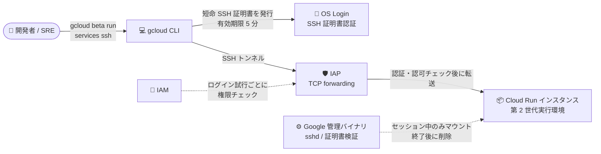

# Cloud Run: SSH サポート (Preview)

**リリース日**: 2026-10-07

**サービス**: Cloud Run

**機能**: Cloud Run サービス・インスタンスへの SSH 接続

**ステータス**: Preview

📊 [このアップデートのインフォグラフィックを見る](https://takech9203.github.io/google-cloud-news-summary/20261007-cloud-run-ssh-preview.html)

## 概要

Cloud Run のサービスおよびインスタンスに対する SSH 接続機能が Preview として提供開始されました。この機能により、稼働中のコンテナインスタンスに対してセキュアでインタラクティブなシェル接続を確立し、コンテナのファイルシステムやランタイム環境に直接アクセスできるようになります。システムリソースの確認、設定の検証、トラブルシューティングといったデバッグ作業を、実際に稼働している本番環境のインスタンス上で直接行えます。

接続のセキュリティは Google Cloud の既存のセキュリティサービスを組み合わせて実現されています。Identity-Aware Proxy (IAP) の TCP forwarding が SSH 接続をプロキシし、リクエストがコンテナに到達する前に認証・認可チェックを通過させます。ユーザー認証には OS Login の SSH 証明書認証が使用され、接続時に gcloud CLI が有効期限 5 分の短命 SSH 証明書を発行します。ログイン試行のたびに IAM 権限がチェックされるため、きめ細かなアクセス制御が可能です。

SSH に必要な sshd や証明書検証バイナリなどの Google 管理バイナリは、SSH セッションの確立時に自動的にコンテナのファイルシステムに追加され、セッション終了後に削除されます。コンテナイメージ側に SSH サーバーを組み込む必要はありません。サーバーレス環境でのデバッグ体験を大きく改善するアップデートであり、Cloud Run を本番運用するすべての開発者・SRE が対象です。

**アップデート前の課題**

- Cloud Run は稼働中のコンテナインスタンスに対するインタラクティブなシェル接続手段を提供しておらず、ランタイム環境の調査はログやメトリクスなどの間接的な手段に頼る必要があった
- 稼働中インスタンスのファイルシステムの状態や実際の設定値を直接確認する手段がなく、問題の再現・切り分けのためにデバッグ用のコードやエンドポイントを追加して再デプロイするといった対応が必要だった
- コンテナ内部にアクセスするには、イメージに SSH サーバーなどのデバッグ機構を自前で組み込み、セキュリティリスクを管理する必要があった

**アップデート後の改善**

- `gcloud beta run services ssh` / `gcloud beta run instances ssh` コマンドで、稼働中のインスタンスにセキュアなインタラクティブシェル接続を確立できるようになった
- sshd などの必要なバイナリは Google が管理し、セッション中のみコンテナにマウントされるため、イメージへの SSH サーバーの組み込みが不要になった
- IAP TCP forwarding + OS Login の短命証明書 (有効期限 5 分) + IAM 権限チェックにより、セキュリティを担保したままデバッグアクセスが可能になった
- 特定のインスタンス ID やリビジョンを指定して接続でき、問題が発生している個別のインスタンスをピンポイントで調査できるようになった

## アーキテクチャ図



開発者が gcloud CLI で SSH 接続を開始すると、OS Login が短命証明書を発行し、IAP TCP forwarding が認証・認可チェックを行ったうえで Cloud Run インスタンスへ接続を転送します。sshd などの必要なバイナリは Google 管理で、セッション中のみコンテナにマウントされます。

## サービスアップデートの詳細

### 主要機能

1. **サービス・インスタンスへの SSH 接続**
   - `gcloud beta run services ssh SERVICE --region=REGION` で Cloud Run サービスの稼働中インスタンスに接続
   - `gcloud beta run instances ssh INSTANCE --region=REGION` で Cloud Run インスタンスに接続
   - サービスのインスタンスが 1 つも稼働していない場合、SSH セッションのために新しいインスタンスが自動起動される
   - SSH セッション中はインスタンスがアクティブに維持される (通常どおり課金対象)
   - セッションを exit してもコンテナは再起動・停止されず、コンテナが生きている間は変更内容が維持される

2. **特定のインスタンス・リビジョンの指定**
   - `--instance=INSTANCE_ID` フラグで特定のサービスインスタンスを指定して接続可能 (インスタンス ID はログの labels フィールドで確認)
   - `--revision=REVISION` フラグで特定のリビジョンを指定して接続可能
   - 問題が発生している個別インスタンスのピンポイント調査に有効

3. **IAP + OS Login によるセキュアな接続**
   - IAP TCP forwarding が SSH 接続をプロキシし、コンテナ到達前に認証・認可を実施
   - IAP の context-aware access を併用すれば、IP アドレスやデバイス属性に基づくアクセス制限も可能
   - OS Login の SSH 証明書認証を使用し、gcloud CLI が有効期限 5 分の短命証明書を発行
   - ログイン試行のたびに IAM 権限をチェック

4. **Google 管理の SSH バイナリ**
   - sshd と証明書検証バイナリは SSH セッション確立時に自動でコンテナに追加され、セッション終了後に削除される
   - コンテナ内の既存の SSH 設定 (`/etc/passwd` エントリ含む) は無視され、Google 管理の設定が優先される
   - サードパーティ OSS の著作権表示は `/usr/share/licenses/google_ssh/THIRD_PARTY_NOTICES` にマウントされる

5. **アクセス制御・監査**
   - IAP の IAM ポリシーバインディングをプロジェクト・リージョン・サービス単位で設定可能
   - 組織ポリシーのカスタム制約で SSH の有効化自体を禁止することも可能
   - Cloud OS Login API の監査ログを有効化することで SSH アクセスのログを Cloud Audit Logs で確認できる

## 技術仕様

### 接続の仕組みと制限

| 項目 | 詳細 |
|------|------|
| 対象リソース | Cloud Run サービス (第 2 世代実行環境のみ)、Cloud Run インスタンス |
| 非対象リソース | Cloud Run jobs、ワーカープール、第 1 世代実行環境のサービス |
| 接続方法 | gcloud CLI (`gcloud beta run services ssh` / `gcloud beta run instances ssh`)、ローカル OpenSSH クライアント |
| 認証 | OS Login の SSH 証明書認証 (証明書の有効期限は 5 分) |
| プロキシ | IAP TCP forwarding (接続前に認証・認可チェック) |
| セッション上限 | 最大 24 時間 (超過時は切断、再接続が必要) |
| アイドルタイムアウト | IAP により非アクティブ 1 時間で切断 |
| ホストキー | SSH 使用時にイメージ内のホストキーが上書きされ、インスタンス再起動まで維持 |
| Windows クライアント | PuTTY は非サポート。OpenSSH クライアントを使用 |
| VPC Service Controls | トンネリングプロセスは `run.googleapis.com` ではなく `iaptunnel.googleapis.com` をサービス名としてチェック |

### 必要な IAM ロール

接続するユーザーには以下のロールが必要です。

| ロール | 付与対象 |
|------|------|
| Service Account User (`roles/iam.serviceAccountUser`) | サービスアカウント |
| Cloud Run SSH Root Access (`roles/run.sshRoot`) | サービス |
| Cloud Run Viewer (`roles/run.viewer`) | サービス |
| IAP-secured Tunnel User (`roles/iap.tunnelResourceAccessor`) | サービス (またはプロジェクト・リージョン単位) |
| Cloud Run Developer (`roles/run.developer`) | サービス |
| Logs View Accessor (`roles/logging.viewAccessor`) | プロジェクト |
| Browser (`roles/browser`) | プロジェクト |
| Service Usage Consumer (`roles/serviceusage.serviceUsageConsumer`) | プロジェクト |

ポリシーの設定には IAP Policy Admin (`roles/iap.admin`) と Cloud Run Admin (`roles/run.admin`) が必要です。組織外のユーザーに SSH アクセスを許可する場合は `roles/compute.osLoginExternalUser` (または `compute.oslogin.updateExternalUser` 権限を持つカスタムロール) の付与が必要です。

## 設定方法

### 前提条件

1. Cloud Run サービスが第 2 世代実行環境で稼働していること (接続後に使うデバッグツールはイメージに含めておく)
2. 必要な API の有効化:

```bash
gcloud services enable \
    run.googleapis.com \
    cloudresourcemanager.googleapis.com \
    iap.googleapis.com \
    oslogin.googleapis.com
```

3. gcloud CLI を最新化: `gcloud components update`
4. 上記「必要な IAM ロール」の付与

### 手順

#### ステップ 1: サービスで SSH を有効化

```bash
# 既存サービスの更新
gcloud beta run services update SERVICE_NAME --ssh

# または新規デプロイ時に有効化
gcloud beta run deploy SERVICE_NAME --image=IMAGE_URL --ssh
```

サービスでは明示的に SSH を有効化します。なお、Cloud Run インスタンスでは SSH はデフォルトで有効であり、`--no-ssh` で無効化できます。

#### ステップ 2: IAP のアクセスポリシーを設定

```bash
# 特定サービスに対して IAP トンネルユーザーを許可
gcloud beta iap tcp add-iam-policy-binding \
    --resource-type=cloud-run \
    --service=SERVICE_NAME \
    --region=REGION \
    --member='user:user@example.com' \
    --role='roles/iap.tunnelResourceAccessor'
```

プロジェクト単位・リージョン単位・サービス単位でアクセスポリシーを設定できます。

#### ステップ 3: SSH で接続

```bash
# サービスに接続
gcloud beta run services ssh SERVICE_NAME \
    --region=REGION --project=PROJECT_ID

# 特定のインスタンスを指定して接続
gcloud beta run services ssh SERVICE_NAME \
    --region=REGION --project=PROJECT_ID --instance=INSTANCE_ID

# 特定のリビジョンを指定して接続
gcloud beta run services ssh SERVICE_NAME \
    --region=REGION --project=PROJECT_ID --revision=REVISION

# Cloud Run インスタンスに接続
gcloud beta run instances ssh INSTANCE \
    --region=REGION --project=PROJECT_ID
```

セッションを終了するには `exit` を入力します。

#### ステップ 4 (任意): SSH アクセスログの確認

```bash
gcloud logging read '
    logName="projects/PROJECT_ID/logs/cloudaudit.googleapis.com%2Fdata_access"
    AND protoPayload.serviceName="oslogin.googleapis.com"
    AND protoPayload.request.instance:"run.googleapis.com"
' --project=PROJECT_ID --freshness=1d \
  --format="table(timestamp, protoPayload.authenticationInfo.principalSubject:label=USER, protoPayload.request.instance:label=CLOUD_RUN_SERVICE)"
```

SSH キー管理の監査ログを取得するには、事前に Cloud OS Login API の監査ログを有効化しておく必要があります。

## メリット

### ビジネス面

- **障害対応時間 (MTTR) の短縮**: 本番で発生している問題を稼働中インスタンス上で直接調査できるため、ログ追加 → 再デプロイ → 再現待ちといったサイクルが不要になり、復旧までの時間を短縮できる
- **サーバーレス移行の障壁低減**: 「中に入って調査できない」という Cloud Run 採用時の懸念が解消され、VM / GKE からの移行判断がしやすくなる

### 技術面

- **セキュアバイデフォルト**: IAP の認証・認可、OS Login の短命証明書 (5 分)、ログインごとの IAM チェックが組み込まれており、自前で SSH 基盤を安全に構築する必要がない
- **イメージの変更不要**: sshd などのバイナリは Google 管理でセッション中のみマウントされるため、デバッグのためにイメージへ SSH サーバーを組み込む必要がない
- **ピンポイント調査**: インスタンス ID やリビジョンを指定して接続でき、特定インスタンスで発生する問題の切り分けが容易
- **監査可能性**: Cloud Audit Logs で誰がいつどのサービスに SSH したかを追跡でき、組織ポリシーのカスタム制約で SSH 有効化自体の統制も可能

## デメリット・制約事項

### 制限事項

- Preview 段階のため Pre-GA Offerings Terms が適用され、サポートが限定的な場合がある
- 対象はサービス (第 2 世代実行環境のみ) と Cloud Run インスタンスのみ。Cloud Run jobs とワーカープールは非サポート
- SSH セッションは最大 24 時間で切断される。また IAP により非アクティブ 1 時間で切断される
- SSH 使用時にイメージ内のホストキーが上書きされ、インスタンス再起動まで上書きされたまま残る
- Windows では PuTTY は非サポート (OpenSSH クライアントが必要)
- ローカル OpenSSH クライアントを使う場合、証明書の有効期限が 5 分のため、期限切れ後は `gcloud beta run services ssh` の再実行が必要

### 考慮すべき点

- SSH セッション中はインスタンスがアクティブに維持され、通常どおり課金が発生する。インスタンスが稼働していない場合は SSH のために新規インスタンスが起動される点にも注意
- コンテナへの変更はコンテナが生きている間のみ保持され、インスタンスの入れ替えで失われる (永続的な変更は再デプロイで行う)
- SSH 利用時はコンテナのセキュリティ強化 (アプリケーションコードを非 root ユーザーで実行するなど) をあわせて検討すべき
- 本番環境での利用は、サービス単位の IAP ポリシーや組織ポリシーのカスタム制約で統制することを推奨
- VPC Service Controls を利用している場合、トンネリングは `iaptunnel.googleapis.com` をサービス名としてチェックするため、境界設定の見直しが必要になる場合がある

## ユースケース

### ユースケース 1: 本番インシデントの即時調査

**シナリオ**: 本番の Cloud Run サービスで特定のインスタンスだけレイテンシが悪化している。ログからは原因が特定できず、インスタンス内部のリソース状況や一時ファイルの状態を確認したい。

**実装例**:
```bash
# ログの labels フィールドから問題のインスタンス ID を特定し、直接接続
gcloud beta run services ssh my-api \
    --region=asia-northeast1 \
    --project=my-project \
    --instance=INSTANCE_ID

# 接続後、インスタンス内でリソースや設定を確認
cat /proc/meminfo
ls -la /tmp
env | sort
```

**効果**: 再デプロイやデバッグコードの追加なしに、問題が発生している個別インスタンスをその場で調査でき、MTTR を大幅に短縮できる。

### ユースケース 2: 新リビジョンの設定検証

**シナリオ**: カナリアデプロイした新リビジョンで環境変数やマウントされたシークレット・ボリュームが意図どおり反映されているかを、トラフィックに影響を与えずに確認したい。

**実装例**:
```bash
gcloud beta run services ssh my-api \
    --region=asia-northeast1 \
    --project=my-project \
    --revision=my-api-00042-abc
```

**効果**: リビジョン単位で実際のランタイム環境に入って設定を検証でき、設定ミスによる障害を本格的なトラフィック切り替え前に検出できる。

### ユースケース 3: 統制された SSH アクセスの運用

**シナリオ**: セキュリティ要件の厳しい組織で、SSH デバッグを特定のサービス・特定のオンコール担当者のみに限定したい。

**実装例**:
```bash
# オンコール担当者にのみ特定サービスへのトンネルアクセスを許可
gcloud beta iap tcp add-iam-policy-binding \
    --resource-type=cloud-run \
    --service=my-api \
    --region=asia-northeast1 \
    --member='group:oncall@example.com' \
    --role='roles/iap.tunnelResourceAccessor'
```

**効果**: IAM と IAP ポリシーによるきめ細かなアクセス制御と Cloud Audit Logs による監査を両立しながら、必要なメンバーにのみデバッグアクセスを提供できる。

## 料金

SSH 機能自体の追加料金は発表されていませんが、以下の課金が発生します。

- SSH ではネットワーク Egress バイトに対して課金される
- SSH セッション中にアクティブに維持されるインスタンスに対して、通常どおりの Cloud Run 課金が発生する (インスタンスが稼働していない場合は SSH のために新規インスタンスが起動される)

詳細は [Cloud Run の料金ページ](https://cloud.google.com/run/pricing)を参照してください。

## 利用可能リージョン

リージョンごとの提供状況に関する個別の記載は確認できませんでした。詳細は[公式ドキュメント](https://docs.cloud.google.com/run/docs/troubleshooting/ssh)を参照してください。

## 関連サービス・機能

- **Identity-Aware Proxy (IAP)**: TCP forwarding で SSH 接続をプロキシし、認証・認可を実施。context-aware access で IP アドレスやデバイス属性に基づくアクセス制限も可能
- **OS Login**: SSH 証明書認証によるユーザー認証を担当。有効期限 5 分の短命証明書を発行
- **Cloud Audit Logs**: OS Login API の監査ログを有効化することで、SSH アクセスの記録・追跡が可能
- **IAM / 組織ポリシー**: ロールベースのアクセス制御に加え、カスタム制約で SSH 有効化の統制が可能
- **VPC Service Controls**: 境界内での利用時はトンネリングが `iaptunnel.googleapis.com` を参照する点に注意
- **Cloud Run 第 2 世代実行環境**: サービスで SSH を利用するための前提となる実行環境

## 参考リンク

- 📊 [インフォグラフィック](https://takech9203.github.io/google-cloud-news-summary/20261007-cloud-run-ssh-preview.html)
- [公式リリースノート](https://docs.cloud.google.com/release-notes#October_07_2026)
- [ドキュメント: SSH で Cloud Run に接続](https://docs.cloud.google.com/run/docs/troubleshooting/ssh)
- [ドキュメント: IAP を使用した Cloud Run への SSH](https://docs.cloud.google.com/iap/docs/ssh-cloud-run)
- [IAP TCP forwarding の概要](https://docs.cloud.google.com/iap/docs/tcp-forwarding-overview)
- [OS Login の SSH 証明書認証](https://docs.cloud.google.com/compute/docs/oslogin/certificates)
- [料金ページ](https://cloud.google.com/run/pricing)

## まとめ

Cloud Run への SSH サポートは、サーバーレス環境の最大の弱点であった「稼働中インスタンスへの直接アクセスができない」という課題を、IAP + OS Login による強固なセキュリティモデルを維持したまま解消する重要なアップデートです。デバッグ用の再デプロイやイメージへの SSH サーバー組み込みが不要になり、本番インシデントの調査効率が大きく向上します。まずは開発・ステージング環境で `gcloud beta run services ssh` を試し、本番利用時は IAP ポリシーと組織ポリシーによるアクセス統制、監査ログの有効化をあわせて設計することを推奨します。

---

**タグ**: #CloudRun #SSH #IAP #OSLogin #Serverless #Debugging #Preview #Security
