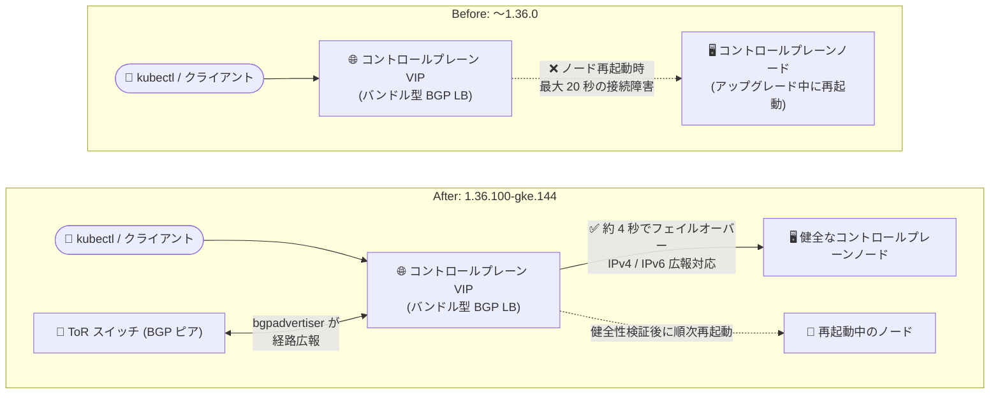

# Google Distributed Cloud (software only) for bare metal: バージョン 1.36.100-gke.144 リリース

**リリース日**: 2026-10-07

**サービス**: Google Distributed Cloud (software only) for bare metal

**機能**: バージョン 1.36.100-gke.144 リリース (機能強化とバグ修正)

**ステータス**: GA (ダウンロード提供開始)

📊 [このアップデートのインフォグラフィックを見る](https://takech9203.github.io/google-cloud-news-summary/20261007-gdc-bare-metal-1-36-100.html)

## 概要

Google Distributed Cloud (software only) for bare metal のパッチバージョン 1.36.100-gke.144 がダウンロード可能になりました。このバージョンは Kubernetes v1.36.4-gke.100 上で動作します。リリース後、GKE On-Prem API クライアント (Google Cloud コンソール、gcloud CLI、Terraform) でインストールやアップグレードに利用可能になるまで約 7〜14 日かかります。

本リリースは、GKE Identity Service 証明書の有効期間延長 (5 年 → 10 年)、バンドル型 BGP ロードバランシングにおけるコントロールプレーンのフェイルオーバー高速化 (最大 20 秒 → 約 4 秒)、メンテナンスモードでのストレージボリュームのデタッチ待機、bgpadvertiser の IPv6 アドレス広報サポートといった機能強化を含みます。さらに、etcd のセキュリティ脆弱性対応 (CVE-2026-46595、CVE-2026-39821) や、クラスタ削除・ノードプール作成のスタック問題など、クラスタライフサイクル運用の信頼性に関わる複数の修正が含まれています。

オンプレミスのベアメタル環境で GDC クラスタを運用している管理者にとって、コントロールプレーンの可用性向上とセキュリティ修正が中心の、適用優先度の高いパッチリリースです。

**アップデート前の課題**

- GKE Identity Service の内部証明書は有効期間が 5 年で、通常のクラスタアップグレードでは更新されず、期限切れになると OIDC/LDAP 経由の認証が失敗し、クラスタ CA の手動ローテーションが必要だった (既知の問題として文書化)
- バンドル型 BGP ロードバランシング利用時、コントロールプレーンのアップグレードや構成更新でノードが再起動すると、最大 20 秒間 Kubernetes API サーバーへの接続障害が発生する可能性があった
- メンテナンスモードのノードドレインが、接続されたストレージボリュームのデタッチ完了を待たずに進行していた
- bgpadvertiser によるバンドル型 BGP コントロールプレーンロードバランシングの広報は IPv4 アドレスのみ対応だった
- コントロールプレーン構成の更新時に複数の API サーバーが同時に再起動し、一時的なコントロールプレーン停止が発生することがあった
- クラスタ削除が孤立したマシンリソースにより無期限にスタックしたり、厳格なファイアウォール環境でワーカーノードプール作成がデッドロックしたりする問題があった

**アップデート後の改善**

- GKE Identity Service 用に新規生成される証明書の有効期間が 10 年に延長され、証明書期限切れによる認証障害のリスクと CA ローテーションの運用負荷が軽減された
- バンドル型 BGP ロードバランシングでのコントロールプレーンフェイルオーバーが約 4 秒で完了するようになり、アップグレード時の API サーバー接続断が大幅に短縮された
- メンテナンスモードのノードドレインがストレージボリュームのデタッチを待機するようになり、ステートフルワークロードの安全性が向上した
- bgpadvertiser が IPv4 に加えて IPv6 アドレスの広報に対応し、IPv6 環境でのコントロールプレーンロードバランシングが可能になった
- コントロールプレーン構成更新時に各 API サーバーの健全性を厳格に検証してから次のノードを再起動するようになり、一時的な API サーバーダウンタイムが解消された
- クラスタ削除のスタック、ノードプール作成のデッドロック、Pod 密度設定差異によるステータス変動、メンテナンスモード遷移中の BareMetalMachine ステータス誤報告が修正された

## アーキテクチャ図



バンドル型 BGP ロードバランシングにおけるコントロールプレーンの Before/After 比較です。1.36.100 ではノード再起動時のフェイルオーバーが最大 20 秒から約 4 秒に短縮され、bgpadvertiser は IPv6 アドレスの広報にも対応しました。

## サービスアップデートの詳細

### 主要機能

1. **GKE Identity Service 証明書の有効期間延長 (5 年 → 10 年)**
   - 新規に生成される GKE Identity Service 用証明書の有効期間が 10 年になった
   - 従来は 5 年で期限切れとなり、通常のアップグレードでは更新されないため、`bmctl update credentials certificate-authorities rotate` によるクラスタ CA の手動ローテーションが必要だった (期限切れ時は OIDC/LDAP 認証が失敗し、ログに `x509: certificate has expired or is not yet valid` が記録される既知の問題)

2. **バンドル型 BGP ロードバランシングのコントロールプレーンフェイルオーバー高速化**
   - コントロールプレーンのアップグレードや構成更新に伴うノード再起動時、API サーバー接続障害が最大 20 秒発生していた問題を修正
   - 修正後は健全なコントロールプレーンノードへのフェイルオーバーが約 4 秒で完了する

3. **メンテナンスモードのノードドレイン改善**
   - ノードドレインが、接続されたストレージボリュームのデタッチ完了を待機するようになった
   - CSI ボリュームを使用するステートフルワークロードのデータ保護が強化される

4. **bgpadvertiser の IPv6 広報サポート**
   - バンドル型 BGP コントロールプレーンロードバランシングで、IPv4 に加えて IPv6 アドレスの広報が可能になった

### 修正された問題

1. **etcd のセキュリティ更新**: etcd を v3.5.33-0-gke.3 に更新し、CVE-2026-46595 および CVE-2026-39821 に対応
2. **ユーザークラスタのステータス変動**: 管理クラスタとユーザークラスタで Pod 密度設定が異なる場合に、reconciling と running の状態を繰り返す問題を修正
3. **コントロールプレーン更新時の一時的ダウンタイム**: 各 API サーバーの健全性を厳格に検証してから後続のコントロールプレーンノードを再起動するよう修正
4. **クラスタ削除のスタック**: 孤立したマシンリソースにより削除が terminating 状態で無期限にスタックする問題を修正
5. **ノードプール作成のデッドロック**: 厳格なネットワークファイアウォールポリシー環境で、ノードプールコントローラーがすべてのインベントリマシンの準備完了を待たなくなり、プロビジョニングのデッドロックを解消
6. **BareMetalMachine ステータスの誤報告**: メンテナンスモード遷移中にノードを ready / available と早期に報告する問題を修正

## 技術仕様

### リリース情報

| 項目 | 詳細 |
|------|------|
| バージョン | 1.36.100-gke.144 |
| Kubernetes バージョン | v1.36.4-gke.100 |
| GKE On-Prem API クライアント対応 | リリース後約 7〜14 日 (コンソール、gcloud CLI、Terraform) |
| etcd バージョン | v3.5.33-0-gke.3 |
| 対応 CVE | CVE-2026-46595、CVE-2026-39821 |
| GKE Identity Service 証明書有効期間 | 10 年 (新規生成分、従来は 5 年) |
| BGP LB コントロールプレーンフェイルオーバー | 約 4 秒 (従来は最大 20 秒の接続障害) |

### バンドル型 BGP ロードバランシングの構成例

```yaml
apiVersion: baremetal.cluster.gke.io/v1
kind: Cluster
metadata:
  name: bm
  namespace: cluster-bm
spec:
  loadBalancer:
    mode: bundled
    type: bgp
    localASN: 65001
    bgpPeers:
    - ip: 10.0.1.254
      asn: 65002
      controlPlaneNodes:
      - 10.0.1.10
      - 10.0.1.11
```

## 設定方法

### 前提条件

1. 既存の Google Distributed Cloud (software only) for bare metal クラスタ (アップグレードの場合)
2. サードパーティのストレージベンダーを使用している場合は、認定済みストレージパートナーのリストを確認

### 手順

#### ステップ 1: アップグレード対象バージョンの確認

```bash
# クラスタの現在のバージョンを確認
kubectl get cluster CLUSTER_NAME -n CLUSTER_NAMESPACE \
  -o jsonpath='{.spec.anthosBareMetalVersion}' --kubeconfig ADMIN_KUBECONFIG
```

アップグレードパスの要件は公式ドキュメントの「Upgrade clusters」を参照してください。

#### ステップ 2: bmctl によるアップグレード

```bash
# クラスタ構成ファイルの anthosBareMetalVersion を更新後、アップグレードを実行
bmctl upgrade cluster -c CLUSTER_NAME --kubeconfig ADMIN_KUBECONFIG
```

GKE On-Prem API クライアント (コンソール、gcloud CLI、Terraform) 経由のアップグレードは、リリース後約 7〜14 日で利用可能になります。

## メリット

### ビジネス面

- **計画外ダウンタイムの削減**: コントロールプレーン更新時の API サーバー接続断が最大 20 秒から約 4 秒に短縮され、アップグレード中も管理操作や CI/CD パイプラインへの影響が最小化される
- **運用負荷の軽減**: GKE Identity Service 証明書の有効期間が 10 年に延長され、証明書期限切れに起因する認証障害や緊急の CA ローテーション対応のリスクが低減する
- **セキュリティコンプライアンス**: etcd の CVE 対応により、脆弱性管理の要件を満たしやすくなる

### 技術面

- **クラスタライフサイクルの信頼性向上**: クラスタ削除のスタック、ノードプール作成のデッドロック、ステータスの誤報告といった運用を阻害する問題が解消された
- **ステートフルワークロードの保護**: メンテナンスモードのドレインがボリュームのデタッチを待機するため、ノードメンテナンスやアップグレード時のデータ破損リスクが低減する
- **IPv6 対応の前進**: bgpadvertiser による IPv6 アドレス広報のサポートにより、IPv6 ネットワーク環境でのコントロールプレーンロードバランシング構成が可能になった

## デメリット・制約事項

### 制限事項

- GKE On-Prem API クライアント (Google Cloud コンソール、gcloud CLI、Terraform) での利用はリリース後約 7〜14 日待つ必要がある
- GKE Identity Service 証明書の有効期間延長は新規に生成される証明書に適用される。既存の証明書の期限管理には引き続き注意が必要
- サードパーティストレージベンダー利用時は、認定済みストレージパートナーのリストで対応状況の確認が必要

### 考慮すべき点

- アップグレード時はノードのドレインが発生するため、PodDisruptionBudget (PDB) の設定を確認し、メンテナンスウィンドウを計画する
- バンドル型 BGP ロードバランシングのフェイルオーバー改善の恩恵を受けるには、HA コントロールプレーン (複数のコントロールプレーンノード) 構成が前提となる

## ユースケース

### ユースケース 1: アップグレード時のダウンタイムに敏感な本番クラスタ

**シナリオ**: バンドル型 BGP ロードバランシングを使用する HA 構成の本番クラスタで、コントロールプレーンのアップグレード中に kubectl や Operator からの API アクセスが最大 20 秒間失敗し、自動化パイプラインがリトライエラーを起こしていた。

**効果**: 1.36.100 へのアップグレード後は、フェイルオーバーが約 4 秒で完了し、API サーバーの健全性検証後に次のノードが再起動されるため、コントロールプレーン更新中の接続断がクライアントのタイムアウト許容範囲内に収まりやすくなる。

### ユースケース 2: OIDC/LDAP 認証を利用する長期運用クラスタ

**シナリオ**: GKE Identity Service で OIDC 認証を構成したクラスタを長期運用しており、5 年で期限切れとなる内部証明書の管理 (クラスタ CA の手動ローテーション) が運用上の懸念だった。

**効果**: 新規生成される証明書の有効期間が 10 年となり、証明書期限切れによる突然の認証障害リスクと、CA ローテーションに伴うワークロード再起動を計画する頻度が低減する。

### ユースケース 3: 厳格なファイアウォールポリシー下でのノードプール拡張

**シナリオ**: セキュリティ要件の厳しいオンプレミス環境で、ネットワークファイアウォールポリシーによりワーカーノードプールの作成がプロビジョニング中に無期限にスタックしていた。

**効果**: ノードプールコントローラーがすべてのインベントリマシンの準備完了を待たずにノードプールを宣言するようになり、プロビジョニングのデッドロックが解消され、ノードプール拡張が確実に完了する。

## 料金

Google Distributed Cloud (software only) for bare metal 自体の料金体系に変更はありません。料金の詳細は公式料金ページを参照してください。

- [Google Distributed Cloud (software only) 料金](https://cloud.google.com/distributed-cloud/bare-metal/pricing)

## 関連サービス・機能

- **GKE Identity Service**: OIDC/LDAP による Kubernetes API サーバーへの認証を提供。本リリースで証明書有効期間が 10 年に延長された
- **GKE On-Prem API**: Google Cloud コンソール、gcloud CLI、Terraform からの GDC クラスタ管理を提供。本バージョンは約 7〜14 日後に利用可能
- **Network Gateway for GDC**: バンドル型 BGP ロードバランシングの経路広報とピアリングセッションを管理するコンポーネント
- **GKE Enterprise / フリート管理**: GDC クラスタをフリートに登録して Google Cloud から一元管理
- **Cloud Monitoring / Cloud Logging**: GDC クラスタのメトリクス・ログの収集先として連携

## 参考リンク

- 📊 [インフォグラフィック](https://takech9203.github.io/google-cloud-news-summary/20261007-gdc-bare-metal-1-36-100.html)
- [公式リリースノート (Google Cloud Release Notes)](https://docs.cloud.google.com/release-notes#October_07_2026)
- [GDC for bare metal リリースノート](https://docs.cloud.google.com/kubernetes-engine/distributed-cloud/bare-metal/docs/release-notes)
- [クラスタのアップグレード](https://docs.cloud.google.com/kubernetes-engine/distributed-cloud/bare-metal/docs/how-to/upgrade)
- [バンドル型 BGP ロードバランシングの構成](https://docs.cloud.google.com/kubernetes-engine/distributed-cloud/bare-metal/docs/how-to/lb-bundled-bgp)
- [メンテナンスモードでのノードドレイン](https://docs.cloud.google.com/kubernetes-engine/distributed-cloud/bare-metal/docs/how-to/maintenance-mode)
- [証明書認証局 (CA) のローテーション](https://docs.cloud.google.com/kubernetes-engine/distributed-cloud/bare-metal/docs/how-to/ca-rotation)
- [GKE Identity Service によるアイデンティティ管理](https://docs.cloud.google.com/kubernetes-engine/distributed-cloud/bare-metal/docs/installing/identity-manage)
- [料金ページ](https://cloud.google.com/distributed-cloud/bare-metal/pricing)

## まとめ

GDC (software only) for bare metal 1.36.100-gke.144 は、コントロールプレーンの可用性向上 (BGP LB フェイルオーバー約 4 秒化、API サーバー健全性検証)、GKE Identity Service 証明書の 10 年化、etcd の CVE 対応を含む、運用の信頼性とセキュリティに直結するパッチリリースです。1.36 系を運用中のクラスタ管理者は、PDB とメンテナンスウィンドウを確認のうえ、早期の適用を推奨します。GKE On-Prem API クライアント経由の場合は約 7〜14 日後の提供開始を待ってください。

---

**タグ**: Google Distributed Cloud, GDC, ベアメタル, Kubernetes, BGP ロードバランシング, GKE Identity Service, etcd, セキュリティ, アップグレード, オンプレミス
