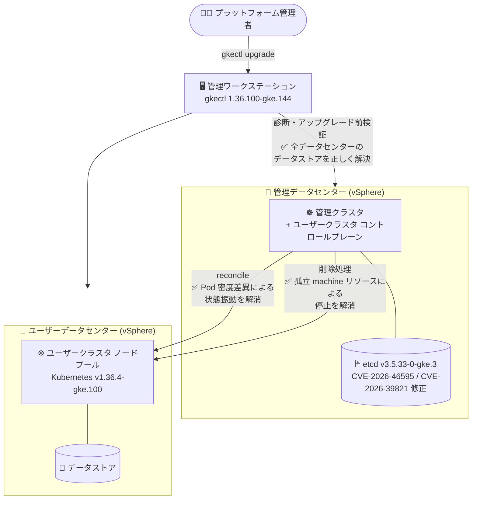

# Google Distributed Cloud (software only) for VMware: 1.36.100-gke.144 パッチリリース

**リリース日**: 2026-10-07

**サービス**: Google Distributed Cloud (software only) for VMware

**機能**: バージョン 1.36.100-gke.144 リリース (Announcement / Fixed)

**ステータス**: GA (パッチリリース)

📊 [このアップデートのインフォグラフィックを見る](https://takech9203.github.io/google-cloud-news-summary/20261007-gdc-vmware-1-36-100.html)

## 概要

2026 年 10 月 7 日、Google Distributed Cloud (software only) for VMware の新バージョン **1.36.100-gke.144** がダウンロード可能になりました。本バージョンは Kubernetes **v1.36.4-gke.100** 上で動作し、2026 年 8 月 25 日にリリースされた 1.36 系の初版 (1.36.0-gke.532) に対する最初のパッチリリースです。リリース後、GKE On-Prem API クライアント (Google Cloud コンソール、gcloud CLI、Terraform) で利用可能になるまでには約 7〜14 日かかります。

今回のリリースはバグ修正とセキュリティ修正が中心です。具体的には、(1) 管理クラスタとユーザークラスタの Pod 密度 (pod density) 設定が異なる場合にユーザークラスタが reconciling と running の状態を繰り返す問題、(2) etcd の脆弱性 (CVE-2026-46595、CVE-2026-39821)、(3) 分割データセンター構成での `gkectl diagnose` とアップグレード前検証における誤検知 (false-positive)、(4) クラスタ削除が terminating 状態のまま無期限に停止する問題、の 4 点が修正されています。

vSphere 上で Kubernetes クラスタをオンプレミス運用しているユーザー、特に管理クラスタとユーザークラスタでデータセンターを分離した構成 (split-data center architecture) を採用しているユーザーや、クラスタのライフサイクル操作 (アップグレード・削除) で問題に遭遇していたユーザーにとって重要なリリースです。サードパーティのストレージベンダーを使用している場合は、認定済みストレージパートナーの一覧を確認した上でアップグレードすることが推奨されます。

**アップデート前の課題**

- 管理クラスタとユーザークラスタの Pod 密度設定が異なる場合、ユーザークラスタが reconciling 状態と running 状態を交互に繰り返し、クラスタステータスが安定しなかった
- etcd に脆弱性 CVE-2026-46595 および CVE-2026-39821 が存在していた
- コントロールプレーンノードが管理データセンターに配置される分割データセンター構成において、`gkectl diagnose` によるクラスタ診断とアップグレード前検証が、実際には存在するデータストアに対して `datastore '<name>' not found` という誤検知エラーで失敗していた
- クラスタ削除時に孤立した (orphaned) machine リソースが原因で、削除処理が terminating 状態のまま無期限に停止することがあった

**アップデート後の改善**

- Pod 密度設定が管理クラスタと異なるユーザークラスタでも、状態の振動 (reconciling / running の繰り返し) が発生しなくなった
- etcd が v3.5.33-0-gke.3 に更新され、CVE-2026-46595 と CVE-2026-39821 が解消された
- 検証処理が、構成されたすべての vSphere データセンターを横断してデータストアを正しく解決するようになり、分割データセンター構成での誤検知が解消された
- 孤立した machine リソースが原因でクラスタ削除が停止する問題が修正され、削除処理が正常に完了するようになった
- このほか、[脆弱性修正ページ](https://docs.cloud.google.com/kubernetes-engine/distributed-cloud/vmware/docs/vulnerabilities)に記載された多数のセキュリティ脆弱性が修正された

## アーキテクチャ図



分割データセンター構成 (コントロールプレーンは管理データセンター、ノードプールはユーザーデータセンター) における今回の修正ポイントを示しています。`gkectl` の診断・検証がすべての vSphere データセンターのデータストアを正しく解決するようになり、管理クラスタによるユーザークラスタの reconcile と削除処理も安定しました。

## サービスアップデートの詳細

### 主要なアップデート内容

1. **バージョン 1.36.100-gke.144 の提供開始 (Announcement)**
   - Kubernetes v1.36.4-gke.100 上で動作する 1.36 系の最初のパッチリリース
   - リリース後、GKE On-Prem API クライアント (Google Cloud コンソール、gcloud CLI、Terraform) で利用可能になるまで約 7〜14 日
   - サードパーティストレージベンダー利用時は、認定済み[ストレージパートナー](https://docs.cloud.google.com/kubernetes-engine/enterprise/docs/resources/partner-storage)の一覧を要確認

2. **ユーザークラスタの状態振動の修正 (Fixed)**
   - 管理クラスタとユーザークラスタで Pod 密度設定が異なる場合に、ユーザークラスタが reconciling と running の状態を繰り返す問題を修正

3. **etcd のセキュリティ更新 (Fixed)**
   - etcd を v3.5.33-0-gke.3 に更新し、CVE-2026-46595 と CVE-2026-39821 に対応

4. **分割データセンター構成での検証誤検知の修正 (Fixed)**
   - `gkectl diagnose` によるクラスタ診断とアップグレード前検証が `datastore '<name>' not found` の誤検知で失敗する問題を修正
   - 修正後は、コントロールプレーンノードが管理データセンターに配置される分割データセンター構成でも、構成済みのすべての vSphere データセンターを横断してデータストアを正しく解決する

5. **クラスタ削除の停止問題の修正 (Fixed)**
   - 孤立した machine リソースが原因で、クラスタ削除が terminating 状態のまま無期限に停止する問題を修正

6. **脆弱性修正 (Fixed)**
   - 本リリースで対応したセキュリティ脆弱性の一覧は[脆弱性修正ページ](https://docs.cloud.google.com/kubernetes-engine/distributed-cloud/vmware/docs/vulnerabilities)を参照

## 技術仕様

### バージョン情報

| 項目 | 詳細 |
|------|------|
| GDC for VMware バージョン | 1.36.100-gke.144 |
| Kubernetes バージョン | v1.36.4-gke.100 |
| etcd バージョン | v3.5.33-0-gke.3 |
| ノードカーネル | 6.8.0-1048.52 (Ubuntu 24.04) / 6.6.143 (COS m117) |
| 1.36 系初版 | 1.36.0-gke.532 (2026-08-25 リリース) |
| GKE On-Prem API クライアント対応 | リリース後約 7〜14 日 (コンソール / gcloud CLI / Terraform) |

### 1.36 系のパッチ履歴

| リリース日 | パッチバージョン | Kubernetes バージョン |
|-----------|------------------|----------------------|
| 2026-10-07 | 1.36.100-gke.144 | v1.36.4-gke.100 |
| 2026-08-25 | 1.36.0-gke.532 | v1.36.0-gke.2800 |

## 設定方法

### 前提条件

1. 管理ワークステーションにアクセスできること
2. アップグレード対象クラスタが健全な状態であること (`gkectl diagnose cluster` で事前確認)
3. サードパーティストレージベンダー利用時は、対象バージョンの認定状況を確認済みであること

### 手順

#### ステップ 1: 管理ワークステーションのアップグレード

```bash
# gkeadm を対象バージョンに更新
gkeadm upgrade gkeadm --target-version 1.36.100-gke.144

# 管理ワークステーションをアップグレード
gkeadm upgrade admin-workstation --config admin-ws-config.yaml --info-file INFO_FILE
```

gkeadm で作成した管理ワークステーションの場合の手順です。ユーザー管理の場合は `gcloud storage cp gs://gke-on-prem-release/gkectl/1.36.100-gke.144/gkectl ./` で gkectl とバンドルを個別にダウンロードします。

#### ステップ 2: アップグレード前検証 (dry-run)

```bash
gkectl upgrade cluster \
  --kubeconfig ADMIN_CLUSTER_KUBECONFIG \
  --config USER_CLUSTER_CONFIG \
  --dry-run
```

`--dry-run` フラグによりアップグレードを開始せずにプリフライトチェックのみを実行できます。今回の修正により、分割データセンター構成でもデータストア検証が誤検知なく実行されます。

#### ステップ 3: ユーザークラスタのアップグレード

```bash
# ユーザークラスタ構成ファイルの gkeOnPremVersion を 1.36.100-gke.144 に設定した上で実行
gkectl upgrade cluster \
  --kubeconfig ADMIN_CLUSTER_KUBECONFIG \
  --config USER_CLUSTER_CONFIG \
  --async
```

`--async` フラグ (推奨) を使用すると、コマンドはアップグレードを開始後すぐに完了し、`gkectl list clusters` や `gkectl describe clusters` で進捗を確認できます。

## メリット

### ビジネス面

- **運用の安定性向上**: クラスタ状態の振動やクラスタ削除の停止といったライフサイクル操作の不具合が解消され、運用工数と障害対応の負荷が低減される
- **セキュリティリスクの低減**: etcd の CVE 2 件を含む多数の脆弱性修正により、オンプレミス Kubernetes 基盤のセキュリティ態勢が強化される

### 技術面

- **分割データセンター構成の信頼性向上**: `gkectl diagnose` とアップグレード前検証がすべての vSphere データセンターのデータストアを正しく解決するため、誤検知による検証失敗で作業がブロックされなくなる
- **削除処理の確実な完了**: 孤立した machine リソースの処理が改善され、クラスタ削除が terminating 状態で無期限に停止しなくなる
- **ステータス監視の正確性**: reconciling / running の状態振動が解消され、クラスタの実際の健全性をステータスから正しく判断できる

## デメリット・制約事項

### 制限事項

- GKE On-Prem API クライアント (Google Cloud コンソール、gcloud CLI、Terraform) からこのバージョンを利用できるようになるまで、リリース後約 7〜14 日かかる
- サードパーティストレージベンダーを使用している場合、ベンダーが本リリースの認定を完了しているか事前確認が必要

### 考慮すべき点

- マイナーバージョンをまたぐアップグレードは 1 つずつ順に行う必要があるため、1.35 以前からのアップグレードはアップグレードパスの計画が必要
- 1.36 系では vSphere 9.0 / 9.1 がサポート対象であり、vSphere 7.0 のサポートは削除されている (1.36.0 時点の変更)。アップグレード前に vSphere 環境のバージョンを確認すること
- アップグレード前に `gkectl diagnose cluster` でクラスタの健全性を確認し、問題を解消しておくことが推奨される

## ユースケース

### ユースケース 1: 分割データセンター構成でのアップグレード検証の正常化

**シナリオ**: コントロールプレーンノードを管理データセンターに、ユーザークラスタのノードプールを別のデータセンターに配置する分割データセンター構成を採用している。これまで `gkectl diagnose` やアップグレード前検証が `datastore not found` の誤検知で失敗し、検証をスキップするか手動で切り分ける必要があった。

**実装例**:
```bash
gkectl diagnose cluster \
  --kubeconfig ADMIN_CLUSTER_KUBECONFIG \
  --cluster-name USER_CLUSTER_NAME
```

**効果**: 検証がすべての構成済み vSphere データセンターを横断してデータストアを解決するため、誤検知なしで診断・検証を完了でき、検証スキップに伴うリスクを回避できる。

### ユースケース 2: etcd 脆弱性対応としての計画的パッチ適用

**シナリオ**: セキュリティポリシー上、CVE が公表されたコンポーネントは一定期間内にパッチ適用が必要な組織で、オンプレミスの GDC for VMware クラスタの etcd に CVE-2026-46595 / CVE-2026-39821 が存在する。

**効果**: 1.36.100-gke.144 へのアップグレードにより etcd が v3.5.33-0-gke.3 に更新され、2 件の CVE とその他の脆弱性修正を一括で適用できる。コンプライアンス要件を満たしつつ、同時にライフサイクル操作のバグ修正も取り込める。

### ユースケース 3: クラスタ削除が停止する環境の復旧

**シナリオ**: 検証環境のユーザークラスタを削除したところ、孤立した machine リソースが原因で terminating 状態のまま削除が完了せず、vSphere リソースが解放されない。

**効果**: 本バージョンでは削除処理が孤立 machine リソースによって停止しなくなり、クラスタ削除が確実に完了する。検証環境の作成・破棄サイクルを自動化している場合も、パイプラインの停止を防げる。

## 料金

Google Distributed Cloud (software only) for VMware は GKE Enterprise のライセンス体系で提供されます。本リリース自体による料金変更はありません。詳細は料金ページを参照してください。

- [Google Distributed Cloud (software only) の料金](https://cloud.google.com/kubernetes-engine/pricing)

## 利用可能リージョン

オンプレミス (vSphere 環境) で動作するソフトウェアのため、リージョンの制約はありません。ダウンロード提供は即時開始されており、GKE On-Prem API クライアント (コンソール、gcloud CLI、Terraform) からの利用はリリース後約 7〜14 日で可能になります。

## 関連サービス・機能

- **GKE On-Prem API (Google Cloud コンソール / gcloud CLI / Terraform)**: クラスタのライフサイクル管理をクラウド側から行うためのクライアント。本バージョンは約 7〜14 日後に利用可能
- **GKE Enterprise**: GDC (software only) for VMware を含むハイブリッド/マルチクラウド Kubernetes 管理プラットフォーム。フリート管理や構成管理と組み合わせて利用
- **Google Distributed Cloud (software only) for bare metal**: VMware 環境ではなくベアメタル上で動作する姉妹製品。同様のバージョン体系でリリースされる
- **Cloud Logging / Cloud Monitoring**: オンプレミスクラスタのログ・メトリクスを Google Cloud 側で集約・監視する際に連携

## 参考リンク

- 📊 [インフォグラフィック](https://takech9203.github.io/google-cloud-news-summary/20261007-gdc-vmware-1-36-100.html)
- [公式リリースノート (Google Cloud 全体)](https://docs.cloud.google.com/release-notes#October_07_2026)
- [GDC for VMware リリースノート](https://docs.cloud.google.com/kubernetes-engine/distributed-cloud/vmware/docs/release-notes#October_07_2026)
- [クラスタのアップグレード手順](https://docs.cloud.google.com/kubernetes-engine/distributed-cloud/vmware/docs/how-to/upgrading)
- [バージョン履歴 (Versioning)](https://docs.cloud.google.com/kubernetes-engine/distributed-cloud/vmware/docs/version-history)
- [脆弱性修正ページ](https://docs.cloud.google.com/kubernetes-engine/distributed-cloud/vmware/docs/vulnerabilities)
- [認定済みストレージパートナー](https://docs.cloud.google.com/kubernetes-engine/enterprise/docs/resources/partner-storage)
- [料金ページ (GKE / GKE Enterprise)](https://cloud.google.com/kubernetes-engine/pricing)

## まとめ

1.36.100-gke.144 は、etcd の CVE 2 件への対応と、クラスタの状態振動・検証誤検知・削除停止という運用に直結する 4 件のバグ修正を含む、1.36 系最初のパッチリリースです。特に分割データセンター構成を採用している環境や、1.36.0 でライフサイクル操作の問題に遭遇していた環境では、早期の適用が推奨されます。アップグレード前には `gkectl diagnose cluster` と `--dry-run` によるプリフライトチェックでクラスタの健全性を確認してください。

---

**タグ**: Google Distributed Cloud, GDC for VMware, GKE On-Prem, Kubernetes, vSphere, パッチリリース, セキュリティ, etcd, CVE-2026-46595, CVE-2026-39821
