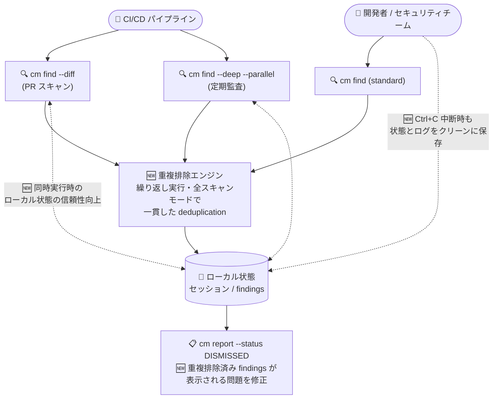

# Gemini Enterprise Agent Platform: CodeMender v0.13.0 リリース (検出結果の重複排除の一貫性向上とバグ修正)

**リリース日**: 2026-10-07

**サービス**: Gemini Enterprise Agent Platform (CodeMender)

**機能**: CodeMender v0.13.0 アップデート (検出結果の重複排除の一貫性向上、DISMISSED レポートの修正、同時スキャン時のローカル状態の信頼性向上、ストリーミングエラー処理の改善、セッション中断時の状態保存)

**ステータス**: Fixed (CodeMender は Preview)

📊 [このアップデートのインフォグラフィックを見る](https://takech9203.github.io/google-cloud-news-summary/20261007-gemini-enterprise-agent-platform-codemender-v0-13-0.html)

## 概要

Gemini Enterprise Agent Platform 上のコードセキュリティエージェント **CodeMender** の v0.13.0 がリリースされました。CodeMender は Google DeepMind が開発した自律型 AI セキュリティエージェントで、CLI (`cm`) を通じてコードベースの脆弱性スキャン (`cm find`)、PoC エクスプロイト実行による検証 (`cm verify`)、自動修正 (`cm fix`) を提供します。

v0.13.0 は、v0.12.0 (2026-10-05) で導入された重複検出修正をさらに発展させた信頼性強化リリースです。standard・`--deep`・`--diff`・`--parallel` の各スキャンモードを繰り返し実行した際の検出結果 (findings) の重複排除 (deduplication) の一貫性が向上したほか、`cm report --status DISMISSED` に重複排除済みの検出結果が表示される問題の修正、`cm find --diff` と `cm find --deep` を同時実行した際のローカル状態の信頼性向上、リトライ不能なストリーミングエラーの即時失敗化、`Ctrl+C` によるセッション中断時のローカルセッション状態・ログのクリーンな保存といったバグ修正が含まれています。

CodeMender を CI/CD パイプライン (PR ごとの `--diff` スキャン) と定期監査 (ナイトリーの `--deep` スキャン) の両方で並行運用しているセキュリティチーム・プラットフォームチームにとって、スキャン結果の集計精度とパイプラインの安定性を高める重要なメンテナンスアップデートです。

**アップデート前の課題**

- `cm find` を繰り返し実行したり、standard・`--deep`・`--diff`・`--parallel` といった異なるスキャンモードを併用したりすると、検出結果の重複排除の挙動が一貫せず、同一の脆弱性が重複して集計される可能性があった
- 重複排除済みの検出結果が `cm report --status DISMISSED` の出力に表示されてしまい、却下 (DISMISSED) 済み項目のトリアージにノイズが混入していた
- `cm find --diff` と `cm find --deep` を同時に実行すると、ローカル状態 (セッション・検出結果ストア) の信頼性に問題が生じることがあった
- ストリーミングエラーの処理で、リトライしても成功しない (non-retryable) エラーに対してもリトライが行われ、失敗の確定までに不要な待ち時間とリソース消費が発生していた
- 実行中のセッションを `Ctrl+C` で中断すると、ローカルセッション状態とログが正しく保存されないことがあった

**アップデート後の改善**

- 繰り返しの `cm find` 実行、および `--deep`・`--diff`・`--parallel` の各スキャンモード間で、検出結果の重複排除が一貫して行われるようになった
- 重複排除済みの検出結果が `cm report --status DISMISSED` に表示されなくなり、却下済み項目のレポートが正確になった
- `cm find --diff` と `cm find --deep` の同時実行時におけるローカル状態の信頼性が向上し、CI/CD と定期監査の並行運用が安定した
- ストリーミングエラー処理が更新され、リトライ不能なエラーはリトライせず即時に失敗するようになり、エラーの検知と対処が迅速になった
- セッションを `Ctrl+C` で中断しても、ローカルセッション状態とログがクリーンに保存されるようになり、`cm session resume` やトラブルシューティングでの状態欠損がなくなった

## アーキテクチャ図



CodeMender v0.13.0 の改善点 (🆕) を示しています。複数のスキャンモードからの検出結果が一貫して重複排除され、`--diff` と `--deep` の同時実行やセッション中断時にもローカル状態が確実に保全されます。

## サービスアップデートの詳細

### 主要機能

1. **検出結果の重複排除の一貫性向上 (Consistent finding deduplication)**
   - `cm find` の繰り返し実行、および `--deep`・`--diff`・`--parallel` の各スキャンモードをまたいで、検出結果の重複排除が一貫して行われるようになった
   - v0.12.0 で修正された `cm report` / `cm stats` の重複検出問題を発展させ、「同じリポジトリを異なるモードで繰り返しスキャンする」実運用パターンでの集計精度を強化
   - 同一の脆弱性が複数回カウントされることによるレポートの水増しや、トリアージの二重作業を防止

2. **`cm report --status DISMISSED` の修正**
   - 重複排除済みの検出結果が `cm report --status DISMISSED` の出力に表示されてしまう問題を修正
   - DISMISSED は誤検知や修正済み、確信度不足などの理由で非アクティブ化された検出結果の状態であり、却下済み項目の棚卸しやレビューがノイズなく行えるようになった

3. **同時スキャン時のローカル状態の信頼性向上**
   - `cm find --diff` と `cm find --deep` を同時に実行した際のローカル状態 (セッション・検出結果の保存) の信頼性を改善
   - PR トリガーの `--diff` スキャンとスケジュール実行の `--deep` スキャンが同一環境で重なっても、状態の不整合が起きにくくなった

4. **ストリーミングエラー処理の改善**
   - リトライ不能 (non-retryable) なエラーに対してリトライを行わず、即時に失敗するようにストリーミングエラー処理を更新
   - 無駄なリトライによる待ち時間を排除し、CI/CD でのエラー検知とフェイルファストな対処が可能になった

5. **セッション中断時のクリーンな状態保存**
   - セッションを `Ctrl+C` で中断した場合でも、ローカルセッション状態とログがクリーンに保存されるようになった
   - 中断後の `cm session resume` によるセッション再開や、ログを用いたトラブルシューティングの信頼性が向上

## 技術仕様

### v0.13.0 の主な変更点

| 項目 | 変更前 | 変更後 (v0.13.0) |
|------|--------|------------------|
| 検出結果の重複排除 | 繰り返し実行・スキャンモード間で一貫しない場合があった | 繰り返しの `cm find`、`--deep`、`--diff`、`--parallel` で一貫した重複排除 |
| `cm report --status DISMISSED` | 重複排除済みの検出結果が表示されることがあった | 重複排除済みの検出結果は表示されない |
| `--diff` と `--deep` の同時実行 | ローカル状態の信頼性に問題が生じることがあった | ローカル状態の信頼性が向上 |
| ストリーミングエラー処理 | リトライ不能なエラーもリトライしていた | リトライ不能なエラーは即時に失敗 |
| `Ctrl+C` によるセッション中断 | セッション状態・ログが保存されないことがあった | 状態とログをクリーンに保存 |

### CodeMender の検出結果ステータス (参考)

| ステータス | 意味 |
|-----------|------|
| OPEN | スキャンで検出された (またはサードパーティツールから取り込まれた) が、未検証・未修正の状態。`cm verify` / `cm fix` のキュー対象 |
| FIXED | パッチが生成・適用され、検証テストによりエクスプロイトが成立しないことが確認された状態 |
| DISMISSED | 誤検知・修正済み・確信度不足などの理由で非アクティブ化された状態。今後のアラートはミュートされる (v0.13.0 で重複排除済み findings の混入を修正) |
| REOPENED | FIXED / DISMISSED だった脆弱性が再スキャンで再検出された状態 (リグレッションの兆候) |

### cm find のスキャンモード (参考)

| モード | コマンド | 対象範囲 | 主な用途 |
|--------|----------|----------|----------|
| Standard | `cm find PATH` | 指定ディレクトリ | ローカルでの探索的チェック |
| Diff | `cm find PATH --diff[=REF]` | 変更ファイル + 依存ファイル (呼び出し元・先) | PR の CI/CD パイプライン、pre-commit フック |
| Deep | `cm find PATH --deep` | リポジトリ全体 (並列ワーカー、`--deep-workers` 1〜16) | 定期監査、リリース前監査、コンプライアンス |

## 設定方法

### 前提条件

1. Google Cloud プロジェクトで必要な API と IAM ロール (`roles/aiplatform.user` など) をセットアップ済みであること
2. CodeMender CLI バイナリをダウンロード・インストールし、`cm init` を実行済みであること
3. Application Default Credentials (ADC) で認証を構成済みであること

### 手順

v0.13.0 の改善は CLI の内部動作の修正であり、追加の設定は不要です。以下は改善が反映される代表的な運用コマンドです。

#### ステップ 1: 複数モードでの繰り返しスキャン

```bash
# PR の変更分をスキャン (CI/CD)
cm find . --diff=origin/main --fail-on=CRITICAL,HIGH

# リポジトリ全体の定期監査 (ナイトリー)
cm find . --deep --deep-workers=8
```

v0.13.0 では、これらのスキャンを繰り返し・並行して実行しても検出結果が一貫して重複排除され、`--diff` と `--deep` が同時に動いてもローカル状態の信頼性が保たれます。

#### ステップ 2: 却下済み検出結果の確認

```bash
# DISMISSED の検出結果のみを表示 (v0.13.0 で重複排除済み findings の混入を修正)
cm report --status DISMISSED

# アクティブな検出結果の確認
cm report --status OPEN
```

#### ステップ 3: セッションの中断と再開

```bash
# 実行中のスキャンを Ctrl+C で中断しても、状態とログはクリーンに保存される
cm find . --deep
# (Ctrl+C で中断)

# 保存されたセッションから再開
cm session resume
```

## メリット

### ビジネス面

- **レポートの正確性向上**: 検出結果の重複がなくなることで、脆弱性件数の KPI や監査レポート (SOC 2、ISO 27001 など向け) の信頼性が高まる
- **トリアージ工数の削減**: DISMISSED レポートから重複排除済み項目のノイズが除去され、同一脆弱性の二重トリアージも防止されるため、セキュリティチームの運用負荷が下がる

### 技術面

- **CI/CD と定期監査の安全な並行運用**: `--diff` (PR ゲート) と `--deep` (ナイトリー監査) が同一環境で同時実行されてもローカル状態が壊れにくくなり、パイプライン設計の自由度が上がる
- **フェイルファストなエラー処理**: リトライ不能なストリーミングエラーが即時失敗するため、CI/CD でのエラー検知が早まり、無駄な実行時間を削減できる
- **中断に強いセッション管理**: `Ctrl+C` での中断後も状態とログが保全されるため、`cm session resume` による再開や事後解析が確実に行える

## デメリット・制約事項

### 制限事項

- CodeMender は Preview (Pre-GA) 段階であり、Pre-GA Offerings Terms が適用される。商用・本番目的での利用は不可で、限定的なテスト・評価用途に限られる
- スキャン対象は自身が所有・利用許諾を持つコード、または OSI 承認ライセンスの OSS に限定される

### 考慮すべき点

- 重複排除ロジックの一貫性向上により、過去バージョンと比較すると `cm report` / `cm stats` の検出結果件数が減少して見える場合がある。件数を KPI として追跡している場合は、v0.13.0 適用タイミングを記録しておくとよい
- リトライ不能エラーが即時失敗するようになったため、CI/CD パイプライン側でエラー時の通知・リカバリ処理 (再実行ポリシーなど) を整備しておくことが望ましい

## ユースケース

### ユースケース 1: PR スキャンとナイトリー監査の並行運用

**シナリオ**: PR ごとに `cm find --diff` を実行しつつ、夜間に `cm find --deep --parallel` でリポジトリ全体を監査している。従来は両者が重なった際にローカル状態の信頼性に問題が生じたり、繰り返しスキャンで検出結果が重複したりしていた。

**実装例**:
```bash
# PR トリガー (CI/CD)
cm find . --diff=origin/main --format=sarif --output=results.sarif --fail-on=CRITICAL,HIGH

# ナイトリー (スケジュール実行)
cm find . --deep --deep-workers=8 --output deep-scan-report.json
```

**効果**: v0.13.0 により同時実行時のローカル状態が安定し、スキャンモードをまたいだ検出結果の重複排除が一貫するため、両パイプラインの結果を安心して統合・集計できる。

### ユースケース 2: 却下済み検出結果の定期棚卸し

**シナリオ**: セキュリティチームが四半期ごとに `cm report --status DISMISSED` で却下済みの検出結果をレビューし、却下判断の妥当性を再確認している。従来は重複排除済みの findings が混入し、レビュー対象の件数が水増しされていた。

**効果**: DISMISSED レポートに本来の却下済み項目のみが表示されるようになり、棚卸しレビューの対象が正確になって作業時間が短縮される。

### ユースケース 3: 長時間スキャンの安全な中断・再開

**シナリオ**: 大規模リポジトリの `--deep` スキャン実行中に、緊急のメンテナンスでスキャンを `Ctrl+C` で中断する必要が生じた。従来はセッション状態やログが保存されず、スキャンを最初からやり直すことがあった。

**効果**: v0.13.0 では中断時もセッション状態とログがクリーンに保存されるため、`cm session resume` で中断地点から再開でき、トークン消費と時間の無駄を抑えられる。

## 料金

CodeMender の利用はトークン使用量に基づいて課金されます。v0.13.0 は信頼性向上のメンテナンスリリースであり、料金体系の変更はありません。なお、リトライ不能なエラーの即時失敗化により、無駄なリトライに伴うリソース消費が抑えられます。

詳細な料金は公式料金ページを参照してください。

- [Gemini Enterprise Agent Platform の料金](https://cloud.google.com/gemini-enterprise-agent-platform/generative-ai/pricing)
- [Cloud Billing レポートの表示](https://docs.cloud.google.com/billing/docs/how-to/reports)

## 利用可能リージョン

CodeMender はグローバルに利用可能です (公式ドキュメント「Supported regions」より)。

## 関連サービス・機能

- **Gemini Enterprise Agent Platform**: CodeMender をホストするエージェント基盤。モデル (Gemini 3.8 Flash など) の選択やガバナンス、課金が統合されている。同日のリリースノートでは Model Garden への Anthropic Claude Haiku 5.5 追加も発表されている
- **Google AI Threat Defense**: CodeMender が主要なコードセキュリティエージェントとして組み込まれる自律型セキュリティプラットフォーム
- **GitHub Code Scanning / Cloud Build**: `cm find --diff` の SARIF 出力 (v2.1.0) を取り込み、PR 上の脆弱性アノテーションやビルドゲートとして活用可能
- **Cloud Billing**: CodeMender のトークン使用量に基づく課金レポート・コスト傾向の確認に使用

## 参考リンク

- 📊 [インフォグラフィック](https://takech9203.github.io/google-cloud-news-summary/20261007-gemini-enterprise-agent-platform-codemender-v0-13-0.html)
- [公式リリースノート (October 07, 2026)](https://docs.cloud.google.com/release-notes#October_07_2026)
- [Google Cloud Blog: Find and fix software vulnerabilities with CodeMender](https://cloud.google.com/blog/products/identity-security/find-and-fix-software-vulnerabilities-with-codemender)
- [CodeMender ドキュメント](https://docs.cloud.google.com/gemini-enterprise-agent-platform/agents/codemender)
- [CodeMender: スキャンモード (find modes)](https://docs.cloud.google.com/gemini-enterprise-agent-platform/agents/codemender/find-modes)
- [CodeMender: セッションとレポートの管理](https://docs.cloud.google.com/gemini-enterprise-agent-platform/agents/codemender/manage-sessions)
- [CodeMender: CI/CD との統合](https://docs.cloud.google.com/gemini-enterprise-agent-platform/agents/codemender/integrate-with-cicd)
- [前回レポート: CodeMender v0.12.0 (2026-10-05)](https://github.com/takech9203/google-cloud-news-summary/blob/main/reports/2026/2026-10-05-gemini-enterprise-agent-platform-codemender-v0-12-0.md)
- [料金ページ](https://cloud.google.com/gemini-enterprise-agent-platform/generative-ai/pricing)

## まとめ

CodeMender v0.13.0 は、v0.12.0 の重複検出修正をさらに推し進め、全スキャンモードにわたる検出結果の重複排除の一貫性と、同時スキャン・セッション中断時のローカル状態の信頼性を高めるメンテナンスリリースです。PR ゲートの `--diff` スキャンと定期監査の `--deep` スキャンを並行運用しているチームは、v0.13.0 への更新により集計精度とパイプラインの安定性が向上するため、早期の適用と `cm report --status DISMISSED` による却下済み項目の棚卸しの再実施を推奨します。

---

**タグ**: #GeminiEnterpriseAgentPlatform #CodeMender #Security #VulnerabilityScanning #AIAgent #DevSecOps #Preview
