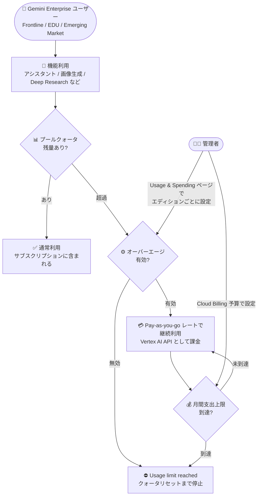

# Gemini Enterprise: Frontline / EDU / Emerging Market エディションでクォータ超過時の Pay-as-you-go 利用が可能に

**リリース日**: 2026-10-07

**サービス**: Gemini Enterprise

**機能**: Pay-as-you-go usage above quota (超過利用) の対象エディション拡大

**ステータス**: 一般提供 (GA)

📊 [このアップデートのインフォグラフィックを見る](https://takech9203.github.io/google-cloud-news-summary/20261007-gemini-enterprise-payg-overage-editions.html)

## 概要

Gemini Enterprise の「Pay-as-you-go usage above quota (クォータ超過時の従量課金利用、以下オーバーエージ)」が、追加のライセンスベース エディションで有効化できるようになりました。今回新たに対象となったのは、**Frontline エディション** (Frontline Starter、Frontline Worker)、**EDU エディション** (EDU、EDU Pro)、**Emerging Market エディション** (Standard Emerging Market、EDU Emerging、EDU Pro Emerging、EDU Gov Emerging) です。

請求書払い (invoiced) の Cloud Billing アカウントと有効なサブスクリプションを持つプロジェクトでオーバーエージを有効にすると、ユーザーはプールされたクォータ上限に到達した後も、従量課金レートで Gemini Enterprise の機能を中断なく使い続けられます。これまでオーバーエージは Standard、Plus、Standard Emerging Market エディションに限られていましたが、今回の拡大により、現場従業員向け (Frontline) や教育機関向け (EDU)、新興国市場向け (Emerging Market) のライセンスを導入している組織でも、クォータ到達による業務停止を回避できるようになります。

特に Frontline や EDU 系のエディションは、Standard / Plus と比べてプールクォータが小さく設定されているため (例: Frontline Starter はアシスタント 20 クエリ/日・ユーザー)、繁忙期や試験期間などの利用ピーク時にクォータに到達しやすい構造でした。本アップデートは、こうした組織の管理者にとって重要なコスト・可用性管理の選択肢となります。

**アップデート前の課題**

- オーバーエージ (クォータ超過時の従量課金利用) は Standard、Plus、Standard Emerging Market エディションのみでサポートされており、Frontline や EDU 系エディションでは利用できなかった
- Frontline / EDU / Emerging Market エディションのプロジェクトでは、プールクォータに到達すると該当機能の利用が停止し、クォータがリセットされるまで待つか、上位エディションへの移行やライセンス追加を検討する必要があった
- クォータの小さいエディションほど利用ピーク時に「Usage limit reached」エラーが発生しやすく、現場業務や授業での利用が中断されるリスクがあった

**アップデート後の改善**

- Frontline Starter / Frontline Worker、EDU / EDU Pro、Standard Emerging Market / EDU Emerging / EDU Pro Emerging / EDU Gov Emerging の各エディションでもオーバーエージを有効化できるようになった
- プールクォータ到達後も従量課金レートで機能を継続利用でき、業務や授業の中断を回避できるようになった
- これにより、ライセンスベースの全エディション (Standard、Plus、Frontline、EDU、Emerging Market) でオーバーエージがサポートされ、エディション間で一貫したコスト管理が可能になった

## アーキテクチャ図



クォータ超過時の動作フローを示しています。管理者がエディションごとにオーバーエージを有効化すると、プールクォータ到達後も従量課金で利用が継続され、Cloud Billing の月間支出上限で課金の上振れを制御できます。

## サービスアップデートの詳細

### 主要機能

1. **対象エディションの拡大**
   - Frontline エディション: Frontline Starter、Frontline Worker
   - EDU エディション: EDU、EDU Pro
   - Emerging Market エディション: Standard Emerging Market、EDU Emerging、EDU Pro Emerging、EDU Gov Emerging
   - 既存の Standard、Plus と合わせ、ライセンスベースの全エディションでオーバーエージが利用可能に

2. **クォータ超過時の継続利用**
   - プロジェクト・ロケーション単位でプールされた機能クォータ (アシスタント クエリ数、画像/動画生成、Deep Research など) に到達した後も、従量課金レートで利用を継続
   - ストレージ + データインデックスのクォータ超過は、オーバーエージの有効化状態にかかわらず自動的に超過課金が発生する点に注意 (全エディションでプロジェクト・ロケーション単位の共有プール)

3. **支出管理機能との連携**
   - Cloud Billing の予算機能でプロジェクト月間支出上限 (spend limit) を設定可能。上限到達時はオーバーエージ利用が自動停止
   - 予算のスコープには Vertex AI (`aiplatform.googleapis.com`) を指定 (Gemini Enterprise と AI 開発者ツールの超過分は Vertex AI API として課金されるため)
   - 予算アラート (50%、80%、100% など) による メール通知を構成可能

## 技術仕様

### オーバーエージの前提条件

| 項目 | 詳細 |
|------|------|
| 課金アカウント | 請求書払い (invoiced) の Cloud Billing アカウントが必須 |
| サブスクリプション | 有効な非無料トライアルのサブスクリプションが 1 つ以上必要 (無料トライアルはオーバーエージ対象外) |
| 対象エディション | Standard、Plus、Frontline Starter / Worker、EDU / EDU Pro、Emerging Market 各エディション |
| 必要なロール | Gemini Enterprise Administrator (`discoveryengine.agentspaceAdmin`) |
| 設定単位 | エディションごとに個別に有効化/無効化 |
| Pay-as-you-go エディション | 対象外 (もともとクォータ制限なしの従量課金のため) |

### 今回対象となったエディションの主なプールクォータ (ユーザーあたり/日、プロジェクト・ロケーション単位でプール)

| 機能 | Frontline Starter | Frontline Worker | EDU | EDU Pro |
|------|-------------------|------------------|-----|---------|
| ストレージ + データインデックス | 2 GiB | 2 GiB | 5 GiB | 50 GiB |
| アシスタント | 20 クエリ/日 | 40 クエリ/日 | 40 クエリ/日 | 200 クエリ/日 |
| エージェント作成 (ノーコード) | n/a | n/a | 1 件/日 | 10 件/日 |
| 動画生成 | n/a | 1 件/日 | 1 件/日 | 3 件/日 |
| 画像生成 | n/a | 2 枚/日 | 2 枚/日 | 10 枚/日 |
| Deep Research | n/a | 1 件/日 | 1 件/日 | 10 件/日 |

## 設定方法

### 前提条件

1. 請求書払いの Cloud Billing アカウントにプロジェクトがリンクされていること (アカウント種別は [課金サイクルの確認ページ](https://docs.cloud.google.com/billing/docs/how-to/billing-cycle#view-your-charging-cycle)で確認)
2. 対象エディションの有効な非無料トライアル サブスクリプションが 1 つ以上あること
3. Gemini Enterprise Administrator ロールを持っていること

### 手順

#### ステップ 1: オーバーエージの有効化

1. Google Cloud コンソールで **Gemini Enterprise > Usage & Spending** ページに移動
2. **Usage** タブを選択
3. ティア選択バナーの **Choose another tier** プルダウンから設定対象のエディションを選択 (エディションごとに個別設定が必要)
4. **Feature usage > Pay-as-you-go usage above quota** のトグルを **Enabled** に切り替え
5. **Save changes** をクリックし、確認ダイアログで **Got it** をクリック

#### ステップ 2: 月間支出上限の設定 (推奨)

1. 同じ **Usage & Spending > Usage** タブの **Project monthly spend limit** セクションで **Set limit** をクリック
2. Cloud Billing で予算と支出上限アクションを構成。予算のスコープとして **Vertex AI (`aiplatform.googleapis.com`)** をサービスリストから選択
3. 必要に応じてアラートしきい値 (50% / 80% / 100% など) と通知先を設定

支出上限は Gemini Enterprise アプリ、Gemini Enterprise Agent Platform、AI コーディングツール (Antigravity など) を横断して適用されます。

## メリット

### ビジネス面

- **業務・授業の継続性**: 現場従業員 (Frontline) や学生・教職員 (EDU) の利用がクォータ到達で突然止まることがなくなり、ピーク時でも業務や授業を継続できる
- **ライセンスコストの最適化**: ピーク利用に合わせて上位エディションや追加ライセンスを購入する代わりに、超過分だけを従量課金で支払う選択が可能になる
- **全エディションで一貫した運用**: 複数エディションを併用する組織でも、同じオーバーエージ/支出管理の仕組みで統一的にコスト管理できる

### 技術面

- **エディション単位のきめ細かい制御**: オーバーエージはエディションごとに個別に有効化/無効化でき、対象を絞った適用が可能
- **Cloud Billing との統合**: 月間支出上限と予算アラートにより、課金の上振れを自動的に抑止・検知できる
- **利用状況の可視化**: Usage & Spending ページでプールクォータの消費状況、Pay-as-you-go 利用量、課金トレンドを確認できる

## デメリット・制約事項

### 制限事項

- 請求書払い (invoiced) の Cloud Billing アカウント限定。セルフサービス (クレジットカード払い) アカウントでは利用できない
- 無料トライアル サブスクリプションはオーバーエージの対象外 (基本プールクォータのみ利用可能)
- Emerging Market エディションは対象顧客が限定されており、利用には Google アカウントチームによる適格性評価が必要
- Gemini Notebook Enterprise の利用クォータなど、一部機能はオーバーエージの対象外 (n/a)

### 考慮すべき点

- **支出上限なしで有効化すると課金が無制限になる**: オーバーエージのみ有効にして支出上限を設定しない場合、クォータ超過後の利用はすべて従量課金され続ける。月間支出上限の設定を強く推奨
- 支出上限到達時の利用停止には数分かかる場合があり、上限をわずかに超えた課金が発生する可能性がある
- Gemini Enterprise アプリ自体はクォータ到達や超過課金開始を自動通知しない。Cloud Billing の予算アラートで通知を構成する必要がある
- ストレージ + データインデックスの超過は、オーバーエージ設定にかかわらず自動的に超過課金となる (保存期間に応じた日割り課金)

## ユースケース

### ユースケース 1: 小売業の繁忙期における Frontline Worker の継続利用

**シナリオ**: 小売チェーンが店舗スタッフに Frontline Worker ライセンスを配布し、接客マニュアル検索や在庫問い合わせにアシスタントを利用している。年末商戦ではアシスタントのプールクォータ (40 クエリ/日・ユーザー) を超過しがちで、営業時間中に利用が止まることが課題だった。

**実装例**:
```
1. Usage & Spending ページで Frontline Worker エディションを選択
2. Pay-as-you-go usage above quota を Enabled に設定
3. Cloud Billing で月間支出上限 (例: $500/月) と 80% アラートを設定
```

**効果**: 繁忙期もアシスタントが停止せず、超過分のみ従量課金。支出上限により想定外の課金を防止できる。

### ユースケース 2: 大学の試験期間における EDU エディションのピーク対応

**シナリオ**: 大学が学生に EDU ライセンス、教職員に EDU Pro ライセンスを提供している。レポート提出・試験期間には Deep Research や画像生成の利用が集中し、プールクォータに到達して「Usage limit reached」エラーが頻発していた。

**効果**: 試験期間のみオーバーエージを有効化することで、学生・教職員の利用を中断させずにピークを吸収。期間終了後はトグルを無効に戻すことで、平常時のコストをライセンス費用内に抑えられる。

## 料金

オーバーエージを有効にした場合、プールクォータ超過後の利用は従量課金 (Pay-as-you-go) レートで課金されます。課金は Vertex AI API (`aiplatform.googleapis.com`) として計上されます。

### 超過課金レート (ライセンスベース全エディション共通)

| 機能 | 超過課金レート |
|------|----------------|
| ストレージ + データインデックス | $5 / GiB / 月 (保存期間に応じた日割り) |
| アシスタント (クエリ) | [Agent Platform 料金](https://cloud.google.com/gemini-enterprise-agent-platform/generative-ai/pricing#cost-of-building-and-deploying-ai-models-in-agent-platform)に準拠 |
| ノーコード エージェント利用 | Agent Platform 料金に準拠 (基盤となるエージェント アクションに基づく) |
| 動画生成 / 画像生成 | Agent Platform 料金に準拠 |
| Deep Research | Agent Platform 料金に準拠 |
| AI 開発者ツール (Antigravity など) | Agent Platform 料金に準拠 |

例: ストレージの共有プールを 30 GiB 超過したデータを 30 日の月に 1 日だけ保存した場合、30 GiB / 30 日 × $5/GiB/月 = $5 の超過課金となります。

価格は米ドル (USD) 表示で、サポートサービスに応じた変動サポート料金が加算される場合があります。詳細は [Quotas and overages](https://docs.cloud.google.com/gemini/enterprise/docs/quotas-and-overages#overages) を参照してください。

## 関連サービス・機能

- **Cloud Billing**: 請求書払いアカウントの要件確認、月間支出上限 (予算 + spend cap)、予算アラート通知の構成に使用
- **Vertex AI**: Gemini Enterprise と AI 開発者ツールの超過課金は Vertex AI API として計上されるため、予算スコープやコストレポートで Vertex AI を指定する
- **Gemini Enterprise Agent Platform**: アシスタントや生成系機能の超過課金レートの基準となる料金体系を提供
- **Google Antigravity / AI 開発者ツール**: 月間支出上限の適用対象に含まれ、Gemini Enterprise アプリと合わせて横断的にコスト管理される
- **Model Armor**: Frontline / EDU / Emerging Market エディションでアシスタントと同等のクォータが適用されるセキュリティ機能

## 参考リンク

- 📊 [インフォグラフィック](https://takech9203.github.io/google-cloud-news-summary/20261007-gemini-enterprise-payg-overage-editions.html)
- [公式リリースノート](https://docs.cloud.google.com/release-notes#October_07_2026)
- [Quotas and overages](https://docs.cloud.google.com/gemini/enterprise/docs/quotas-and-overages)
- [Configure overages](https://docs.cloud.google.com/gemini/enterprise/docs/configure-overages)
- [Overview of overages and spend controls](https://docs.cloud.google.com/gemini/enterprise/docs/manage-costs-overview)
- [Gemini Enterprise 料金ページ](https://cloud.google.com/gemini-enterprise-agent-platform/generative-ai/pricing)

## まとめ

Frontline / EDU / Emerging Market エディションへのオーバーエージ対応拡大により、Gemini Enterprise のライセンスベース全エディションでクォータ到達による利用停止を回避できるようになりました。クォータの小さいエディションを導入している組織はピーク時の業務継続性が大きく向上する一方、有効化の際は月間支出上限と予算アラートの設定を必ずセットで行い、想定外の課金を防ぐことを推奨します。

---

**タグ**: Gemini Enterprise, Pay-as-you-go, オーバーエージ, クォータ, Frontline, EDU, Emerging Market, Cloud Billing, コスト管理
