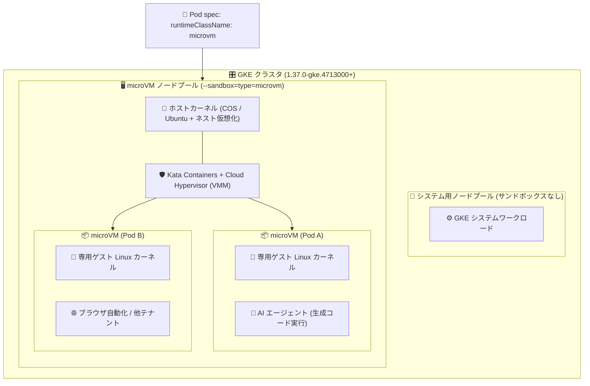

# Google Kubernetes Engine: GKE Sandbox の microVM サンドボックスタイプが GA

**リリース日**: 2026-10-07

**サービス**: Google Kubernetes Engine (GKE)

**機能**: GKE Sandbox - microVM サンドボックスタイプ

**ステータス**: Feature (GA - 一般提供)

📊 [このアップデートのインフォグラフィックを見る](https://takech9203.github.io/google-cloud-news-summary/20261007-gke-sandbox-microvm-ga.html)

## 概要

GKE Sandbox の microVM サンドボックスタイプが、バージョン 1.37.0-gke.4713000 以降のクラスタで一般提供 (GA) になりました。microVM サンドボックスは、信頼できないワークロード、AI エージェントランタイム、マルチテナント環境向けに、ハードウェア仮想化による強力な分離を提供します。

GKE の microVM サンドボックスは、オープンソースの Kata Containers と Cloud Hypervisor (仮想マシンモニター、VMM) を使用して実装されています。各 Pod は専用の軽量仮想マシン (microVM) 内で実行され、他の Pod やホストノードから厳格に分離されます。従来の gVisor サンドボックスがユーザー空間でシステムコールを再実装するアプローチであるのに対し、microVM は完全な Linux カーネルと標準的な Linux 機能をそのまま利用できるため、互換性と分離強度を両立できる点が特徴です。

特に、AI エージェントが生成したコードを無監督で実行するランタイムや、Puppeteer のようなブラウザ自動化ワークロード、完全な Linux カーネルへのアクセスを前提とするワークロードを安全に実行したい組織に適しています。

**アップデート前の課題**

- GKE Sandbox の主な選択肢は gVisor であり、ユーザー空間カーネルがサポートするシステムコールのサブセットしか利用できず、完全な Linux カーネル機能を必要とするワークロードは実行できなかった
- gVisor では特権コンテナ (privileged containers) がサポートされておらず、特権が必要なワークロードをサンドボックス化できなかった
- 大量の低オーバーヘッドなシステムコール (多数の小さな I/O 操作など) を発行するワークロードでは、gVisor のシステムコールインターセプトによる性能影響が課題になり得た
- AI エージェントが生成した任意のコードを実行するような高リスクのワークロードに対して、ハードウェアレベルの分離境界を GKE のマネージド機能として利用する手段が GA ではなかった

**アップデート後の改善**

- Pod ごとに専用のゲストカーネルを持つ microVM によるハードウェア仮想化分離が、GA 品質 (本番 SLA 対象) で利用可能になった
- 完全な Linux カーネルと標準的な Linux 機能をサンドボックス内で利用できるため、既存ワークロードの互換性を保ったまま分離を強化できる
- 特権コンテナがサポートされ、特権は microVM 内のゲスト OS に対する root 権限に限定される (ホストノードには及ばない)
- ノードイメージとして Container-Optimized OS に加えて Ubuntu もサポートされる (gVisor は COS のみ)
- ComputeClass による ノード自動作成 (node pool auto-creation) と組み合わせて、microVM 対応ノードを宣言的にプロビジョニングできる

## アーキテクチャ図



Pod specification で `runtimeClassName: microvm` を指定すると、GKE は Kata Containers と Cloud Hypervisor を使って Pod ごとに専用のゲストカーネルを持つ microVM を作成し、ホストノードおよび他の Pod からハードウェア仮想化レベルで分離します。

## サービスアップデートの詳細

### 主要機能

1. **ハードウェア仮想化による Pod 単位の分離**
   - 各 Pod が独自の microVM 内で動作し、専用のゲスト Linux カーネルを持つ
   - サンドボックス内のコンテナが侵害されても、影響は microVM 内に限定され、ホストカーネルや他 Pod への到達が困難になる

2. **完全な Linux カーネルの提供**
   - gVisor のようなシステムコールのサブセットではなく、標準的な Linux 機能を含む完全なカーネルを利用可能
   - 特権コンテナをサポート。特権はゲスト OS に対する root 権限に限定され、ホストノードには及ばない

3. **Kata Containers + Cloud Hypervisor ベース**
   - オープンソースの Kata Containers と Cloud Hypervisor (VMM) により microVM を作成・管理
   - `kubectl exec POD_NAME -- cat /sys/class/dmi/id/product_name` の出力が `cloud-hypervisor` であることで、microVM 内での実行を検証できる

4. **ComputeClass / ノードプール両対応のプロビジョニング**
   - 手動ノードプール作成 (gcloud CLI / GKE API) に加え、ComputeClass の `nodePoolConfig.sandbox.type: microvm` と `priorityDefaults.enableNestedVirtualization: true` によるノード自動作成に対応

## 技術仕様

### gVisor と microVM の比較

| 項目 | gVisor | microVM |
|------|--------|---------|
| カーネルアクセス | Linux システムコールのサブセット | 完全な Linux カーネル |
| 分離レベル | ユーザー空間カーネルによるシステムコールインターセプト | 専用ゲストカーネルによる完全なハードウェア仮想化 |
| CPU/メモリオーバーヘッド | 動的 (ベースメモリは低い) | Pod ごとに固定で 250 mCPU + 130 MiB |
| 起動時間 | 200 ms 未満 | 約 1〜2 秒 |
| ノード構成 | 任意の Standard ノードプール / Autopilot (Autopilot ではデフォルト有効) | ネスト仮想化を有効化したノードのみ |
| ノードイメージ | Container-Optimized OS のみ | Container-Optimized OS または Ubuntu |
| マシンタイプ | ほとんどの CPU、Arm、アクセラレータ対応 | ネスト仮想化をサポートするマシンタイプのみ |
| アクセラレータ | 特定の GPU モデル / TPU バージョンをサポート | GPU / TPU 非対応 |
| 特権コンテナ | 非サポート | サポート (ゲスト OS 内の root に限定) |

### 必要バージョンと前提

| 項目 | 詳細 |
|------|------|
| 必要 GKE バージョン | 1.37.0-gke.4713000 以降 |
| サンドボックス実装 | Kata Containers + Cloud Hypervisor (VMM) |
| ノード要件 | ネスト仮想化 (nested virtualization) の有効化が必須 |
| OS | Linux ノードのみ (Windows Server 非対応) |
| 有効化手段 | gcloud CLI / GKE API / ComputeClass (Google Cloud コンソールからは microVM タイプを選択不可) |
| RuntimeClass | `microvm` |

## 設定方法

### 前提条件

1. GKE クラスタがバージョン 1.37.0-gke.4713000 以降で動作していること
2. ネスト仮想化をサポートするマシンタイプを使用すること (Compute Engine のマシンシリーズ比較表の「Nested virtualization」行を参照)
3. Standard クラスタでは、GKE Sandbox を有効にしないノードプールが少なくとも 1 つ必要 (デフォルトノードプールでは GKE Sandbox を有効化できない)

### 手順

#### ステップ 1: microVM サンドボックス対応ノードプールを作成する

```bash
gcloud container node-pools create NODE_POOL_NAME \
  --cluster=CLUSTER_NAME \
  --location=CONTROL_PLANE_LOCATION \
  --sandbox=type=microvm \
  --enable-nested-virtualization \
  --machine-type=MACHINE_TYPE
```

`--sandbox=type=microvm` と `--enable-nested-virtualization` を併用します。`MACHINE_TYPE` はネスト仮想化をサポートするマシンタイプを指定します。

#### ステップ 2 (代替): ComputeClass でノード自動作成を構成する

```yaml
apiVersion: cloud.google.com/v1
kind: ComputeClass
metadata:
  name: sandbox-microvm-class
spec:
  priorities:
  - machineFamily: n4
  - machineFamily: c4
  nodePoolConfig:
    sandbox:
      type: microvm
  priorityDefaults:
    enableNestedVirtualization: true
  nodePoolAutoCreation:
    enabled: true
  whenUnsatisfiable: DoNotScaleUp
```

`priorityDefaults.enableNestedVirtualization: true` は microVM サンドボックスに必須で、クラスタが 1.37.0-gke.4713000 以降である必要があります。

#### ステップ 3: Pod で microVM サンドボックスをリクエストする

```yaml
apiVersion: apps/v1
kind: Deployment
metadata:
  name: sandboxed-agent
spec:
  replicas: 1
  selector:
    matchLabels:
      app: sandboxed-agent
  template:
    metadata:
      labels:
        app: sandboxed-agent
    spec:
      runtimeClassName: microvm
      containers:
      - name: agent
        image: AGENT_IMAGE
        resources:
          limits:
            cpu: "1"
            memory: 1Gi
```

`runtimeClassName: microvm` を指定すると、GKE は microVM サンドボックスが有効なノードに Pod をスケジュールします。サンドボックス内のすべてのコンテナにはリソース制限を指定することが推奨されます。

#### ステップ 4: サンドボックスの動作を検証する

```bash
# Pod の RuntimeClass を確認
kubectl get pods -o jsonpath=$'{range .items[*]}{.metadata.name}: {.spec.runtimeClassName}\n{end}'

# microVM 内で実行されていることを確認 (出力が cloud-hypervisor であること)
kubectl exec POD_NAME -- cat /sys/class/dmi/id/product_name

# ゲストカーネルがホストと異なることを確認
kubectl exec POD_NAME -- uname -r
kubectl get node NODE_NAME -o jsonpath='{.status.nodeInfo.kernelVersion}'
```

## メリット

### ビジネス面

- **AI エージェント活用の安全性向上**: AI が生成した任意のコードを無監督で実行するランタイムを、ハードウェア仮想化の分離境界内に閉じ込められるため、エージェント型 AI の本番導入リスクを低減できる
- **マルチテナント基盤の強化**: テナント間の分離をカーネル共有ではなくハードウェア仮想化で担保でき、SaaS 事業者などがより強い分離保証を顧客に提供できる
- **GA による本番適用**: GA ステータスとなったことで、本番環境での利用に適したサポート・安定性が期待できる

### 技術面

- **完全な Linux カーネル互換性**: gVisor で動作しなかった、完全なカーネル機能や特権を必要とするワークロードもサンドボックス化できる
- **高システムコール負荷への適性**: 多数の小さな I/O 操作など、低オーバーヘッドなシステムコールを大量に発行するワークロードに適する
- **Ubuntu ノードイメージ対応**: COS に加えて Ubuntu ノードイメージを選択でき、ノード構成の柔軟性が高い
- **宣言的なプロビジョニング**: ComputeClass とノード自動作成により、microVM 対応ノードの管理を自動化できる

## デメリット・制約事項

### 制限事項

- ネスト仮想化が必須のため、ネスト仮想化をサポートするマシンタイプしか利用できず、ネスト仮想化の要件・制限事項がすべて適用される
- GPU / TPU はサポートされない (アクセラレータワークロードには gVisor サンドボックスを検討)
- Linux ノードのみ対応 (Windows Server ノード非対応)
- Google Cloud コンソールからは microVM タイプを選択できず、gcloud CLI または GKE API が必要
- Standard クラスタではデフォルトノードプールで GKE Sandbox を有効化できず、サンドボックスを使わないノードプールが最低 1 つ必要
- 一度有効化したノードプールで GKE Sandbox を無効化することはできない (ノードプールの削除が必要)

### 考慮すべき点

- Pod ごとに 250 mCPU + 130 MiB の固定オーバーヘッドが発生するため、小さな Pod を大量に動かす構成ではコスト効率に影響する
- Pod の起動時間が約 1〜2 秒と、gVisor (200 ms 未満) より長い。起動レイテンシに敏感なワークロードでは注意が必要
- gVisor と異なり、microVM 内の Pod はデフォルトでクラスタメタデータにアクセスできる。防止するには NetworkPolicy で egress を遮断する必要がある (169.254.169.252/32 のポート 988、GKE Dataplane V2 では 169.254.169.254/32 のポート 80)
- サンドボックス内から報告される情報は信頼できないため、サンドボックス動作の検証には Pod の RuntimeClass 確認など外部からの手段を使う

## ユースケース

### ユースケース 1: AI エージェントのコード実行ランタイム

**シナリオ**: LLM ベースの AI エージェントが生成したコードを、人の監督なしに実行するプラットフォームを GKE 上に構築する。生成コードは本質的に信頼できないため、ホストや他テナントへの影響を遮断したい。

**実装例**:
```yaml
spec:
  runtimeClassName: microvm
  containers:
  - name: code-executor
    image: CODE_EXECUTOR_IMAGE
    resources:
      limits:
        cpu: "2"
        memory: 2Gi
```

**効果**: 生成コードの実行が microVM 内の専用ゲストカーネルに閉じ込められ、コンテナエスケープが発生してもホストカーネルに到達しにくい多層防御を実現できる。完全な Linux カーネルがあるため、生成コードの互換性問題も起きにくい。

### ユースケース 2: ブラウザ自動化 (Puppeteer など) の分離実行

**シナリオ**: Puppeteer のようにブラウザ内で自律的にコードを実行するワークロードを多数実行する。ブラウザは攻撃対象になりやすく、サンドボックス機能やカーネル機能を広く利用するため、完全なカーネルと強い分離の両方が必要。

**効果**: 完全な Linux カーネルによりブラウザの動作要件を満たしつつ、Pod 単位のハードウェア仮想化分離で侵害時の影響範囲を限定できる。

### ユースケース 3: マルチテナント SaaS でのテナント分離

**シナリオ**: 顧客ごとのワークロードを同一クラスタで実行する SaaS 基盤で、テナント間分離の保証を強化したい。特権が必要な顧客ワークロードも受け入れる必要がある。

**効果**: テナント間の境界がカーネル共有ではなくハードウェア仮想化になり、特権コンテナもゲスト OS 内に限定した形で許可できるため、受け入れ可能なワークロードの幅と分離保証を両立できる。

## 料金

GKE Sandbox (microVM) の利用に伴う追加料金に関する個別の公式記載は確認できていません。ノードのコンピュートリソースには通常の GKE / Compute Engine 料金が適用されます。なお、microVM サンドボックスでは Pod ごとに 250 mCPU + 130 MiB の固定リソースオーバーヘッドが発生するため、キャパシティ計画時に考慮してください。

詳細は [GKE 料金ページ](https://cloud.google.com/kubernetes-engine/pricing) を参照してください。

## 利用可能リージョン

リージョン固有の制限に関する記載は確認できていません。GKE バージョン 1.37.0-gke.4713000 以降が利用可能で、ネスト仮想化をサポートするマシンタイプが提供されている環境で利用できます。詳細は [GKE Sandbox ドキュメント](https://docs.cloud.google.com/kubernetes-engine/docs/concepts/sandbox-pods) を参照してください。

## 関連サービス・機能

- **GKE Sandbox (gVisor)**: もう 1 つのサンドボックスタイプ。起動が速く (200 ms 未満)、GPU/TPU やアクセラレータワークロードに対応。ワークロード特性に応じて microVM と使い分ける
- **ComputeClass / ノード自動作成**: `nodePoolConfig.sandbox` フィールドで microVM 対応ノードを宣言的に自動プロビジョニングできる
- **Kubernetes NetworkPolicy / GKE Dataplane V2**: microVM Pod からのクラスタメタデータアクセスを遮断するために使用 (gVisor と異なり microVM ではデフォルトで遮断されない)
- **Workload Identity Federation for GKE**: サンドボックス化した Pod に Google Cloud サービスへのアクセス権を安全に付与する際に併用を推奨
- **Confidential GKE Nodes**: 使用中データの暗号化を提供する補完的なノードセキュリティ機能。分離 (Sandbox) と暗号化 (Confidential) を組み合わせた多層防御が可能
- **Cloud Logging / Cloud Monitoring / Managed Service for Prometheus**: サンドボックスのログ・メトリクス収集に必要 (新規クラスタではデフォルトで有効)

## 参考リンク

- 📊 [インフォグラフィック](https://takech9203.github.io/google-cloud-news-summary/20261007-gke-sandbox-microvm-ga.html)
- [公式リリースノート](https://docs.cloud.google.com/release-notes#October_07_2026)
- [GKE Sandbox の概要 (About GKE Sandbox)](https://docs.cloud.google.com/kubernetes-engine/docs/concepts/sandbox-pods)
- [GKE Sandbox でワークロード分離を強化する (Harden workload isolation with GKE Sandbox)](https://docs.cloud.google.com/kubernetes-engine/docs/how-to/sandbox-pods)
- [Kata Containers](https://kata-containers.github.io/kata-containers/)
- [Cloud Hypervisor](https://www.cloudhypervisor.org/)
- [料金ページ](https://cloud.google.com/kubernetes-engine/pricing)

## まとめ

GKE Sandbox の microVM サンドボックスタイプの GA により、完全な Linux カーネルを維持したままハードウェア仮想化レベルの分離を GKE のマネージド機能として本番利用できるようになりました。AI エージェントのコード実行基盤やマルチテナント環境を運用している場合は、ワークロード特性 (起動レイテンシ、固定オーバーヘッド、GPU/TPU 要否) を踏まえて gVisor と microVM を使い分ける設計を検討することを推奨します。導入にはクラスタを 1.37.0-gke.4713000 以降に更新し、ネスト仮想化対応マシンタイプでノードプールまたは ComputeClass を構成してください。

---

**タグ**: #GKE #GKESandbox #microVM #KataContainers #CloudHypervisor #セキュリティ #AIエージェント #マルチテナント #GA
