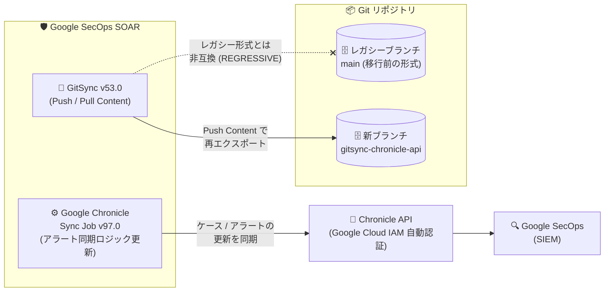

# Google SecOps Marketplace: Google Chronicle 統合 v97.0 / GitSync v53.0 アップデート

**リリース日**: 2026-10-07

**サービス**: Google SecOps Marketplace

**機能**: Google Chronicle 統合のアラート同期ロジック更新 (v97.0) と GitSync の Chronicle API 対応 (v53.0)

**ステータス**: Change (GitSync v53.0 は REGRESSIVE — 既存ユーザーは移行作業が必要)

📊 [このアップデートのインフォグラフィックを見る](https://takech9203.github.io/google-cloud-news-summary/20261007-google-secops-marketplace-chronicle-gitsync-updates.html)

## 概要

Google SecOps Marketplace の 2 つの統合 (インテグレーション) が更新されました。1 つ目は **Google Chronicle 統合のバージョン 97.0** で、Google Chronicle Sync Job におけるアラート同期ロジックが更新されました。この Sync Job は、Google SecOps SOAR で管理されているアラートとケースの変更 (優先度、ステータスなど) を Google SecOps (SIEM) 側へ同期し、両システムで同一の情報を即座に追跡できるようにするジョブです。

2 つ目は **GitSync のバージョン 53.0** で、最新の Chronicle API に対応しました。GitSync は SOAR のプレイブック、コネクタ、統合、オントロジーマッピングなどの構成資産を Git リポジトリで管理 (エクスポート/インポート) するための Power-up です。このアップデートは **REGRESSIVE (後方非互換)** とマークされており、既存ユーザーは更新後にリポジトリブランチを移行し、コンテンツを再エクスポートする必要があります。Chronicle API 対応環境と従来環境では JSON 構成ファイルのフォーマットが異なり、同じブランチを同時に使用できないためです。

このアップデートは、レガシー SIEM API (Backstory API / Ingestion API) から統一 Chronicle API への移行という Google SecOps 全体のモダナイゼーションの一環です。レガシー API は 2027 年 7 月 20 日にシャットダウンが予定されており、2026 年 10 月 26 日以降は新規インスタンスからレガシー API を呼び出せなくなります。SOAR と SIEM を連携して運用している SecOps 管理者は、計画的な移行が求められます。

**アップデート前の課題**

- GitSync は従来のプラットフォーム API エンドポイント (`*.siemplify-soar.com/api/`) を使用しており、Chronicle API 対応環境 (`secops.google.com` / `*.chronicle.security.google.com`) では認証エラー (401 Unauthorized) や接続エラーが発生していた
- エクスポートされる JSON 構成ファイルはレガシー形式であり、Chronicle API のリソース識別子やフィールド形式に対応していなかった
- カスタム統合のエクスポート/インポートはファイル単位で転送されるため、大きな統合では転送に時間がかかっていた
- オントロジーマッピングルールがソース別に整理されておらず、異なるソース間のマッピングルールの競合が発生し得た
- 組み込みの読み取り専用システムアイテム (デフォルトのシステムタグなど) が同期対象に含まれ、権限エラーの原因になり得た

**アップデート後の改善**

- **GitSync v53.0**: Chronicle REST API 経由で Google SecOps に接続し、Google Cloud IAM によりランタイムで自動認証されるようになった (プラットフォーム API 用の認証情報の設定が不要になり、Git リポジトリの認証情報のみ設定すればよい)
- **GitSync v53.0**: プレイブック同期ジョブに「Include Playbook Blocks」オプションが追加され、再利用可能なワークフローブロックをプレイブックと一緒にエクスポート/インポートできるようになった (`/Playbooks` と `/Blocks` のどちらからもインポート可能)
- **GitSync v53.0**: カスタム統合パッケージが `.zip` アーカイブとして直接アップロード/ダウンロードされ、大きな統合の転送時間が短縮された
- **GitSync v53.0**: マッピングルールが `/Ontology/Mappings/<Source_Name>/` 配下にソース別に整理され、異なるソース間のルール競合を防止するようになった
- **GitSync v53.0**: 組み込みの読み取り専用システムアイテムが同期時に自動的に除外され、権限エラーを防止するようになった
- **Google Chronicle 統合 v97.0**: Google Chronicle Sync Job のアラート同期ロジックが更新された

## アーキテクチャ図



GitSync v53.0 は Chronicle API 経由で IAM 自動認証を行い、新形式の構成ファイルを専用ブランチへエクスポートします。レガシーブランチの構成ファイルとは非互換のため、ブランチ移行と再エクスポートが必須です。

## サービスアップデートの詳細

### 主要機能

1. **Google Chronicle 統合 v97.0: Sync Job のアラート同期ロジック更新**
   - Google Chronicle Sync Data Job は、SOAR で管理されるケースとアラートのフィールド (優先度、ステータス、タイトルなど) を Google SecOps へ同期する
   - 1 回のイテレーションで最大 1,000 ケースと 1,000 アラートを同期
   - Chronicle Alerts Connector および Chronicle Alerts Creator Job で作成されたアラートに対応 (非推奨の Alerts Connector / IOCs Connector のアラートには非対応)
   - レガシー API の非推奨化に先立ち、このジョブを Chronicle API を使用するよう明示的に構成する必要がある

2. **GitSync v53.0: Chronicle API 対応環境のサポート (REGRESSIVE)**
   - Chronicle REST API 経由の接続と Google Cloud IAM によるランタイム自動認証
   - エクスポートされる JSON 構成ファイルが Chronicle API のリソース識別子・フィールド形式に変更 (移行前のリポジトリブランチとは非互換)
   - プレイブックブロックの専用同期オプション (「Include Playbook Blocks」) を追加
   - カスタム統合の `.zip` アーカイブ直接転送による転送時間の短縮
   - ソース別オントロジーマッピング (`/Ontology/Mappings/<Source_Name>/`) による競合防止
   - 組み込みシステムデフォルトの自動除外による権限エラー防止

3. **必須の移行作業 (GitSync 既存ユーザー)**
   - リポジトリブランチの移行とコンテンツの再エクスポートが必要
   - プラットフォームの Chronicle API 対応環境への移行は一方向の移行であり、レガシーエンドポイントには戻せない

## 技術仕様

### Google Chronicle Sync Data Job の同期フィールド

| 対象 | 追跡フィールド (SOAR 側) | 同期フィールド (SecOps 側) |
|------|------------------------|---------------------------|
| ケース | Priority / Status / Title | Priority / Status / Title / Stage / Google SecOps Case ID |
| アラート | Priority / Status / Case ID | Priority / Status / Google SecOps Alert ID / Verdict / Closure Comment / Closure Reason / Closure Root Cause / Usefulness |

### GitSync v53.0 の主な変更点

| 項目 | 詳細 |
|------|------|
| 認証 | Chronicle REST API + Google Cloud IAM によるランタイム自動認証 (プラットフォーム API 認証情報は不要、Git リポジトリの認証情報のみ設定) |
| 構成スキーマ | Chronicle API のリソース識別子・フィールド形式を使用 (移行前ブランチと非互換) |
| プレイブックブロック | 「Include Playbook Blocks」オプションで一括エクスポート/インポート (`/Playbooks` または `/Blocks` からインポート可能) |
| カスタム統合 | `.zip` アーカイブとして直接転送 |
| オントロジーマッピング | `/Ontology/Mappings/<Source_Name>/` 配下にソース別で整理 |
| システムデフォルト | 組み込み・読み取り専用アイテムを同期から自動除外 |

### レガシー API の非推奨スケジュール

| 日付 | 内容 |
|------|------|
| 2026 年 10 月 26 日 | 新規インスタンスからレガシー API (Backstory API / Ingestion API) の呼び出しが不可に |
| 2027 年 7 月 20 日 | レガシー SIEM API のシャットダウン (全既存インスタンスは Chronicle API への移行が必須) |

## 設定方法

### 前提条件

1. Google SecOps プラットフォームが Chronicle API 対応環境 (`secops.google.com` または `*.chronicle.security.google.com`) に移行済みであること
2. Content Hub で GitSync パッケージがバージョン 53.0 以降に更新されていること
3. GitSync は Shared Instance として構成すること (全プラットフォームコンポーネントとスケジュールジョブがリポジトリ構成にアクセスできるようにするため)

### 手順 (GitSync のブランチ移行: 推奨の専用ブランチ方式)

#### ステップ 1: レガシー環境からベースラインを Push

移行前の環境から Push Content ジョブをフル実行し、既存ブランチ (例: `main`) にクリーンなバックアップをコミットします。

#### ステップ 2: 新しい Git ブランチを作成

```bash
git checkout -b gitsync-chronicle-api
git push origin gitsync-chronicle-api
```

新しい専用ブランチを作成することで、Chronicle API 形式の構成を分離し、移行前構成のアーカイブをそのまま保持できます。

#### ステップ 3: 統合インスタンスのアップグレードと再構成

Chronicle API 対応環境で GitSync が Content Hub にてバージョン 53.0 以降に更新されていることを確認し、**Settings > Integrations > GitSync** で **Branch** パラメータを `gitsync-chronicle-api` に更新します。その後、**Ping** アクションで接続を確認します。既存の Shared Instance を削除・再作成する必要はありません。

#### ステップ 4: Chronicle API 形式のベースラインを Push

Chronicle API 対応インスタンスから Push Content ジョブをフル実行し、新ブランチに更新済みの構成ファイルを格納します。新しいブランチの初期化時や Chronicle API 対応環境への移行時は、必ず Push Content を最初に実行します。

#### ステップ 5: 検証と Pull 同期の有効化

リポジトリのファイル構造を確認し、必要に応じてスケジュールされた Pull Content ジョブを有効化します。

**既存ブランチを再利用する場合 (Option 2)**: バックアップタグの作成 (`git tag backup-legacy-pre-migration`)、同期ジョブの一時停止、レガシーディレクトリの削除、ベースライン Push、同期再開という手順になります。GitSync はリモートリポジトリへ直接 push するため (Pull Request を作成しない)、ブランチ保護ルールが有効な場合は例外設定が必要です。

## メリット

### ビジネス面

- **運用の一貫性**: SOAR と SIEM の間でケース・アラートの状態が同期され、両システムで同じ情報を即座に追跡できる
- **構成の Configuration as Code 化の継続**: Chronicle API 対応環境へ移行した後も、プレイブックや統合などの資産を Git で継続的にバージョン管理できる
- **レガシー API 廃止への備え**: 2027 年 7 月のレガシー API シャットダウンに向けて、Marketplace 統合側の対応が整った

### 技術面

- **認証の簡素化とセキュリティ向上**: Google Cloud IAM によるランタイム自動認証により、プラットフォーム API 用の認証情報管理が不要になる
- **転送効率の向上**: カスタム統合の `.zip` アーカイブ直接転送により、大きな統合の転送時間が短縮される
- **構成の競合防止**: ソース別オントロジーマッピングと組み込みシステムアイテムの自動除外により、同期時のエラーや競合を回避できる

## デメリット・制約事項

### 制限事項

- **後方非互換 (REGRESSIVE)**: GitSync v53.0 の構成ファイル形式は移行前のリポジトリブランチと非互換。既存ユーザーはブランチ移行とコンテンツの再エクスポートが必須
- **一方向の移行**: Chronicle API 対応環境への移行は一方向のインフラ移行であり、レガシーエンドポイントには戻せない
- **レガシーブランチの Pull 不可**: 移行前のレガシー構成ファイルを含むブランチを Chronicle API 対応環境へ Pull すると、`General error performing Job Pull Content` や `400 Bad Request` / `404 Not Found` エラーが発生する。先に Push Content でブランチを新形式に更新する必要がある
- **Sync Job の対象制限**: Google Chronicle Sync Data Job は Chronicle Alerts Connector / Alerts Creator Job 由来のアラートのみ対象。非推奨のコネクタ (Alerts Connector、IOCs Connector) のアラートは同期されない
- **同期件数の上限**: Sync Data Job は 1 イテレーションあたり最大 1,000 ケース・1,000 アラートを同期

### 考慮すべき点

- **ブランチ保護ルール**: GitSync は Pull Request を作成せずリモートリポジトリへ直接 push するため、ブランチ保護 (レビュー必須など) が有効なブランチでは push が失敗する。専用ブランチの利用、または GitSync 用アカウントの例外設定が必要
- **Pull Content のタイムアウト**: 複数の商用統合を一度にインポートするとジョブ実行の 5 分タイムアウトを超過する場合がある。事前に Content Hub から必要な商用統合をインストールしておくか、タイムアウト時はジョブを再実行する
- **Commit Passwords オプション**: Password 型以外のパラメータ (Application ID、Client ID、ユーザー名、URL など) は常に平文でエクスポートされる。公開/共有リポジトリでは Commit Passwords を絶対に有効化しない
- **認証方式の一致**: Google Chronicle 統合の Sync Job は、統合構成と同一の認証方式 (Chronicle API) を使用するよう明示的に構成する必要がある

## ユースケース

### ユースケース 1: Chronicle API 対応環境への GitSync 移行

**シナリオ**: SOAR のプレイブックとコネクタ構成を GitSync の `main` ブランチで管理している組織が、プラットフォームの Chronicle API 対応環境への移行に伴い、GitSync v53.0 へアップデートする。

**実装例**:
```bash
# 移行前: レガシー環境からフル Push でバックアップ (main ブランチへ)
# 移行後: 専用ブランチを作成
git checkout -b gitsync-chronicle-api
git push origin gitsync-chronicle-api
# GitSync の Branch パラメータを gitsync-chronicle-api に変更し Ping で確認
# Chronicle API 対応インスタンスからフル Push Content を実行
```

**効果**: 移行前構成のアーカイブを `main` ブランチに保持したまま、Chronicle API 形式の構成管理を新ブランチで開始でき、履歴を壊さずに安全に移行できる。

### ユースケース 2: SOAR と SIEM 間のアラート状態の双方向追跡

**シナリオ**: SOC チームが Google SecOps SOAR でアラートのトリアージ (優先度変更、クローズ処理) を行い、その結果を Google SecOps (SIEM) 側でも追跡したい。

**効果**: 更新された同期ロジックを持つ Google Chronicle Sync Job (v97.0) により、SOAR 側での優先度・ステータス変更や Verdict、クローズ理由などが SecOps 側に同期され、両システムで一貫したアラート状態を維持できる。

## 関連サービス・機能

- **Google SecOps (SIEM)**: Sync Job の同期先。アラート・ケースの状態が SOAR から同期される
- **Google SecOps SOAR**: 両統合が動作するプラットフォーム。ケース管理とプレイブック自動化を担う
- **Chronicle API**: レガシー Backstory API / Ingestion API を置き換える統一 REST API。GitSync v53.0 と Google Chronicle 統合の接続基盤
- **Google Cloud IAM**: GitSync v53.0 のランタイム自動認証、および Chronicle API のアクセス制御 (`roles/chronicle.admin` などのロール) を提供
- **Content Hub**: GitSync および Google Chronicle 統合パッケージの更新・インストール元
- **Chronicle Alerts Connector / Alerts Creator Job**: Sync Data Job と連携して動作する、完全な Google SecOps システムを構成するコンポーネント

## 参考リンク

- 📊 [インフォグラフィック](https://takech9203.github.io/google-cloud-news-summary/20261007-google-secops-marketplace-chronicle-gitsync-updates.html)
- [公式リリースノート](https://docs.cloud.google.com/release-notes#October_07_2026)
- [Google Chronicle 統合ドキュメント](https://docs.cloud.google.com/chronicle/docs/soar/marketplace-integrations/google-chronicle)
- [GitSync ドキュメント (Chronicle API-enabled environment migration を含む)](https://docs.cloud.google.com/chronicle/docs/soar/marketplace/power-ups/gitsync)
- [レガシー API から Chronicle API への移行ガイド](https://docs.cloud.google.com/chronicle/docs/administration/migrate-from-legacy-api-to-chronicle-api)
- [SOAR 移行の概要 (Google Cloud への移行)](https://docs.cloud.google.com/chronicle/docs/soar/admin-tasks/advanced/migrate-to-gcp)

## まとめ

GitSync v53.0 は Chronicle API 対応環境をサポートする重要なアップデートですが、REGRESSIVE (後方非互換) であり、既存ユーザーはリポジトリブランチの移行とコンテンツの再エクスポートが必須です。レガシー API は 2027 年 7 月 20 日にシャットダウンされるため、GitSync を利用している組織は専用ブランチ方式での計画的な移行を早めに実施することを推奨します。あわせて Google Chronicle 統合 (v97.0) の Sync Job が Chronicle API を使用するよう構成されているかも確認してください。

---

**タグ**: #GoogleSecOps #SOAR #GitSync #ChronicleAPI #SIEM #セキュリティ #移行
