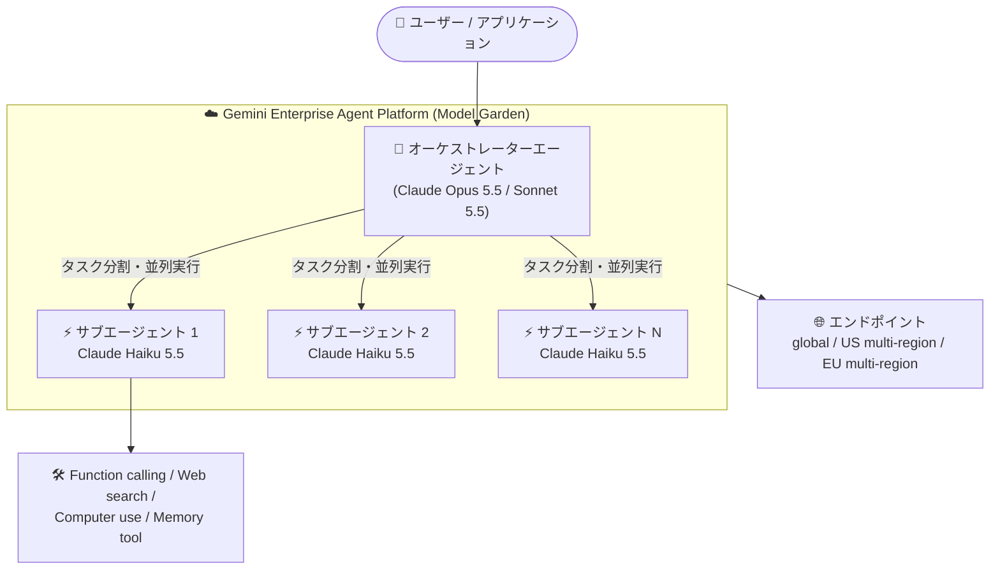

# Gemini Enterprise Agent Platform (Model Garden): Anthropic Claude Haiku 5.5 が利用可能に

**リリース日**: 2026-10-07

**サービス**: Gemini Enterprise Agent Platform (Model Garden)

**機能**: Anthropic Claude Haiku 5.5 の提供開始

**ステータス**: GA (一般提供)

📊 [このアップデートのインフォグラフィックを見る](https://takech9203.github.io/google-cloud-news-summary/20261007-model-garden-claude-haiku-5-5.html)

## 概要

2026 年 10 月 7 日、Anthropic の最新軽量モデル **Claude Haiku 5.5** が Gemini Enterprise Agent Platform の Model Garden で一般提供 (GA) として利用可能になりました。Claude Haiku 5.5 は、コーディング、サブエージェント、レイテンシに敏感な大規模ユースケース向けに設計された、高性能かつコスト効率の高いモデルです。

今回のリリースで特に注目すべきは、Haiku ファミリーとして初めて **100 万トークンの入力コンテキスト** と **128,000 トークンの最大出力** に対応した点です。さらに、従来の Haiku 4.5 ではサポートされていなかった **Computer use** と **Memory tool** にも対応し、上位モデル (Sonnet 5.5 / Opus 5.5) と同等の機能セットを低コストで利用できるようになりました。

マルチエージェントシステムのサブエージェント、カスタマーサービスなどのリアルタイム応答、大量データの並列処理といった「速度とコストが重要なワークロード」を Google Cloud 上で構築する開発者・アーキテクトが主な対象ユーザーです。

**アップデート前の課題**

従来、Google Cloud 上で利用できる Haiku ファミリーの最新版は Claude Haiku 4.5 (2025 年 10 月 15 日リリース) でした。

- 入力コンテキストは最大 200,000 トークン、出力は最大 64,000 トークンに制限されており、大規模コードベースや長大なドキュメントの処理には上位モデルが必要だった
- Computer use や Memory tool がサポートされておらず、エージェント用途では機能面の制約があった
- モデル提供リージョンが us-east5、europe-west1 (およびグローバルエンドポイント) に限定されていた
- クォータはグローバルエンドポイントで QPM 2,500 / 入力 TPM 2,500,000 にとどまり、大規模並列実行にはクォータ面の上限があった
- なお、旧世代の Claude 3.5 Haiku は 2026 年 1 月 5 日に非推奨となり、2026 年 7 月 5 日にシャットダウン済みで、軽量モデルの後継選択肢が求められていた

**アップデート後の改善**

- 入力 100 万トークン / 出力 128,000 トークンに拡大し、大規模リポジトリや長文ドキュメントを Haiku クラスの価格・速度で処理可能になった
- Computer use、Memory tool、Web search、Batch predictions、Prompt caching、Function calling に対応し、エージェント構築に必要な機能が揃った
- モデル提供が米国・欧州のマルチリージョンとグローバルエンドポイントに拡大し、ML 処理は asia-southeast1 (アジア太平洋) でも実行可能になった
- クォータが大幅に引き上げられ、グローバルエンドポイントで QPM 3,000 / 入力 TPM 30,000,000 / 出力 TPM 3,000,000 となり、サブエージェントの並列実行に十分な処理能力を確保できるようになった
- 利用形態として Shared Model Lineage Quota と Provisioned Throughput をサポートし、安定したスループットの確保が可能になった

## アーキテクチャ図



Model Garden 上で Claude Haiku 5.5 をサブエージェントとして並列実行するマルチエージェント構成の例です。上位モデルがタスクを分割し、低コスト・低レイテンシの Haiku 5.5 が各タスクを処理します。

## サービスアップデートの詳細

### 主要機能

1. **100 万トークンコンテキストと 128K 出力**
   - 最大入力トークン: 1,000,000、最大出力トークン: 128,000
   - Haiku 4.5 (入力 200,000 / 出力 64,000) から大幅に拡大し、Sonnet 5.5 / Opus 5.5 と同等のコンテキスト長を実現
   - 大規模コードベースの解析や長文 PDF の処理を軽量モデルの価格帯で実行可能

2. **エージェント向け機能のフルサポート**
   - Computer use、Memory tool に新たに対応 (Haiku 4.5 では非対応)
   - Web search、Batch predictions、Prompt caching、Function calling、Count tokens もサポート
   - コーディングサブエージェント、カスタマーサービスエージェントなどの構築に必要な機能が揃う

3. **マルチモーダル入力**
   - 入力: テキスト、画像、PDF / 出力: テキスト
   - 画像・PDF の制限事項は Anthropic のドキュメント (Vision、PDF support) に準拠

4. **提供リージョンとクォータの拡大**
   - モデル提供: 米国マルチリージョン、欧州マルチリージョン、グローバルエンドポイント
   - ML 処理: 米国・欧州マルチリージョンに加え asia-southeast1 (アジア太平洋)
   - グローバルエンドポイントで QPM 3,000 / 入力 TPM 30,000,000 / 出力 TPM 3,000,000

## 技術仕様

### モデル仕様

| 項目 | 詳細 |
|------|------|
| モデル ID | `claude-haiku-5-5` |
| ローンチステージ | GA (一般提供) |
| リリース日 | 2026 年 10 月 7 日 |
| 廃止予定日 | 2027 年 10 月 7 日以降 (それより早く廃止されない) |
| 入力 | テキスト、画像、PDF |
| 出力 | テキスト |
| 最大入力トークン | 1,000,000 |
| 最大出力トークン | 128,000 |
| サポート機能 | Computer use、Web search、Batch predictions、Prompt caching、Function calling、Count tokens、Memory tool |
| 利用形態 | Shared Model Lineage Quota、Provisioned Throughput |

### リージョン・クォータ

| エンドポイント | QPM | 入力 TPM (非キャッシュ + キャッシュ書き込み) | 出力 TPM | コンテキスト長 |
|----------------|-----|---------------------------------------------|----------|----------------|
| 米国マルチリージョン | 1,500 | 15,000,000 | 1,500,000 | 1,000,000 |
| 欧州マルチリージョン | 1,500 | 15,000,000 | 1,500,000 | 1,000,000 |
| グローバルエンドポイント | 3,000 | 30,000,000 | 3,000,000 | 1,000,000 |

ML 処理は米国マルチリージョン、欧州マルチリージョン、asia-southeast1 (アジア太平洋) で実行されます。

### Haiku 4.5 との比較

| 項目 | Claude Haiku 4.5 | Claude Haiku 5.5 |
|------|------------------|------------------|
| 最大入力トークン | 200,000 | 1,000,000 |
| 最大出力トークン | 64,000 | 128,000 |
| Computer use | 非対応 | 対応 |
| Memory tool | 非対応 | 対応 |
| モデル提供リージョン | us-east5、europe-west1、global | US / EU マルチリージョン、global |
| グローバルエンドポイントのクォータ | QPM 2,500 / 入力 TPM 2.5M | QPM 3,000 / 入力 TPM 30M |

## 設定方法

### 前提条件

1. Agent Platform API (`aiplatform.googleapis.com`) が有効化された Google Cloud プロジェクト
2. パートナーモデルを有効化・使用するための IAM 権限
3. Model Garden の Claude Haiku 5.5 モデルカードで「Enable」をクリックし、利用規約に同意 (Anthropic のリセラーポリシーにより、一部のリセラー経由の請求先アカウントでは有効化できない場合がある)

### 手順

#### ステップ 1: Model Garden でモデルを有効化

Google Cloud コンソールで Model Garden の Claude Haiku 5.5 モデルカードを開き、「Enable」をクリックします。

```
https://console.cloud.google.com/agent-platform/publishers/anthropic/model-garden/claude-haiku-5-5
```

#### ステップ 2: Anthropic SDK または curl でリクエストを送信

モデル名に `claude-haiku-5-5` を指定して Gemini Enterprise Agent Platform のエンドポイントにリクエストを送信します。

```bash
MODEL="claude-haiku-5-5"
LOCATION="global"
PROJECT_ID="your-project-id"

curl -X POST \
  -H "Authorization: Bearer $(gcloud auth print-access-token)" \
  -H "Content-Type: application/json" \
  "https://aiplatform.googleapis.com/v1/projects/${PROJECT_ID}/locations/${LOCATION}/publishers/anthropic/models/${MODEL}:rawPredict" \
  -d '{
    "anthropic_version": "vertex-2023-10-16",
    "max_tokens": 1024,
    "messages": [
      {"role": "user", "content": "こんにちは、自己紹介をしてください。"}
    ]
  }'
```

Anthropic は、モデルの誤用を記録するために、プロンプトと生成結果の 30 日間ロギングを有効にすることを推奨しています。

## メリット

### ビジネス面

- **コスト効率の高い AI 活用**: 入力 $0.10 / 100 万トークンという低価格で、無料枠プロダクトや大量トラフィックのユーザー体験を経済的に成立させられる
- **スケーラビリティ**: 高いクォータ (グローバルで入力 TPM 3,000 万) により、エンタープライズ規模の並列ワークロードに対応
- **モデルの長期利用**: 廃止予定日が 2027 年 10 月 7 日以降と明示されており、本番採用の計画が立てやすい

### 技術面

- **軽量モデルで 1M コンテキスト**: 大規模コードベース・長文ドキュメント処理を上位モデルなしで実現
- **エージェント機能のフルセット**: Computer use、Memory tool、Function calling により、サブエージェントの実装パターンが広がる
- **マルチリージョン + Provisioned Throughput**: 可用性とスループットの要件が厳しい本番システムにも適用可能

## デメリット・制約事項

### 制限事項

- 出力はテキストのみ (画像・音声の生成は不可)
- 画像ファイルは最大 5 MB、1 リクエストあたり最大 100 枚 (Anthropic Claude モデル共通の制限)
- モデル提供は米国・欧州マルチリージョンとグローバルエンドポイントのみで、ML 処理のアジア対応は asia-southeast1 に限られる

### 考慮すべき点

- 入力トークンが 100,000 を超えるリクエストには長文コンテキスト料金 (入力 $0.50 / 出力 $2.50 per 1M トークン) が適用されるため、コンテキスト長に応じたコスト設計が必要
- 複雑な推論や最高精度が求められるタスクには Claude Sonnet 5.5 / Opus 5.5 の方が適する場合がある
- Anthropic のリセラーポリシーにより、一部のリセラー管理下の請求先アカウントではモデルを有効化できない

## ユースケース

### ユースケース 1: マルチエージェントシステムのサブエージェント

**シナリオ**: 大規模リファクタリングや移行プロジェクトで、オーケストレーター (Opus 5.5 / Sonnet 5.5) がタスクを分割し、多数の Haiku 5.5 サブエージェントが並列でコードを処理する。

**実装例**:
```
オーケストレーター (Opus 5.5)
  ├─ サブエージェント 1 (Haiku 5.5): モジュール A のリファクタリング
  ├─ サブエージェント 2 (Haiku 5.5): モジュール B のテスト生成
  └─ サブエージェント 3 (Haiku 5.5): ドキュメント更新
```

**効果**: 1M コンテキストで大きなモジュールを丸ごと渡せるため分割の手間が減り、低価格でサブエージェントを大量並列実行できる。

### ユースケース 2: レイテンシ重視のカスタマーサービスエージェント

**シナリオ**: チャットボットやカスタマーサービスなど、応答速度が重要なリアルタイムアプリケーションに Haiku 5.5 を利用する。プロンプトキャッシュで FAQ やポリシー文書のコンテキストを再利用する。

**効果**: 高速応答と低コスト (キャッシュヒット $0.01 / 1M トークン) を両立し、大量の同時セッションを経済的に処理できる。

### ユースケース 3: バッチでの大量ドキュメント処理

**シナリオ**: 大量の PDF・画像を含むドキュメントを Batch predictions で一括処理し、分類・要約・抽出を行う。

**効果**: バッチ料金 (入力 $0.05 / 出力 $0.25 per 1M トークン) により、オンライン料金の半額で大規模処理が可能。

## 料金

Claude Haiku 5.5 はトークン数ベースの従量課金です。入力トークンが 100,000 を超えるリクエストには長文コンテキスト料金が適用されます。

### 料金表 (100 万トークンあたり、米ドル)

| 項目 | 標準 | 入力 100K トークン超 |
|------|------|---------------------|
| 入力 | $0.10 | $0.50 |
| 出力 | $0.50 | $2.50 |
| バッチ入力 | $0.05 | - |
| バッチ出力 | $0.25 | - |
| キャッシュ書き込み (5 分) | $0.125 | $0.625 |
| キャッシュ書き込み (1 時間) | $0.20 | $1.00 |
| キャッシュヒット | $0.01 | $0.05 |

最新の料金は [Gemini Enterprise Agent Platform の料金ページ](https://cloud.google.com/gemini-enterprise-agent-platform/generative-ai/pricing) を参照してください。

## 利用可能リージョン

- **モデル提供 (固定クォータ / Provisioned Throughput)**: 米国マルチリージョン、欧州マルチリージョン、グローバルエンドポイント
- **ML 処理**: 米国マルチリージョン、欧州マルチリージョン、asia-southeast1 (アジア太平洋)

## 関連サービス・機能

- **Gemini Enterprise Agent Platform (Model Garden)**: Claude Haiku 5.5 の提供基盤。Anthropic のほか各社のパートナーモデルをマネージド API として利用できる
- **Claude Sonnet 5.5 / Opus 5.5**: 同じく Model Garden で提供される上位モデル。オーケストレーターと Haiku サブエージェントの組み合わせが典型的な構成
- **Provisioned Throughput**: 安定したスループットを確保するための購入オプション。Haiku 5.5 でもサポート
- **Prompt caching / Batch predictions**: コスト最適化のための機能。キャッシュヒットは入力の 1/10、バッチは入出力の 1/2 の料金
- **リクエスト / レスポンスロギング**: Anthropic が推奨する 30 日間のプロンプト・生成結果ログの記録に使用

## 参考リンク

- 📊 [インフォグラフィック](https://takech9203.github.io/google-cloud-news-summary/20261007-model-garden-claude-haiku-5-5.html)
- [公式リリースノート](https://docs.cloud.google.com/release-notes#October_07_2026)
- [Claude Haiku 5.5 on Google Cloud ドキュメント](https://docs.cloud.google.com/gemini-enterprise-agent-platform/models/partner-models/claude/haiku-5-5)
- [Claude モデルの使い方](https://docs.cloud.google.com/gemini-enterprise-agent-platform/models/partner-models/claude/use-claude)
- [料金ページ](https://cloud.google.com/gemini-enterprise-agent-platform/generative-ai/pricing)

## まとめ

Claude Haiku 5.5 の GA により、軽量モデルの価格帯で 1M トークンコンテキスト、Computer use、Memory tool を利用できるようになり、サブエージェントやレイテンシ重視のワークロードの選択肢が大きく広がりました。Haiku 4.5 や旧世代 Haiku を利用中のチームは、コンテキスト長・機能・クォータのすべてで強化された Haiku 5.5 への移行検証を推奨します。マルチエージェント構成では、Opus 5.5 / Sonnet 5.5 との組み合わせによるコスト最適化をまず検討するとよいでしょう。

---

**タグ**: #GeminiEnterpriseAgentPlatform #ModelGarden #Anthropic #Claude #ClaudeHaiku #生成AI #GA
