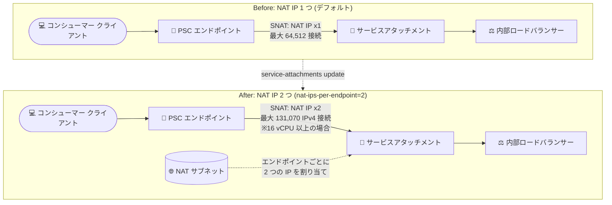

# Virtual Private Cloud (Private Service Connect): サービスアタッチメントへの追加 NAT IP アドレス設定による最大接続数の拡張

**リリース日**: 2026-10-07

**サービス**: Virtual Private Cloud (Private Service Connect)

**機能**: サービスアタッチメントのエンドポイントあたり NAT IP アドレス数の追加設定 (1 → 2)

**ステータス**: Feature (新機能)

📊 [このアップデートのインフォグラフィックを見る](https://takech9203.github.io/google-cloud-news-summary/20261007-private-service-connect-additional-nat-ip.html)

## 概要

Private Service Connect (PSC) において、**サービスプロデューサーが公開サービス (サービスアタッチメント) に追加の NAT IP アドレスを割り当てることで、コンシューマーが単一の PSC エンドポイントまたはバックエンド経由で確立できる同時接続数を増やせる**ようになりました。サービスアタッチメントの `nat-ips-per-endpoint` 設定を `2` にすることで、承認された各エンドポイント / バックエンドに NAT サブネットから 2 つの NAT IP アドレスが割り当てられます。

PSC では、コンシューマー VPC からのパケットがプロデューサー VPC 内の NAT サブネットの IP アドレスにソース NAT (SNAT) されます。NAT IP アドレス 1 つあたりの利用可能なソースポートは 64,512 個 (特権ポートを除く) であり、従来はこれが単一エンドポイントあたりの同時接続数の実質的な上限でした。今回のアップデートにより、エンドポイントあたりの NAT IP を 2 つに増やすことで、プロデューサーのバックエンド VM の vCPU 数に応じて単一エンドポイントあたり最大 131,070 の同時 IPv4 接続まで拡張できます。

対象ユーザーは、PSC で大規模なマネージドサービスや SaaS を公開しているサービスプロデューサー、および単一エンドポイント経由で非常に多くの同時接続を必要とするコンシューマーを抱えるプラットフォームエンジニアです。

**アップデート前の課題**

- サービスアタッチメントはエンドポイント / バックエンドごとに NAT IP アドレスを 1 つ割り当てるため、単一エンドポイントあたりの同時接続数は NAT IP の利用可能ソースポート数である 64,512 に制限されていた
- バックエンド VM に十分な vCPU があり、バックエンド単体ではより多くの接続を処理できる場合でも、単一エンドポイントからの接続は NAT ソースポート数の 64,512 で頭打ちになっていた
- 接続数の上限を回避するには、コンシューマー側で複数のエンドポイントを構成するなどの対応が必要だった

**アップデート後の改善**

- サービスアタッチメントの設定でエンドポイント / バックエンドあたりの NAT IP アドレス数を 2 に増やせるようになり、利用可能なソースポートが倍増した
- バックエンド VM の vCPU 数に応じて、単一エンドポイントあたりの最大同時 IPv4 接続数を最大 131,070 (16 vCPU 以上の場合) まで拡張できるようになった
- 既存のサービスアタッチメントに対しても、トラフィックを中断することなく `gcloud compute service-attachments update` で設定を変更できる (割り当て済みの NAT IP には影響しない)

## アーキテクチャ図



サービスアタッチメントの NAT IP 割り当てを 1 から 2 に増やすことで、SNAT に使えるソースポートが倍増し、単一の PSC エンドポイント / バックエンド経由の同時 IPv4 接続数の上限を引き上げられます。

## サービスアップデートの詳細

### 主要機能

1. **エンドポイントあたり NAT IP アドレス数の設定 (1 または 2)**
   - サービスアタッチメントの作成時 (`--nat-ips-per-endpoint`) または更新時に、承認された各コンシューマーエンドポイント / バックエンドへ割り当てる NAT IP アドレス数を 1 (デフォルト) または 2 に設定できる
   - 既存のサービスアタッチメントは 1 から 2 への増加のみ可能で、減らすことはできない。増加時に割り当て済みの NAT IP アドレスは影響を受けない

2. **単一エンドポイントあたりの最大同時 IPv4 接続数の拡張**
   - NAT IP アドレス 1 つにつき 64,512 個のソースポート (特権ポートを除く) が利用可能
   - NAT IP を 2 つにすると、プロデューサーのバックエンド VM の vCPU 数に応じて最大同時 IPv4 接続数が増加する (下表参照)
   - この拡張は IPv4 接続が対象

3. **トラフィック無停止での設定変更**
   - 既存のサービスアタッチメントに対して Console、gcloud、API で設定を更新できる
   - NAT サブネットの容量が不足している場合、更新は「Insufficient IPv4 capacity on NAT subnetworks for the requested Service Attachment update」エラーで失敗するため、事前に NAT サブネットの追加・拡張が必要

## 技術仕様

### エンドポイントあたりの最大同時 IPv4 接続数

| エンドポイントあたり NAT IP 数 | バックエンド VM の vCPU 数 | エンドポイントあたり最大同時 IPv4 接続数 |
|-------------------------------|---------------------------|------------------------------------------|
| 1 (デフォルト) | 任意 | 64,512 |
| 2 | 1〜7 | 65,535 |
| 2 | 8〜15 | 98,302 |
| 2 | 16 以上 | 131,070 |

### 関連する制約・仕様

| 項目 | 詳細 |
|------|------|
| NAT IP 数の設定値 | `1` (デフォルト) または `2`。増加のみ可能で減少は不可 |
| ソースポート数 | NAT IP アドレス 1 つあたり 64,512 ポート (特権ポートを除く) |
| バックエンドあたりの接続上限 | ベースラインは 65,535 接続。IPv4 接続はバックエンド VM の vCPU 数に応じて増加 |
| NAT サブネットの消費 | デフォルトではエンドポイント / バックエンドごとに 1 IP を消費。設定を 2 にするとエンドポイント / バックエンドごとに 2 IP を消費 |
| 接続伝播 (connection propagation) | コンシューマーが接続伝播を使用する場合、伝播先の VPC スポークごと・エンドポイントごとに、設定した NAT IP 数 (1 または 2) に応じた追加 IP を消費 |
| 必要な権限 | `compute.serviceAttachments.update` |
| クライアント側の上限 | クライアント VM 側もエフェメラルソースポート数により同一ソース IP・宛先 IP・プロトコルあたり 64,512 同時接続に制限される点に注意 |

## 設定方法

### 前提条件

1. サービスアタッチメントの NAT サブネットに、承認済みの各エンドポイント (伝播されたエンドポイント接続を含む) およびバックエンドへ追加の IP アドレスを割り当てるのに十分な空き容量があること
2. `compute.serviceAttachments.update` 権限を持っていること

### 手順

#### ステップ 1: 既存サービスアタッチメントの NAT IP 数を 2 に更新 (gcloud)

```bash
gcloud compute service-attachments update ATTACHMENT_NAME \
    --region=REGION \
    --nat-ips-per-endpoint=2
```

Console の場合は「Private Service Connect」ページ →「Published services」タブ → 対象サービス →「Edit service details」→「Allocated IPs per PSC endpoint」で `2` を選択して保存します。

#### ステップ 2: API での更新 (フィンガープリントを取得して PATCH)

```bash
# フィンガープリントの取得
GET https://compute.googleapis.com/compute/v1/projects/PROJECT_ID/regions/REGION/serviceAttachments/ATTACHMENT_NAME

# natIpsPerEndpoint を 2 に更新
PATCH https://compute.googleapis.com/compute/v1/projects/PROJECT_ID/regions/REGION/serviceAttachments/ATTACHMENT_NAME
{
  "natIpsPerEndpoint": 2,
  "fingerprint": "FINGERPRINT"
}
```

新規作成時は `gcloud compute service-attachments create` に `--nat-ips-per-endpoint=2` を指定することもできます。

#### ステップ 3: NAT サブネット容量の監視

```bash
# NAT サブネット容量が不足する場合は、サービスアタッチメントに NAT サブネットを追加
gcloud compute service-attachments update ATTACHMENT_NAME \
    --region=REGION \
    --nat-subnets=PSC_SUBNET_LIST
```

`private_service_connect/producer/used_nat_ip_addresses` メトリクスを監視し、使用中の NAT IP アドレス数が NAT サブネットの容量を超えないようにします。NAT サブネットはトラフィックを中断せずにいつでも追加できます。

## メリット

### ビジネス面

- **大規模コンシューマーへの対応力向上**: 単一エンドポイント経由の接続数上限が引き上げられるため、接続数の多い大口コンシューマーに対しても追加のエンドポイント構成を強いることなくサービスを提供できる
- **サービス無停止での拡張**: 既存のサービスアタッチメントをトラフィック中断なしに更新できるため、稼働中の公開サービスにも適用しやすい

### 技術面

- **ソースポート枯渇の緩和**: NAT IP が 2 つになることでソースポートが倍増し、SNAT ポート枯渇による接続失敗のリスクを低減できる
- **バックエンド性能の活用**: 16 vCPU 以上のバックエンド VM では単一エンドポイントあたり最大 131,070 同時 IPv4 接続まで拡張でき、VM の処理能力を接続数の面でも活かせる

## デメリット・制約事項

### 制限事項

- NAT IP 数は一度 2 に増やすと 1 に戻すことはできない
- 最大接続数の拡張は IPv4 接続が対象
- NAT IP を 2 にしても、バックエンド VM の vCPU 数が少ない場合 (1〜7 vCPU) は最大 65,535 接続までしか増えない
- クライアント VM 側のエフェメラルソースポート数 (同一ソース IP・宛先 IP・プロトコルあたり 64,512) など、他の制限要因により実際の上限が制約される場合がある

### 考慮すべき点

- エンドポイント / バックエンドごとの NAT IP 消費が 2 倍になるため、NAT サブネットの IP 消費量が増加する。NAT サブネットには 4 つの使用不可 IP があるため (例: /29 で使用可能 4 IP、/24 で 252 IP)、サイジングの見直しが必要
- 接続伝播を使用している場合、伝播先 VPC スポークごとの IP 消費も設定した NAT IP 数に応じて増えるため、容量見積もりに含める必要がある
- NAT サブネットの容量不足時は更新がエラーで失敗するため、事前に `used_nat_ip_addresses` メトリクスで空き容量を確認しておく

## ユースケース

### ユースケース 1: SaaS プロバイダーが大口顧客の接続数上限を引き上げる

**シナリオ**: PSC 経由でデータベースサービスを公開している SaaS プロバイダーで、特定の大口コンシューマーが単一エンドポイント経由で 64,512 を超える同時接続を必要としている。

**実装例**:
```bash
gcloud compute service-attachments update my-saas-attachment \
    --region=asia-northeast1 \
    --nat-ips-per-endpoint=2
```

**効果**: バックエンド VM が 16 vCPU 以上であれば、単一エンドポイントあたりの同時 IPv4 接続数を最大 131,070 まで拡張でき、コンシューマー側で複数エンドポイントを構成する運用負荷を回避できる。

### ユースケース 2: SNAT ポート枯渇による接続失敗の予防

**シナリオ**: 接続数がピーク時に NAT ソースポートの上限 (64,512) に近づいており、接続失敗が懸念されるマルチテナントサービス。

**効果**: NAT IP を 2 つに増やしてソースポートを倍増させつつ、`used_nat_ip_addresses` メトリクスと接続ステータス (Needs attention) の監視を組み合わせることで、ポート枯渇・IP 枯渇による接続失敗を未然に防げる。

## 料金

このアップデートに固有の料金情報はリリースノートに記載されていません。Private Service Connect の料金詳細は公式料金ページを参照してください。

- [VPC 料金 (Private Service Connect を含む)](https://cloud.google.com/vpc/pricing)

## 関連サービス・機能

- **内部ロードバランサー (Internal Application/Network Load Balancer)**: サービスアタッチメントのターゲットサービスとなる転送ルールを提供する。Envoy プロキシを使用するサービスではプロキシインスタンスが自動スケールするため、バックエンドあたりの接続上限が実質的な制約になりにくい
- **Cloud Monitoring**: `private_service_connect/producer/used_nat_ip_addresses` メトリクスで NAT サブネットの IP 使用状況を監視し、容量不足を事前に検知できる
- **接続伝播 (Propagated connections) / Network Connectivity Center**: VPC スポークへ接続を伝播する構成では、設定した NAT IP 数に応じて追加の IP が消費されるため、本機能の NAT サブネット容量設計と密接に関連する

## 参考リンク

- 📊 [インフォグラフィック](https://takech9203.github.io/google-cloud-news-summary/20261007-private-service-connect-additional-nat-ip.html)
- [公式リリースノート](https://docs.cloud.google.com/release-notes#October_07_2026)
- [最大接続数 (Maximum connections)](https://docs.cloud.google.com/vpc/docs/about-vpc-hosted-services#max-connections)
- [エンドポイントあたりの NAT IP アドレス数の更新](https://docs.cloud.google.com/vpc/docs/manage-private-service-connect-services#update-nat-ips-per-endpoint)
- [公開サービスへのアクセス制御](https://docs.cloud.google.com/vpc/docs/about-controlling-access-published-services)
- [料金ページ](https://cloud.google.com/vpc/pricing)

## まとめ

Private Service Connect のサービスアタッチメントでエンドポイントあたりの NAT IP アドレスを 2 つに増やせるようになり、単一エンドポイント経由の同時 IPv4 接続数を最大 131,070 まで拡張できるようになりました。接続数の多いコンシューマーを抱えるサービスプロデューサーは、NAT サブネットの空き容量と `used_nat_ip_addresses` メトリクスを確認のうえ、`--nat-ips-per-endpoint=2` の適用を検討することを推奨します。設定は増加のみ可能で元に戻せない点と、NAT サブネットの IP 消費が倍増する点には注意してください。

---

**タグ**: #VPC #PrivateServiceConnect #ネットワーキング #NAT #サービスアタッチメント #スケーラビリティ
