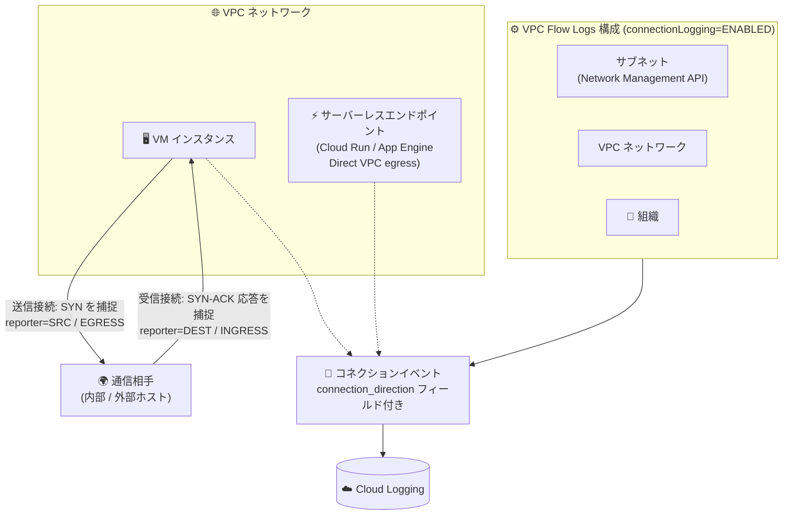

# Virtual Private Cloud: VPC Flow Logs の TCP コネクションロギングが GA

**リリース日**: 2026-10-07

**サービス**: Virtual Private Cloud (VPC Flow Logs)

**機能**: TCP コネクションロギング (TCP connection logging)

**ステータス**: GA (一般提供)

📊 [このアップデートのインフォグラフィックを見る](https://takech9203.github.io/google-cloud-news-summary/20261007-vpc-flow-logs-tcp-connection-logging.html)

## 概要

VPC Flow Logs の TCP コネクションロギングが一般提供 (GA) になりました。この機能を有効にすると、VM インスタンスおよびサーバーレスエンドポイント (Direct VPC egress を構成した Cloud Run / App Engine) について、**送信 (アウトバウンド) の TCP 接続試行**と**確認応答された受信 (インバウンド) の TCP 接続**がログとして記録されます。

VPC Flow Logs の主たる仕組みはパケットサンプリングであり、サンプリングレートは物理ホストの負荷に応じて動的に変化します。そのため、短命 (short-lived) または低トラフィックの TCP 接続はサンプリングから漏れる可能性がありました。TCP コネクションロギングはこのギャップを埋めるもので、接続の確立イベント (SYN / SYN-ACK) そのものを捕捉します。これにより、ネットワークフォレンジック、セキュリティ分析、通信の棚卸し (どのリソースがどこへ接続を開始したか) の精度が大きく向上します。

本機能は、**サブネット単位 (Network Management API 経由)**、**VPC ネットワーク単位**、**組織単位**の VPC Flow Logs 構成で有効化できます。セキュリティ監査やゼロトラスト移行時の通信可視化に取り組む Solutions Architect、SRE、セキュリティチームにとって重要なアップデートです。

**アップデート前の課題**

- プライマリパケットサンプリングは動的なサンプリングレートに依存するため、短命・低ボリュームの TCP 接続 (例: 単発のヘルスチェック、攻撃者の短時間のスキャン、間欠的なバッチ接続) がログに残らないことがあった
- 通常のフローログエントリはパケットの方向 (INGRESS/EGRESS) は示すものの、**レポーターが接続のイニシエーター (接続を開始した側) かどうかを判別できなかった**
- すべての接続イベントを確実に捕捉するには Packet Mirroring とサードパーティ製コレクタなど、追加コストのかかる手段が必要だった

**アップデート後の改善**

- 送信方向のすべての TCP 接続試行 (最初の SYN パケット) と、確認応答されたすべての受信 TCP 接続 (SYN に対する SYN-ACK 応答) が記録されるようになった
- 新しい `connection_direction` フィールド (EGRESS / INGRESS) により、レポーターが接続を開始した側か、受け入れた側かを判別できるようになった
- サブネット、VPC ネットワーク、組織の各スコープの VPC Flow Logs 構成で有効化でき、組織全体への一括適用も可能になった

## アーキテクチャ図



TCP コネクションロギングを有効にした VPC Flow Logs 構成 (サブネット / VPC ネットワーク / 組織) が、VM・サーバーレスエンドポイントの SYN (送信) および SYN-ACK (受信応答) を捕捉し、`connection_direction` フィールド付きのログエントリとして Cloud Logging に書き込む流れを示しています。

## サービスアップデートの詳細

### 主要機能

1. **送信 TCP 接続試行の捕捉**
   - VM / サーバーレスエンドポイントが外部へ接続を開始する際の最初の SYN パケットを捕捉
   - ログの `reporter` は `SRC`、方向は `EGRESS` として記録される
   - 接続が成功したかどうかにかかわらず「接続試行」が記録されるため、不審な外部接続の試みも可視化できる

2. **確認応答された受信 TCP 接続の捕捉**
   - 受信した SYN に対して返される SYN-ACK パケットを捕捉
   - ログの `reporter` は `DEST`、方向は `INGRESS` として記録される

3. **`connection_direction` フィールドによる接続イニシエーターの識別**
   - `EGRESS`: レポーターが SYN を送信して接続を開始した
   - `INGRESS`: レポーターが受信した SYN に SYN-ACK で応答した
   - 従来のフローログでは判別できなかった「どちらが接続を開始したか」が明確になる
   - 接続が複数のアグリゲーション間隔にまたがる場合、SYN / SYN-ACK が捕捉された間隔のエントリにのみ付与される

4. **3 つのスコープでの有効化**
   - サブネット単位: Network Management API (`vpcFlowLogsConfigs`) 経由で設定
   - VPC ネットワーク単位・組織単位: VPC Flow Logs 構成の `connectionLogging` パラメータで設定
   - 既存のアグリゲーション間隔、フィルタ、セカンダリサンプリングレート、メタデータ設定と組み合わせ可能

5. **既存のフローログアグリゲーションとの統合**
   - 接続イベントと同一 5-tuple のデータパケットが同じアグリゲーション間隔内にサンプリングされた場合、単一のログエントリにマージされる
   - データパケットがサンプリングされなかった場合は、接続イベント単独のログエントリが生成される
   - セカンダリサンプリングレートの設定は接続イベントのログエントリにも適用される

## 技術仕様

### TCP コネクションロギングの仕様

| 項目 | 詳細 |
|------|------|
| 対象リソース | VM インスタンス、サーバーレスエンドポイント (Direct VPC egress 構成の Cloud Run / App Engine) |
| 捕捉対象 (送信) | 最初の SYN パケット (`reporter=SRC`, `connection_direction=EGRESS`) |
| 捕捉対象 (受信) | SYN に応答する SYN-ACK パケット (`reporter=DEST`, `connection_direction=INGRESS`) |
| ログレート上限 | vCPU あたり毎秒 100 接続 (VM あたり最大毎秒 800 接続)。超過分は記録されない場合がある |
| 設定スコープ | サブネット (Network Management API)、VPC ネットワーク、組織 |
| 設定パラメータ | `connectionLogging`: `ENABLED` / `DISABLED` (デフォルト: `DISABLED`) |
| アグリゲーション | 同一 5-tuple のサンプリング済みデータパケットと同一間隔内であれば 1 エントリにマージ |
| サンプリング | セカンダリサンプリングレートが接続イベントのログエントリにも適用される |

### 接続イベント単独エントリで設定されないフィールド

接続イベントのみ (同一間隔内にサンプリングされたデータパケットなし) のログエントリでは、以下のフィールドは設定されません。

| フィールド | 説明 |
|-----------|------|
| `bytes_sent` | 送信ペイロードバイト数の推定値 |
| `packets_sent` | 送信パケット数の推定値 |
| `round_trip_time` / `rtt_msec` | アグリゲーション間隔中に測定された RTT |

### Network Management API での設定例 (サブネット)

```json
POST https://networkmanagement.googleapis.com/v1/projects/PROJECT_ID/locations/global/vpcFlowLogsConfigs?vpc_flow_logs_config_id=CONFIG_NAME

{
  "subnet": "projects/PROJECT_ID/regions/REGION/subnetworks/SUBNET_NAME",
  "aggregationInterval": "INTERVAL_5_SEC",
  "flowSampling": 1.0,
  "metadata": "INCLUDE_ALL_METADATA",
  "connectionLogging": "ENABLED"
}
```

## 設定方法

### 前提条件

1. VPC ネットワーク (レガシーネットワークは非対象) 上の VM インスタンスまたは Direct VPC egress 構成のサーバーレスエンドポイント
2. VPC Flow Logs 構成を Network Management API (`networkmanagement.googleapis.com`) で作成すること。**Compute Engine API で構成した VPC Flow Logs (サブネットの `logConfig`) では TCP コネクションロギングはサポートされない**

### 手順

#### ステップ 1: VPC ネットワーク単位で有効化する場合 (gcloud)

```bash
gcloud network-management vpc-flow-logs-configs create CONFIG_NAME \
    --location=global \
    --network="projects/PROJECT_ID/global/networks/NETWORK_NAME" \
    --connection-logging=enabled
```

VPC ネットワーク全体を対象に、TCP コネクションロギングを有効にした VPC Flow Logs 構成を作成します。`--aggregation-interval`、`--filter-expr`、`--flow-sampling`、`--metadata` などのパラメータも併せてカスタマイズできます。

#### ステップ 2: サブネット単位で有効化する場合 (Network Management API)

```bash
curl -X POST \
  -H "Authorization: Bearer $(gcloud auth print-access-token)" \
  -H "Content-Type: application/json" \
  "https://networkmanagement.googleapis.com/v1/projects/PROJECT_ID/locations/global/vpcFlowLogsConfigs?vpc_flow_logs_config_id=CONFIG_NAME" \
  -d '{
    "subnet": "projects/PROJECT_ID/regions/REGION/subnetworks/SUBNET_NAME",
    "connectionLogging": "ENABLED"
  }'
```

対象サブネットを指定して VPC Flow Logs 構成を作成し、`connectionLogging` を `ENABLED` に設定します。

#### ステップ 3: ログの確認

Cloud Logging で `connection_direction` フィールドを使って接続イベントを識別できます。`EGRESS` はレポーターが接続を開始したこと、`INGRESS` はレポーターが受信接続に応答したことを示します。

## メリット

### ビジネス面

- **セキュリティ監査・フォレンジックの精度向上**: サンプリング漏れしやすい短命接続 (スキャン、単発の不正接続試行など) も記録されるため、インシデント調査時に「どのリソースがどこへ接続したか」をより網羅的に追跡できる
- **追加インフラ不要**: 接続イベントの網羅的な捕捉のために Packet Mirroring + コレクタ VM のような構成を組む必要がなく、VPC Flow Logs 構成のパラメータ 1 つで有効化できる

### 技術面

- **接続イニシエーターの判別**: `connection_direction` フィールドにより、従来のフローログでは不可能だった「接続を開始した側」の識別が可能になった
- **柔軟な適用スコープ**: サブネット、VPC ネットワーク、組織の 3 レベルで設定でき、組織ポリシーとして一括で可視性を確保することも、特定サブネットに限定することもできる
- **既存設定との統合**: アグリゲーション、フィルタリング、セカンダリサンプリング、メタデータアノテーションといった既存の VPC Flow Logs の仕組みにそのまま統合される

## デメリット・制約事項

### 制限事項

- ログレートは vCPU あたり毎秒 100 接続、VM あたり最大毎秒 800 接続まで。上限を超えた接続は記録されない場合がある
- Compute Engine API (サブネットの `logConfig`) で構成した VPC Flow Logs では TCP コネクションロギングを利用できない。サブネット単位で使う場合は Network Management API での構成が必要
- 対象は VM インスタンスとサーバーレスエンドポイントであり、VLAN アタッチメント (Cloud Interconnect) や Cloud VPN トンネルのゲートウェイ構成は対象として言及されていない
- 接続イベント単独のログエントリでは `bytes_sent`、`packets_sent`、RTT 関連フィールドは設定されない

### 考慮すべき点

- デフォルトは `DISABLED` のため、利用には明示的な有効化が必要
- 接続イベント分のログエントリが追加されるため、ログ生成量 (Cloud Logging の取り込み・保存コスト) が増加しうる。セカンダリサンプリングレートやフィルタ式と組み合わせた調整を検討する
- 複数のアグリゲーション間隔にまたがる接続では、`connection_direction` は SYN / SYN-ACK が捕捉された間隔のエントリにのみ付与される点に注意

## ユースケース

### ユースケース 1: ネットワークフォレンジック (侵害調査)

**シナリオ**: セキュリティインシデント発生時、侵害が疑われる VM からの外部への接続試行を漏れなく調査したい。従来のサンプリングベースのフローログでは、攻撃者が行う短時間・少量の通信が記録されない可能性があった。

**実装例**:
```
# Cloud Logging クエリ例: 接続を開始した (EGRESS) イベントを抽出
logName="projects/PROJECT_ID/logs/networkmanagement.googleapis.com%2Fvpc_flows"
jsonPayload.connection_direction="EGRESS"
jsonPayload.src_instance.vm_name="suspicious-vm"
```

**効果**: すべての送信 TCP 接続試行が記録されるため、C2 サーバーへの単発の接続試行なども見逃さずに調査できる。

### ユースケース 2: ゼロトラスト移行前の通信依存関係の棚卸し

**シナリオ**: ファイアウォールポリシーの厳格化やマイクロセグメンテーション導入に先立ち、ワークロード間の実際の接続関係 (誰が誰に接続を開始しているか) を正確に把握したい。

**効果**: `connection_direction` によりクライアント/サーバーの関係が明確になり、サンプリング漏れの少ない接続インベントリに基づいて、許可ルールを過不足なく設計できる。

### ユースケース 3: 組織全体での接続可視性の標準化

**シナリオ**: 組織内の全プロジェクトでセキュリティ監査要件として接続ログの取得を義務付けたい。

**効果**: 組織レベルの VPC Flow Logs 構成で TCP コネクションロギングを一括有効化でき、プロジェクトごとの設定漏れを防げる。なお、組織レベルで有効化した場合、課金は各プロジェクトに個別に行われる。

## 料金

VPC Flow Logs の料金は Network Telemetry の料金体系に従います。料金は、フローログをレポートするリソースを含むプロジェクトに課金されます。組織レベルで有効化した場合は、各プロジェクトが個別に課金されます。TCP コネクションロギングにより生成されるログエントリが増える場合、Network Telemetry の生成量および Cloud Logging の取り込み・保存量に応じたコスト増に留意してください。

- 料金の詳細: [Network Telemetry pricing](https://cloud.google.com/vpc/pricing#network-telemetry)

## 関連サービス・機能

- **Cloud Logging**: フローログ (接続イベントを含む) の書き込み先。デフォルト 30 日保持。長期保存にはカスタム保持期間の設定やエクスポートを利用
- **Network Management API**: サブネット単位の VPC Flow Logs 構成 (TCP コネクションロギング対応) を作成する API。Compute Engine API による構成では本機能は利用不可
- **Cloud Run / App Engine (Direct VPC egress)**: サーバーレスエンドポイントとして TCP コネクションロギングの対象となる
- **Packet Mirroring**: 全パケットの解析が必要な場合の代替手段。接続イベントの捕捉だけであれば本機能で代替可能なケースがある
- **組織ポリシー `constraints/compute.requireVpcFlowLogs`**: VPC Flow Logs の有効化を組織全体で強制する際に併用

## 参考リンク

- 📊 [インフォグラフィック](https://takech9203.github.io/google-cloud-news-summary/20261007-vpc-flow-logs-tcp-connection-logging.html)
- [公式リリースノート](https://docs.cloud.google.com/release-notes#October_07_2026)
- [VPC Flow Logs の概要 (TCP connection logging)](https://docs.cloud.google.com/vpc/docs/flow-logs#connection-logging)
- [VPC Flow Logs の有効化・構成方法](https://docs.cloud.google.com/vpc/docs/using-flow-logs)
- [VPC Flow Logs のレコード形式 (connection_direction フィールド)](https://docs.cloud.google.com/vpc/docs/about-flow-logs-records)
- [料金ページ (Network Telemetry)](https://cloud.google.com/vpc/pricing#network-telemetry)

## まとめ

VPC Flow Logs の TCP コネクションロギングの GA により、サンプリングでは漏れやすかった短命・低ボリュームの TCP 接続イベントを、追加インフラなしで網羅的に記録できるようになりました。セキュリティ監査やフォレンジック、ゼロトラスト移行の通信棚卸しに取り組んでいる場合は、Network Management API ベースの VPC Flow Logs 構成で `connectionLogging` を有効化し、ログ量の増加をセカンダリサンプリングレートやフィルタで調整しながら導入することを推奨します。

---

**タグ**: VPC, VPC Flow Logs, TCP Connection Logging, Network Management API, ネットワーク監視, セキュリティ, フォレンジック, Cloud Logging, GA
