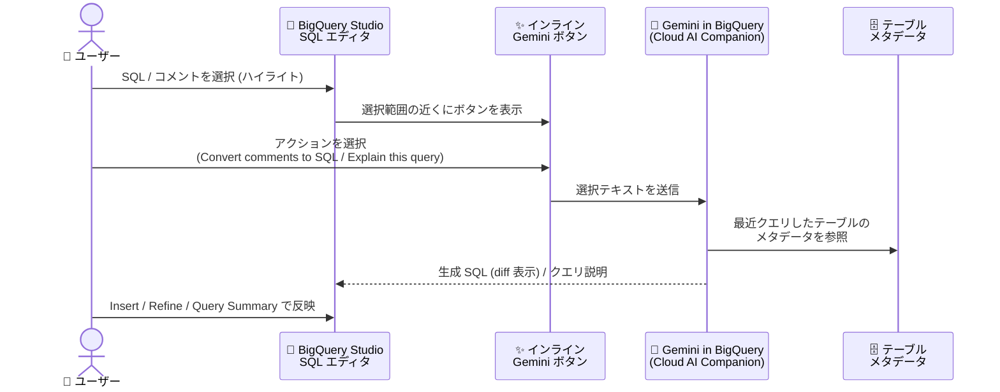

# BigQuery: BigQuery Studio SQL エディタのインラインアクションボタンによる Gemini アシスタンスが GA

**リリース日**: 2026-10-08

**サービス**: BigQuery

**機能**: BigQuery Studio SQL エディタのインラインアクションボタンによる Gemini アシスタンス

**ステータス**: GA (一般提供)

📊 [このアップデートのインフォグラフィックを見る](https://takech9203.github.io/google-cloud-news-summary/20261008-bigquery-gemini-sql-editor-inline-assist.html)

## 概要

BigQuery Studio の SQL エディタで、テキストを選択 (ハイライト) すると表示されるインラインアクションボタンから Gemini アシスタンスを利用できる機能が一般提供 (GA) となりました。エディタ上で SQL やコメントを選択するだけで、選択範囲の近くにフローティングの Gemini ボタンが表示され、そこから「コメントを SQL に変換 (Convert comments to SQL)」や「クエリの説明 (Explain this query)」といった Gemini in BigQuery のアシスト機能を直接呼び出せます。

これまで Gemini によるクエリ支援は、エディタ横の SQL 生成ツールや Cloud Assist パネルなど、エディタの外側にある UI から呼び出す形が中心でした。今回の GA により、クエリを書いている文脈 (選択したテキスト) に紐づいた形でワンクリックで Gemini を起動できるようになり、データアナリスト、データサイエンティスト、データエンジニアの日常的な SQL 作成・レビュー作業が本番環境でも安心して使える形で効率化されます。

対象ユーザーは BigQuery Studio で SQL を記述するすべてのユーザーです。Gemini in BigQuery のセットアップ (API 有効化と IAM ロール付与) が前提となります。

**アップデート前の課題**

- Gemini でクエリを生成・説明させるには、エディタ横の SQL 生成ツール (ペンアイコン) や Cloud Assist パネルを別途開く必要があり、編集中のテキストとの間でコンテキストの切り替えが発生していた
- 選択テキストに対するインライン操作は Pre-GA (Preview) 段階の提供であり、SLA やサポートの観点から本番ワークフローへの組み込みを見送るケースがあった
- 自然言語コメントから SQL への変換やクエリ説明の呼び出し方 (ショートカットやメニューの場所) が分かりにくく、機能の発見性が低かった

**アップデート後の改善**

- SQL エディタ上でテキストを選択するだけでインラインの Gemini アクションボタンが表示され、その場で「Convert comments to SQL」「Explain this query」などのアクションを実行できるようになった
- 本機能が GA となり、一般提供の条件 (サポート・安定性) のもとで本番の開発ワークフローに組み込めるようになった
- 生成結果は元のテキストとの差分 (diff) 表示で確認でき、挿入 (Insert)・調整 (Refine)・テーブルソース変更 (Edit Table Sources)・クエリ要約 (Query Summary) を選択できるため、生成 SQL のレビューと反映がスムーズになった

## アーキテクチャ図



ユーザーが SQL エディタでテキストを選択すると、インラインの Gemini ボタンが表示され、Gemini in BigQuery が最近参照したテーブルのメタデータを使って SQL 生成やクエリ説明を返すフローです。

## サービスアップデートの詳細

### 主要機能

1. **テキスト選択で表示されるインラインアクションボタン**
   - SQL エディタ上でテキストをハイライトすると、選択範囲の近くにフローティングの Gemini ボタンが表示される
   - エディタの外のパネルやツールに移動することなく、編集中のコンテキストから直接 Gemini アシスタンスを呼び出せる

2. **コメントから SQL への変換 (Convert comments to SQL)**
   - `/* 自然言語のプロンプト */` 形式のコメントを含む SQL を選択し、インライン Gemini ボタンから「Convert comments to SQL」をクリックすると、自然言語部分が SQL に変換される
   - キーボードショートカット Control+Shift+P (macOS では Command+Shift+P) で選択テキストに対する Transform プロンプトを直接開くこともできる
   - 生成結果は元テキストとの差分 (diff) として表示され、Insert (エディタへ挿入)、Refine (追加指示による修正)、Edit Table Sources (参照テーブルの変更)、Query Summary (クエリ要約の表示) を選択できる

3. **クエリの説明 (Explain this query)**
   - 理解したいクエリをハイライトし、インライン Gemini ボタンから「Explain this query」をクリックすると、クエリの自然言語による説明が Cloud パネルに表示される
   - 長く複雑なクエリや、スキーマ・ビジネスコンテキストの把握が難しいクエリの理解を支援する

4. **テーブルメタデータに基づくコンテキスト認識**
   - Gemini in BigQuery は、最近クエリ・参照したテーブルのメタデータを利用して適切なデータを特定するため、対象テーブルを事前にクエリしておくことで生成精度を高められる

## 技術仕様

### 機能の提供形態

| 項目 | 詳細 |
|------|------|
| 対象 UI | Google Cloud コンソールの BigQuery Studio (SQL エディタ) |
| 呼び出し方法 | テキスト選択時に表示されるインライン Gemini ボタン、または Control+Shift+P (macOS: Command+Shift+P) |
| 提供アクション | Convert comments to SQL、Explain this query など |
| 結果の確認 | 元テキストとの diff 表示、Insert / Refine / Edit Table Sources / Query Summary |
| ステータス | GA (一般提供) |
| 前提 | Gemini in BigQuery のセットアップ (API 有効化・IAM ロール付与) |

### 必要な IAM 権限

Gemini in BigQuery の利用には、以下のロールのいずれかが必要です。

- **BigQuery Studio User** (`roles/bigquery.studioUser`)
- **BigQuery Studio Admin** (`roles/bigquery.studioAdmin`)

これらのロールには、Gemini in BigQuery に必要な以下の権限が含まれます。

```text
cloudaicompanion.entitlements.get
cloudaicompanion.instances.completeCode
cloudaicompanion.instances.completeTask
cloudaicompanion.instances.generateCode
cloudaicompanion.operations.get
cloudaicompanion.topics.create
```

## 設定方法

### 前提条件

1. Gemini in BigQuery が有効化されていること (必要な API の有効化と IAM ロールの付与)
2. BigQuery Studio の SQL エディタで Gemini 機能 (Gemini settings) がオンになっていること

### 手順

#### ステップ 1: Gemini in BigQuery をセットアップする

1. Google Cloud コンソールで対象プロジェクトを選択し、BigQuery Studio ページに移動する
2. BigQuery Studio で Gemini アイコンにカーソルを合わせると、必要な Google Cloud API の有効化を促すプロンプトが表示されるので、画面に従って API を有効化する
3. 利用するプリンシパルに **BigQuery Studio User** または **BigQuery Studio Admin** ロールを付与する

#### ステップ 2: インラインアクションボタンから Gemini を利用する

1. BigQuery Studio のクエリエディタで、Gemini 設定 (ペンアイコン) から利用したい Gemini 機能が有効になっていることを確認する
2. 変換したい自然言語コメントを含む SQL、または説明させたいクエリをハイライトする

```sql
-- 例: 自然言語コメントを含む SQL を選択して変換する
SELECT
  subscriber_type,
  /* the name of the day of week of the trip start
     ordered longest to shortest trip with the trip's duration */
FROM `bigquery-public-data`.`austin_bikeshare`.`bikeshare_trips`
LIMIT 10;
```

3. 選択範囲の近くに表示されるインライン Gemini ボタンをクリックし、「Convert comments to SQL」または「Explain this query」を選択する
4. 生成された SQL を diff 表示で確認し、Insert でエディタに挿入する (必要に応じて Refine で修正指示を追加する)

## メリット

### ビジネス面

- **SQL 作成の生産性向上**: 自然言語コメントからの SQL 生成やクエリ説明をエディタ内で完結でき、分析業務のリードタイムを短縮できる
- **本番利用の安心感**: GA となったことで、Pre-GA 利用規約ではなく一般提供の条件で利用でき、組織的な標準ツールとして展開しやすくなった
- **オンボーディングの加速**: 複雑な既存クエリの説明機能により、新しいメンバーがデータセットやクエリ資産を理解する時間を短縮できる

### 技術面

- **コンテキストスイッチの削減**: 別パネルやツールを開かずに、選択テキストに対して直接 Gemini を呼び出せる
- **差分レビューによる安全な反映**: 生成 SQL は元テキストとの diff で確認してから挿入でき、意図しない変更の混入を防げる
- **メタデータに基づく精度**: 最近クエリしたテーブルのメタデータを活用するため、スキーマに沿った SQL が生成されやすい

## デメリット・制約事項

### 制限事項

- Gemini in BigQuery のセットアップ (API 有効化、`cloudaicompanion` 関連の IAM 権限付与) が事前に必要
- Gemini in BigQuery は Gemini for Google Cloud の一部であり、BigQuery 本体と同じコンプライアンス・セキュリティ認証をすべてサポートするわけではないため、要件の厳しいプロジェクトでは利用可否の確認が必要
- 生成される SQL は同じプロンプトでも毎回同じとは限らず、出力の検証が推奨される

### 考慮すべき点

- 良い結果を得るには、プロンプトを「クエリを最適化して」のような一般的な表現ではなく、SQL 構文と対象データに即した具体的な内容にする必要がある
- Gemini は最近クエリしたテーブルのメタデータを参照するため、対象テーブルを事前に参照・クエリしておくと精度が上がる
- 組織のポリシーで特定ユーザーの利用を制限したい場合は、`cloudaicompanion` の IAM 権限の取り消しや Gemini 設定のトグルで機能単位の無効化が可能
- Gemini for Google Cloud は、明示的な許可なしにプロンプトや応答をモデルの学習に使用しないが、データガバナンス要件は事前に確認しておくことが望ましい

## ユースケース

### ユースケース 1: 自然言語コメントからのアドホック分析クエリ作成

**シナリオ**: データアナリストが、使い慣れないデータセットに対して集計クエリを書く必要がある。カラム名や関数の正確な構文を調べる代わりに、やりたいことをコメントで記述して SQL 化したい。

**実装例**:
```sql
SELECT
  subscriber_type,
  /* 曜日ごとの平均利用時間を長い順に表示 */
FROM `bigquery-public-data`.`austin_bikeshare`.`bikeshare_trips`
LIMIT 10;
```
上記を選択し、インライン Gemini ボタンから「Convert comments to SQL」を実行。diff を確認して Insert で反映する。

**効果**: 構文調査やドキュメント参照の時間を削減し、分析の試行錯誤を高速化できる。

### ユースケース 2: 引き継いだ複雑なクエリのレビューと理解

**シナリオ**: データエンジニアが、前任者が作成した数百行の変換クエリを引き継いだ。スキーマやビジネスロジックの背景が分からず、改修前にクエリの意図を把握したい。

クエリ全体をハイライトし、インライン Gemini ボタンから「Explain this query」を実行すると、Cloud パネルに自然言語の説明が表示される。

**効果**: クエリ資産の理解にかかる時間を短縮し、改修時のデグレードリスクを低減できる。

## 料金

Gemini in BigQuery の料金は Gemini for Google Cloud の料金体系に含まれます。BigQuery の料金ページでは、BigQuery エディション (Standard、Enterprise、Enterprise Plus) に Gemini in BigQuery の AI アシスタンス機能が含まれると案内されています。最新の詳細は以下の料金ページを参照してください。

- [Gemini for Google Cloud の料金 (Gemini in BigQuery)](https://cloud.google.com/products/gemini/pricing#gemini-in-bigquery-pricing)
- [BigQuery の料金](https://cloud.google.com/bigquery/pricing)

## 利用可能リージョン

Gemini in BigQuery がデータを処理するロケーションについては、公式ドキュメント「[Where Gemini in BigQuery processes your data](https://docs.cloud.google.com/bigquery/docs/gemini-locations)」を参照してください。

## 関連サービス・機能

- **Gemini in BigQuery (SQL 生成ツール / SQL 補完)**: エディタ横のペンアイコンから使う SQL 生成ツールや、入力中の SQL 補完など、インラインボタン以外の AI アシスト機能群
- **Gemini Cloud Assist**: Google Cloud コンソールのチャットパネルから SQL 生成を行う機能。既存クエリとの diff プレビューや Apply and run に対応 (Preview)
- **BigQuery data canvas**: 自然言語でデータの探索・結合・可視化を行うキャンバス型のインターフェース
- **BigQuery conversational analytics / データエージェント**: 自然言語でデータと対話し、ビジネスロジックを組み込んだエージェントを構築する機能
- **IAM (BigQuery Studio User / Admin ロール)**: Gemini in BigQuery の利用に必要な権限管理

## 参考リンク

- 📊 [インフォグラフィック](https://takech9203.github.io/google-cloud-news-summary/20261008-bigquery-gemini-sql-editor-inline-assist.html)
- [公式リリースノート (October 08, 2026)](https://docs.cloud.google.com/release-notes#October_08_2026)
- [ドキュメント: Write SQL with Gemini assistance](https://docs.cloud.google.com/bigquery/docs/write-sql-gemini)
- [ドキュメント: Gemini in BigQuery の概要](https://docs.cloud.google.com/bigquery/docs/gemini-overview)
- [ドキュメント: Set up Gemini in BigQuery](https://docs.cloud.google.com/bigquery/docs/gemini-set-up)
- [料金ページ: Gemini for Google Cloud pricing](https://cloud.google.com/products/gemini/pricing#gemini-in-bigquery-pricing)

## まとめ

BigQuery Studio の SQL エディタで、テキスト選択時のインラインアクションボタンから Gemini アシスタンス (コメントからの SQL 変換、クエリ説明など) を呼び出せる機能が GA となり、本番ワークフローに安心して組み込めるようになりました。すでに Gemini in BigQuery を有効化している組織は、エディタ上でテキストを選択してインラインボタンを試し、SQL 作成・レビューのフローへの組み込みを検討することをおすすめします。未導入の場合は、API 有効化と BigQuery Studio User ロールの付与から始めてください。

---

**タグ**: #BigQuery #Gemini #GeminiInBigQuery #BigQueryStudio #SQL #GA #生成AI
