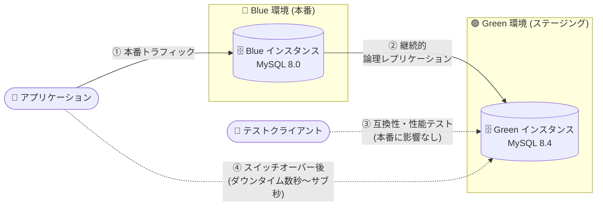

# Cloud SQL for MySQL: Blue-Green デプロイメント (Preview) とマネージドバッファプール新フラグ

**リリース日**: 2026-10-08

**サービス**: Cloud SQL for MySQL

**機能**: Blue-Green デプロイメント / `innodb_cloudsql_managed_buffer_pool_tuneup_pct` フラグ

**ステータス**: Blue-Green デプロイメント: Preview / マネージドバッファプール新フラグ: GA (Feature)

📊 [このアップデートのインフォグラフィックを見る](https://takech9203.github.io/google-cloud-news-summary/20261008-cloud-sql-mysql-blue-green-buffer-pool.html)

## 概要

2026 年 10 月 8 日、Cloud SQL for MySQL に運用性を大きく向上させる 2 つの機能が同日に発表されました。1 つ目は **Blue-Green デプロイメント (Preview)** です。MySQL 8.0 から 8.4 へのメジャーバージョンアップグレードや、ハードウェア・構成変更のステージングを、ダウンタイムを最小限に抑えながら実行できます。Cloud SQL が本番環境 (Blue) をミラーリングした独立のステージング環境 (Green) を作成し、Blue から Green への継続的な論理レプリケーションを維持します。Green 環境で本番トラフィックに影響を与えずにアプリケーションの互換性とパフォーマンスをテストし、準備ができたらスイッチオーバーをトリガーして最小限のダウンタイム (Enterprise Plus エディションでは通常 1 秒未満) で切り替えられます。

2 つ目は、マネージドバッファプール機能の新しいデータベースフラグ **`innodb_cloudsql_managed_buffer_pool_tuneup_pct`** のサポートです。マネージドバッファプールは、InnoDB バッファプールサイズを自動調整して OOM (Out-of-Memory) イベントを削減する機能です。バッファプール縮小後、インスタンスのメモリ使用率が 70% 以下で 10 分以上安定すると、Cloud SQL はバッファプールサイズを元に戻すために増加させますが、新フラグによりこの 70% のしきい値を変更できるようになりました。

いずれも、Cloud SQL for MySQL を本番運用するデータベース管理者・SRE にとって、計画メンテナンスの安全性とメモリ管理の柔軟性を高める重要なアップデートです。

**アップデート前の課題**

- MySQL のメジャーバージョンアップグレード (インプレースアップグレード) は本番インスタンスに直接適用する必要があり、事前に本番相当の環境で互換性を検証するには手動でクローンやレプリカを構築・同期する必要があった
- ハードウェア変更 (CPU/RAM スケーリング) やデータベースフラグの変更を本番適用前に検証する自動化されたワークフローがなく、切り替え時のダウンタイムも長くなりがちだった
- マネージドバッファプールのバッファプール復元 (増加) をトリガーするメモリ使用率しきい値は 70% に固定されており、ベースラインのメモリ使用率が 70% を超えるワークロードでは縮小後にバッファプールが元に戻らない、逆にスパイクが多いワークロードでは復元が早すぎて RAM の余裕を確保できない、といった調整ができなかった

**アップデート後の改善**

- Blue-Green デプロイメントにより、本番 (Blue) のミラーである Green 環境の作成、継続的論理レプリケーション、テスト、スイッチオーバーまでが自動化されたワークフローとして提供され、メジャーバージョンアップグレード (8.0 → 8.4) を最小限のダウンタイムで実行できるようになった
- 「意図 (intent) なし」のデプロイメント作成により、マシンタイプ変更やフラグ変更などの構成変更も同一バージョンのまま Green 環境でステージング・検証できるようになった
- `innodb_cloudsql_managed_buffer_pool_tuneup_pct` フラグにより、バッファプール復元のしきい値 (デフォルト 70%) をワークロード特性に合わせて調整できるようになった (しきい値を上げてベースライン使用率が高い環境でも復元を可能にする、または下げてメモリスパイクに備えた RAM を確保する)

## アーキテクチャ図



Blue-Green デプロイメントのフロー。Cloud SQL が本番 (Blue) のミラーとして Green 環境を作成し継続的に論理レプリケーションを維持、Green でテスト完了後にスイッチオーバーで接続エンドポイントを入れ替えます。

## サービスアップデートの詳細

### 主要機能

1. **Blue-Green デプロイメント (Preview)**
   - Cloud SQL が本番環境 (Blue) のクローンとしてステージング環境 (Green) を自動作成し、Blue → Green の継続的な論理レプリケーションを維持
   - Green インスタンスは `{BLUE_INSTANCE_NAME}-green-{UNIQUE_ID}` という命名パターンで自動作成される
   - **意図 (intent) ありの作成**: メジャーバージョンアップグレード用 (MySQL 8.0 → 8.4)。作成時に Cloud SQL がアップグレード事前チェック API を自動実行して互換性を検証
   - **意図なしの作成**: 現行バージョンのまま構成変更をステージング。マシンタイプ変更 (CPU/RAM)、データベースフラグのテスト、ストレージ変更の評価などに使用

2. **スイッチオーバーの自動化ワークフロー**
   - 事前検証 (レプリケーションの健全性チェック、構成チェック) → ワークフロー実行 → 接続エンドポイントの入れ替え → ロール変換 (Green が本番 Read/Write に昇格) を自動実行
   - レプリケーションラグが大きい場合やアクティブなトランザクションがブロックする場合はスイッチオーバーが失敗し、Blue 本番環境はオンラインのまま維持される (安全設計)
   - アプリケーション側の接続文字列や構成の変更は不要
   - デプロイメントは `SWITCHOVER_READY` / `SWITCHOVER_NOT_READY` / `SWITCHOVER_IN_PROGRESS` / `SWITCHOVER_COMPLETED` のライフサイクル状態で管理される

3. **`innodb_cloudsql_managed_buffer_pool_tuneup_pct` フラグ (マネージドバッファプール)**
   - マネージドバッファプール (`innodb_cloudsql_managed_buffer_pool=on`) は、メモリ使用率が高い場合に `innodb_buffer_pool_size` を反復的・動的に縮小して OOM イベントを防止する機能
   - 縮小後、メモリ使用率が 70% 以下で 10 分以上安定すると、バッファプールサイズを段階的に元の値まで増加させる
   - 新フラグでこの復元しきい値 (デフォルト 70%) を変更可能に。ベースライン使用率が 70% を超える場合はしきい値を上げて復元を可能にし、メモリスパイクに備えて RAM を確保したい場合はしきい値を下げる
   - フラグ変更にインスタンスの再起動は不要

## 技術仕様

### Blue-Green デプロイメント

| 項目 | 詳細 |
|------|------|
| ステータス | Preview |
| 対応エンジン | Cloud SQL for MySQL のみ (PostgreSQL / SQL Server は非対応) |
| 構成ステージング (意図なし) | MySQL 5.7 以降 |
| メジャーバージョンアップグレード (意図あり) | MySQL 8.0 → 8.4 (MySQL 8.0.18 は非対応) |
| スイッチオーバーのダウンタイム | Enterprise Plus: 通常サブ秒 / Enterprise: 通常 60 秒未満 (ワークロードとレプリケーションラグに依存) |
| レプリケーション方式 | Blue → Green の継続的な論理レプリケーション |
| 前提条件 | 自動バックアップとバイナリログの有効化、新ネットワークアーキテクチャ、最新メンテナンスバージョン |
| 操作インターフェース | Google Cloud コンソール、`gcloud beta sql blue-green-deployments`、Cloud SQL Admin API (`blueGreenDeployments`) |

### マネージドバッファプール関連フラグ

| フラグ | 用途 | デフォルト / 範囲 |
|------|------|------|
| `innodb_cloudsql_managed_buffer_pool` | マネージドバッファプールの有効化 (再起動不要) | off / on |
| `innodb_cloudsql_managed_buffer_pool_threshold_pct` | バッファプール縮小を開始するメモリ使用率しきい値 | デフォルト 90〜97% (RAM 容量に依存) / 50〜99 の整数 |
| `innodb_cloudsql_managed_buffer_pool_tuneup_pct` (**新規**) | バッファプール復元 (増加) をトリガーするメモリ使用率しきい値 | デフォルト 70% / メンテナンスバージョン `MYSQL_VERSION.R20260726.00_05` 以降が必要 |

マネージドバッファプールは共有コアインスタンス (f1-micro、g1-small) および MySQL 5.6 / 5.7 では有効化できません。また、調整された `innodb_buffer_pool_size` の現在値は Google Cloud コンソールには反映されないため、MySQL クライアントで `show global variables like 'innodb_buffer_pool_size';` を実行して確認します。

## 設定方法

### 前提条件

1. **Blue-Green デプロイメント**: 自動バックアップとバイナリログが有効であること、インスタンスが新ネットワークアーキテクチャを使用していること、Blue ソースインスタンスが最新メンテナンスバージョンで稼働していること、リードレプリカが存在しないこと
2. **`innodb_cloudsql_managed_buffer_pool_tuneup_pct` フラグ**: メンテナンスバージョン `MYSQL_VERSION.R20260726.00_05` 以降、マネージドバッファプールが有効であること

### 手順

#### ステップ 1: Blue-Green デプロイメントの作成

```bash
# 意図あり (メジャーバージョンアップグレード: MySQL 8.0 → 8.4)
gcloud beta sql blue-green-deployments create DEPLOYMENT_NAME \
  --source-instance=SOURCE_INSTANCE_ID \
  --target-database-version=MYSQL_8_4 \
  --region=REGION \
  --async

# 意図なし (ハードウェア・構成変更のステージング)
gcloud beta sql blue-green-deployments create DEPLOYMENT_NAME \
  --source-instance=SOURCE_INSTANCE_ID \
  --region=REGION \
  --async
```

意図ありの場合、Cloud SQL は Green インスタンス作成前にメジャーバージョンアップグレードの事前チェックを自動実行します。

#### ステップ 2: デプロイメント状態の確認とスイッチオーバー

```bash
# 状態確認 (SWITCHOVER_READY になるまで待機)
gcloud beta sql blue-green-deployments describe DEPLOYMENT_NAME \
  --region=REGION

# Green 環境でのテスト完了後、スイッチオーバーを実行
gcloud beta sql blue-green-deployments switchover DEPLOYMENT_NAME \
  --region=REGION \
  --async

# スイッチオーバー後、検証が済んだら旧 Blue インスタンスを削除して課金を停止
gcloud beta sql blue-green-deployments delete DEPLOYMENT_NAME \
  --region=REGION \
  --delete-old-source
```

#### ステップ 3: マネージドバッファプールの復元しきい値の調整

```bash
# マネージドバッファプールを有効化し、復元しきい値を 80% に変更 (再起動不要)
gcloud sql instances patch INSTANCE_NAME \
  --database-flags=EXISTING_FLAGS,innodb_cloudsql_managed_buffer_pool=on,\
innodb_cloudsql_managed_buffer_pool_tuneup_pct=80
```

ベースラインのメモリ使用率が 70% を超える環境ではしきい値を引き上げてバッファプールの復元を可能にし、メモリスパイクが頻発する環境では引き下げて RAM の余裕を維持します。

## メリット

### ビジネス面

- **計画メンテナンスのリスク低減**: 本番と同期された Green 環境で事前にフルテストできるため、メジャーバージョンアップグレードの失敗リスクと切り戻しコストを大幅に削減できる
- **ダウンタイムの最小化**: スイッチオーバーのダウンタイムは Enterprise Plus で通常サブ秒、Enterprise で通常 60 秒未満。SLA の厳しいサービスでもアップグレードを計画しやすい
- **追加機能料金なし**: Blue-Green デプロイメント自体に追加料金はない (Green インスタンス分の標準料金は発生)

### 技術面

- **自動化されたワークフロー**: 環境複製、論理レプリケーション、アップグレード事前チェック、エンドポイント入れ替えまで Cloud SQL が自動実行。手動でのレプリカ構築・DNS/接続先変更が不要
- **アプリケーション変更不要**: スイッチオーバー時に接続エンドポイントが入れ替わるため、接続文字列の変更が不要
- **安全なフェイルセーフ**: レプリケーション異常やラグ過大時はスイッチオーバーが失敗し、Blue 本番環境は影響を受けない
- **メモリ管理の柔軟性**: OOM 対策 (バッファプール縮小) と性能回復 (バッファプール復元) のバランスをワークロードに合わせてチューニング可能

## デメリット・制約事項

### 制限事項

- Blue-Green デプロイメントは Preview であり、Pre-GA 利用規約が適用される (サポートが限定される可能性あり)
- 対応は Cloud SQL for MySQL のみ (PostgreSQL / SQL Server は非対応)。メジャーバージョンアップグレードの対象は MySQL 8.0 → 8.4 のみで、MySQL 8.0.18 は非対応
- リードレプリカを持つインスタンス、Private Service Connect アウトバウンド構成、旧ネットワークアーキテクチャのインスタンスは非対応
- MySQL の IAM グループ認証とは互換性がなく、スイッチオーバー失敗の原因となる
- Green インスタンスは計画的スイッチオーバー専用であり、予期しない障害時のフェイルオーバー先としては使用できない (障害対策には高可用性構成または DR レプリカを使用)
- `innodb_cloudsql_managed_buffer_pool_tuneup_pct` はメンテナンスバージョン `MYSQL_VERSION.R20260726.00_05` 以降が必要。マネージドバッファプール自体は共有コアインスタンスと MySQL 5.6 / 5.7 では利用不可

### 考慮すべき点

- Blue と Green の両環境が存在する期間は両インスタンス分の標準料金が課金される。検証完了後は速やかにデプロイメント (と旧 Blue インスタンス) を削除する
- スイッチオーバーは書き込みの少ない時間帯に実施し、事前にレプリケーションラグ (Cloud Monitoring の `replica_lag` など) と長時間実行トランザクション・DDL の完了を確認する
- `SWITCHOVER_READY` 状態はレプリケーションの健全性のみを示し、レプリケーションラグは評価されない点に注意
- マネージドバッファプールによる `innodb_buffer_pool_size` の調整値はコンソールに反映されないため、実値は MySQL クライアントで確認する

## ユースケース

### ユースケース 1: MySQL 8.0 から 8.4 へのメジャーバージョンアップグレード

**シナリオ**: EC サイトの本番 Cloud SQL for MySQL 8.0 インスタンスを 8.4 にアップグレードしたいが、アプリケーション互換性の懸念があり、長時間の停止も許容できない。

**実装例**:
```bash
gcloud beta sql blue-green-deployments create upgrade-to-84 \
  --source-instance=prod-mysql \
  --target-database-version=MYSQL_8_4 \
  --region=asia-northeast1 \
  --async
# Green 環境 (MySQL 8.4) でアプリの互換性・性能テストを実施
# 問題なければオフピーク時間帯にスイッチオーバー
gcloud beta sql blue-green-deployments switchover upgrade-to-84 \
  --region=asia-northeast1
```

**効果**: 本番トラフィックに影響を与えずに 8.4 での動作検証を完了し、数秒程度のダウンタイムでアップグレードを完了できる。事前チェック API により互換性問題を作成時点で検出できる。

### ユースケース 2: マシンタイプ変更・フラグ変更の事前検証

**シナリオ**: 本番インスタンスのマシンタイプ変更 (スケールアップ) や性能関連フラグの変更を、本番適用前に実トラフィック相当のデータで検証したい。

**効果**: 意図なしの Blue-Green デプロイメントで現行バージョンのまま Green 環境を作成し、構成変更を安全にステージング・テストした上で最小ダウンタイムで切り替えられる。

### ユースケース 3: OOM 頻発インスタンスのメモリチューニング

**シナリオ**: ベースラインのメモリ使用率が常時 75% 前後のインスタンスでマネージドバッファプールを有効化したところ、一度縮小されたバッファプールが復元されず性能が低下したままになる。

**実装例**:
```bash
gcloud sql instances patch prod-mysql \
  --database-flags=innodb_cloudsql_managed_buffer_pool=on,\
innodb_cloudsql_managed_buffer_pool_tuneup_pct=85
```

**効果**: 復元しきい値を 85% に引き上げることで、ベースライン使用率が高い環境でもバッファプールが元のサイズに復元され、OOM 防止と読み取り性能の両立が可能になる。

## 料金

- **Blue-Green デプロイメント**: 機能自体の追加料金はなし。ただし、デプロイメント期間中は Blue と Green の両インスタンスに標準料金が課金される。スイッチオーバー前にキャンセルする場合はデプロイメントを削除して Green の課金を停止し、スイッチオーバー後は検証完了後に `--delete-old-source` フラグで旧 Blue インスタンスを削除しないと両方のインスタンスに課金が継続する
- **マネージドバッファプールフラグ**: データベースフラグの設定に追加料金はなし

詳細は [Cloud SQL 料金ページ](https://cloud.google.com/sql/pricing) を参照してください。

## 利用可能リージョン

公式ドキュメントにリージョン制限の記載はありません。最新情報は [Cloud SQL のドキュメント](https://docs.cloud.google.com/sql/docs/mysql/about-blue-green-deployments) を参照してください。なお、Green インスタンスの作成はリージョン・ゾーンのコンピュートリソース制約の影響を受ける可能性があります。

## 関連サービス・機能

- **Cloud SQL 高可用性 (HA) / DR レプリカ**: Blue-Green は計画的な変更管理用であり、予期しない障害への自動復旧には HA 構成や DR レプリカを使用する (補完関係)
- **Cloud SQL メジャーバージョンインプレースアップグレード**: 従来のアップグレード方式。Blue-Green は事前検証とダウンタイム最小化の点でこれを補完する
- **Cloud Monitoring**: スイッチオーバー前のレプリケーションラグ監視 (`replica_lag` メトリクス) や、マネージドバッファプール利用時のメモリ使用率監視に使用
- **Cloud SQL Admin API (`blueGreenDeployments`)**: Blue-Green デプロイメントのライフサイクル (create / describe / list / switchover / delete) を API で自動化可能
- **Cloud SQL セルフサービスメンテナンス**: Blue-Green の前提条件である最新メンテナンスバージョンへの更新、および新フラグに必要な `R20260726.00_05` への更新に使用

## 参考リンク

- 📊 [インフォグラフィック](https://takech9203.github.io/google-cloud-news-summary/20261008-cloud-sql-mysql-blue-green-buffer-pool.html)
- [公式リリースノート](https://docs.cloud.google.com/release-notes#October_08_2026)
- [About blue-green deployments in Cloud SQL](https://docs.cloud.google.com/sql/docs/mysql/about-blue-green-deployments)
- [Create and stage a blue-green deployment](https://docs.cloud.google.com/sql/docs/mysql/create-blue-green-deployment)
- [Switchover a blue-green deployment](https://docs.cloud.google.com/sql/docs/mysql/switchover-blue-green-deployment)
- [Enable managed buffer pool (Optimize high memory usage)](https://docs.cloud.google.com/sql/docs/mysql/optimize-high-memory-usage#enable-managed-buffer-pool)
- [Cloud SQL for MySQL database flags](https://docs.cloud.google.com/sql/docs/mysql/flags)
- [料金ページ](https://cloud.google.com/sql/pricing)

## まとめ

Blue-Green デプロイメント (Preview) により、Cloud SQL for MySQL のメジャーバージョンアップグレードや構成変更を、本番同期済みのステージング環境で検証した上で数秒程度のダウンタイムで実行できるようになりました。MySQL 8.0 を運用中のチームは、8.4 へのアップグレード計画に本機能の活用を検討する価値があります。あわせて、OOM 対策としてマネージドバッファプールを利用している場合は、新しい `innodb_cloudsql_managed_buffer_pool_tuneup_pct` フラグでワークロードに合わせた復元しきい値のチューニングを検討してください (要メンテナンスバージョン `R20260726.00_05` 以降)。

---

**タグ**: Cloud SQL, MySQL, Blue-Green デプロイメント, メジャーバージョンアップグレード, MySQL 8.4, InnoDB, バッファプール, OOM 対策, データベースフラグ, Preview
