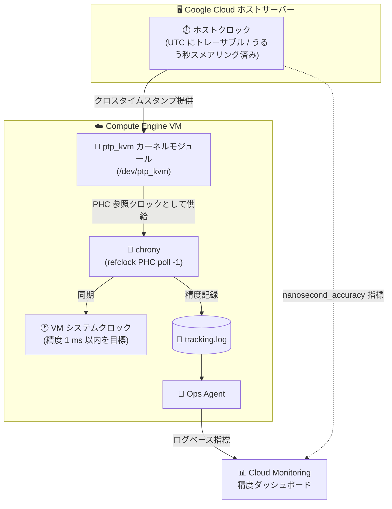

# Compute Engine: 高精度時刻同期 (Accurate Time) が GA

**リリース日**: 2026-10-08

**サービス**: Compute Engine

**機能**: chrony と ptp_kvm によるホストクロック同期 (1 ms 以内の精度を目標とした高精度時刻同期)

**ステータス**: GA (一般提供)

📊 [このアップデートのインフォグラフィックを見る](https://takech9203.github.io/google-cloud-news-summary/20261008-compute-engine-accurate-time-sync-ga.html)

## 概要

Compute Engine VM のシステムクロックを、ホストサーバーのクロックと直接同期する「高精度時刻同期 (Accurate Time)」が一般提供 (GA) になりました。chrony と Linux カーネルの `ptp_kvm` モジュールを組み合わせることで、ネットワーク経由の NTP を介さずにホストの高精度クロックを参照でき、**1 ms 以内の精度**を目標とした時刻同期を実現します。

従来、Compute Engine VM はメタデータサーバー (`metadata.google.internal`) を NTP ソースとする時刻同期が標準でした。NTP はネットワーク遅延や仮想化レイヤーの変動の影響を受けるため、より厳密な時刻精度を必要とするワークロード (金融取引、分散データベース、ログの時系列相関分析など) には十分でないケースがありました。今回の GA により、すべての標準的な公開 Google Cloud リージョンとゾーンで、サポート対象のマシンタイプ・OS においてホストクロックベースの高精度時刻同期を本番環境で利用できます。

このアップデートは、イベントの正確な順序付けやタイムスタンプの監査可能性 (トレーサビリティ) が重要なシステムを運用する Solutions Architect、SRE、金融・分散システムの開発者が主な対象です。

**アップデート前の課題**

- 標準の NTP ベースの時刻同期では、ネットワーク遅延や仮想化レイヤーの変動により、ミリ秒未満の厳密な時刻精度を保証することが難しかった
- ライブマイグレーションなどのイベント後に、NTP のポーリング間隔の長さに起因してクロックのずれが大きくなることがあった
- VM クロックの UTC に対する精度を体系的に監視・監査する標準的な仕組みを、ユーザー自身で構築する必要があった

**アップデート後の改善**

- `ptp_kvm` 経由でホストの高精度クロックを直接参照し、ネットワークや仮想化の変動の影響を受けにくい、**1 ms 以内の精度を目標とした**時刻同期が GA として利用可能になった
- すべての標準的な公開 Google Cloud リージョン・ゾーンでサポートされ、本番ワークロードに適用できるようになった
- Google Cloud 指標 `instance/clock_accuracy/ptp_kvm/nanosecond_accuracy` と chrony のトラッキングログを組み合わせ、VM クロックの UTC へのトレーサビリティを Cloud Monitoring ダッシュボードで可視化できるようになった

## アーキテクチャ図



ホストクロックが `ptp_kvm` を通じて VM に供給され、chrony がそれを参照クロック (PHC) として VM のシステムクロックを同期します。精度は chrony のトラッキングログと Google Cloud 指標を組み合わせて Cloud Monitoring で監視できます。

## サービスアップデートの詳細

### 主要機能

1. **ptp_kvm によるホストクロック直接参照**
   - VM がプラットフォーム提供クロックと VM CPU クロック (サイクルカウンター) のクロスタイムスタンプを読み取る仕組み
   - ネットワークや仮想化レイヤーの変動の影響を受けにくく、NTP よりも安定した同期が可能
   - chrony の設定に `refclock PHC /dev/ptp_kvm poll -1` を追加して利用する

2. **1 ms 以内の精度を目標とした設計**
   - サポートされる構成において、VM クロックとホストクロックの誤差が 1 ms 以内となるよう設計されている
   - Google のクロックはうるう秒スメアリングを行っているため、タイムスタンプの逆行 (リピート) を避けられる

3. **時刻精度の監視・監査**
   - chrony のトラッキングログ (`/var/log/chrony/tracking.log`) を Ops Agent で収集し、ログベース指標を作成
   - ホストクロックの UTC に対する精度を示す Google Cloud 指標 `instance/clock_accuracy/ptp_kvm/nanosecond_accuracy` と組み合わせ、VM クロックの UTC トレーサビリティをダッシュボードで可視化

4. **全標準リージョン・ゾーンでの GA**
   - サポート対象のマシンタイプと OS において、すべての標準的な公開 Google Cloud リージョン・ゾーンで利用可能

## 技術仕様

### NTP と高精度時刻同期 (PTP ベース) の比較

| 項目 | NTP (従来のデフォルト) | 高精度時刻同期 (今回 GA) |
|------|------------------------|--------------------------|
| 時刻ソース | メタデータサーバー (`metadata.google.internal`) | ホストクロック (`/dev/ptp_kvm`) |
| 同期経路 | ネットワーク経由 (NTP プロトコル) | ハイパーバイザー経由のクロスタイムスタンプ |
| 精度 | ネットワーク遅延に依存 | 1 ms 以内を目標とした設計 |
| うるう秒処理 | Google NTP のスメアリング | ホストクロック側でスメアリング済み |
| 精度の監視 | 標準的な仕組みなし | chrony ログ + Cloud Monitoring 指標 |
| 設定 | デフォルトで有効 | chrony + ptp_kvm の構成が必要 |

### サポート対象マシンタイプ

| シリーズ | マシンタイプ |
|----------|--------------|
| 汎用 (Intel) | C3、C4 |
| 汎用 (AMD) | C3D、C4D |

### サポート対象 OS (主なもの)

| OS | バージョン |
|----|-----------|
| CentOS Stream | 9 |
| Container-Optimized OS | COS 105 / 109 / 113 / 117 LTS |
| Debian | 11 (Bullseye)、12 (Bookworm) |
| Fedora Cloud | 39 |
| RHEL | 8、9 (SAP HA イメージ含む) |
| Rocky Linux | 8、9 |
| SLES | 15 (BYOS / SAP イメージ含む) |
| Ubuntu | 22.04 LTS、24.04 LTS |
| Ubuntu Pro | 20.04 LTS |

## 設定方法

### 前提条件

1. サポート対象のマシンタイプ (C3、C4、C3D、C4D) とサポート対象 OS を使用した VM であること
2. 時刻精度の監視を行う場合、VM のサービスアカウントに `roles/monitoring.metricWriter` と `roles/logging.logWriter` が付与されていること

### 手順

#### ステップ 1: chrony を ptp_kvm の参照クロックとして構成

```bash
# ptp_kvm カーネルモジュールをロード (起動時にも自動ロード)
/sbin/modprobe ptp_kvm
echo "ptp_kvm" > /etc/modules-load.d/ptp_kvm.conf

# NTP サーバー設定を無効化 (混在によるクロック精度低下を防止)
sed -i '/^server /d' /etc/chrony/chrony.conf
sed -i '/^pool /d' /etc/chrony/chrony.conf

# ホストクロックはうるう秒スメアリング済みのため leapsectz を無効化
sed "s/^leapsectz/#leapsectz/" -i /etc/chrony/chrony.conf

# PTP-KVM ベースの参照クロックとトラッキングログを設定
echo "refclock PHC /dev/ptp_kvm poll -1" >> /etc/chrony/chrony.conf
echo "log tracking" >> /etc/chrony/chrony.conf

# chrony を再起動
systemctl restart chronyd
```

NTP サーバーを併用すると、ライブマイグレーションイベント後などにクロック同期へ悪影響を与える可能性があるため、公式手順では NTP ソースを削除し ptp_kvm のみを時刻ソースとします。

#### ステップ 2: Ops Agent で精度ログを収集 (監視を行う場合)

```yaml
# /etc/google-cloud-ops-agent/config.yaml
logging:
  receivers:
    chrony_tracking_receiver:
      type: files
      include_paths:
        - /var/log/chrony/tracking.log
  processors:
    chrony_tracking_processor:
      type: parse_regex
      regex: "^.*PHC0.* (?<max_error>[-\\d\\.eE]+)$"
  service:
    pipelines:
      chrony_tracking_pipeline:
        receivers: [chrony_tracking_receiver]
        processors: [chrony_tracking_processor]
```

Ops Agent 設定後、プロジェクトでログベース指標とダッシュボードを作成するスクリプト (公式ドキュメント参照) を実行すると、VM クロックの UTC トレーサビリティを可視化できます。

#### ステップ 3: 同期状態の確認

```bash
chronyc sources
chronyc sourcestats
```

`PHC0` (ptp_kvm) が時刻ソースとして表示され、オフセットが小さい値で安定していれば設定は成功です。

## メリット

### ビジネス面

- **規制・監査要件への対応**: 金融取引など、タイムスタンプの精度とトレーサビリティが規制上要求されるワークロードを Google Cloud 上で構築しやすくなる
- **GA による本番適用**: Preview ではなく GA ステータスとなったことで、SLA を重視する本番システムへ安心して導入できる

### 技術面

- **高精度かつ安定した同期**: ネットワーク変動や仮想化オーバーヘッドの影響を受けにくく、1 ms 以内の精度を目標とした同期が得られる
- **タイムスタンプの単調性**: うるう秒スメアリングにより、タイムスタンプの逆行・重複を回避できる
- **精度の可観測性**: chrony トラッキングログと `nanosecond_accuracy` 指標により、時刻精度そのものを継続的に監視・証明できる

## デメリット・制約事項

### 制限事項

- サポート対象マシンタイプは C3、C4、C3D、C4D に限られる (N 系や E2 などは対象外)
- サポート対象 OS が限定されており、対象外の OS・イメージでは利用できない
- デフォルトでは有効にならず、VM ごとに chrony と ptp_kvm の構成が必要

### 考慮すべき点

- 公式手順では NTP ソースを無効化するため、NTP との精度比較を行いたい場合は変更を加えない chrony の 2 つ目のインスタンスを別途実行する必要がある
- うるう秒はホストクロック側でスメアリングされるため、chrony 側の `leapsectz` 設定は無効化する必要がある
- Google Cloud 外部のシステムと時刻を揃える場合は、同じスメアリング方式を採用する Google Public NTP を外部システム側で利用するなど、スメアリング方式の混在を避ける設計が必要

## ユースケース

### ユースケース 1: 金融取引システムのタイムスタンプ精度確保

**シナリオ**: 証券取引や決済処理において、約定イベントの正確な順序付けと、規制対応のためのタイムスタンプ監査証跡が求められる。

**実装例**:
```bash
# C4 インスタンスで高精度時刻同期を構成し、
# Cloud Monitoring ダッシュボードで精度を常時監視
gcloud compute instances create trading-vm \
  --machine-type=c4-standard-8 \
  --image-family=debian-12 --image-project=debian-cloud \
  --metadata-from-file=startup-script=configure-time-sync.sh
```

**効果**: 1 ms 以内を目標とした精度でイベントを時刻順に記録でき、クロック精度の監視データを監査証跡として活用できる。

### ユースケース 2: 分散データベース・分散システムの整合性向上

**シナリオ**: 複数ノードにまたがる分散データベースで、タイムスタンプベースの順序付け (コミットタイムスタンプなど) に依存しており、ノード間のクロックずれが整合性やパフォーマンスに影響する。

**効果**: 各ノードのクロックがホストクロック経由で高精度に同期されることで、クロック不確実性のマージンを小さくでき、トランザクション順序付けの信頼性が向上する。

### ユースケース 3: マイクロサービスのログ相関・分散トレーシング

**シナリオ**: 多数の VM にまたがるマイクロサービスの障害調査で、サービス間のログをタイムスタンプで突き合わせてイベントの因果関係を特定したい。

**効果**: VM 間のクロックずれが 1 ms 以内を目標に抑えられるため、ログの時系列相関の精度が上がり、障害の根本原因分析が容易になる。

## 料金

高精度時刻同期の機能自体に対する個別の料金は、リリースノートおよびドキュメントに記載されていません。VM の料金 (サポート対象マシンタイプ C3 / C4 / C3D / C4D) と、監視に Ops Agent / Cloud Monitoring を利用する場合の料金が適用されます。詳細は料金ページを参照してください。

- [Compute Engine の料金](https://cloud.google.com/compute/all-pricing)
- [Google Cloud Observability の料金](https://cloud.google.com/stackdriver/pricing)

## 利用可能リージョン

サポート対象のマシンタイプと OS において、**すべての標準的な公開 Google Cloud リージョンとゾーン**でサポートされています。

## 関連サービス・機能

- **Cloud Monitoring / Ops Agent**: chrony のトラッキングログを収集してログベース指標を作成し、`instance/clock_accuracy/ptp_kvm/nanosecond_accuracy` 指標と組み合わせて時刻精度ダッシュボードを構築
- **Google Kubernetes Engine (GKE)**: ノードのシステム構成カスタマイズ (DaemonSet / node system config) により、GKE ノードにも同様の時刻同期設定を適用可能
- **Google Public NTP**: Google Cloud 外部のシステムをスメアリング済み時刻に同期させる場合に利用し、スメアリング方式の混在を回避
- **超低遅延 (ULL) ソリューション**: さらに高い精度が必要な金融向けワークロードでは、NIC の PTP ハードウェアクロックを利用する専用構成も提供されている

## 参考リンク

- 📊 [インフォグラフィック](https://takech9203.github.io/google-cloud-news-summary/20261008-compute-engine-accurate-time-sync-ga.html)
- [公式リリースノート](https://docs.cloud.google.com/release-notes#October_08_2026)
- [Configure accurate time for Compute Engine VMs](https://docs.cloud.google.com/compute/docs/instances/time-synchronization/configure-time-sync)
- [Configure NTP on a VM](https://docs.cloud.google.com/compute/docs/instances/time-synchronization/configure-ntp)
- [Compute Engine の料金](https://cloud.google.com/compute/all-pricing)

## まとめ

Compute Engine の高精度時刻同期が GA となり、chrony と ptp_kvm によるホストクロック同期で 1 ms 以内を目標とした時刻精度を、すべての標準リージョン・ゾーンの本番環境で利用できるようになりました。金融取引、分散データベース、ログ相関分析など時刻精度が重要なワークロードを運用している場合は、まず C3 / C4 系インスタンスとサポート対象 OS で構成を検証し、Cloud Monitoring による精度監視とあわせて導入を検討することを推奨します。

---

**タグ**: Compute Engine, 時刻同期, chrony, ptp_kvm, PTP, NTP, GA, 金融, 分散システム, Cloud Monitoring
