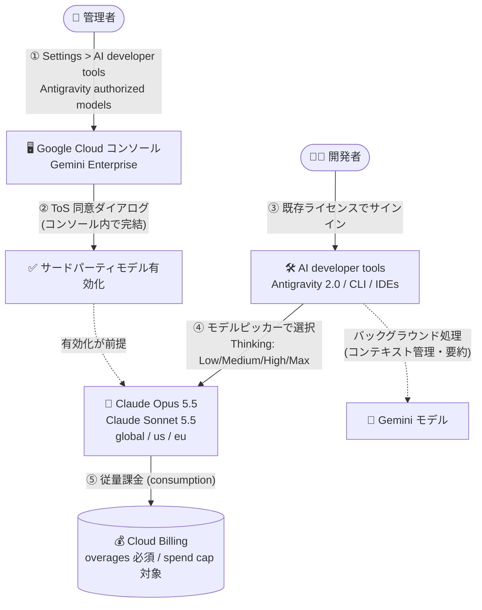

# Gemini Enterprise: AI developer tools で Anthropic Claude Opus 5.5 / Claude Sonnet 5.5 が利用可能に

**リリース日**: 2026-10-08

**サービス**: Gemini Enterprise

**機能**: AI developer tools (Antigravity) におけるサードパーティモデル Claude Opus 5.5 / Claude Sonnet 5.5 のサポート

**ステータス**: Feature

📊 [このアップデートのインフォグラフィックを見る](https://takech9203.github.io/google-cloud-news-summary/20261008-gemini-enterprise-claude-opus-sonnet-5-5.html)

## 概要

Gemini Enterprise の AI developer tools (Antigravity 2.0、Antigravity CLI、Antigravity for IDEs) で、Anthropic の Claude Opus 5.5 (`claude-opus-5-5`) と Claude Sonnet 5.5 (`claude-sonnet-5-5`) を管理者が有効化できるようになりました。サードパーティモデルはデフォルトで無効になっており、管理者によるオプトインが必要です。

最大のポイントは、Google Cloud コンソール内で完結する利用規約 (Terms of Service) 同意フローです。管理者は **Gemini Enterprise > Settings > AI developer tools > Antigravity authorized models** から、Anthropic の別アカウントやオンボーディング手続きなしに直接オプトインできます。開発者は既存の Gemini Enterprise ライセンスでサインインしたまま、モデルピッカーで Claude モデルを Low / Medium / High / Max の 4 段階の Thinking レベル付きで選択できます (デフォルトは Medium)。

サードパーティモデルの利用は Cloud Billing アカウントへの従量課金 (consumption billing) として請求され、プロジェクトの支出上限 (spend cap) の対象になります。有効化の前提として overages (プール済みクォータ超過分の従量課金) をオンにしておく必要があります。組織の AI コーディング環境に Gemini と Claude を併用したいエンタープライズの管理者・開発者に向けたアップデートです。

**アップデート前の課題**

- Gemini Enterprise の AI developer tools (Antigravity) では Google 製の Gemini モデルのみが利用対象で、Anthropic Claude などサードパーティモデルを組織のガバナンス配下で選択できなかった
- サードパーティモデルを使うには、別途プロバイダーとの契約・アカウント作成・オンボーディングが必要になるのが一般的だった
- サードパーティモデルの利用コストを Google Cloud の請求・支出管理の枠組みに統合できなかった

**アップデート後の改善**

- 管理者が Google Cloud コンソール内の同意フローだけで Claude Opus 5.5 / Claude Sonnet 5.5 を有効化でき、Anthropic の別アカウントやオンボーディングが不要になった
- 開発者は既存の Gemini Enterprise ライセンスのまま、Antigravity のモデルピッカーで Claude モデルを Thinking レベル (Low / Medium / High / Max) 付きで選択できるようになった
- サードパーティモデルの利用料金が Cloud Billing の従量課金として一元管理され、プロジェクトの月次支出上限 (全モデル共通) でコスト制御できるようになった

## アーキテクチャ図



管理者がコンソール内の同意フローで Claude モデルを有効化すると、開発者は Antigravity のモデルピッカーから Thinking レベル付きで Claude を選択でき、利用料金は Cloud Billing の従量課金として一元管理されます。

## サービスアップデートの詳細

### 主要機能

1. **コンソール内で完結する ToS 同意フロー**
   - 管理者は Gemini Enterprise > Settings > AI developer tools タブ > Antigravity authorized models でモデルごとのトグルをオンにし、埋め込みの利用規約ダイアログで同意するだけで有効化できる
   - Anthropic の別アカウント作成やオンボーディング手続きは不要
   - サードパーティモデルはデフォルトで無効 (Gemini モデルはライセンスユーザーに対してデフォルトで有効)

2. **Thinking レベル付きのモデル選択**
   - 開発者はモデルピッカーで Claude Opus 5.5 / Claude Sonnet 5.5 を Low / Medium / High / Max の 4 段階の Thinking レベルで選択できる (例: 「Claude Opus 5.5 (High)」)。デフォルトは Medium
   - モデルを有効化すると、そのモデルのすべての Thinking レベルが開発者に提供される。個別の Thinking レベルだけを制限することはできない

3. **Cloud Billing への従量課金統合**
   - サードパーティモデルの利用は Cloud Billing アカウントへの従量課金 (pay-as-you-go) として請求される
   - 有効化の前提として overages (プール済みクォータ超過分の従量課金) をオンにする必要がある。後から overages をオフにすると、再度オンにするまで開発者はサードパーティモデルを利用できない
   - 利用料金はプロジェクトの月次支出上限 (spend cap) の対象で、この上限は Gemini を含むすべてのモデルに適用される

4. **ハイブリッド実行モデル**
   - 開発者が Claude モデルを主要な推論・計画・ツールオーケストレーション・コード生成に選択した場合でも、Antigravity はコンテキスト管理や要約などのクライアントサイド調整に軽量な Gemini モデルを、画像生成に Gemini 3 Pro Image をバックグラウンドで引き続き使用する
   - Gemini モデルの利用は組織のプール済みエディションクレジットから消費され、サードパーティモデルは従量課金になる

## 技術仕様

### 対象モデルとツール

| 項目 | 詳細 |
|------|------|
| 追加モデル | Anthropic Claude Opus 5.5 (`claude-opus-5-5`)、Anthropic Claude Sonnet 5.5 (`claude-sonnet-5-5`) |
| 対象ツール | Antigravity 2.0、Antigravity CLI、Antigravity for IDEs |
| デフォルト状態 | 無効 (管理者のオプトインと ToS 同意が必要) |
| Thinking レベル | Low / Medium / High / Max (デフォルト: Medium)。レベル単位の制限は不可 |
| 推論ロケーション | global、us、eu (国別リージョンは非対応) |
| 課金 | Cloud Billing への従量課金。overages の有効化が前提。プロジェクトの spend cap の対象 |
| データ取り扱い | プロンプトとレスポンスはモデルの学習に使用されない。Gemini モデルと同じ処理・保護が適用される |

### データレジデンシーと利用地域

- サードパーティモデルの推論は global / us / eu ロケーションでのみ利用可能で、国別リージョン (in-country regions) はサポートされない
- モデルにアクセスできる国・地域は Anthropic の [Supported countries and regions](https://www.anthropic.com/supported-countries) に準拠する
- Anthropic はリセラーに関するポリシーを適用しており、禁止対象のリセラーが管理する Cloud Billing アカウントでは ToS への同意や Claude モデルの有効化ができない (この場合はリセラーへの問い合わせが必要)

### トークン使用量のログ構造

各推論呼び出しは `businessaicode.googleapis.com/inference_response` ログに記録され、Cloud Logging / Observability Analytics で集計できます。

```json
{
  "logName": "projects/[PROJECT_ID]/logs/businessaicode.googleapis.com%2Finference_response",
  "labels": {
    "model": "claude-sonnet-5-5",
    "model_provider": "Anthropic",
    "client_name": "antigravity_cli",
    "user_id": "user:user@example.com"
  },
  "jsonPayload": {
    "metadata": {
      "promptTokenCount": "70825",
      "cachedContentTokenCount": "69079",
      "candidatesTokenCount": "14215",
      "totalTokenCount": "85040"
    }
  }
}
```

## 設定方法

### 前提条件

1. Gemini Enterprise Administrator ロールを保有していること
2. プロジェクトが請求書払い (invoiced) の Cloud Billing アカウントにリンクされ、ライセンスベースのエディション (Standard、Plus、Frontline、EDU、Emerging Market など) のアクティブな (無料トライアルでない) サブスクリプションが 1 つ以上あること
3. overages (Pay-as-you-go usage above quota) が有効化されていること

### 手順

#### ステップ 1: overages を有効化する

1. Google Cloud コンソールで **Gemini Enterprise > Usage & Spending** に移動
2. **Usage** タブを選択し、構成するエディションを選択
3. **Feature usage > Pay-as-you-go usage above quota** のトグルを **Enabled** にして保存

意図しない課金を防ぐため、あわせて月次支出上限の設定を推奨します (Cloud Billing の予算でサービススコープに **Vertex AI (aiplatform.googleapis.com)** を選択)。

#### ステップ 2: サードパーティモデルを有効化する

1. Google Cloud コンソールで **Gemini Enterprise** に移動
2. **Settings** をクリックし、**AI developer tools** タブを選択
3. **Antigravity authorized models** 設定で、有効化するサードパーティモデルのトグルをオンにする
4. 表示される埋め込みの Terms of Service ダイアログで、サードパーティの利用規約を確認して同意する

#### ステップ 3: 開発者がモデルを選択する

開発者は既存の Gemini Enterprise ライセンスで Antigravity にサインインし、モデルピッカーで Claude Opus 5.5 または Claude Sonnet 5.5 を Thinking レベル付き (例: Claude Opus 5.5 (High)) で選択します。

## メリット

### ビジネス面

- **調達・契約の簡素化**: Anthropic との個別契約やアカウント作成が不要で、Google Cloud コンソール内の同意フローだけで利用を開始できる
- **コストガバナンスの一元化**: サードパーティモデルの利用料金が Cloud Billing に統合され、全モデル共通の月次支出上限と予算アラートでコストを制御できる
- **ガバナンス下でのモデル選択肢拡大**: 管理者が認可したモデルのみを開発者に提供でき、組織のポリシーに沿って Gemini と Claude を併用できる

### 技術面

- **タスクに応じたモデル使い分け**: 高度な推論が必要なタスクは Claude Opus 5.5、バランス重視のタスクは Claude Sonnet 5.5 と、Thinking レベルも含めて開発者が選択できる
- **データ保護の一貫性**: サードパーティモデル利用時もプロンプトと必要なコードコンテキストのみが送信され、Gemini モデルと同じ処理・保護が適用される。プロンプトとレスポンスはモデルの学習に使用されない
- **可観測性**: Cloud Logging の `inference_response` ログからモデル別・日別・ユーザー別のトークン使用量を Observability Analytics の SQL で集計し、Cloud Monitoring ダッシュボードに固定できる

## デメリット・制約事項

### 制限事項

- サードパーティモデルの推論は global / us / eu ロケーションのみで、国別リージョン (in-country regions) はサポートされない
- Thinking レベルを個別に制限することはできない (モデルを有効化するとすべてのレベルが利用可能になる)
- overages の有効化が前提のため、請求書払いの Cloud Billing アカウントとアクティブなライセンスベースのサブスクリプションが必要
- Anthropic が禁止するリセラー経由の Cloud Billing アカウントでは、ToS 同意とモデル有効化ができない
- モデルプロバイダーが組織のアクセスを制限した場合、開発者はそのモデルを利用できなくなる (解決には Google Cloud サポートへの問い合わせが必要)

### 考慮すべき点

- サードパーティモデルは従量課金のため、spend cap (月次支出上限) を設定しないとプール済みクォータ超過後の利用がすべて従量課金で継続する。意図しない課金を防ぐために月次支出上限の設定が強く推奨される
- 使用停止処理の反映には数分かかる場合があり、設定した上限をわずかに超える課金が発生する可能性がある
- Claude モデルを選択していても、Antigravity はバックグラウンドで軽量な Gemini モデル (コンテキスト管理・要約) と Gemini 3 Pro Image (画像生成) を使用し、これらも課金対象になり得る
- Gemini Enterprise で有効化しても Gemini Enterprise Agent Platform の組織ポリシーは上書きされないため、両プラットフォームで許可モデルを揃えておく必要がある
- トークン使用量の追跡には Metadata logging の有効化と、_Default ログバケットの Observability Analytics へのアップグレードが必要 (アップグレードは元に戻せない)

## ユースケース

### ユースケース 1: 組織標準の AI コーディング環境でのマルチモデル提供

**シナリオ**: プラットフォームチームが Antigravity を全社の AI コーディングツールとして展開しており、開発者からタスクに応じて Claude も使いたいという要望がある。

**実装例**:
```
1. Usage & Spending で overages を有効化し、Vertex AI スコープの月次支出上限を設定
2. Settings > AI developer tools > Antigravity authorized models で
   Claude Opus 5.5 / Claude Sonnet 5.5 のトグルをオンにして ToS に同意
3. 開発者は IDE / CLI のモデルピッカーで用途に応じてモデルと Thinking レベルを選択
```

**効果**: 個別契約なしで数分でマルチモデル環境を提供でき、コストは Cloud Billing の支出上限で統制できる。

### ユースケース 2: モデル別・ユーザー別のトークンコスト配賦

**シナリオ**: FinOps チームが、サードパーティモデルの利用コストをチーム別・ユーザー別に可視化したい。

**実装例**:
```sql
SELECT
  JSON_VALUE(labels.user_id) AS user_id,
  JSON_VALUE(labels.model) AS model,
  COUNT(*) AS requests,
  SUM(SAFE_CAST(JSON_VALUE(json_payload.metadata.totalTokenCount) AS INT64)) AS total_tokens
FROM `[PROJECT_ID].global._Default._Default`
WHERE log_id = "businessaicode.googleapis.com/inference_response"
  AND JSON_VALUE(labels.model_provider) = "Anthropic"
  AND timestamp >= TIMESTAMP_SUB(CURRENT_TIMESTAMP(), INTERVAL 30 DAY)
GROUP BY user_id, model
ORDER BY total_tokens DESC
```

**効果**: Observability Analytics でモデル別・ユーザー別のトークン消費を集計し、Cloud Monitoring ダッシュボードに固定して継続的に監視できる。

## 料金

サードパーティモデルの利用は、Gemini Enterprise のプール済みエディションクレジットではなく、Cloud Billing アカウントへの従量課金 (consumption / pay-as-you-go) として請求されます。利用には overages の有効化が前提で、プロジェクトの月次支出上限 (全モデル共通) の対象になります。Gemini Enterprise と AI developer tools の overages は Vertex AI API (aiplatform.googleapis.com) 配下で請求されます。

具体的な単価は Cloud Billing SKU ページを参照してください。

- [Anthropic Claude Opus 5.5 の SKU](https://cloud.google.com/skus?filter=opus&currency=USD)
- [Anthropic Claude Sonnet 5.5 の SKU](https://cloud.google.com/skus?filter=sonnet&currency=USD)

## 利用可能リージョン

サードパーティモデルの推論は以下のロケーションで利用可能です。

| ロケーション | 対応状況 |
|--------------|----------|
| global | 対応 |
| us | 対応 |
| eu | 対応 |
| 国別リージョン (in-country regions) | 非対応 |

モデルにアクセスできる国・地域の一覧は [Anthropic の Supported countries and regions](https://www.anthropic.com/supported-countries) を参照してください。

## 関連サービス・機能

- **Antigravity (2.0 / CLI / for IDEs)**: 今回のアップデートの対象となる AI developer tools。モデルピッカーで Claude モデルを選択できる
- **Gemini Enterprise Agent Platform**: Claude などのパートナーモデルを MaaS (Model as a Service) として提供するプラットフォーム。モデルカード (Claude Opus 5.5 / Sonnet 5.5) もここで公開されている。組織ポリシーの許可モデルを Gemini Enterprise 側の設定と揃える必要がある
- **Cloud Billing**: サードパーティモデルの従量課金、月次支出上限 (spend cap)、予算アラートによるコスト管理
- **Cloud Logging / Observability Analytics**: `inference_response` ログによるモデル別・日別・ユーザー別のトークン使用量の集計
- **Cloud Monitoring**: トークン使用量の SQL チャートやログベース指標のダッシュボード化・アラート設定

## 参考リンク

- 📊 [インフォグラフィック](https://takech9203.github.io/google-cloud-news-summary/20261008-gemini-enterprise-claude-opus-sonnet-5-5.html)
- [公式リリースノート](https://docs.cloud.google.com/release-notes#October_08_2026)
- [Configure AI developer tools settings (モデル有効化手順)](https://docs.cloud.google.com/gemini/enterprise/docs/ai-developer-tools-settings#enable-third-party-models)
- [Configure overages](https://docs.cloud.google.com/gemini/enterprise/docs/configure-overages)
- [Quotas and overages](https://docs.cloud.google.com/gemini/enterprise/docs/quotas-and-overages)
- [Track third-party model token usage](https://docs.cloud.google.com/gemini/enterprise/docs/ai-developer-tools-track-token-usage)
- [Claude Opus 5.5 モデルカード](https://docs.cloud.google.com/gemini-enterprise-agent-platform/models/partner-models/claude/opus-5-5)
- [Claude Sonnet 5.5 モデルカード](https://docs.cloud.google.com/gemini-enterprise-agent-platform/models/partner-models/claude/sonnet-5-5)

## まとめ

Gemini Enterprise の AI developer tools に Anthropic Claude Opus 5.5 / Claude Sonnet 5.5 が加わり、コンソール内の同意フローだけでサードパーティモデルを組織のガバナンスとコスト管理の枠組みに統合できるようになりました。導入する場合は、まず overages の有効化と月次支出上限の設定を行い、Metadata logging と Observability Analytics によるトークン使用量の可視化もあわせて整備することを推奨します。

---

**タグ**: Gemini Enterprise, Antigravity, Anthropic Claude, Claude Opus 5.5, Claude Sonnet 5.5, AI developer tools, サードパーティモデル, Cloud Billing, 従量課金
