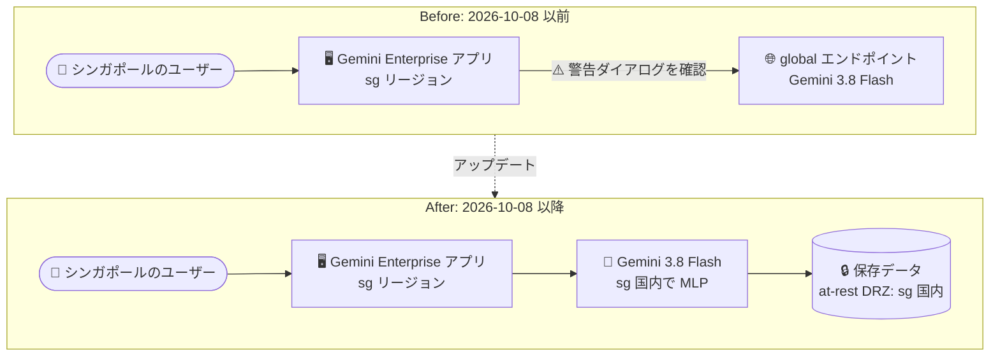

# Gemini Enterprise: Gemini 3.8 Flash がシンガポールリージョンで GA

**リリース日**: 2026-10-08

**サービス**: Gemini Enterprise

**機能**: Gemini 3.8 Flash のシンガポール (sg) インカントリーリージョン提供 (データレジデンシー対応)

**ステータス**: GA (一般提供)

📊 [このアップデートのインフォグラフィックを見る](https://takech9203.github.io/google-cloud-news-summary/20261008-gemini-enterprise-gemini-3-8-flash-singapore.html)

## 概要

Gemini Enterprise において、Gemini 3.8 Flash がシンガポール (`sg`) インカントリーリージョンで一般提供 (GA) になりました。保存データのデータレジデンシー (at-rest DRZ: Data Residency Zone) と機械学習処理 (MLP: Machine Learning Processing) の両方がシンガポール国内で完結します。

Gemini 3.8 Flash は、ソフトウェアエンジニアリング、エージェントタスク、専門領域における複数ステップの推論で Gemini 3.7 Flash から大幅な性能向上を実現した「ワークホース」モデルです。2026 年 9 月 2 日に `global`、`us`、`eu` リージョンで GA になっており、今回インカントリーリージョンとして初めてシンガポールが追加されました。

このアップデートは、データ主権やコンプライアンス要件によりシンガポール国内でのデータ保存・処理が求められる金融・公共・医療などの組織にとって重要です。なお、インカントリーリージョンの利用は GA with allowlist (許可リスト制) であり、利用には Google アカウントチームへの連絡が必要です。

**アップデート前の課題**

- Gemini 3.8 Flash の at-rest DRZ と MLP は `us` / `eu` マルチリージョンでのみサポートされており、インカントリーリージョンでは利用できなかった
- シンガポールリージョン (`sg`) のユーザーが Gemini 3.8 Flash を使うには、警告ダイアログを確認したうえでトラフィックを `global` エンドポイントにルーティングする必要があり、データレジデンシー要件を満たせなかった
- データレジデンシーを維持したままインカントリーリージョンで利用できる最新世代モデルは Gemini 3.5 Flash に限られていた

**アップデート後の改善**

- シンガポール (`sg`) リージョンで Gemini 3.8 Flash が GA になり、at-rest DRZ と MLP の両方が国内で完結するようになった
- `sg` リージョンでは Gemini 3.8 Flash がデフォルトで有効化され、管理者は Gemini Enterprise アプリのトグルでオン/オフを制御できる
- シンガポールのデータレジデンシー要件を持つ組織が、`global` エンドポイントへのルーティングなしで最新のワークホースモデルを利用できるようになった

## アーキテクチャ図

アップデート前はシンガポールのユーザーが Gemini 3.8 Flash を使うには `global` エンドポイントへのルーティングが必要でしたが、アップデート後は保存データ (DRZ) と機械学習処理 (MLP) の両方がシンガポール国内で完結します。

## サービスアップデートの詳細

### 主要機能

1. **シンガポール (sg) での Gemini 3.8 Flash GA**
   - Gemini Enterprise のインカントリーリージョン `sg` で Gemini 3.8 Flash が一般提供
   - at-rest DRZ (保存データのレジデンシー) と MLP (機械学習処理) の両方をシンガポール国内でサポート
   - `global`、`us`、`eu` リージョンと同様に、`sg` リージョンではデフォルトで有効

2. **管理者によるモデル制御**
   - 管理者は Gemini Enterprise アプリの「Gemini 3.8 Flash」トグルでモデルの有効/無効を切り替え可能
   - モデルセレクターを有効にすると、ユーザーが Web アプリで使用するモデルを選択できる

3. **Gemini 3.8 Flash モデルの特長**
   - ソフトウェアエンジニアリング、エージェントタスク、専門領域での複数ステップ推論において Gemini 3.7 Flash から大幅に性能向上
   - 高コストなフロンティアモデルに迫る性能を発揮することもあるワークホースモデル
   - `thinking_level` は `LOW`、`MEDIUM` (デフォルト)、`HIGH` をサポート (`MINIMAL` は非対応)

## 技術仕様

### インカントリーリージョンにおけるモデル対応状況

| 項目 | 詳細 |
|------|------|
| 対象サービス | Gemini Enterprise (Standard / Plus エディション)、Gemini Notebook Enterprise |
| 対象リージョン | `sg` (シンガポール) インカントリーリージョン |
| データレジデンシー | at-rest DRZ サポート (保存データがシンガポール国内に留まる) |
| ML 処理 | MLP サポート (機械学習処理がシンガポール国内で実行される) |
| デフォルト設定 | `sg` リージョンでは Gemini 3.8 Flash がデフォルトで有効 |
| 利用条件 | インカントリーリージョンの利用は GA with allowlist (Google アカウントチームへの連絡が必要) |

### インカントリーリージョン別の Gemini モデル対応 (DRZ/MLP)

| モデル | CA | IN | JP (asia-northeast1) | SG | UK (europe-west2) |
|--------|----|----|----------------------|----|--------------------|
| Gemini 3.8 Flash | 非対応 | 非対応 | 非対応 | **DRZ/MLP 対応 (今回 GA)** | 非対応 |
| Gemini 3.7 Flash | global のみ | global のみ | global のみ | global のみ | global のみ |
| Gemini 3.5 Flash | DRZ/MLP 対応 | DRZ/MLP 対応 | DRZ/MLP 対応 | DRZ/MLP 対応 | DRZ/MLP 対応 |
| Gemini 2.5 Pro | 2026-10-20 まで対応 (非推奨) | 非提供 | 2026-10-20 まで対応 (非推奨) | 非提供 | 非提供 |

CA、IN、JP、UK リージョンでは Gemini 3.8 Flash は提供されていません。非対応のインカントリーリージョンでモデルを有効化する場合は、警告ダイアログを確認してトラフィックを `global` エンドポイントにルーティングする必要があります。

## 設定方法

### 前提条件

1. Gemini Enterprise Standard または Plus エディションのサブスクリプション
2. インカントリーリージョン (`sg`) の利用は許可リスト制のため、Google アカウントチームへの連絡によるアクセス許可

### 手順

#### ステップ 1: リージョンの確認

Gemini Enterprise アプリが `sg` リージョンで構成されていることを確認します。`sg` リージョンでは Gemini 3.8 Flash はデフォルトで有効です。

#### ステップ 2: 管理者によるモデルトグルの管理 (任意)

Gemini Enterprise の管理画面で「Gemini 3.8 Flash」トグルを操作し、ユーザーへの提供可否を制御します。ユーザーが使用モデルを選択できるようにするには「Enable model selector」トグルを有効にします。

詳細は [Manage features on the web app](https://docs.cloud.google.com/gemini/enterprise/docs/manage-web-app-features) を参照してください。

## メリット

### ビジネス面

- **データ主権・コンプライアンス対応**: シンガポールの規制要件 (金融、公共、医療など) により国内データ保存・処理が求められる組織が、最新モデルを利用しながら要件を満たせる
- **最新モデルの性能をレジデンシー維持で享受**: 従来はデータレジデンシーを維持する場合 Gemini 3.5 Flash が最新だったが、3.8 Flash の性能向上をそのまま活用できる

### 技術面

- **in-region MLP**: 推論などの機械学習処理がシンガポール国内で実行され、`global` エンドポイントへのルーティングが不要になる
- **デフォルト有効 + 管理者制御**: `sg` リージョンでは追加設定なしで利用可能になり、組織ポリシーに応じてトグルで無効化もできる

## デメリット・制約事項

### 制限事項

- インカントリーリージョンの利用は GA with allowlist であり、Google アカウントチームを通じたアクセス申請が必要
- Gemini 3.8 Flash の in-region 対応はインカントリーリージョンでは `sg` のみ。CA、IN、JP、UK では引き続き非提供
- インカントリーリージョンはマルチリージョン (`us` / `eu`) と同様の機能制限がある場合がある (例: Gemini Notebook Content Studio はインカントリーリージョンでは利用不可、Discover Sources は DRZ 非対応)
- AlphaEvolve のベース機能 (Gemini 3.8 Flash 利用時) は、インカントリーリージョンでは DRZ/MLP 非対応

### 考慮すべき点

- セキュリティや規制上の理由がない場合、Google は `global` ロケーションの利用を推奨している (応答時間、最新モデル、最新機能の面で有利なため)
- Gemini 3.8 Flash は性能最大化のためにより多くのトークンを使用する場合がある。計算効率が最優先の場合は低い effort レベルの利用、または 3.7 Flash の利用が案内されている

## ユースケース

### ユースケース 1: シンガポールの金融機関における社内 AI アシスタント

**シナリオ**: シンガポールの金融機関が、顧客データや社内文書を扱う Gemini Enterprise の AI アシスタントを導入したいが、規制によりデータの国内保存・国内処理が必須。

**効果**: `sg` リージョンで Gemini 3.8 Flash を利用することで、保存データと ML 処理の両方を国内に留めたまま、最新世代モデルによる検索・回答生成やエージェントタスクを実現できる。

### ユースケース 2: 既存の sg リージョン利用組織のモデルアップグレード

**シナリオ**: すでに `sg` リージョンで Gemini Enterprise を利用し、データレジデンシー維持のため Gemini 3.5 Flash を使っている組織。

**効果**: Gemini 3.8 Flash が `sg` でデフォルト有効になったため、追加の構成変更なしで、ソフトウェアエンジニアリングや複数ステップ推論の性能が向上したモデルへ移行できる。

## 料金

今回のアップデートはリージョン提供範囲の拡大であり、料金に関する発表は含まれていません。Gemini Enterprise はエディション (Business / Standard / Plus / Pay-as-you-go / Frontline) ごとのサブスクリプション制です。詳細は以下を参照してください。

- [Gemini Enterprise エディション比較](https://docs.cloud.google.com/gemini/enterprise/docs/editions)
- [Gemini Enterprise Agent Platform の生成 AI 料金](https://cloud.google.com/gemini-enterprise-agent-platform/generative-ai/pricing)

## 利用可能リージョン

Gemini 3.8 Flash (Gemini Enterprise) の提供リージョン:

| リージョン | ステータス | DRZ / MLP |
|-----------|-----------|-----------|
| `global` | GA (2026-09-02)、デフォルト有効 | - |
| `us` マルチリージョン | GA (2026-09-02)、デフォルト有効 | DRZ/MLP 対応 |
| `eu` マルチリージョン | GA (2026-09-02)、デフォルト有効 | DRZ/MLP 対応 |
| `sg` インカントリーリージョン | **GA (2026-10-08)、デフォルト有効** | **DRZ/MLP 対応** |

その他のインカントリーリージョン (CA、IN、JP、UK) では Gemini 3.8 Flash は提供されていません。

## 関連サービス・機能

- **Gemini Notebook Enterprise**: Gemini Enterprise と同じロケーション体系 (マルチリージョン / インカントリーリージョン) で提供され、ベース機能はインカントリーリージョンでも DRZ/MLP に対応
- **Gemini Enterprise Agent Platform**: Gemini 3.8 Flash を API 経由で利用するプラットフォーム。モデルの技術仕様 (`thinking_level` など) や開発者ガイドが提供されている
- **Workflow Builder / Agent Registry**: Gemini Enterprise のベース機能として、インカントリーリージョンでも DRZ/MLP サポートの対象に含まれる

## 参考リンク

- 📊 [インフォグラフィック](https://takech9203.github.io/google-cloud-news-summary/20261008-gemini-enterprise-gemini-3-8-flash-singapore.html)
- [公式リリースノート](https://docs.cloud.google.com/release-notes#October_08_2026)
- [Data residency for Gemini Enterprise Standard and Plus Editions and Gemini Notebook Enterprise](https://docs.cloud.google.com/gemini/enterprise/docs/locations)
- [Manage features on the web app](https://docs.cloud.google.com/gemini/enterprise/docs/manage-web-app-features)
- [Gemini 3.8 Flash モデルドキュメント](https://docs.cloud.google.com/gemini-enterprise-agent-platform/models/gemini/3-8-flash)
- [Gemini Enterprise エディション](https://docs.cloud.google.com/gemini/enterprise/docs/editions)

## まとめ

Gemini 3.8 Flash がシンガポール (`sg`) インカントリーリージョンで GA になり、保存データのレジデンシー (DRZ) と機械学習処理 (MLP) の両方が国内で完結するようになりました。シンガポールのデータ主権・規制要件を持つ組織は、`global` エンドポイントへのルーティングなしで最新のワークホースモデルを利用できます。インカントリーリージョンの利用は許可リスト制のため、該当する組織は Google アカウントチームへの申請を検討してください。

---

**タグ**: Gemini Enterprise, Gemini 3.8 Flash, データレジデンシー, DRZ, MLP, シンガポール, GA, 生成 AI
