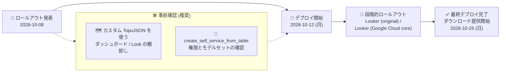

# Looker: Looker 26.20 リリースのロールアウト開始

**リリース日**: 2026-10-08

**サービス**: Looker

**機能**: Looker 26.20 リリース (ロールアウト告知)

**ステータス**: Announcement (リリースロールアウト)

📊 [このアップデートのインフォグラフィックを見る](https://takech9203.github.io/google-cloud-news-summary/20261008-looker-26-20-release.html)

## 概要

Looker 26.20 が Looker (original) および Looker (Google Cloud core) インスタンスに向けてロールアウトされることが発表されました。デプロイ開始は 2026 年 10 月 12 日 (月)、最終デプロイおよびダウンロード提供開始は 2026 年 10 月 25 日 (日) の予定です。

26.20 には破壊的変更 (Breaking) 2 件、新機能 (Feature) 1 件、および多数の修正 (Fixed) が含まれます。特に注意が必要なのは、セキュリティ強化のためのカスタム TopoJSON URL バリデーションの変更で、Google Maps Enhancements プレビュー機能でカスタム TopoJSON ファイルを使用している既存のダッシュボードや Look に影響する可能性があります。また、接続セットアップ時のセルフサービスモデリングの利用条件も変更されます。新機能としては、これまで内部ダッシュボードに限定されていたテーマ機能が Look にも適用可能になります。

Looker 管理者および LookML 開発者は、ロールアウト期間 (10 月 12 日〜 25 日) に自社インスタンスへ変更が適用されることを想定し、特に破壊的変更の影響範囲を事前に確認しておくことが推奨されます。

**アップデート前の課題**

- カスタム TopoJSON URL のバリデーションが緩く、セキュリティ上の改善余地があった
- テーマ機能は内部ダッシュボードにのみ適用でき、Look には適用できなかった
- スケジュール配信プランを複製するとカスタムメッセージの値が保持されないことがあった
- テーブルビジュアライゼーションの自動サイズ調整時に左固定 (left-pinned) 列が比例的にスケールされず、不要な横スクロールバーが表示されることがあった
- テーブルビジュアライゼーションで小計 (サブトータル) を有効化しても Cell Visualizations オプションが自動的に無効化されず、設定が競合することがあった

**アップデート後の改善**

- カスタム TopoJSON URL のバリデーションが強化され、Google Maps レンダリング (プレビュー) のセキュリティが向上した
- 内部ダッシュボードに加えて Look にもテーマを適用できるようになり、ブランディングの一貫性を保ちやすくなった
- スケジュール配信プランの複製時にカスタムメッセージの値が保持されるようになった
- テーブルビジュアライゼーションの左固定列が自動サイズ調整時に比例的にスケールされ、不要な横スクロールバーが発生しなくなった
- 小計を有効化すると Cell Visualizations オプションが自動的に無効化されるようになった

## アーキテクチャ図



Looker 26.20 のロールアウトスケジュールと、破壊的変更に備えてデプロイ開始前に実施しておきたい事前確認を示しています。

## サービスアップデートの詳細

### ロールアウトスケジュール

| イベント | 日付 |
|------|------|
| ロールアウト発表 | 2026 年 10 月 8 日 (水) |
| デプロイ開始 (予定) | 2026 年 10 月 12 日 (月) |
| 最終デプロイ・ダウンロード提供 (予定) | 2026 年 10 月 25 日 (日) |

対象は Looker (original) と Looker (Google Cloud core) の両インスタンスです。

### 破壊的変更 (Breaking)

1. **カスタム TopoJSON URL バリデーションの強化**
   - セキュリティ向上のため、カスタム TopoJSON URL のバリデーションが更新される
   - 影響範囲はプレビュー中の Google Maps レンダリングに限定される
   - Google Maps Enhancements プレビュー機能を有効にし、カスタム TopoJSON ファイルを使用している既存のダッシュボードや Look が影響を受ける可能性がある
   - 参考: 公式ドキュメントでは、プロジェクトファイルのパスは `/projects/{project_id}/raw/{file_path}` 形式に厳密に従う必要があり (`/raw/` を省略するとリクエストがブロックされる)、ファイル拡張子は `.json` である必要がある。外部ホストの TopoJSON ファイルは Looker インスタンスドメインからの CORS リクエストを許可する必要がある

2. **セルフサービスモデリングの利用条件の変更**
   - 接続 (Connection) のセットアップ時、セルフサービスモデリングは `create_self_service_from_table` 権限を付与するロールが、そのロールのモデルセットを通じて選択した場合にのみ利用可能になる

### 新機能 (Feature)

1. **Look へのテーマ適用**
   - 内部ダッシュボードに加えて、Look にもテーマを適用できるようになる
   - 組織のブランドカラーやフォント設定を Look にも一貫して反映可能になる

### 主な修正 (Fixed)

1. **スケジュール配信・連携まわり**
   - スケジュール配信プランの複製時にカスタムメッセージの値が保持されない問題を修正
   - Slack 連携で Looker チャートのプレビューが表示されないことがある問題を修正

2. **テーブル・ビジュアライゼーションまわり**
   - テーブルビジュアライゼーションの自動サイズ調整時に左固定列が比例的にスケールされるようになり、不要な横スクロールバーを防止
   - 小計を有効化すると Cell Visualizations オプションが自動的に無効化されるように修正
   - 正負両方の値を含むテーブルセルビジュアライゼーションで不要なスクロールバーが表示され値ラベルが隠れる問題を修正
   - ビジュアライゼーション設定のカラーパレットポップオーバーが展開時に再配置されず、コントロールが重なり・切り捨てられる問題を修正
   - 短い KPI ビジュアライゼーションの比較バーの不透明度を下げ、視認性を向上

3. **ダッシュボード・フィルタまわり**
   - ダッシュボードの編集・保存後に無限リロードが発生し、ページの再読み込みが必要になる問題を修正
   - 親フィルタが選択されていてもリンクフィルタのオートコンプリート候補が表示されないことがある問題を修正

4. **接続・システムアクティビティまわり**
   - BigQuery JDBC ドライバが `BYTES`、`STRUCT/RECORD`、ネストした `ARRAY` などのデータ型を正しくパースできないことがある問題を修正
   - System Activity の `query_metrics` Explore が、失敗またはタイムアウトしたクエリについてもフェーズタイミング (接続取得、実行時間、optimistic pivot フォールバックのリトライループなど) を取得できるように更新
   - System Activity の Dashboard Diagnostics ダッシュボードが LookML ダッシュボードの統計、タイル実行回数、パフォーマンス推奨事項を完全にサポートするように更新

## 技術仕様

### 対象インスタンスと提供形態

| 項目 | 詳細 |
|------|------|
| 対象製品 | Looker (original)、Looker (Google Cloud core) |
| バージョン | Looker 26.20 |
| デプロイ方式 | Google による段階的ロールアウト (ホスト型)、セルフホスト向けダウンロードは最終デプロイ日に提供 |
| 破壊的変更 | TopoJSON URL バリデーション強化、セルフサービスモデリングの権限条件変更 |

### カスタム TopoJSON の要件 (Google Maps Enhancements プレビュー)

| 項目 | 要件 |
|------|------|
| プロジェクトファイルのパス | `/projects/{project_id}/raw/{file_path}` 形式に厳密に従う (`/raw/` 省略不可) |
| ファイル拡張子 | `.json` (例: `my_map.json`、`my_map.topojson.json`) |
| 外部ホストファイル | Looker インスタンスドメインからの CORS リクエストを許可する設定が必要 |
| 推奨ファイルサイズ | 10 MB 未満 |

## 設定方法

### 前提条件

1. Looker (original) または Looker (Google Cloud core) インスタンスを利用していること
2. 破壊的変更の影響確認には Looker 管理者権限 (Admin ロールまたは相当の権限) が必要

### 手順 (ロールアウト前の推奨対応)

#### ステップ 1: Google Maps Enhancements プレビュー機能の利用状況を確認

管理画面の **Admin > General > Preview Features** で Google Maps Enhancements プレビュー機能が有効になっているかを確認します。有効な場合、カスタム TopoJSON ファイル (Custom Layer) を使用しているダッシュボードや Look を棚卸しします。

#### ステップ 2: TopoJSON URL が新しいバリデーション要件を満たすか確認

プロジェクトファイルを参照している場合はパスが `/projects/{project_id}/raw/{file_path}` 形式かつ `.json` 拡張子であること、外部 URL の場合はホスト側で CORS が許可されていることを確認します。

#### ステップ 3: セルフサービスモデリングの権限設定を確認

`create_self_service_from_table` 権限を付与しているロールと、そのロールのモデルセットの構成を確認し、26.20 以降もセルフサービスモデリングを利用するユーザーに適切な権限が行き渡るように調整します。

#### ステップ 4: ロールアウト後の動作確認

自社インスタンスに 26.20 が適用された後、Google Maps レンダリングを使用するダッシュボード・Look の表示、およびスケジュール配信・テーブルビジュアライゼーションの動作を確認します。

## メリット

### ビジネス面

- **ブランディングの一貫性向上**: テーマが Look にも適用可能になり、ダッシュボードと Look の間で統一されたルック & フィールを提供できる
- **セキュリティ強化**: TopoJSON URL バリデーションの強化により、カスタム地図レイヤー経由のリスクが低減される
- **運用の信頼性向上**: スケジュール配信や Slack プレビューなど、日常の配信・共有ワークフローの不具合が解消される

### 技術面

- **可観測性の向上**: System Activity の `query_metrics` が失敗・タイムアウトしたクエリのフェーズタイミングも捕捉するようになり、パフォーマンス問題の診断が容易になる
- **BigQuery 連携の安定化**: JDBC ドライバが `BYTES`、`STRUCT/RECORD`、ネストした `ARRAY` を正しくパースできるようになる
- **ビジュアライゼーション品質の向上**: テーブルの列スケーリング、小計とセルビジュアライゼーションの排他制御など、表示まわりの細かな不整合が解消される

## デメリット・制約事項

### 制限事項

- カスタム TopoJSON を使用する Google Maps レンダリングはプレビュー機能であり、Pre-GA Offerings Terms の対象 (サポートが限定される可能性がある)
- セルフホスト (Looker original の customer-hosted) 環境では、ダウンロード提供開始 (10 月 25 日) までは 26.20 を適用できない

### 考慮すべき点

- **破壊的変更への事前対応が必要**: Google Maps Enhancements プレビューでカスタム TopoJSON を使用している場合、ロールアウト後に地図が表示されなくなる可能性があるため、URL / パス形式を事前に確認する
- **権限設計の見直し**: セルフサービスモデリングの利用条件変更により、`create_self_service_from_table` 権限とモデルセットの対応を見直す必要がある
- ロールアウトは段階的に行われるため、自社インスタンスへの適用タイミングは期間内 (10 月 12 日〜 25 日) で前後する

## ユースケース

### ユースケース 1: カスタム地図レイヤーを使うダッシュボードの影響確認

**シナリオ**: 営業テリトリーや独自の商圏ポリゴンをカスタム TopoJSON で定義し、Google Maps Enhancements プレビューの Custom Layer で可視化している企業が、26.20 適用後も地図表示を維持したい。

**実装例**:
```text
1. Admin > Preview Features で Google Maps Enhancements の有効状態を確認
2. Custom Layer を使用するダッシュボード / Look を棚卸し
3. TopoJSON URL を確認:
   - プロジェクトファイル: /projects/{project_id}/raw/{file_path} 形式 + .json 拡張子
   - 外部 URL: ホスト側で Looker ドメインからの CORS を許可
4. ロールアウト後 (10/12 以降) に対象ダッシュボードの地図表示を確認
```

**効果**: 破壊的変更による地図表示の停止を未然に防ぎ、ビジネスユーザーへの影響を最小化できる。

### ユースケース 2: Look へのテーマ適用による社内レポートの統一

**シナリオ**: 社内でダッシュボードにはコーポレートテーマを適用しているが、個別の Look は従来テーマ適用対象外だったため、見た目が不統一だった。

**効果**: 26.20 以降、Look にもテーマを適用できるため、ダッシュボードと Look の両方で統一されたブランド体験を提供できる。

## 料金

Looker 26.20 へのアップデート自体に追加料金は発生しません。Looker の料金はエディションおよびユーザーライセンスに基づきます。詳細は料金ページを参照してください。

- [Looker 料金ページ](https://cloud.google.com/looker/pricing)

## 利用可能リージョン

Looker (original) および Looker (Google Cloud core) の全インスタンスが段階的ロールアウトの対象です。リージョンごとの提供状況は公式ドキュメントを参照してください。

## 関連サービス・機能

- **BigQuery**: Looker の主要なデータソースの 1 つ。26.20 では BigQuery JDBC ドライバのデータ型パース (`BYTES`、`STRUCT/RECORD`、ネスト `ARRAY`) が修正される
- **Google Maps Platform**: Google Maps Enhancements プレビュー機能による地図レンダリングの基盤。今回の TopoJSON バリデーション強化の影響範囲
- **Slack 連携**: Looker チャートのプレビュー表示の不具合が修正され、Slack へのチャート共有が安定化
- **Looker System Activity**: `query_metrics` Explore と Dashboard Diagnostics ダッシュボードが強化され、クエリ・ダッシュボードのパフォーマンス診断に活用できる

## 参考リンク

- 📊 [インフォグラフィック](https://takech9203.github.io/google-cloud-news-summary/20261008-looker-26-20-release.html)
- [公式リリースノート](https://docs.cloud.google.com/release-notes#October_08_2026)
- [Looker リリースノート](https://docs.cloud.google.com/looker/docs/release-notes)
- [Google Maps のレイヤーオプション (Custom Layer / TopoJSON)](https://docs.cloud.google.com/looker/docs/google-map-options)
- [内部ダッシュボードのテーマ](https://docs.cloud.google.com/looker/docs/themes-for-internal-dashboards)
- [プレビュー機能の管理 (Admin settings - Preview Features)](https://docs.cloud.google.com/looker/docs/admin-panel-general-preview-features)
- [料金ページ](https://cloud.google.com/looker/pricing)

## まとめ

Looker 26.20 は 2026 年 10 月 12 日からロールアウトが開始され、10 月 25 日に完了・ダウンロード提供される予定です。カスタム TopoJSON URL バリデーションの強化とセルフサービスモデリングの権限条件変更という 2 つの破壊的変更が含まれるため、Google Maps Enhancements プレビューを利用している管理者はロールアウト前に影響範囲の確認を済ませておくことを推奨します。Look へのテーマ適用やテーブルビジュアライゼーションの改善など、日常利用の品質を高める変更も多く含まれています。

---

**タグ**: Looker, Looker 26.20, リリースロールアウト, Breaking Change, TopoJSON, Google Maps Enhancements, テーマ, BI, ビジュアライゼーション
