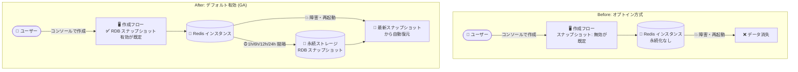

# Memorystore for Redis: RDB スナップショットがコンソールでのインスタンス作成時にデフォルトで有効化 (GA)

**リリース日**: 2026-10-08

**サービス**: Memorystore for Redis

**機能**: RDB スナップショットのデフォルト有効化 (Google Cloud コンソール)

**ステータス**: GA (一般提供)

📊 [このアップデートのインフォグラフィックを見る](https://takech9203.github.io/google-cloud-news-summary/20261008-memorystore-redis-rdb-snapshots-default.html)

## 概要

Google Cloud コンソールから Memorystore for Redis インスタンスを作成する際に、RDB (Redis Database) スナップショットがデフォルトで有効になるアップデートが一般提供 (GA) になりました。データ保護と、永続化のベースライン (基本レベル) を標準で提供することが目的です。

RDB スナップショットは、インスタンスのデータを指定した間隔 (1 時間〜24 時間) で永続ストレージに保存する機能です。インスタンスの障害や再起動時に、Memorystore が最新のスナップショットから自動的にデータを復元します。これまでは作成時に明示的に有効化する必要がありましたが、今回のアップデートにより、コンソールの作成フローで「Schedule Redis Database (RDB) snapshot」チェックボックスが最初から選択された状態になり、意識的にオプトアウトしない限りベースラインのデータ保護が確保されます。

Memorystore for Redis をキャッシュ用途以上に使うユーザー (セッションストア、ジョブキューなど、データ消失が長時間のアプリケーションダウンタイムにつながるワークロード) にとって、「スナップショットの有効化を忘れていた」ことによるデータ消失リスクを減らす、安全なデフォルト (secure by default) への変更です。

**アップデート前の課題**

- RDB スナップショットはオプトイン方式であり、インスタンス作成時に明示的に有効化する必要があった
- 有効化を忘れたまま運用し、インスタンスの障害・再起動時にデータが完全に失われるリスクがあった
- 特に Basic Tier (レプリカなし) では、永続化を設定しない限りメンテナンスや障害のたびにデータが消失していた

**アップデート後の改善**

- コンソールでのインスタンス作成時、RDB スナップショットのスケジュール設定がデフォルトで有効になり、ベースラインのデータ保護が標準で確保される
- 作成フロー内でスナップショットの開始時刻 (「Immediately」も選択可) と取得間隔をそのまま設定できる
- 不要な場合はチェックボックスをオフにしてオプトアウトすることも引き続き可能

## アーキテクチャ図



コンソールでのインスタンス作成時に RDB スナップショットが既定で有効になり、障害・再起動時には最新スナップショットからデータが自動復元されます。

## サービスアップデートの詳細

### 主要機能

1. **コンソール作成フローでのデフォルト有効化**
   - インスタンス作成画面の「Snapshots」ペインで「Schedule Redis Database (RDB) snapshot」チェックボックスがデフォルトで選択される
   - 「Start time」メニューで取得開始時刻を選択 (インスタンス作成直後に取得する「Immediately」も選択可能)
   - 「Snapshot interval」メニューで取得間隔を選択
   - チェックボックスをオフにすればオプトアウト可能 (ただし公式ドキュメントは、ベースラインのデータ保護のためチェックを外さないことを推奨)

2. **RDB スナップショットによる自動復元**
   - 指定間隔 (1h / 6h / 12h / 24h) でポイントインタイムのスナップショットを永続ストレージに保存
   - Basic Tier: 障害による再起動、スケーリング操作、バージョンアップグレードのたびに最新スナップショットからデータを復元
   - Standard Tier: 通常はレプリカから復元し、レプリカが利用できず primary / レプリカ両方が再起動した場合にスナップショットから復元 (レプリケーション + 自動フェイルオーバーに加えた追加の保護層)

3. **追加コストなし**
   - RDB スナップショットの利用によるインスタンス課金への追加コストは発生しない

## 技術仕様

| 項目 | 詳細 |
|------|------|
| 対象 | Google Cloud コンソールからの Memorystore for Redis インスタンス作成 |
| スナップショット間隔 | 1h / 6h / 12h / 24h (最小 1 時間、最大 24 時間) |
| スケジュール評価 | UTC タイムゾーンで評価 |
| 保持されるスナップショット | 最新の成功したスナップショットのみ (手動リストアには利用不可) |
| スナップショット取得ノード (Standard Tier) | レプリカ側で取得 (primary のメモリ・CPU への影響を最小化) |
| 対応 Redis バージョン | 5.0 以上 |
| 追加コスト | なし |
| 制約 | キー数が約 2 億以上の場合、スナップショット取得・復元が遅くなる可能性 |

## 設定方法

### 手順

#### コンソールでの作成 (今回のアップデート)

1. Google Cloud コンソールの Memorystore for Redis ページでインスタンス作成を開始
2. 「Configuration」セクションを展開すると、「Snapshots」ペインで「Schedule Redis Database (RDB) snapshot」がデフォルトで選択済み
3. 「Start time」(開始時刻、「Immediately」も選択可) と「Snapshot interval」(取得間隔) を選択
4. ピーク時間帯を避けた開始時刻・間隔を選ぶことを推奨
5. 「Create」をクリック

#### gcloud での作成 (明示的な指定が必要)

```bash
gcloud redis instances create INSTANCE_ID \
  --size=SIZE \
  --region=REGION_ID \
  --persistence-mode=rdb \
  --rdb-snapshot-period=24h \
  --rdb-snapshot-start-time=2026-10-09T03:00:00Z
```

`--rdb-snapshot-period` には `1h`、`6h`、`12h`、`24h` を指定できます。今回のデフォルト有効化はコンソールでの作成フローに関する変更であり、gcloud では引き続き `--persistence-mode=rdb` の明示的な指定が必要です。

## メリット

### ビジネス面

- **データ消失リスクの低減**: 設定漏れによるキャッシュ・セッションデータの消失と、それに伴うアプリケーションダウンタイムを防止
- **追加コストなしの保護**: RDB スナップショットは課金に影響しないため、コスト増なしでベースラインの保護を獲得

### 技術面

- **Secure by default**: 新規インスタンスが最初から永続化のベースラインを持つため、運用ポリシーの統制が容易
- **自動復元**: Basic Tier の再起動・スケーリング・バージョンアップグレード時にも最新スナップショットから自動復元
- **primary への影響最小化**: Standard Tier ではスナップショットをレプリカ側で取得するため、primary の性能影響を抑制

## デメリット・制約事項

### 制限事項

- スナップショットは内部のシステム復旧専用で、ユーザーがアクセスしたり手動リストアに使うことはできない (手動バックアップにはエクスポート/インポート機能を使用)
- 保持されるのは最新の成功したスナップショット 1 つのみ
- Redis バージョン 5.0 以上のインスタンスが対象
- キー数が約 2 億以上になると、スナップショット取得・復元が遅くなる可能性がある

### 考慮すべき点

- スナップショットはポイントインタイムのため、復元時にはスナップショット間隔分のデータ古さ (staleness) が発生し得る。アプリケーションがこれを許容できるか確認が必要
- 純粋な使い捨てキャッシュ用途でスナップショットが不要な場合は、作成時にチェックボックスをオフにしてオプトアウトできる
- ピーク時間帯のスナップショット取得は性能に影響し得るため、開始時刻と間隔はピークを避けて設定することを推奨
- 高可用性が必要な場合は、スナップショットだけに頼らず Standard Tier (レプリカ + 自動フェイルオーバー) の利用を推奨

## ユースケース

### ユースケース 1: セッションストアのベースライン保護

**シナリオ**: Web アプリケーションのログインセッションを Basic Tier の Memorystore for Redis に保存している。インスタンスの再起動やメンテナンスのたびに全ユーザーが強制ログアウトされる問題を避けたい。

**効果**: コンソールから作成するだけで RDB スナップショットが有効になり、再起動・スケーリング・バージョンアップグレード時に最新スナップショットからセッションデータが自動復元される。全ユーザーの一斉ログアウトを回避できる。

### ユースケース 2: Standard Tier の多層防御

**シナリオ**: 決済処理のジョブキューを Standard Tier インスタンスで運用しており、レプリカによる HA に加えて、primary とレプリカが同時に障害を起こすまれなケースにも備えたい。

**効果**: 通常はレプリカへの自動フェイルオーバーで復旧し、primary / レプリカ両方が再起動した場合でも最新スナップショットからデータを復元できる。追加コストなしで保護層を 1 つ追加できる。

## 料金

RDB スナップショットの利用によるインスタンス課金への追加コストはありません。Memorystore for Redis 自体の料金は、サービスティア (Basic / Standard)、容量 (GB)、リージョンに基づく従量課金です。詳細は[料金ページ](https://cloud.google.com/memorystore/pricing)を参照してください。

## 利用可能リージョン

Memorystore for Redis が提供されているすべてのリージョンで利用できます。リージョン一覧は[公式ドキュメント](https://docs.cloud.google.com/memorystore/docs/redis/regions)を参照してください。

## 関連サービス・機能

- **Memorystore for Redis Cluster**: クラスタ版 Memorystore。RDB 永続化に加えて AOF 永続化もサポートしており、より大規模・高耐久性の要件に対応
- **エクスポート/インポート (Cloud Storage)**: RDB スナップショットは手動リストアに使えないため、手動バックアップ・リストアやデータ移行にはエクスポート/インポート機能を使用
- **Cloud Monitoring**: RDB スナップショットの状態 (永続化メトリクス) を監視し、スナップショット失敗やデータ staleness を検知
- **Memorystore for Valkey**: Google Cloud が推進する次世代のインメモリサービス。新規ワークロードの選択肢として比較検討の対象

## 参考リンク

- 📊 [インフォグラフィック](https://takech9203.github.io/google-cloud-news-summary/20261008-memorystore-redis-rdb-snapshots-default.html)
- [公式リリースノート](https://docs.cloud.google.com/release-notes#October_08_2026)
- [RDB スナップショットの概要](https://docs.cloud.google.com/memorystore/docs/redis/about-rdb-snapshots)
- [RDB スナップショットの管理](https://docs.cloud.google.com/memorystore/docs/redis/manage-rdb-snapshots)
- [Memorystore for Redis の概要](https://docs.cloud.google.com/memorystore/docs/redis/memorystore-for-redis-overview)
- [料金ページ](https://cloud.google.com/memorystore/pricing)

## まとめ

Google Cloud コンソールから作成する Memorystore for Redis インスタンスで RDB スナップショットがデフォルト有効となり、追加コストなしでベースラインのデータ保護が標準装備されました。新規インスタンスを作成する際は、既定のスナップショット設定 (開始時刻・間隔) がワークロードのピーク時間帯と重ならないかを確認し、使い捨てキャッシュなど永続化が不要なケースのみ明示的にオプトアウトする運用を推奨します。既存インスタンスでスナップショット未設定のものがあれば、この機会に有効化を検討してください。

---

**タグ**: Memorystore, Redis, RDB スナップショット, 永続化, データ保護, GA, バックアップ
