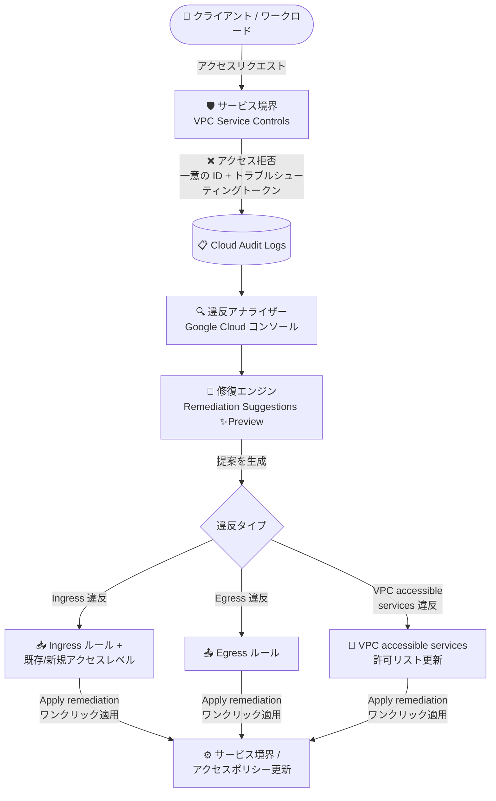

# VPC Service Controls: 違反アナライザーの自動修復提案 (Remediation Suggestions)

**リリース日**: 2026-10-08

**サービス**: VPC Service Controls

**機能**: 違反アナライザーにおける自動修復提案 (Remediation Suggestions)

**ステータス**: Preview

📊 [このアップデートのインフォグラフィックを見る](https://takech9203.github.io/google-cloud-news-summary/20261008-vpc-service-controls-remediation-suggestions.html)

## 概要

VPC Service Controls の違反アナライザー (Violation Analyzer) に、自動修復提案 (Remediation Suggestions) 機能が Preview として追加されました。この機能は、サービス境界 (Service Perimeter) によるアクセス拒否イベントを分析し、拒否を解決するための実行可能かつ最小スコープの構成変更を自動生成します。生成された提案はワンクリックでサービス境界とアクセスポリシーに適用できます。

修復エンジンは、違反の種類 (Ingress 違反、Egress 違反、VPC accessible services 違反) に応じて、Ingress ルール、Egress ルール、VPC accessible services の更新、既存または新規のコンテキストアウェアアクセスレベルを自動的に提案します。提案は最小権限の原則 (Principle of Least Privilege) に沿うようにスコープが絞り込まれており、過剰な権限付与を避けながらアクセス拒否を解決できます。

VPC Service Controls を運用するセキュリティ管理者やプラットフォームチームにとって、境界違反のトラブルシューティングから構成修正までのリードタイムを大幅に短縮できるアップデートです。

**アップデート前の課題**

- 違反アナライザーはアクセス拒否イベントの詳細な評価レポート (違反の詳細、Ingress / Egress ルールや VPC accessible services の評価結果) を表示できたものの、解決には管理者が評価結果を読み解き、該当する境界コンポーネントや構成を手動で特定・編集する必要があった
- 拒否を解決するための Ingress / Egress ルールやアクセスレベルの記述は、VPC Service Controls のルール属性に関する深い知識が必要で、設定ミスや過剰に広いスコープの許可を招きやすかった
- 1 つのアクセス拒否に Ingress・Egress・VPC accessible services の複数の違反タイプが含まれる場合、それぞれを個別に分析して修正する必要があった

**アップデート後の改善**

- 修復エンジンがアクセス拒否イベントを自動分析し、違反タイプに応じた最小スコープの構成変更 (Ingress ルール、Egress ルール、VPC accessible services の更新、アクセスレベル) を自動提案するようになった
- Ingress 違反では、リクエストコンテキストに合致する既存アクセスレベルの選択 (推奨)、または IP サブネットワーク・地理的リージョン・デバイスポリシーなどに基づく新規のコンテキストアウェアアクセスレベルの作成を提案できるようになった
- 複数の違反タイプが混在するアクセス拒否でも、該当するすべての違反に対応する提案が一括生成され、「Apply remediation」のワンクリックでサービス境界とアクセスポリシーに適用できるようになった

## アーキテクチャ図



アクセス拒否イベントが Cloud Audit Logs に記録され、違反アナライザーで診断すると修復エンジンが違反タイプごとに最小スコープの構成変更を提案し、ワンクリックでサービス境界とアクセスポリシーに適用できる流れを示しています。

## サービスアップデートの詳細

### 主要機能

1. **違反タイプに応じた自動修復提案**
   - 修復エンジンが、一意の ID またはトラブルシューティングトークンで診断されたアクセス拒否の違反コンテキストを評価し、違反タイプに基づいた構成変更を提案
   - Ingress 違反: 呼び出し元 ID、送信元アクセスレベルまたはネットワーク、対象サービス、メソッドセレクタ、リソースにスコープを絞った Ingress ルールを追加提案
   - Egress 違反: 送信元 ID またはプロジェクトと、境界外の対象サービス・メソッドセレクタ・外部リソースにスコープを絞った Egress ルールを追加提案
   - VPC accessible services 違反: 制限されたサービスを境界の VPC accessible services 許可リストに追加、またはサービスが未サポートの場合は制限の更新を提案

2. **コンテキストアウェアアクセスレベルの提案**
   - Ingress 違反の修復時に、リクエストコンテキストを満たす既存のアクセスレベルの選択 (推奨) が可能
   - または、呼び出し元の IP サブネットワーク、地理的リージョン、デバイスポリシー要件に合致する新しいコンテキストアウェアアクセスレベルの作成を提案

3. **複数の違反タイプへの一括対応とワンクリック適用**
   - 1 つのアクセス拒否に Ingress、Egress、VPC accessible services の複数の違反が含まれる場合も、該当するすべての違反に対応する提案を生成
   - Access Context Manager Editor ロールを持っていれば、「Apply remediation」のクリックでサービス境界とアクセスポリシーを自動更新 (新規アクセスレベルを選択した場合は自動プロビジョニング)

## 技術仕様

### 違反タイプ別の修復アクション

| 違反タイプ | 提案される修復アクション |
|------|------|
| Ingress 違反 | リクエストコンテキストに合致する既存アクセスレベルの選択 (推奨)、または呼び出し元の IP サブネットワーク・地理的リージョン・デバイスポリシーに合致する新規コンテキストアウェアアクセスレベルのプロビジョニング。呼び出し元 ID、送信元アクセスレベル / ネットワーク、対象サービス、メソッドセレクタ、リソースにスコープを絞った Ingress ルールの追加 |
| Egress 違反 | 送信元 ID / プロジェクトと、対象サービス・メソッドセレクタ・外部リソースにスコープを絞った Egress ルールの追加 |
| VPC accessible services 違反 | 制限されたサービスを境界の VPC accessible services 許可リストに追加、またはサービスが未サポートの場合は制限の更新を提案 |

### 必要な IAM ロール

| 操作 | 必要なロール |
|------|------|
| 違反アナライザーでアクセス拒否イベントを診断 | Access Context Manager Reader (`roles/accesscontextmanager.policyReader`) — アクセスポリシーに対して付与 |
| Cloud Audit Logs からトラブルシューティングトークンを取得 | Logs Viewer (`roles/logging.viewer`) — VPC Service Controls 監査ログを持つプロジェクトに対して付与 |
| 提案された修復の適用 | Access Context Manager Editor (`roles/accesscontextmanager.editor`) — アクセスポリシーに対して付与 |

修復の適用には、`accesscontextmanager.accessLevels.create`、`accesscontextmanager.servicePerimeters.update` などの権限が必要です。カスタムロールや他の事前定義ロールでも同等の権限があれば利用できます。

## 設定方法

### 前提条件

1. 違反アナライザーの使用と修復提案の適用に必要な IAM ロール (上記の表を参照) が付与されていること
2. トラブルシューティング対象のアクセス拒否イベントの一意の ID またはトラブルシューティングトークンを取得していること (VPC Service Controls はアクセス拒否時に一意の ID を生成し、暗号化されたトラブルシューティングトークンを Cloud Audit Logs に記録する)
3. アクセスレベルにデバイスポリシーが含まれる場合、デバイスコンテキストの詳細を取得するには Google Workspace 側の権限 (Super Admin、Services Admin、Mobile Admin、または「Manage Devices and Settings」権限を含むカスタム管理者ロール) が必要

### 手順

#### ステップ 1: 違反アナライザーでアクセス拒否を診断する

1. Google Cloud コンソールで「セキュリティ」>「VPC Service Controls」ページに移動する (組織レベルでのみアクセス可能)
2. 「Violation analyzer」をクリックする
3. 「Troubleshooting token (or unique ID)」フィールドにアクセス拒否のトラブルシューティングトークンまたは一意の ID を入力し、「Continue」をクリックする

Logs Explorer の拒否ログエントリから「VPC Service Controls」>「Troubleshoot denial」をクリックして直接違反アナライザーに移動することもできます。

#### ステップ 2: 修復提案を確認する

1. トラブルシューティング結果ページの「Protected resources accessed」セクションで、アクセスを拒否した境界を選択する
2. 「Review recommendation」をクリックすると、「Remediation details」ペインが開く
3. 提案された修復アクションを確認する
   - アクセスレベルが必要な場合: 「Existing access level」タブでリクエストコンテキストを満たす既存のアクセスレベルを選択する (推奨)、または「New access level」タブで提案されたアクセスレベル名・IP サブネットワーク・地理的リージョン・デバイス制約を確認する
   - 提案された Ingress ルール、Egress ルール、または VPC accessible services の変更内容を確認する

#### ステップ 3: 修復を適用する

「Apply remediation」をクリックすると、VPC Service Controls が新しいアクセスレベル (作成を選択した場合) を自動的にプロビジョニングし、サービス境界の構成を更新します。

## メリット

### ビジネス面

- **トラブルシューティング時間の短縮**: アクセス拒否の診断から構成修正までが違反アナライザー内で完結し、境界違反による業務停止時間を削減できる
- **セキュリティ態勢の維持**: 提案は最小権限の原則に沿った狭いスコープで生成されるため、障害対応時にありがちな過剰に広い許可ルールの追加を避けられる

### 技術面

- **構成変更の自動生成**: Ingress / Egress ルールの属性 (ID、メソッドセレクタ、リソースなど) を手動で記述する必要がなくなり、設定ミスのリスクが低減する
- **複数違反タイプへの一括対応**: Ingress、Egress、VPC accessible services の違反が混在するケースでも、すべてに対応する提案が一括生成される
- **コンテキストアウェアアクセスレベルの活用**: IP サブネットワーク、地理的リージョン、デバイスポリシーに基づくアクセスレベルの作成・選択が提案に組み込まれており、Access Context Manager の活用が容易になる

## デメリット・制約事項

### 制限事項

- Preview 機能であり、Pre-GA Offerings Terms が適用される。「現状のまま」提供され、サポートが限定される場合がある
- 修復提案はサポート対象のアクセス拒否イベントに対して提供される
- 違反アナライザーは Google Cloud コンソールでのみ利用可能 (組織レベルでアクセスする必要がある)
- 修復の適用にはアクセスポリシーに対する Access Context Manager Editor ロールが必要

### 考慮すべき点

- 修復提案は、操作するアカウントが閲覧権限を持つリクエストコンテキストを使用して生成される。より広い権限を持つユーザーや管理者の方が、きめ細かい提案を受け取れる場合がある
- ワンクリックで境界とアクセスポリシーが更新されるため、適用前に提案内容 (許可される ID、リソース、サービスのスコープ) を必ずレビューするべき
- デバイス属性を含むアクセスレベルが関係する拒否では、Google Workspace 側の権限がないとトラブルシューティング結果が不整合になる可能性がある

## ユースケース

### ユースケース 1: 境界外のパートナープロジェクトからのアクセス拒否の迅速な解決

**シナリオ**: サービス境界で保護された BigQuery データセットに対して、境界外のプロジェクトのサービスアカウントからのクエリが拒否された。開発チームから早急な解決を求められている。

**実装例**:
```
1. 拒否エラーに含まれる一意の ID を取得
2. 違反アナライザーでトークンを入力して診断
3. Ingress 違反として検出され、呼び出し元サービスアカウントと
   対象サービスにスコープを絞った Ingress ルールが提案される
4. 「Apply remediation」で境界に適用
```

**効果**: ルール属性の手動設計が不要になり、最小スコープの Ingress ルールで必要なアクセスのみを許可できる。

### ユースケース 2: 特定ネットワークからの管理者アクセスをコンテキストアウェアに許可

**シナリオ**: 社内の特定 IP サブネットワークからの管理オペレーションが境界で拒否された。IP やリージョンの条件を含むアクセスレベルで許可したい。

**効果**: 修復エンジンが呼び出し元の IP サブネットワークや地理的リージョンに合致する既存アクセスレベルの選択、または新規コンテキストアウェアアクセスレベルの作成を提案するため、Access Context Manager でのアクセスレベル設計を一から行う必要がない。

## 関連サービス・機能

- **Access Context Manager**: 修復提案が提案・プロビジョニングするアクセスレベルとアクセスポリシーを管理するサービス。修復の適用には Access Context Manager Editor ロールが必要
- **Cloud Audit Logs / Cloud Logging**: アクセス拒否イベントの一意の ID とトラブルシューティングトークンが記録される。Logs Explorer の拒否ログエントリから違反アナライザーへ直接移動できる
- **VPC Service Controls 違反ダッシュボード**: 組織内の境界によるアクセス拒否をトラブルシューティングトークンとともに一覧表示し、トークンのクリックで違反アナライザーを開ける
- **Ingress / Egress ルール**: 修復提案が自動生成する境界構成の中核要素。送信元・ID・対象サービス・メソッドセレクタなどの属性でアクセスを制御する

## 参考リンク

- 📊 [インフォグラフィック](https://takech9203.github.io/google-cloud-news-summary/20261008-vpc-service-controls-remediation-suggestions.html)
- [公式リリースノート](https://docs.cloud.google.com/release-notes#October_08_2026)
- [Resolve access denials with remediation suggestions](https://docs.cloud.google.com/vpc-service-controls/docs/remediation-suggestions)
- [Diagnose access denials using the violation analyzer](https://docs.cloud.google.com/vpc-service-controls/docs/violation-analyzer)
- [Ingress and egress rules](https://docs.cloud.google.com/vpc-service-controls/docs/ingress-egress-rules)
- [Allow access to protected resources from outside a perimeter (access levels)](https://docs.cloud.google.com/vpc-service-controls/docs/use-access-levels)

## まとめ

VPC Service Controls の違反アナライザーに自動修復提案が加わったことで、境界によるアクセス拒否の「診断」から「解決」までがコンソール内でワンクリック適用まで完結するようになりました。最小権限の原則に沿ったスコープの絞られた提案が生成されるため、セキュリティを損なわずに運用負荷を下げられます。VPC Service Controls を運用しているチームは、Preview 段階である点に留意しつつ、違反対応ワークフローへの組み込みを検討することをおすすめします。

---

**タグ**: #VPCServiceControls #セキュリティ #ViolationAnalyzer #RemediationSuggestions #AccessContextManager #ゼロトラスト #Preview
