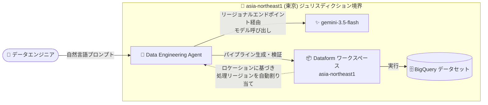

# BigQuery: Data Engineering Agent が東京リージョン (asia-northeast1) エンドポイントと gemini-3.5-flash をサポート (GA)

**リリース日**: 2026-10-09

**サービス**: BigQuery (Data Engineering Agent)

**機能**: asia-northeast1 (東京) リージョナルエンドポイントの提供と gemini-3.5-flash モデルのサポート

**ステータス**: Generally Available (GA)

📊 [このアップデートのインフォグラフィックを見る](https://takech9203.github.io/google-cloud-news-summary/20261009-bigquery-data-engineering-agent-tokyo-gemini-3-5-flash.html)

## 概要

BigQuery の Data Engineering Agent が、asia-northeast1 (東京) のリージョナルエンドポイントで利用可能になり、あわせて gemini-3.5-flash モデルをサポートしました。本アップデートは Generally Available (GA) です。Data Engineering Agent は、自然言語プロンプトで BigQuery のデータパイプラインを構築・変更・トラブルシューティングできるエージェントで、Dataform 統合、プラン生成、コード検証、自動データラングリングなどの機能を提供します。

これまで Data Engineering Agent のジュリスディクション (管轄区域) 単位のエンドポイントは `us`、`eu`、`global` が中心でしたが、今回 `asia-northeast1` (東京) の専用サービスエンドポイントが追加されました。Google Cloud コンソールからエージェントを利用する場合、リージョナルプリファレンスは関連付けられた Dataform ワークスペースのロケーションに基づいて自動的に割り当てられ、推論エンジンや会話コンテキストの一時保存を含むすべての内部処理が、そのジュリスディクション境界内に維持されます。

対象ユーザーは、日本国内でのデータ処理 (データレジデンシー) 要件を持つ日本の企業・公共機関のデータエンジニアリングチームです。金融・医療・公共など、AI 処理を国内に留める必要がある組織でも、AI 支援によるパイプライン開発を採用しやすくなります。

**アップデート前の課題**

- Data Engineering Agent の専用エンドポイントは `us` / `eu` / `global` のみで、日本国内 (asia-northeast1) に処理を留める選択肢がなかった
- 日本のデータレジデンシー要件を持つ組織では、Gemini 処理が米国・EU または global で行われるため、エージェントの採用が難しかった
- gemini-3.5-flash モデルを Data Engineering Agent のバックエンドとして利用できなかった

**アップデート後の改善**

- `asia-northeast1` (東京) のリージョナルエンドポイントが追加され、エージェントの推論処理・会話コンテキストの一時保存を含む内部処理を東京リージョン内に留められるようになった
- gemini-3.5-flash (GA、ML 処理のデータレジデンシーで asia-northeast1 をサポート) をエージェントのモデルとして利用可能になった
- Dataform ワークスペースを東京リージョンに配置するだけで、リージョナルプリファレンスが自動的に適用されるようになった

## アーキテクチャ図



Dataform ワークスペースを asia-northeast1 に配置すると、Data Engineering Agent の推論処理 (gemini-3.5-flash の呼び出しを含む) とパイプライン生成・実行のすべてが東京のジュリスディクション境界内で完結する流れを示しています。

## サービスアップデートの詳細

### 主要機能

1. **asia-northeast1 (東京) リージョナルエンドポイント (GA)**
   - Data Engineering Agent のジュリスディクション単位のリージョナライゼーションに `asia-northeast1` (東京) が追加 (既存は `us`、`eu`、`global`)
   - コンソール利用時は、関連付けられた Dataform ワークスペースのロケーションに基づいてリージョナルプリファレンスが自動的に割り当てられる
   - 推論エンジンと会話コンテキストの一時保存を含むすべての内部処理が、ジュリスディクション境界内に維持される

2. **gemini-3.5-flash モデルのサポート**
   - gemini-3.5-flash (2026 年 5 月 19 日 GA) は、ML 処理のデータレジデンシーで asia-northeast1 (東京) を含む複数のリージョンをサポートするモデル
   - 1,048,576 トークンのコンテキストウィンドウと Thinking・Function Calling 対応により、パイプライン生成やトラブルシューティングのような複雑なエージェントタスクに適する

3. **API 利用時のリージョン指定**
   - Data Engineering Agent API 経由で利用する場合、`us`、`eu`、`asia-northeast1` (東京) を指定することで、すべての処理・推論・下流サービス呼び出しをそのジュリスディクション内に維持できる
   - 指定した API リージョンが Dataform ワークスペースのリージョンと一致しない場合はエラーが返される (意図しないリージョン外処理を防止)

## 技術仕様

### Data Engineering Agent のリージョナルエンドポイント

| 項目 | 詳細 |
|------|------|
| 対応エンドポイント | `us`、`eu`、`asia-northeast1` (東京)、`global` |
| リージョン割り当て (コンソール) | 関連付けられた Dataform ワークスペースのロケーションに基づき自動割り当て |
| リージョン指定 (API) | `us` / `eu` / `asia-northeast1` を明示指定。ワークスペースリージョンと不一致の場合はエラー |
| 処理リージョンの変更 | 新しい Dataform リポジトリを作成し、目的のリージョンに構成する必要あり |
| ジュリスディクション内に維持される処理 | 推論エンジン、会話コンテキストの一時保存を含むすべての内部処理 |

### gemini-3.5-flash モデル

| 項目 | 詳細 |
|------|------|
| モデル ID | `gemini-3.5-flash` |
| ローンチステージ | GA (リリース日: 2026 年 5 月 19 日) |
| コンテキストウィンドウ | 1,048,576 トークン (最大出力 65,536 トークン) |
| ML 処理のデータレジデンシー | `us`、`eu`、`northamerica-northeast1`、`europe-west2`、`europe-west3`、`asia-northeast1` (東京)、`asia-south1`、`asia-southeast1`、`australia-southeast1` |
| セキュリティコントロール | データレジデンシー、CMEK、VPC-SC、AXT (Access Transparency) |
| 備考 | asia-northeast1 では Provisioned Throughput は Single Zone のみサポート |

## 設定方法

### 前提条件

1. プロジェクトで Gemini in BigQuery (Data Engineering Agent) が有効化されていること
2. Dataform リポジトリ / ワークスペースを利用できること

### 手順

#### ステップ 1: Dataform リポジトリを東京リージョンに作成

```bash
# Dataform リポジトリを asia-northeast1 に作成
gcloud dataform repositories create my-pipeline-repo \
  --region=asia-northeast1 \
  --project=PROJECT_ID
```

リージョナルプリファレンスは Dataform ワークスペースのロケーションに基づいて自動的に割り当てられます。既存リポジトリのリージョンは変更できないため、処理リージョンを変えたい場合は新しいリポジトリを作成します。

#### ステップ 2: BigQuery pipelines / Dataform からエージェントを利用

BigQuery Studio の pipelines インターフェースまたは Dataform ワークスペースを開き、自然言語プロンプトでパイプラインの構築・変更・トラブルシューティングを行います。コンソール利用時は、ワークスペースが asia-northeast1 にあれば、エージェントの内部処理は東京のジュリスディクション境界内に維持されます。

API 経由で利用する場合は、リージョンに `asia-northeast1` を指定します (ワークスペースのリージョンと一致している必要があります)。

## メリット

### ビジネス面

- **日本国内のデータレジデンシー要件への対応**: AI 処理を国内に留める必要がある金融・医療・公共などの規制業種でも、エージェントの推論処理を東京リージョン内に維持したまま AI 支援のデータエンジニアリングを採用できる
- **GA ステータスによる本番適用のしやすさ**: Generally Available となったことで、本番ワークロードへの適用やコンプライアンス評価が行いやすくなる

### 技術面

- **レイテンシの低減**: 日本国内のユーザー・データに近い東京リージョンで処理されることで、エージェントとの対話やパイプライン生成の応答性向上が期待できる
- **意図しないリージョン外処理の防止**: API 利用時にリージョン不一致がエラーとなる設計により、構成ミスによるジュリスディクション外での処理を防げる
- **エンタープライズセキュリティとの親和性**: gemini-3.5-flash はデータレジデンシー、CMEK、VPC-SC、AXT に対応しており、既存のセキュリティ統制に組み込みやすい

## デメリット・制約事項

### 制限事項

- 処理リージョンを変更するには、新しい Dataform リポジトリを作成して目的のリージョンに構成する必要がある (既存リポジトリのリージョン変更は不可)
- API 利用時に指定リージョンと Dataform ワークスペースのリージョンが一致しない場合はエラーになる
- asia-northeast1 では gemini-3.5-flash の Provisioned Throughput は Single Zone のみのサポート

### 考慮すべき点

- ジュリスディクション単位の処理は GA 機能の Gemini in BigQuery 機能に対して提供される。各機能の対応状況はドキュメントで確認が必要
- Dataform / BigQuery pipelines の `defaultLocation` 設定を適切に構成し、BigQuery ジョブと Gemini 処理のロケーションを一貫させることがベストプラクティス

## ユースケース

### ユースケース 1: 国内データレジデンシー要件下でのパイプライン構築

**シナリオ**: 日本の金融機関が、顧客データを扱う BigQuery パイプラインの開発に AI エージェントを活用したいが、社内規程により AI の推論処理を含むデータ処理を国内に留める必要がある。

**実装例**:
```bash
# Dataform リポジトリを東京リージョンに作成し、
# BigQuery Studio の pipelines からエージェントを利用
gcloud dataform repositories create finance-etl \
  --region=asia-northeast1
```

**効果**: エージェントの推論処理・会話コンテキストを含むすべての内部処理が東京のジュリスディクション境界内に維持され、国内データレジデンシー要件を満たしながら、自然言語によるパイプラインの構築・最適化・トラブルシューティングが可能になる。

### ユースケース 2: 国内チームでの低レイテンシなエージェント活用

**シナリオ**: 東京リージョンに BigQuery データセットを集約している国内のデータエンジニアリングチームが、エージェントとの対話的なパイプライン開発を日常業務に組み込みたい。

**効果**: データと同じ東京リージョンで gemini-3.5-flash による処理が行われるため、応答性の高い対話的な開発体験が得られ、データ移動を最小化したガバナンスベストプラクティスにも沿う。

## 料金

Data Engineering Agent の利用はトークン量に基づいて課金されます (BigQuery の「Agents」料金カテゴリ)。

| 項目 | 料金 (USD) |
|------|------------|
| 入力トークン (Data Engineering Agent など) | $3 / 100 万トークン |
| 出力トークン (同上) | $20 / 100 万トークン |

生成されたパイプラインの実行やエージェントによるデータサンプリング・プロファイリングには、通常の BigQuery のコンピュート料金が別途適用されます。最新の料金は [BigQuery の料金ページ](https://cloud.google.com/bigquery/pricing) を参照してください。

## 利用可能リージョン

Data Engineering Agent のジュリスディクション単位の専用サービスエンドポイントは以下で提供されます。

- `us` (米国)
- `eu` (EU)
- `asia-northeast1` (東京) ← 今回追加
- `global`

詳細は [Gemini in BigQuery のデータ処理ロケーション](https://docs.cloud.google.com/bigquery/docs/gemini-locations) を参照してください。

## 関連サービス・機能

- **Dataform**: エージェントがパイプラインコードを生成・管理するリポジトリ / ワークスペース。ワークスペースのロケーションがエージェントの処理リージョンを決定する
- **BigQuery pipelines**: エージェントを利用してパイプラインを構築する主要インターフェース
- **Gemini in BigQuery**: SQL 生成、データキャンバス、データインサイト、データ準備など、BigQuery の AI 支援機能群。本アップデートと同様にジュリスディクション単位の処理ロケーション管理が提供される
- **Knowledge Catalog (Dataplex)**: エージェントが外部コンテキストとして参照し、メタデータエンリッチメントにも利用される
- **Google Cloud Data Agent Kit**: VS Code などの IDE から Data Engineering Agent を利用するための拡張機能

## 参考リンク

- 📊 [インフォグラフィック](https://takech9203.github.io/google-cloud-news-summary/20261009-bigquery-data-engineering-agent-tokyo-gemini-3-5-flash.html)
- [公式リリースノート](https://docs.cloud.google.com/release-notes#October_09_2026)
- [Gemini in BigQuery のデータ処理ロケーション](https://docs.cloud.google.com/bigquery/docs/gemini-locations)
- [Data Engineering Agent の概要](https://docs.cloud.google.com/gemini/data-agents/data-engineering-agent/agent-overview)
- [Gemini 3.5 Flash モデル情報](https://docs.cloud.google.com/gemini-enterprise-agent-platform/models/gemini/3-5-flash)
- [料金ページ](https://cloud.google.com/bigquery/pricing)

## まとめ

Data Engineering Agent が asia-northeast1 (東京) のリージョナルエンドポイントで GA となり、gemini-3.5-flash をサポートしたことで、日本国内のデータレジデンシー要件を持つ組織でも、推論処理を含むエージェントの内部処理を東京リージョン内に留めたまま AI 支援のデータエンジニアリングを本番適用できるようになりました。国内要件のあるチームは、Dataform リポジトリを asia-northeast1 に作成し、既存のパイプライン開発ワークフローへのエージェント導入を検討することをおすすめします。

---

**タグ**: BigQuery, Data Engineering Agent, Gemini, gemini-3.5-flash, asia-northeast1, 東京リージョン, データレジデンシー, Dataform, 生成AI, GA
