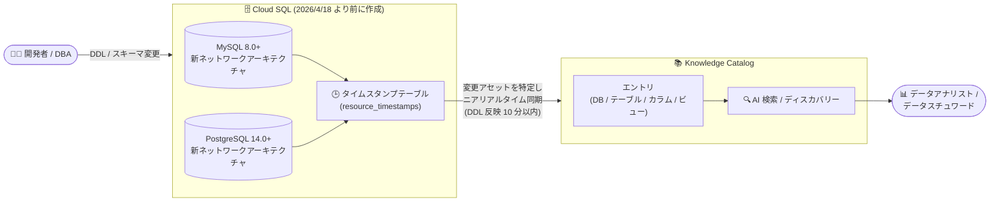

# Cloud SQL for MySQL / PostgreSQL: 既存インスタンスの Knowledge Catalog ニアリアルタイム同期対応

**リリース日**: 2026-10-09

**サービス**: Cloud SQL for MySQL / Cloud SQL for PostgreSQL

**機能**: 2026 年 4 月 18 日より前に作成されたインスタンスにおける Knowledge Catalog (旧 Dataplex Universal Catalog) へのニアリアルタイムメタデータ同期

**ステータス**: Feature (新機能)

📊 [このアップデートのインフォグラフィックを見る](https://takech9203.github.io/google-cloud-news-summary/20261009-cloud-sql-knowledge-catalog-near-real-time-sync.html)

## 概要

2026 年 4 月 18 日より前に作成された Cloud SQL for MySQL および Cloud SQL for PostgreSQL の既存インスタンスでも、Knowledge Catalog (旧 Dataplex Universal Catalog) 統合を有効化すると、スキーマとメタデータの更新がニアリアルタイムで同期されるようになりました。従来、これらの既存インスタンスで統合を有効化した場合、メタデータの反映は 1 日 1 回のバッチ更新でしたが、今回のアップデートにより新規インスタンス (2026 年 4 月 18 日以降に作成されたインスタンスはニアリアルタイム同期がデフォルトで有効) と同等の鮮度でカタログが維持されます。

本機能の対象は、MySQL バージョン 8.0 以降または PostgreSQL バージョン 14.0 以降を実行し、かつ新ネットワークアーキテクチャ上で動作する適格インスタンスです。統合が現在オフになっているインスタンスで有効化すると自動的にニアリアルタイム同期が適用され、既に 1 日 1 回更新で統合が有効になっているインスタンスでは、統合を一度無効化して再有効化することでニアリアルタイム更新に切り替えられます。

このアップデートは、2026 年 4 月以前から Cloud SQL を運用しており、データカタログの鮮度に課題を感じていたデータプラットフォーム管理者やデータガバナンス担当者を対象としています。既存環境を作り直すことなく、最新のメタデータ同期方式へ移行できる点が大きな価値です。

**アップデート前の課題**

- 2026 年 4 月 18 日より前に作成された既存インスタンスでは、Knowledge Catalog 統合を有効化してもメタデータの更新が 1 日 1 回のバッチ反映に限られていた
- スキーマ変更 (テーブル追加や DDL 実行) がカタログに反映されるまで最大 1 日程度の遅延があり、データディスカバリーで古い情報が表示される可能性があった
- ニアリアルタイム同期を利用するには 2026 年 4 月 18 日以降にインスタンスを新規作成する必要があり、既存インスタンスの移行 (再作成) には大きな運用コストがかかった
- 1 日 1 回のバッチ抽出は、小さいマシンタイプかつ大規模スキーマ (10,000 テーブル以上) のインスタンスで CPU 使用率が最大 40% に達することがあった

**アップデート後の改善**

- 既存の適格インスタンス (MySQL 8.0+ / PostgreSQL 14.0+、新ネットワークアーキテクチャ) で統合を有効化するだけで、ニアリアルタイム同期が適用されるようになった
- 新しい DDL やスキーマ変更は有効化後 10 分以内に Knowledge Catalog へ反映され、既存リソースも 24 時間以内にカタログへ登録される
- 既に 1 日 1 回更新で統合済みのインスタンスも、無効化 → 再有効化の操作のみでニアリアルタイム更新に切り替え可能になった
- ニアリアルタイム統合は変更済みアセットのみを差分抽出するため、インスタンスの CPU 使用率への影響が最小限に抑えられる

## アーキテクチャ図



既存の Cloud SQL インスタンスで DDL やスキーマ変更が発生すると、インスタンス内のタイムスタンプテーブルで変更アセットが特定され、従来の 1 日 1 回のバッチ更新に代わってニアリアルタイム (DDL 変更は 10 分以内) で Knowledge Catalog に同期されます。

## サービスアップデートの詳細

### 主要機能

1. **既存インスタンスへのニアリアルタイム同期の拡大**
   - 2026 年 4 月 18 日より前に作成されたインスタンスで、統合が現在オフの場合に有効化すると、1 日 1 回のバッチ更新ではなくニアリアルタイム同期が適用される
   - 2026 年 4 月 18 日以降に作成されたインスタンスは、従来どおりニアリアルタイム同期がデフォルトで有効 (2026 年 3 月 19 日〜4 月 18 日に作成された一部のインスタンスも該当する場合がある)
   - 有効化後、新しい DDL とスキーマ変更は 10 分以内、インスタンス上の既存リソースは 24 時間以内に Knowledge Catalog へ反映される

2. **1 日 1 回更新からの切り替え (無効化 → 再有効化)**
   - 既に Knowledge Catalog 統合が 1 日 1 回更新で有効になっているインスタンスは、統合を一度無効化してから再有効化することでニアリアルタイム更新に切り替えられる
   - ニアリアルタイム統合中のインスタンスで統合を無効化する操作は最大 10 分かかる

3. **タイムスタンプテーブルによる差分検出**
   - ニアリアルタイム統合のインスタンスには、アセットの作成・更新時刻を追跡するタイムスタンプテーブルが作成される (MySQL では `mysql` データベース内の `resource_timestamps` テーブル)
   - DDL やスキーマ変更が発生すると、統合処理がタイムスタンプテーブルを照会して最近変更されたアセットを特定し、最新のスキーマ更新のみを Knowledge Catalog にロードする
   - 統合を支えるクエリには `--Dataplex` コメントが付与されており、アクティブクエリの監視画面で識別できる

4. **結果整合性による信頼性の担保**
   - ネットワーク不安定などの稀なケースで更新が欠落しても、通常 24 時間以内に結果整合的に反映される

## 技術仕様

### ニアリアルタイム同期の適用条件 (既存インスタンス)

| 項目 | Cloud SQL for MySQL | Cloud SQL for PostgreSQL |
|------|---------------------|--------------------------|
| 作成日 | 2026 年 4 月 18 日より前 (今回の対象) | 2026 年 4 月 18 日より前 (今回の対象) |
| データベースバージョン | MySQL 8.0 以降 | PostgreSQL 14.0 以降 |
| ネットワークアーキテクチャ | 新ネットワークアーキテクチャ | 新ネットワークアーキテクチャ |
| 統合オフ → 有効化 | ニアリアルタイム同期が適用 | ニアリアルタイム同期が適用 |
| 1 日 1 回で統合済み | 無効化 → 再有効化で切り替え | 無効化 → 再有効化で切り替え |

条件を満たさないインスタンス (旧バージョン、旧ネットワークアーキテクチャ) は、従来どおり 1 日 1 回の更新となります。

### 同期の反映時間

| イベント | 反映時間 |
|----------|----------|
| 新しい DDL / スキーマ変更 | 有効化後 10 分以内 |
| インスタンス上の既存リソースの初回登録 | 24 時間以内 |
| 欠落した更新の結果整合 | 通常 24 時間以内 |
| ニアリアルタイム統合の無効化処理 | 最大 10 分 |

### 必要な IAM 権限

```
cloudsql.schemas.view  # Knowledge Catalog で Cloud SQL メタデータを表示するために必要
                       # プロジェクトレベルで付与が必要
```

この権限を持つユーザーは、プロジェクト内のすべての Cloud SQL インスタンスのメタデータを表示できる点に注意してください。

## 設定方法

### 前提条件

1. プロジェクトで Dataplex API が有効化されていること
2. `cloudsql.schemas.view` 権限を含む IAM ロール (カスタムロールまたは事前定義ロール) が付与されていること
3. 対象インスタンスが MySQL 8.0 以降または PostgreSQL 14.0 以降で、新ネットワークアーキテクチャ上で動作していること

### 手順

#### ステップ 1: 統合状態とインスタンス条件の確認

```bash
# インスタンスの設定を確認 (enableDataplexIntegration の値を確認)
gcloud sql instances describe INSTANCE_NAME
```

出力の `settings` セクションで `enableDataplexIntegration` の値と、データベースバージョンを確認します。旧ネットワークアーキテクチャのインスタンスは、先に新ネットワークアーキテクチャへのアップグレードが必要です。

#### ステップ 2: 統合が未有効の場合 — 有効化

```bash
# 既存インスタンスに Knowledge Catalog 統合を有効化 (ニアリアルタイム同期が適用される)
gcloud sql instances patch INSTANCE_NAME \
    --enable-dataplex-integration
```

```bash
# プロジェクト内の全インスタンスに一括有効化する場合
gcloud sql instances list --format="(NAME)" \
    | tail -n +2 | xargs -t -I % gcloud sql instances patch % --enable-dataplex-integration
```

#### ステップ 3: 1 日 1 回更新で統合済みの場合 — 無効化して再有効化

```bash
# 1. 統合を一度無効化 (ニアリアルタイム統合中の無効化は最大 10 分かかる)
gcloud sql instances patch INSTANCE_NAME \
    --no-enable-dataplex-integration

# 2. 統合を再有効化 (ニアリアルタイム更新に切り替わる)
gcloud sql instances patch INSTANCE_NAME \
    --enable-dataplex-integration
```

REST API を使用する場合は、以下のリクエストボディで `PATCH` リクエストを送信します。

```json
{
  "settings": {
    "enableDataplexIntegration": true
  }
}
```

#### ステップ 4: 同期の確認

有効化後、Knowledge Catalog コンソールで Cloud SQL のアセットを確認します。新しい DDL やスキーマ変更は 10 分以内、既存リソースは 24 時間以内に反映されます。MySQL では `mysql` データベースの `resource_timestamps` テーブルを Google Cloud コンソールからクエリして、アセットの作成・更新時刻を確認することもできます。

## メリット

### ビジネス面

- **データカタログの鮮度向上**: スキーマ変更が最大 1 日遅れで反映されていた既存環境でも、ほぼリアルタイムで最新のメタデータを参照できるようになり、データディスカバリーやガバナンス判断の信頼性が向上する
- **移行コストの削減**: ニアリアルタイム同期のためにインスタンスを再作成する必要がなく、設定変更 (有効化、または無効化 → 再有効化) のみで既存環境を最新の同期方式へ移行できる
- **新旧インスタンスの運用統一**: 2026 年 4 月 18 日前後で作成されたインスタンス間のカタログ鮮度の差がなくなり、組織全体で一貫したメタデータ運用が可能になる

### 技術面

- **差分ベースの効率的な同期**: タイムスタンプテーブルで変更アセットのみを特定して同期するため、全スキーマを毎日抽出するバッチ方式に比べて CPU 使用率への影響が最小限に抑えられる
- **DDL 変更の迅速な反映**: 新しい DDL やスキーマ変更は 10 分以内にカタログへ反映される
- **結果整合性**: 稀に更新が欠落しても通常 24 時間以内に結果整合的に反映され、カタログの正確性が担保される
- **可観測性**: 統合を支えるクエリは `--Dataplex` コメントで識別可能で、アクティブクエリの監視により統合の動作を確認できる

## デメリット・制約事項

### 制限事項

- 対象は MySQL 8.0 以降 / PostgreSQL 14.0 以降かつ新ネットワークアーキテクチャのインスタンスのみ。条件を満たさないインスタンスは引き続き 1 日 1 回の更新となる
- 既に 1 日 1 回更新で統合済みのインスタンスは自動では切り替わらず、統合の無効化 → 再有効化の手動操作が必要
- データベースの名前変更時は、データベースの更新のみがニアリアルタイムで反映され、配下のテーブルとのマッピングは結果整合となる
- 以下のケースではメッセージがドロップされ、カタログが一時的に結果整合となる可能性がある: 短時間での大量 DDL 実行、クローン作成されたインスタンス、バックアップから復元されたインスタンス、メモリ不足、インスタンス再起動、ネットワーク障害
- MySQL ではデータベース・テーブル・ビューを削除して同名で再作成した場合、元のエントリが Knowledge Catalog に残る (PostgreSQL では期待どおり削除される)
- 2026 年 4 月 18 日より前に作成されたインスタンスで、Assured Workloads によるリソースアクセス制限がある場合、Knowledge Catalog 統合はオフになる

### 考慮すべき点

- 無効化 → 再有効化の切り替え時、ニアリアルタイム統合中のインスタンスの無効化処理には最大 10 分かかるため、切り替え作業は時間に余裕を持って計画する
- 再有効化後、既存リソースのカタログ再登録には最大 24 時間かかる点を考慮し、カタログ参照が集中する時間帯を避けて切り替えることを推奨
- `cloudsql.schemas.view` 権限はプロジェクトレベルで付与されるため、プロジェクト内全インスタンスのメタデータが閲覧対象となるアクセス制御上の影響を確認する
- 旧ネットワークアーキテクチャのインスタンスは、まず新ネットワークアーキテクチャへのアップグレードを検討する必要がある

## ユースケース

### ユースケース 1: 長期運用中の既存データベース群をニアリアルタイムカタログへ移行

**シナリオ**: 2024 年から運用している Cloud SQL for PostgreSQL 15 のインスタンス群 (新ネットワークアーキテクチャ) で Knowledge Catalog 統合が 1 日 1 回更新になっており、頻繁なスキーマ変更がカタログに反映されるまでの遅延が、データアナリストのデータディスカバリーの妨げになっている。

**実装例**:
```bash
# 1 日 1 回更新のインスタンスを無効化 → 再有効化してニアリアルタイムに切り替え
gcloud sql instances patch analytics-db --no-enable-dataplex-integration
gcloud sql instances patch analytics-db --enable-dataplex-integration
```

**効果**: インスタンスを再作成することなく、スキーマ変更が 10 分以内に Knowledge Catalog へ反映されるようになり、アナリストが常に最新のテーブル構造を検索・参照できる。

### ユースケース 2: アジャイル開発環境でのスキーマ変更の即時カタログ反映

**シナリオ**: マイクロサービス開発チームが Cloud SQL for MySQL 8.0 上で頻繁にテーブル追加・カラム変更を行っており、データスチュワードが変更を翌日まで把握できず、メタデータのエンリッチメント (アスペクト付与や PII 分類) が後手に回っている。

**効果**: DDL 変更が 10 分以内にカタログへ反映されるため、データスチュワードが新規テーブルやカラムの追加をほぼリアルタイムで検知し、ガバナンスポリシーの適用やメタデータの付与を迅速に実施できる。

## 料金

Cloud SQL 側で Knowledge Catalog 統合 (ニアリアルタイム同期を含む) を有効化すること自体に追加料金は発生しません。Knowledge Catalog の利用料金はメタデータストレージ SKU に基づきます。

| 項目 | 料金 |
|------|------|
| Cloud SQL 側の統合有効化 | 追加料金なし |
| メタデータストレージ | Knowledge Catalog のメタデータストレージ SKU に基づく課金 |
| 検索 API 呼び出し / コンソールでの検索 | 無料 |

最新の料金詳細は [Knowledge Catalog 料金](https://cloud.google.com/dataplex/pricing) および [Cloud SQL 料金](https://cloud.google.com/sql/pricing) を参照してください。

## 利用可能リージョン

Cloud SQL for MySQL および Cloud SQL for PostgreSQL が利用可能なすべてのリージョンで、Knowledge Catalog 統合が利用可能です。詳細は [Cloud SQL のロケーション](https://cloud.google.com/sql/docs/mysql/locations) を参照してください。

## 関連サービス・機能

- **Knowledge Catalog (Dataplex)**: Cloud SQL のメタデータを統合管理するカタログサービス。AI 検索、メタデータエンリッチメント、データリネージ機能を提供
- **Cloud SQL 新ネットワークアーキテクチャ**: ニアリアルタイム同期の前提条件。旧アーキテクチャのインスタンスはアップグレードが必要
- **BigQuery**: Knowledge Catalog と統合されたもう一つの主要データソース。Cloud SQL と BigQuery のメタデータを横断的に検索可能
- **AlloyDB for PostgreSQL**: Cloud SQL と同様に Knowledge Catalog 統合をサポート
- **Sensitive Data Protection**: カタログに登録されたスキーマ情報と組み合わせて、PII データの検出・分類を強化
- **Pub/Sub**: Knowledge Catalog のメタデータ変更フィードと連携し、メタデータ変更の通知を受信可能

## 参考リンク

- 📊 [インフォグラフィック](https://takech9203.github.io/google-cloud-news-summary/20261009-cloud-sql-knowledge-catalog-near-real-time-sync.html)
- [公式リリースノート](https://docs.cloud.google.com/release-notes#October_09_2026)
- [Cloud SQL for MySQL の Knowledge Catalog 統合](https://docs.cloud.google.com/sql/docs/mysql/dataplex-catalog-integration)
- [Cloud SQL for PostgreSQL の Knowledge Catalog 統合](https://docs.cloud.google.com/sql/docs/postgres/dataplex-catalog-integration)
- [新ネットワークアーキテクチャへのアップグレード (MySQL)](https://docs.cloud.google.com/sql/docs/mysql/upgrade-cloud-sql-instance-new-network-architecture)
- [Knowledge Catalog の概要](https://cloud.google.com/dataplex/docs/catalog-overview)
- [Knowledge Catalog 料金](https://cloud.google.com/dataplex/pricing)
- [Cloud SQL 料金](https://cloud.google.com/sql/pricing)
- [関連レポート: Cloud SQL の Knowledge Catalog 自動統合 (2026-04-18)](./2026-04-18-cloud-sql-knowledge-catalog-integration.md)

## まとめ

2026 年 4 月 18 日より前に作成された既存の Cloud SQL for MySQL (8.0+) / PostgreSQL (14.0+) インスタンスでも、Knowledge Catalog 統合を有効化するだけでスキーマ・メタデータのニアリアルタイム同期 (DDL 変更は 10 分以内に反映) が利用できるようになりました。1 日 1 回更新で統合済みのインスタンスは、`gcloud sql instances patch` による無効化 → 再有効化の簡単な操作で切り替えられます。既存環境でカタログの鮮度に課題がある場合は、インスタンスのバージョンとネットワークアーキテクチャを確認のうえ、ニアリアルタイム同期への切り替えを推奨します。

---

**タグ**: #CloudSQL #MySQL #PostgreSQL #KnowledgeCatalog #Dataplex #MetadataSync #NearRealTime #DataDiscovery #DataGovernance #GoogleCloud
