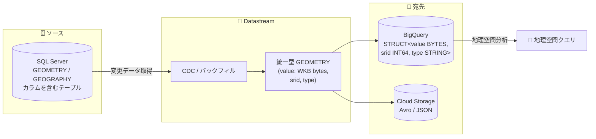

# Datastream: SQL Server の GEOMETRY / GEOGRAPHY 空間データ型のレプリケーションをサポート

**リリース日**: 2026-10-09

**サービス**: Datastream

**機能**: SQL Server GEOMETRY / GEOGRAPHY 空間データ型のレプリケーション対応

**ステータス**: 一般提供 (Feature)

📊 [このアップデートのインフォグラフィックを見る](https://takech9203.github.io/google-cloud-news-summary/20261009-datastream-sqlserver-spatial-data-types.html)

## 概要

Datastream が、SQL Server ソースの `GEOMETRY` および `GEOGRAPHY` 空間データ型のレプリケーションをサポートしました。これまでレプリケーション対象外だった空間データを含むテーブルも、他のカラムと同様に BigQuery などの宛先へストリーミングできるようになります。

SQL Server の `GEOMETRY` / `GEOGRAPHY` 型は、Datastream の統一型 (unified type) である `GEOMETRY` 型にマッピングされます。統一型 `GEOMETRY` は、WKB (Well-Known Binary) 形式のバイナリ値 (`value`)、空間参照系 ID (`srid`)、ジオメトリの種類 (`type`) の 3 フィールドで構成され、BigQuery 宛先では同じ構造の `STRUCT` 型として格納されます。

地理空間情報 (店舗位置、配送エリア、不動産の区画データなど) を SQL Server で管理している企業が、BigQuery の地理空間分析機能と組み合わせてニアリアルタイム分析を行うための重要なアップデートです。

**アップデート前の課題**

- SQL Server ソースの `GEOMETRY` / `GEOGRAPHY` カラムは Datastream でレプリケーションされず、宛先に空間データを届けるには別途エクスポート処理や変換パイプラインを構築する必要があった
- 空間データを含むテーブルのニアリアルタイム分析 (BigQuery の地理空間関数との組み合わせ) が Datastream 単体では実現できなかった

**アップデート後の改善**

- SQL Server の `GEOMETRY` / `GEOGRAPHY` カラムが Datastream の統一型 `GEOMETRY` としてレプリケーションされるようになった
- BigQuery 宛先では `value` (WKB 形式の `BYTES`)、`srid` (`INT64`)、`type` (`STRING`) をネストした `STRUCT` 型として格納され、SRID やジオメトリ種別を含めてロスレスに空間データを転送できるようになった
- 空間データ型サポート導入前に作成した既存ストリームでも、ラベル `enable_sqlserver_spatial_types: true` を追加することで空間カラムのレプリケーションを有効化できる

## アーキテクチャ図



SQL Server の空間データ型カラムが Datastream の統一型 `GEOMETRY` (WKB 値 + SRID + ジオメトリ種別) に変換され、BigQuery では `STRUCT` 型として格納されるデータフローを示しています。

## サービスアップデートの詳細

### 主要機能

1. **SQL Server 空間データ型のレプリケーション**
   - `GEOMETRY` 型 (平面座標系の空間データ) と `GEOGRAPHY` 型 (測地座標系の空間データ) の両方に対応
   - どちらも Datastream の統一型 `GEOMETRY` にマッピングされる

2. **ロスレスな統一型表現**
   - 統一型 `GEOMETRY` は `value` (WKB 形式のバイト列)、`srid` (空間参照系 ID)、`type` (ジオメトリの種類) の 3 フィールドを持つレコード型
   - Avro ではカスタムレコード型、JSON ではネストした JSON として出力される

3. **既存ストリームでの有効化オプション**
   - 空間データ型サポート導入前に作成されたストリームでは、`GEOMETRY` / `GEOGRAPHY` カラムはデフォルトでレプリケーションされない
   - ストリームにラベル `enable_sqlserver_spatial_types: true` を追加することで、既存ストリームでも空間カラムのレプリケーションを有効化できる

## 技術仕様

### データ型マッピング

| SQL Server データ型 | Datastream 統一型 | BigQuery データ型 |
|---------------------|-------------------|-------------------|
| `GEOMETRY` | `GEOMETRY` | `STRUCT` (`value`: `BYTES` (WKB 形式), `srid`: `INT64`, `type`: `STRING`) |
| `GEOGRAPHY` | `GEOMETRY` | `STRUCT` (`value`: `BYTES` (WKB 形式), `srid`: `INT64`, `type`: `STRING`) |

### 統一型 GEOMETRY の構造 (Avro 定義)

```json
{
  "type": "record",
  "name": "geometry",
  "fields": [
    {"name": "value", "type": "bytes"},
    {"name": "srid", "type": "int"},
    {"name": "type", "type": "string"}
  ]
}
```

### 他ソースの空間データ型対応状況 (参考)

| ソース | 空間データ型 | Datastream での扱い |
|--------|-------------|---------------------|
| SQL Server | `GEOMETRY` / `GEOGRAPHY` | **サポート (今回のアップデート)** |
| MySQL | `GEOMETRY` | `UNSUPPORTED` |
| Oracle | `SDO_GEOMETRY` | `UNSUPPORTED` |
| PostgreSQL | `POINT` / `POLYGON` など | `UNSUPPORTED` |

## 設定方法

### 既存ストリームでの空間データ型レプリケーションの有効化

空間データ型サポート導入前に作成されたストリームでは、`GEOMETRY` / `GEOGRAPHY` カラムはデフォルトではレプリケーションされません。有効化するには、対象ストリームに以下のラベルを追加します。

```
ラベルキー: enable_sqlserver_spatial_types
ラベル値: true
```

新規に作成するストリームでは、空間データ型はデフォルトでレプリケーション対象となります。

## メリット

### ビジネス面

- **地理空間データのニアリアルタイム分析**: SQL Server で管理する位置情報 (店舗、物流、不動産、IoT デバイスの位置など) を BigQuery にストリーミングし、鮮度の高い地理空間分析が可能になる
- **パイプライン構築コストの削減**: 空間データ専用のエクスポート / 変換処理を別途開発・運用する必要がなくなる

### 技術面

- **ロスレスな転送**: WKB 形式の値に加えて SRID とジオメトリ種別が保持されるため、座標系情報を失わずに宛先へ転送できる
- **標準形式 (WKB) での格納**: `value` フィールドは WKB (Well-Known Binary) 形式のため、BigQuery の地理空間関数など WKB を扱えるツールでの後続処理と親和性が高い

## デメリット・制約事項

### 制限事項

- 空間データ型サポート導入前に作成された既存ストリームでは、`GEOMETRY` / `GEOGRAPHY` カラムはデフォルトでレプリケーションされない (ラベル `enable_sqlserver_spatial_types: true` の追加が必要)
- ユニークインデックスのないテーブルでは、ラージオブジェクトカラム (`GEOMETRY` / `GEOGRAPHY` を含む `TEXT`、`NTEXT`、`XML`、`IMAGE` など) の CDC はサポートされない (ラージオブジェクトカラムをストリームに含めなければ CDC は可能)
- トランザクションログ方式の CDC では、ユニークインデックスのないテーブル、またはユニークな非クラスター化インデックスのみで可変長カラム (`VARCHAR`、`VARBINARY`、`NVARCHAR`、`GEOMETRY`、`GEOGRAPHY`) を含むテーブルにおいて、ラージオブジェクトカラムの CDC はサポートされない

### 考慮すべき点

- トランザクションログ方式では、`GEOMETRY` / `GEOGRAPHY` などのデータ型はソースデータベースへのポイントインタイム照会 (supplementation) によって値が補完される。短時間に連続する更新や、挿入直後の削除といったシナリオでは中間の変更がキャプチャされない可能性があり、すべての中間変更を期待する append-only 書き込みモードでは特に注意が必要
- BigQuery には `STRUCT` (WKB バイト列) として格納されるため、BigQuery の `GEOGRAPHY` 型として直接扱う場合は WKB からの変換処理が必要

## ユースケース

### ユースケース 1: 店舗・配送エリアデータのニアリアルタイム地理空間分析

**シナリオ**: 小売・物流企業が SQL Server で店舗位置 (`GEOGRAPHY`) や配送エリアのポリゴン (`GEOMETRY`) を管理しており、BigQuery で売上データと組み合わせた商圏分析を行いたい。

**効果**: Datastream のストリームに空間カラムを含めるだけで、位置情報が WKB 形式で BigQuery に継続的に反映され、専用のエクスポートジョブなしで鮮度の高い商圏分析が可能になる。

### ユースケース 2: 既存の SQL Server ストリームへの空間データ追加

**シナリオ**: すでに Datastream で SQL Server から BigQuery へレプリケーションを行っているが、これまで空間カラムが宛先に反映されていなかった。

**実装例**:
```
# 既存ストリームにラベルを追加して空間データ型のレプリケーションを有効化
enable_sqlserver_spatial_types: true
```

**効果**: ストリームを作り直すことなく、既存ストリームで `GEOMETRY` / `GEOGRAPHY` カラムのレプリケーションを有効化できる。

## 料金

本アップデートによる料金体系の変更はアナウンスされていません。Datastream の料金は処理された CDC / バックフィルのデータ量に基づきます。詳細は [Datastream の料金ページ](https://cloud.google.com/datastream/pricing)を参照してください。

## 関連サービス・機能

- **BigQuery**: Datastream の主要な宛先。空間データは `STRUCT` (WKB 形式の `BYTES` + SRID + 種別) として格納され、BigQuery の地理空間分析機能と組み合わせて活用できる
- **Cloud Storage**: Datastream のもう 1 つの宛先。統一型 `GEOMETRY` は Avro のカスタムレコード型、または JSON のネスト構造として出力される
- **Cloud SQL for SQL Server**: Datastream の SQL Server ソースとして利用できるマネージドデータベース

## 参考リンク

- 📊 [インフォグラフィック](https://takech9203.github.io/google-cloud-news-summary/20261009-datastream-sqlserver-spatial-data-types.html)
- [公式リリースノート](https://docs.cloud.google.com/release-notes#October_09_2026)
- [Map SQL Server data types to Datastream unified types](https://docs.cloud.google.com/datastream/docs/unified-types#map-sqlserver)
- [Data type mappings in BigQuery](https://docs.cloud.google.com/datastream/docs/bq-map-data-types)
- [Stream data from a SQL Server database (既知の制限事項)](https://docs.cloud.google.com/datastream/docs/sources-sqlserver)
- [料金ページ](https://cloud.google.com/datastream/pricing)

## まとめ

SQL Server の空間データ型 (`GEOMETRY` / `GEOGRAPHY`) が Datastream でレプリケーション可能になり、位置情報を含むテーブルを BigQuery へニアリアルタイムに連携できるようになりました。MySQL や Oracle の空間型は引き続き未サポートであり、SQL Server ソースならではの差別化ポイントです。既存の SQL Server ストリームを運用中の場合は、`enable_sqlserver_spatial_types` ラベルの追加による有効化を検討してください。

---

**タグ**: Datastream, SQL Server, BigQuery, CDC, 空間データ, GEOMETRY, GEOGRAPHY, データレプリケーション
