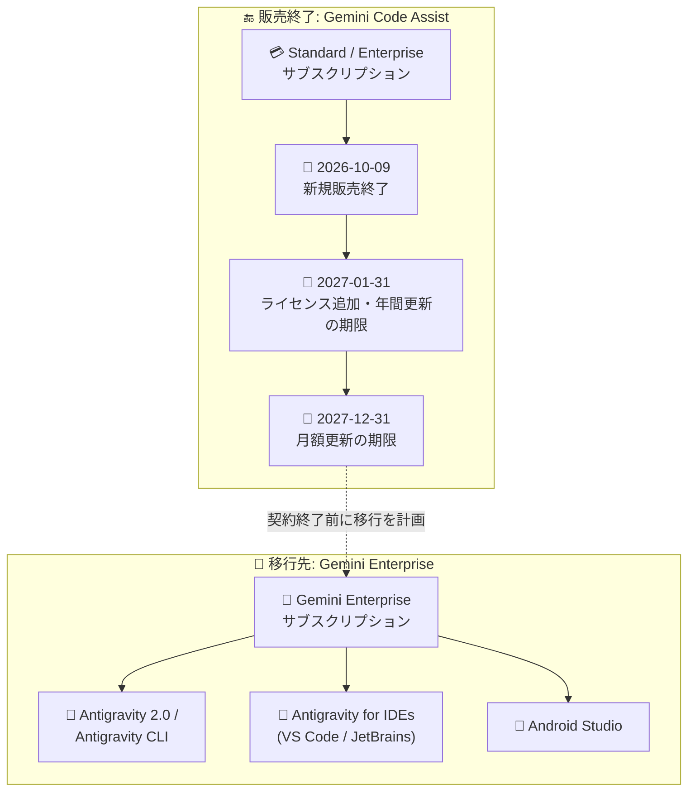

# Gemini Code Assist: Standard / Enterprise サブスクリプションの新規販売終了

**リリース日**: 2026-10-09

**サービス**: Gemini (Gemini Code Assist)

**機能**: Gemini Code Assist Standard / Enterprise サブスクリプションの販売終了

**ステータス**: Announcement (販売終了のお知らせ)

📊 [このアップデートのインフォグラフィックを見る](https://takech9203.github.io/google-cloud-news-summary/20261009-gemini-code-assist-subscription-sale-ending.html)

## 概要

Google Cloud は 2026 年 10 月 9 日をもって、Gemini Code Assist Standard および Enterprise サブスクリプションの新規販売を終了すると発表しました。既存のサブスクリプションは契約期間の終了まで引き続き動作し、サポートも継続されますが、自動更新は 2027 年中に順次終了します。年間サブスクリプションの自動更新は 2027 年 1 月 31 日まで、月額サブスクリプションの自動更新は 2027 年 12 月 31 日までとなり、以降は更新できません。既存サブスクリプションへのライセンス追加も 2027 年 1 月 31 日が期限です。

今後のエージェント型コーディング支援は、Gemini Enterprise エディションに含まれる **Antigravity** を通じて提供されます。Antigravity は Gemini Enterprise Agent Platform 経由でも利用可能です。Google は、プランが最終更新日または契約終了日を迎える前に、Gemini Enterprise への移行を計画するよう推奨しています。

この発表は段階的な縮小の流れの中に位置付けられます。2026 年 6 月 18 日には個人向けティア (Gemini Code Assist for individuals、Google AI Pro / Ultra) 向けの Gemini Code Assist IDE 拡張と Gemini CLI がリクエスト処理を停止しており、2026 年 9 月 4 日にはアクティブなサブスクリプションを持たない請求先アカウントによる Cloud コンソール経由での新規購入が停止されていました。今回の発表により、法人向けの Standard / Enterprise サブスクリプションも新規販売が完全に終了します。

**アップデート前の課題**

- 2026 年 9 月 4 日以降、アクティブなサブスクリプションを持たない請求先アカウントは Cloud コンソールから新規購入できなくなっていたが、Google Cloud セールスへの問い合わせによる新規購入は可能だった
- 既存顧客はライセンス追加や自動更新を期限の制約なく継続できた
- Gemini Code Assist と Antigravity という複数の AI 開発者ツールが並存していた

**アップデート後の変更**

- 2026 年 10 月 9 日以降、Gemini Code Assist Standard / Enterprise の新規サブスクリプションは一切購入できない
- ライセンス追加と年間サブスクリプションの自動更新は 2027 年 1 月 31 日まで、月額サブスクリプションの自動更新は 2027 年 12 月 31 日までに期限が設定された
- エージェント型コーディング支援の提供は、Gemini Enterprise エディションに含まれる Antigravity (Antigravity 2.0、Antigravity CLI、IDE 拡張) に一本化される

## アーキテクチャ図

Gemini Code Assist Standard / Enterprise は段階的に終了し、エージェント型コーディング支援は Gemini Enterprise サブスクリプションに含まれる Antigravity 系ツール群へ移行します。

## サービスアップデートの詳細

### 販売終了スケジュール

| 日付 | 内容 |
|------|------|
| 2026 年 6 月 18 日 (実施済み) | 個人向けティア (for individuals、Google AI Pro / Ultra) の Gemini Code Assist IDE 拡張と Gemini CLI がリクエスト処理を停止 |
| 2026 年 9 月 4 日 (実施済み) | アクティブなサブスクリプションを持たない請求先アカウントによる Cloud コンソール経由の新規購入を停止 |
| **2026 年 10 月 9 日** | **Standard / Enterprise の新規サブスクリプション購入が不可に** |
| 2027 年 1 月 31 日 | 既存サブスクリプションへのライセンス追加の期限。年間サブスクリプションの自動更新の期限 |
| 2027 年 12 月 31 日 | 月額サブスクリプションの自動更新の期限 |

### 既存サブスクリプションへの影響

1. **契約期間中は継続利用可能**
   - 既存のサブスクリプションは契約期間の終了まで引き続き動作し、サポートも継続される
   - 2027 年 1 月 31 日まではライセンスの追加が可能

2. **自動更新の終了**
   - 年間サブスクリプション: 2027 年 1 月 31 日以降は更新不可
   - 月額サブスクリプション: 2027 年 12 月 31 日以降は更新不可

3. **移行先は Antigravity (Gemini Enterprise)**
   - エージェント型コーディング支援は、Gemini Enterprise エディションに含まれる Antigravity を通じて提供される
   - Gemini Enterprise Agent Platform 経由でも利用可能
   - 最終更新日または契約終了日の前に Gemini Enterprise への移行計画を立てることが推奨されている

## 技術仕様

### 移行先: Gemini Enterprise の AI 開発者ツール

Gemini Enterprise サブスクリプションで利用できる AI 開発者ツールは以下のとおりです。

| ツール | 説明 |
|------|------|
| Google Antigravity | 自律型 AI エージェントでアプリケーションを構築する AI 開発環境。Antigravity 2.0 と Antigravity CLI をサポート |
| Antigravity for IDEs | VS Code や JetBrains など IDE に自律型 AI エージェント機能を組み込む拡張機能 |
| Android Studio | プロフェッショナル Android 開発向け IDE。Gemini Enterprise 経由で AI 機能を利用可能 |

### Gemini Enterprise で AI 開発者ツールを利用するための要件

| 項目 | 詳細 |
|------|------|
| 対応エディション | Gemini Enterprise Standard / Plus (有料またはフリートライアル)、Standard Emerging Market / Pay-as-you-go (有料) |
| 請求先アカウント | 請求書発行 (invoiced) タイプの Cloud Billing アカウントが必要 |
| 必要な IAM ロール | 管理者: Gemini Enterprise Admin (`roles/discoveryengine.agentspaceAdmin`)、利用者: Gemini Enterprise User (`roles/discoveryengine.agentspaceUser`) |
| 利用可能モデル | Gemini モデルはデフォルトで有効。Anthropic Claude などのサードパーティモデルは管理者のオプトインと従量課金 (overage) の有効化が必要 |

## デメリット・制約事項

### 制限事項

- 2026 年 10 月 9 日以降、Gemini Code Assist Standard / Enterprise の新規サブスクリプションは購入できない
- 2027 年 1 月 31 日以降は既存サブスクリプションへのライセンス追加ができない
- 自動更新の終了後、サブスクリプションは契約期間満了で失効する (失効後の再有効化はできない)
- 移行先の Gemini Enterprise の AI 開発者ツールは請求書発行タイプの Cloud Billing アカウントが必要
- Gemini Enterprise 上の Antigravity は一部のコンプライアンス認証 (FedRAMP、ISO 27001 / 42001、SOC 1 / 2 / 3、ITAR、IL4 / IL5、Access Transparency) に未対応

### 考慮すべき点

- 契約の最終更新日・終了日を確認し、逆算して Gemini Enterprise への移行スケジュールを策定する必要がある
- ライセンス数の調整 (追加) が必要な場合は 2027 年 1 月 31 日までに実施する必要がある
- Gemini CLI を利用しているチームは Antigravity CLI への移行ガイドに沿った移行作業が必要
- コンプライアンス要件が厳しい組織は、Antigravity の未対応認証を踏まえた評価が必要

## ユースケース

### ユースケース 1: 年間サブスクリプション利用組織の移行計画

**シナリオ**: Gemini Code Assist Enterprise の年間サブスクリプションを利用中の開発組織。自動更新の期限が 2027 年 1 月 31 日に迫っている。

**対応**: 最終更新後の契約満了日を確認し、満了前に Gemini Enterprise Standard / Plus エディションの評価・契約を完了させる。開発者には Antigravity for IDEs (VS Code / JetBrains) への移行手順を周知する。

**効果**: コーディング支援の空白期間を作らずに Antigravity ベースのエージェント型開発環境へ移行できる。

### ユースケース 2: Gemini CLI ユーザーの Antigravity CLI への移行

**シナリオ**: Gemini Code Assist Standard ライセンスで Gemini CLI をターミナルや CI パイプラインで利用しているチーム。

**対応**: 公式の Gemini CLI → Antigravity CLI 移行ガイドに沿って、認証とワークフローを Antigravity CLI へ切り替える。

**効果**: サブスクリプション終了後もターミナルベースのエージェント型コーディング支援を継続できる。

## 料金

今回の発表は新機能ではなく販売終了のアナウンスのため、新たな料金は発生しません。既存の Gemini Code Assist の料金は公式料金ページを参照してください。移行先の Antigravity では、Gemini モデルは Gemini Enterprise エディションのプール型クレジットから消費され、サードパーティモデル (Anthropic Claude など) は従量課金 (overage) として Cloud Billing アカウントに課金されます。

- [Gemini Code Assist の料金](https://cloud.google.com/products/gemini/pricing)
- [Gemini Enterprise](https://cloud.google.com/gemini-enterprise)

## 関連サービス・機能

- **Gemini Enterprise**: 移行先となるサブスクリプション。Standard / Plus / Pay-as-you-go エディションで Antigravity などの AI 開発者ツールを利用できる
- **Google Antigravity / Antigravity CLI**: 自律型 AI エージェントによる開発環境と CLI。今後のエージェント型コーディング支援の提供基盤
- **Antigravity for IDEs**: VS Code / JetBrains 向けの拡張機能。Gemini Code Assist IDE 拡張の後継に相当
- **Gemini Enterprise Agent Platform**: Antigravity を利用するためのもう 1 つの提供経路
- **Android Studio**: Gemini Enterprise 経由で AI 機能を利用できる Android 開発向け IDE

## 参考リンク

- 📊 [インフォグラフィック](https://takech9203.github.io/google-cloud-news-summary/20261009-gemini-code-assist-subscription-sale-ending.html)
- [公式リリースノート](https://docs.cloud.google.com/release-notes#October_09_2026)
- [Gemini Code Assist Standard and Enterprise subscriptions (販売終了のご案内)](https://docs.cloud.google.com/gemini/docs/codeassist/sunset)
- [Gemini Enterprise の AI developer tools 概要](https://docs.cloud.google.com/gemini/enterprise/docs/ai-developer-tools-overview)
- [Antigravity ドキュメント](https://antigravity.google/docs/home/)
- [Antigravity IDE extensions](https://antigravity.google/docs/ide/extensions/)
- [Gemini CLI から Antigravity CLI への移行ガイド](https://antigravity.google/docs/gcli-migration)
- [Gemini Code Assist の料金ページ](https://cloud.google.com/products/gemini/pricing)

## まとめ

Gemini Code Assist Standard / Enterprise は 2026 年 10 月 9 日で新規販売を終了し、自動更新も 2027 年中 (年間: 1 月 31 日、月額: 12 月 31 日) に終了します。Google の法人向け AI コーディング支援は Gemini Enterprise に含まれる Antigravity へ一本化されるため、現行ユーザーは契約の最終更新日を確認し、ライセンス追加期限 (2027 年 1 月 31 日) も考慮しつつ、契約満了前に Gemini Enterprise への移行計画を立てることを強く推奨します。

---

**タグ**: #GeminiCodeAssist #Antigravity #GeminiEnterprise #販売終了 #移行 #AI開発者ツール
