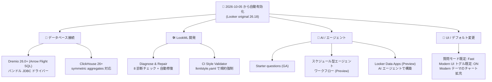

# Looker: Looker 26.18 向け新機能の自動有効化 (Diagnose & Repair、CI Style Validator、Data Apps など)

**リリース日**: 2026-10-09

**サービス**: Looker

**機能**: Looker 26.18 を実行する Looker (original) インスタンスでの新機能自動有効化 (2026 年 10 月 5 日開始)

**ステータス**: Announcement / Feature (GA + Preview) / Change

📊 [このアップデートのインフォグラフィックを見る](https://takech9203.github.io/google-cloud-news-summary/20261009-looker-26-18-auto-enabled-features.html)

## 概要

2026 年 10 月 5 日より、Looker 26.18 を実行する Looker (original) インスタンスに対して、一連の新機能が自動的に有効化されることが発表されました。Looker (Google Cloud core) 向けの機能有効化は別途アナウンスされる予定です。26.18 本体のロールアウト (2026 年 9 月 21 日〜10 月 4 日) が品質改善中心であったのに対し、今回の自動有効化では新機能・プレビュー機能・デフォルト動作の変更が一括で適用されます。

有効化される機能は大きく 4 つの領域に分かれます。(1) データベース接続では Dremio 26.0+ (Arrow Flight SQL) と ClickHouse 26+ の新ダイアレクトサポート、(2) LookML 開発では Git リポジトリの健全性を診断・自動修復する新しい Diagnose & Repair ツールと、LookML コーディング規約を CI で強制する Style Validator、(3) AI/エージェント機能では AI-Assisted Quick Starts (Starter questions) の GA、Conversational Analytics のスケジュール型エージェントワークフロー (Preview)、ローカル AI コーディングエージェントで構築する Looker Data Apps (Preview)、(4) UI/デフォルト動作では Conversational Analytics の既定質問モードの Fast 化、Modern User Interface トグルの既定 ON 化、Modern 可視化テーマの対応チャート拡充です。

Looker 管理者、LookML 開発者、Conversational Analytics を利用する分析チームが対象です。自動有効化のため個別のオプトイン操作は不要ですが、デフォルト動作の変更 (質問モード、Modern UI トグル) と、26.14 より前に作成したワークフローの再作成要件は事前に把握しておく必要があります。

**アップデート前の課題**

- Dremio や ClickHouse の新しいバージョンに接続するには、カスタム JDBC ドライバー JAR の個別インストールや旧ダイアレクトでの運用が必要だった
- LookML プロジェクトの Git リポジトリに不整合 (stale なロックファイル、権限異常、オブジェクト破損など) が発生した場合、根本原因の特定と修復を手動で行うか、サポートに頼る必要があった
- Looker CI には LookML のコーディング規約や命名規則を強制する仕組みがなく、スタイル統一はコードレビューや外部リンターに依存していた
- Conversational Analytics のエージェントワークフローはしきい値トリガー型のみで、定期的な AI インサイト配信にはダッシュボードのスケジュール配信など別の仕組みが必要だった
- ダッシュボードはグリッドレイアウトが前提で、絶対配置や要素の重ね合わせ、カスタム Web コンポーネントを使った自由なレイアウトは Extension Framework での本格的な開発が必要だった
- Conversational Analytics の既定質問モードは Thinking で、単純な質問でも推論ステップの生成により応答に時間がかかっていた

**アップデート後の改善**

- Dremio 26.0+ (Arrow Flight SQL) はバンドルされた Apache Arrow Flight SQL JDBC ドライバーを使用し、カスタム JDBC ドライバーのインストールが不要になった。ClickHouse 26+ もモダナイズされた JDBC ドライバーと symmetric aggregates に対応した
- Diagnose & Repair ツールにより、8 項目の診断チェックで Git リポジトリの健全性を評価し、多くの問題を自動修復 (ロックファイル削除、権限正規化、オブジェクトインデックス修復) またはリカバリブランチ付きの安全な再構築で解決できるようになった
- Looker CI の Style Validator により、`lkmlstyle.yaml` で構成可能な 25 の組み込みルール + カスタムルールで LookML のスタイルを CI パイプラインで自動検証できるようになった
- スケジュール型エージェントワークフロー (Preview) により、自然言語の指示だけで AI 生成のインサイトサマリー・データテーブル・可視化・PDF レポートを email / Slack に定期配信できるようになった
- Looker Data Apps (Preview) により、Gemini CLI、Claude Code、Cursor などのローカル AI コーディングエージェントで自由レイアウトのキャンバス型ダッシュボードを構築しつつ、LookML セマンティックレイヤーとユーザー権限によるガバナンスを維持できるようになった
- Fast モードが既定となり、クエリを LookML 定義に直接マッピングして高速に回答する体験がデフォルトになった (複雑な多段階の分析には Thinking モードを引き続き選択可能)

## アーキテクチャ図



2026 年 10 月 5 日以降に自動有効化される機能群を、データベース接続・LookML 開発・AI/エージェント・UI/デフォルト変更の 4 領域に整理した図です。

## サービスアップデートの詳細

### 主要機能

1. **Dremio 26.0+ (Arrow Flight SQL) ダイアレクトの組み込みサポート**
   - バンドルされた Apache Arrow Flight SQL JDBC ドライバーを使用するため、パッケージ化されていないカスタム JDBC ドライバー JAR のインストールが不要
   - 高スループットなカラムナ転送プロトコルである Arrow Flight SQL による Dremio 接続が標準で利用可能

2. **AI-Assisted Quick Starts (Starter questions) の GA**
   - 新しい Explore エクスペリエンスで「Starter questions」として提供される AI 支援のクイックスタート機能が一般提供 (GA) に昇格

3. **Diagnose & Repair ツール (Git リポジトリ診断・修復)**
   - LookML プロジェクトリポジトリを 8 つの診断チェック (Git Setup、Git Connection Test、File System Access、Repository Functional State、Git Lock File、Object Permissions、Git Config Settings、Repository Consistency FSCK) で評価
   - 個人の開発環境 (personal development environment) と共有の本番環境 (shared production environment) のどちらでも実行可能
   - 問題検出時は、stale なロックファイルの削除、ファイル権限の修正、破損したオブジェクトインデックスの修復などを自動実行
   - 修復不能な場合は、未コミットの変更を専用のリカバリブランチに退避したうえでリポジトリを安全に再構築
   - 各チェックは Not Detected / Detected / Repaired / Failed のステータスで報告され、Git Setup と Git Connection Test は外部要因のため手動対応

4. **Looker CI Style Validator**
   - LookML のコーディング規約・命名規則・構造的ベストプラクティスを CI (Continuous Integration) スイートで強制
   - プロジェクトリポジトリのルートに `lkmlstyle.yaml` (または `lkmlstyle.yml`) 設定ファイルを配置して実行 (設定ファイルがない場合は検証が失敗する)
   - `ruleset_version: "all-v1.0"` で 25 の標準組み込みルールを一括有効化、`"none"` で段階的導入も可能
   - ルールごとの severity (error / warn / disabled)、`ignore_files` によるファイル除外、`overrides` によるパス別上書き、`custom_rules` による宣言的なカスタムルール (pattern_match、property、order、first_child、unique) をサポート
   - 「Only incremental errors」(既定で有効) により、開発ブランチで新たに発生した違反のみを報告するインクリメンタル検証が可能

5. **(Preview) Conversational Analytics スケジュール型エージェントワークフロー**
   - 従来のトリガー型 (しきい値監視) に加え、スケジュール型のエージェントワークフローをサポート
   - 自然言語で指示するだけで、AI 生成のインサイトサマリー・データテーブル・可視化・PDF レポートを email または Slack に定期配信
   - スケジュールは分 (最短 15 分間隔)・時間・日・週・月・カスタム日で設定可能
   - 受信者は通知内の「Investigate」から、ワークフローを生成したデータエージェントとのプライベートで永続的な会話を開始可能
   - 管理ページが拡充: Manage Workflows ユーザーページ / 管理者ページに加え、スケジュール実行の監視とエラー調査のための新しい Workflow Executions 管理者ページを追加
   - Looker 26.14 より前に作成されたワークフローは Legacy Workflows タブに表示され、再作成が必要

6. **(Preview) Looker Data Apps**
   - Gemini CLI、Claude Code、Cursor などのローカル AI コーディングエージェントが自然言語プロンプトから構築するフリーフォームキャンバス型ダッシュボード
   - 絶対配置、要素の重ね合わせ、カスタム Web コンポーネントなど完全なビジュアルレイアウト制御が可能
   - Looker Extension Framework 上で動作し、単一要素の User-Defined Dashboard (UDD) 内で実行される
   - AI はオーサリング時のみ使用 (ローカルマシンで実行)。公開後の閲覧・操作時には AI モデルは一切呼び出されない
   - アウトバウンド通信をブロックするネットワーク分離サンドボックスで実行され、通信先は Looker インスタンスのみ
   - クエリは LookML セマンティックレイヤー経由のみで、閲覧ユーザーの権限・モデルアクセス・行レベルアクセスフィルタが適用される

7. **ClickHouse 26+ ダイアレクトサポート**
   - モダナイズされた JDBC ドライバーを使用し、symmetric aggregates (ファンアウト結合時の正確な集計) をサポート

### デフォルト動作の変更 (Change)

1. **Conversational Analytics の既定質問モードが Thinking から Fast に変更**
   - Fast モードは推論ステップを生成せず、クエリを LookML 定義に直接マッピングして高速に回答
   - 複雑な多段階の分析質問には、質問モードのドロップダウンから Thinking モードを引き続き選択可能

2. **Modern User Interface プレビュー機能トグルの既定値が ON に変更**

3. **Modern 可視化テーマの対応チャート拡充**
   - マップチャート (静的なマップポイントとリージョン)、ワードクラウドチャート、ドーナツマルチプルに対応 (ドーナツマルチプルは従来ドキュメント記載のみだったが、本リリースで正式に利用可能に)

## 技術仕様

### 自動有効化の概要

| 項目 | 詳細 |
|------|------|
| 有効化開始日 | 2026 年 10 月 5 日 |
| 対象 | Looker 26.18 を実行する Looker (original) インスタンス |
| Looker (Google Cloud core) | 機能有効化は別途アナウンス予定 |
| オプトイン操作 | 不要 (自動有効化) |

### Diagnose & Repair の診断チェック (8 項目)

| 診断チェック | 内容 | 修復タイプ |
|------|------|------|
| Git Setup | リモート origin URL と DB 構成レコードの存在確認 | 手動 |
| Git Connection Test | 認証情報・ネットワーク到達性・リモートアクセス権限の検証 | 手動 |
| File System Access | ファイルシステム I/O・ストレージエラーの検出 | 自動 (リポジトリ再構築 + リカバリブランチ) |
| Repository Functional State | `.git` 構造の健全性とワーキングツリー認識の確認 | 自動 (リポジトリ再構築) |
| Git Lock File | 中断された Git 操作が残した stale な `.lock` ファイルのスキャン | 自動 (ロックファイル削除) |
| Object Permissions | 推奨基準から逸脱したファイル/ディレクトリ権限の検出 | 自動 (権限の正規化) |
| Git Config Settings | `core.filemode` など Looker 必須デフォルトとの一致確認 | 自動 (設定更新) |
| Repository Consistency FSCK | `git fsck` によるオブジェクトデータベースの構造的破損検査 | 自動 (インデックス再構築、`git fetch --refetch`、フォールバック再構築) |

### Style Validator の設定ファイル (lkmlstyle.yaml)

| パラメータ | 必須 | 説明 |
|------|------|------|
| `schema_version` | 必須 | 設定スキーマバージョン (現在は `1` のみ) |
| `ruleset_version` | 必須 | ベースラインルールセット (`"all-v1.0"` = 25 ルール全有効 / `"none"` = ゼロから opt-in) |
| `ignore_files` | 任意 | 検証から完全に除外するファイルの glob パターン |
| `rules` | 任意 | 個別ルールの severity (error / warn / disabled) のグローバル調整 |
| `overrides` | 任意 | 特定パスにスコープしたルール上書き |
| `custom_rules` | 任意 | 宣言的なユーザー定義ルール (pattern_match、property、order、first_child、unique) |

最小構成の例:

```yaml
schema_version: 1
ruleset_version: "all-v1.0"
```

### スケジュール型エージェントワークフローの配信仕様

| 項目 | 詳細 |
|------|------|
| 配信先 | Email、Slack (Looker の email ドメイン許可リストに準拠) |
| 配信内容 | AI 生成の自然言語サマリー、データテーブル、埋め込みチャート、PDF レポート |
| スケジュール頻度 | 分 (最短 15 分)・時間・日・週・月・カスタム日 |
| Slack の制限 | サマリーは 3,000 文字、テーブルは最大 100 行 x 10 列 (超過分は切り詰め) |
| 必要権限 | 対象モデルに対する `chat_with_agent` 権限 |
| 免責ヘッダー | 配信には「Powered by Gemini. Verify as AI can make mistakes.」が付与される |

## 設定方法

### Diagnose & Repair の実行手順

1. Development Mode を有効にし、ナビゲーションパネルの **Develop** > **Projects** から対象プロジェクトを開く
2. Looker IDE のアイコンメニューから **Settings** を選択
3. **Git Diagnose and Repair** セクションで **Diagnose & Repair** をクリック
4. テスト対象の環境 (**Development** = 個人の開発コピー / **Production** = 本番コピー) を選択して **Diagnose** を実行
5. **Detected** となったチェックに自動修復が利用可能な場合、**Start Repair** をクリックして修復を適用

必要権限: 開発環境の診断にはプロジェクト内の少なくとも 1 モデルへの `develop` 権限、本番環境の診断には `deploy` 権限が必要です。

### Style Validator の有効化手順

1. Looker 26.18 以降で CI の要件を満たし、CI を有効化する
2. LookML プロジェクトを Git バージョン管理に接続する
3. CI スイート設定で **Style Validator** トグルを有効化する (既定では無効。有効化時は「Only incremental errors」が既定で ON)
4. プロジェクトリポジトリのルートに `lkmlstyle.yaml` を追加する (ない場合、検証は「No style validator configuration provided」エラーで失敗)
5. CI スイートを実行し、CI run 結果ページでルール名・パス・行番号・コンテキストスニペット付きの診断結果を確認する

## メリット

### ビジネス面

- **AI インサイトの定期配信による意思決定の高速化**: スケジュール型ワークフローにより、BI ダッシュボードを開かなくても AI 生成のサマリーや PDF レポートが email / Slack に届き、受信者はそのまま「Investigate」で深掘りできる
- **ダッシュボード開発の民主化と高速化**: Data Apps により、自然言語プロンプトとローカル AI エージェントでピクセルパーフェクトなデータアプリを構築でき、ガバナンス (LookML セマンティックレイヤー・権限) は維持される
- **運用コストの削減**: Git リポジトリ障害の自己解決 (Diagnose & Repair) により、サポート問い合わせや開発停止時間を削減できる

### 技術面

- **Git トラブルシューティングの自動化**: 8 項目の体系的な診断と自動修復 (リカバリブランチによる未コミット変更の保護付き) により、従来は手動対応が必要だったリポジトリ破損・ロックファイル・権限問題を安全に解決できる
- **LookML 品質の CI ゲート化**: 25 の組み込みルールとカスタムルールにより、命名規則や構造的ベストプラクティスをコードレビュー前に機械的に強制できる。インクリメンタル検証により既存の違反を抱えたプロジェクトでも段階導入しやすい
- **接続性の近代化**: Dremio (Arrow Flight SQL) と ClickHouse 26+ がバンドルドライバーで利用でき、カスタム JAR 管理が不要になる。ClickHouse では symmetric aggregates により結合時の集計精度も向上する
- **セキュアな AI 活用設計**: Data Apps は公開後にランタイム AI を使わず、ネットワーク分離サンドボックスで実行されるため、クエリ結果や認証情報が外部サーバーに送信されない

## デメリット・制約事項

### 制限事項

- スケジュール型エージェントワークフローと Looker Data Apps は **Preview** であり、Pre-GA 利用規約が適用され、サポートが限定される
- Looker 26.14 より前に作成されたワークフローは Legacy Workflows タブに表示され、**再作成が必要**
- スケジュール型ワークフローの最短実行間隔は 15 分。Slack 配信はサマリー 3,000 文字、テーブル 100 行 x 10 列に制限される
- Style Validator は root プロジェクトの `.lkml` / `.lookml` ファイルのみを検証し、インポートされた依存プロジェクトや `include:` で取り込まれたオブジェクトは対象外
- Diagnose & Repair のうち Git Setup と Git Connection Test は外部要因 (期限切れのデプロイキー、失効したトークン、ファイアウォールなど) のため自動修復不可で、手動対応が必要

### 考慮すべき点

- **自動有効化**のため、デフォルト動作の変更 (Conversational Analytics の Fast モード化、Modern UI トグルの ON 化) が 10 月 5 日以降ユーザー体験に直接影響する。利用部門への事前周知を推奨
- ワークフローの email / Slack 配信先には Looker のアクセス制御が適用されない。外部共有時のコンテンツアクセス管理は利用者側の責任となるため、機密データを扱うエージェントでの配信設定ポリシーを定めておく必要がある
- Style Validator を有効化しても `lkmlstyle.yaml` がないと CI が失敗するため、有効化前に設定ファイルの整備が必要
- Looker (Google Cloud core) ユーザーは今回の対象外であり、別途のアナウンスを待つ必要がある

## ユースケース

### ユースケース 1: 週次営業レポートの AI 自動配信

**シナリオ**: 営業企画チームが毎週月曜朝に、前週の売上トレンドと要因分析のサマリーを経営層へ配信したい。

**実装例**:
```
Conversational Analytics の Explore データエージェントとの会話で:
「毎週月曜 8:00 に、前週の地域別売上のサマリーと上位 10 商品のテーブル、
 トレンドチャートを含む PDF レポートを sales-leaders@example.com に送って」
```

**効果**: ダッシュボードの手動確認やレポート作成作業が不要になり、受信者は「Investigate」からそのまま AI に追加質問して深掘りできる。実行状況は管理者が Workflow Executions ページで監視できる。

### ユースケース 2: LookML リポジトリ障害からの迅速な復旧

**シナリオ**: 開発者の個人ブランチで Git 操作が中断され、ロックファイルが残って IDE 上の Git 操作がすべてブロックされた。

**効果**: Diagnose & Repair を Development 環境に対して実行すると、Git Lock File チェックが問題を検出し、自動修復で stale なロックファイルを安全に削除。リポジトリ履歴や作業ファイルを変更せずに数分で開発を再開できる。より深刻な破損でも、未コミットの変更はリカバリブランチに退避されるため消失しない。

### ユースケース 3: チーム横断の LookML コーディング規約の強制

**シナリオ**: 複数チームが共同開発する LookML プロジェクトで、命名規則 (例: Finance ビューのディメンションは `fin_` プレフィックス必須) や join の `relationship` 明示を徹底したい。

**実装例**:
```yaml
schema_version: 1
ruleset_version: "all-v1.0"
custom_rules:
  - name: finance-dimension-prefix
    title: "Finance dimensions must be prefixed with fin_"
    rule_type: pattern_match
    severity: error
    select: "view.dimension"
    filters:
      view_label: "Finance"
    match: "^fin_[a-z0-9_]+$"
```

**効果**: プルリクエスト時の CI 実行で規約違反が error として検出され、レビュー負荷が軽減される。「Only incremental errors」により既存の違反は温存しつつ、新規違反のみをブロックする段階的導入が可能。

## 料金

今回自動有効化される機能は Looker (original) のライセンス内で提供され、Release Notes に追加料金の記載はありません。Conversational Analytics などの Gemini in Looker 機能の提供条件は、エディションや契約によって異なる場合があります。詳細は料金ページを参照してください。

- [Looker 料金](https://cloud.google.com/looker/pricing)

## 関連サービス・機能

- **Looker Continuous Integration (CI)**: Style Validator が追加される CI 基盤。LookML Validator や SQL Validator と組み合わせた品質ゲートを構成できる
- **Gemini in Looker / Conversational Analytics**: Starter questions、質問モード (Fast/Thinking)、エージェントワークフローの基盤
- **Looker Extension Framework**: Data Apps の実行基盤。単一要素の User-Defined Dashboard 内でサンドボックス実行される
- **Gemini CLI / MCP Toolbox / Looker-managed MCP server**: Data Apps や LookML の AI 支援開発でローカル AI エージェントと Looker を接続する手段
- **Dremio / ClickHouse**: 新ダイアレクトが追加されたデータソース。ClickHouse 26+ では symmetric aggregates に対応
- **Slack / Email (Action Hub)**: スケジュール型ワークフローの配信先。Slack 配信には Action Hub での Slack アクション設定と認証が必要
- **Looker (Google Cloud core)**: マネージド版。今回の機能有効化は対象外で、別途アナウンス予定

## 参考リンク

- 📊 [インフォグラフィック](https://takech9203.github.io/google-cloud-news-summary/20261009-looker-26-18-auto-enabled-features.html)
- [公式リリースノート (October 09, 2026)](https://docs.cloud.google.com/release-notes#October_09_2026)
- [Looker リリースノート](https://docs.cloud.google.com/looker/docs/release-notes)
- [Diagnose & Repair tool](https://docs.cloud.google.com/looker/docs/diagnosing-and-repairing-git-projects)
- [CI Style Validator](https://docs.cloud.google.com/looker/docs/ci-style-validator)
- [Conversational Analytics スケジュール型エージェントワークフロー](https://docs.cloud.google.com/looker/docs/conversational-analytics-scheduled-agentic-workflows)
- [Looker Data Apps](https://docs.cloud.google.com/looker/docs/data-apps)
- [Starter questions (AI-Assisted Quick Starts)](https://docs.cloud.google.com/looker/docs/gemini-quick-starts)
- [Dremio 接続ドキュメント](https://docs.cloud.google.com/looker/docs/db-config-dremio)
- [ClickHouse 接続ドキュメント](https://docs.cloud.google.com/looker/docs/db-config-clickhouse)
- [Looker 料金ページ](https://cloud.google.com/looker/pricing)

## まとめ

Looker 26.18 を実行する Looker (original) インスタンスでは、2026 年 10 月 5 日から Git 診断・修復 (Diagnose & Repair)、CI Style Validator、AI エージェントによるスケジュール配信や Data Apps (いずれも Preview) など、開発生産性と AI 活用を大きく拡張する機能群が自動的に有効化されます。管理者は、デフォルト動作の変更 (Fast モード、Modern UI トグル ON) の利用部門への周知と、26.14 より前に作成したワークフローの再作成計画を進めてください。LookML 開発チームは、`lkmlstyle.yaml` の整備による Style Validator の段階導入と、Git トラブル時の第一手としての Diagnose & Repair の活用を検討することを推奨します。

---

**タグ**: Looker, LookML, CI, Git, ConversationalAnalytics, Gemini, DataApps, AgenticWorkflow, Dremio, ClickHouse, Preview, GA
