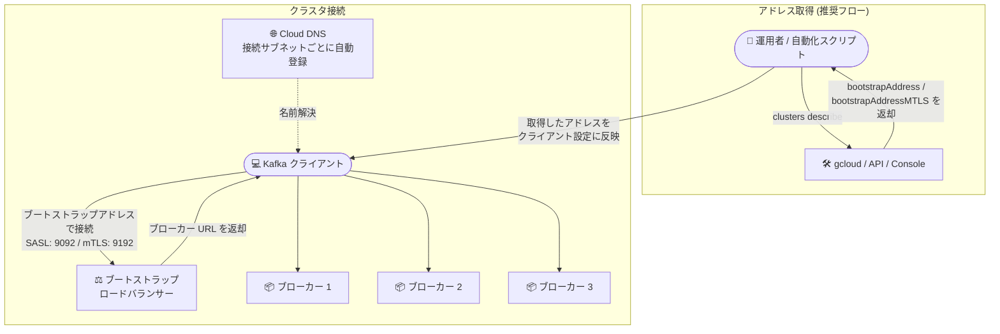

# Google Cloud Managed Service for Apache Kafka: ブートストラップアドレスとブローカー URL のフォーマット変更

**リリース日**: 2026-10-09

**サービス**: Google Cloud Managed Service for Apache Kafka

**機能**: 新規クラスタにおけるブートストラップアドレス / ブローカー URL のフォーマット変更

**ステータス**: Change (変更)

📊 [このアップデートのインフォグラフィックを見る](https://takech9203.github.io/google-cloud-news-summary/20261009-managed-kafka-bootstrap-address-format-change.html)

## 概要

Google Cloud Managed Service for Apache Kafka において、**新規に作成されるクラスタのブートストラップアドレスおよびブローカー URL のフォーマットが変更**されました。Kafka クライアントはブートストラップアドレスを使用してクラスタへの接続を確立し、ブローカーの一覧を取得します。今回の変更に伴い、公式ドキュメントでは「ブートストラップアドレスはクラスタのライフタイム中は固定だが、**URL のフォーマットはクラスタごとに異なる可能性がある**」ことが明記されました。

この変更は新規クラスタに適用されるものであり、ブートストラップアドレスと ブローカー URL はクラスタのライフタイム中は固定であるため、既存クラスタに接続中のクライアントのアドレスが変わるものではありません。一方で、ブートストラップアドレスのフォーマットを前提に URL を自前で組み立てている (ハードコードしている) スクリプトや IaC 構成がある場合は注意が必要です。今後は Console、gcloud、API 経由でクラスタごとの実際のブートストラップアドレスを取得する運用が推奨されます。

対象ユーザーは、Managed Service for Apache Kafka で新規クラスタを作成するすべてのユーザー、および接続設定を自動化しているプラットフォームエンジニアです。

**アップデート前の状況**

- ブートストラップアドレスのフォーマットは全クラスタで一貫していることを前提に、プロジェクト ID やクラスタ ID から接続文字列を組み立てる運用が可能だった
- 接続文字列をスクリプトや設定ファイルにハードコードしていても、フォーマット差異の問題は顕在化しにくかった

**アップデート後の変更点**

- 新規に作成する Managed Service for Apache Kafka クラスタでは、ブートストラップアドレスとブローカー URL のフォーマットが従来と異なる
- 公式ドキュメントに「ブートストラップ URL のフォーマットはクラスタごとに異なる可能性がある」ことが明記され、Console / gcloud / API でクラスタごとに実際の値を取得することが前提となった
- ブートストラップアドレス自体はクラスタのライフタイム中は固定であるため、既存クラスタの接続設定を変更する必要はない

## アーキテクチャ図



ブートストラップアドレスのフォーマットはクラスタごとに異なる可能性があるため、URL を自前で組み立てるのではなく、gcloud や Console でクラスタごとの実際の値を取得してクライアントに設定するフローが推奨されます。

## サービスアップデートの詳細

### 主要な変更点

1. **新規クラスタのアドレスフォーマット変更**
   - 新規に作成される Managed Service for Apache Kafka クラスタでは、ブートストラップアドレスとブローカー URL のフォーマットが変更された
   - ブートストラップアドレスとブローカー URL はクラスタのライフタイム中は固定 (既存クラスタのアドレスは変わらない)

2. **フォーマットの非保証化 (ドキュメント上の明確化)**
   - 公式ドキュメントでは「ブートストラップ URL のフォーマットはクラスタごとに異なる可能性がある」と明記
   - クライアント設定にはクラスタごとに取得した実際の値を使用することが前提

3. **ブートストラップアドレスの取得方法**
   - Console: クラスタ詳細ページの「Configurations」タブに表示 (SASL は「Bootstrap URL」、mTLS は「mTLS Bootstrap URL」)
   - gcloud: `managed-kafka clusters describe` の `bootstrapAddress` (SASL) / `bootstrapAddressMTLS` (mTLS) フィールド
   - API / Terraform でも取得可能

### ブートストラップアドレスの仕組み

- ブートストラップアドレスは、クラスタ内の全ブローカーに接続されたロードバランサーに対応しており、クライアントはこのアドレスを起点にブローカー URL を取得する
- クラスタにサブネットを接続すると、サービスがそのサブネットのネットワーク内にブートストラップアドレスとブローカーの DNS エントリを自動作成する
- DNS 名は接続されたすべてのサブネットで同一であり、サブネットごとに異なる IP アドレスに解決される
- パブリッククラスタの場合、スプリットホライズン DNS により、同一のブートストラップアドレスが接続元に応じてパブリック / プライベート IP に解決される
- ディスカバリ DNS レコードは外部 Egress ファイアウォール設定専用であり、Kafka クライアントの接続先として使用してはならない

## 技術仕様

### 接続エンドポイントの仕様

| 項目 | 詳細 |
|------|------|
| ブートストラップアドレスの有効期間 | クラスタのライフタイム中は固定 |
| URL フォーマット | クラスタごとに異なる可能性がある (フォーマットは非保証) |
| SASL 認証時の取得フィールド | `bootstrapAddress` (ポート 9092) |
| mTLS 認証時の取得フィールド | `bootstrapAddressMTLS` (ポート 9192) |
| DNS 登録 | 接続された各サブネットのネットワークに自動登録 |
| パブリッククラスタの名前解決 | スプリットホライズン DNS (接続元に応じてパブリック / プライベート IP に解決) |
| クライアントが接続してはいけない宛先 | ディスカバリ DNS レコード (ファイアウォール設定専用) |

## 設定方法

### ブートストラップアドレスの確認手順

#### Console の場合

1. Managed Service for Apache Kafka の「クラスタ」ページに移動する
2. クラスタ名をクリックする
3. 「Configurations」タブを選択する
4. SASL 認証の場合は「Bootstrap URL」、mTLS 認証の場合は「mTLS Bootstrap URL」の値をコピーする

#### gcloud の場合

SASL 認証を使用する場合:

```bash
gcloud managed-kafka clusters describe CLUSTER_ID \
  --location=LOCATION \
  --format="value(bootstrapAddress)"
```

mTLS 認証を使用する場合:

```bash
gcloud managed-kafka clusters describe CLUSTER_ID \
  --location=LOCATION \
  --format="value(bootstrapAddressMTLS)"
```

`CLUSTER_ID` はクラスタの ID または名前、`LOCATION` はクラスタのロケーションに置き換えます。

## 影響と推奨される対応

### 影響を受けないケース

- **既存クラスタ**: ブートストラップアドレスはクラスタのライフタイム中は固定のため、既存クラスタに接続しているクライアントの設定変更は不要
- **アドレスを動的に取得している構成**: gcloud / API / Terraform でブートストラップアドレスを取得してクライアントに渡している場合は、新フォーマットでもそのまま動作する

### 対応を検討すべきケース

- **接続文字列をハードコードしている場合**: 旧フォーマットを前提に URL を組み立てているスクリプト、CI/CD パイプライン、IaC テンプレートは、新規クラスタで動作しない可能性がある。`clusters describe` の出力から取得する方式への移行を推奨
- **新規クラスタを作成する場合**: 既存クラスタと同じフォーマットのアドレスを想定せず、作成後に実際の値を取得して設定する
- **ファイアウォールや DNS 設定でアドレスを参照している場合**: 新規クラスタのアドレスフォーマットが異なることを前提に、設定の自動化・パラメータ化を検討する

## 関連サービス・機能

- **Cloud DNS**: ブートストラップアドレスとブローカーの DNS エントリが接続サブネットのネットワークに自動登録される。実際のブローカー IP アドレスと URL は Cloud DNS で確認できる
- **Private Service Connect**: コンシューマーネットワーク内にブートストラップアドレスと各ブローカー用のエンドポイントが作成される
- **Cloud Next Generation Firewall (Cloud NGFW)**: パブリッククラスタのアクセス制御に使用。ディスカバリ DNS レコードを FQDN ベースのファイアウォールルールに利用できる
- **Kafka Connect / クライアントアプリケーション**: Java / Python のクライアントはブートストラップアドレスを使用してクラスタに接続する

## 参考リンク

- 📊 [インフォグラフィック](https://takech9203.github.io/google-cloud-news-summary/20261009-managed-kafka-bootstrap-address-format-change.html)
- [公式リリースノート](https://docs.cloud.google.com/release-notes#October_09_2026)
- [View a Managed Service for Apache Kafka cluster (ブートストラップアドレスの取得)](https://docs.cloud.google.com/managed-service-for-apache-kafka/docs/view-cluster#view-bootstrap-address)
- [Configure networking for Managed Service for Apache Kafka](https://docs.cloud.google.com/managed-service-for-apache-kafka/docs/networking-kafka)
- [gcloud managed-kafka clusters describe リファレンス](https://docs.cloud.google.com/sdk/gcloud/reference/managed-kafka/clusters/describe)
- [Authentication types for Kafka brokers](https://docs.cloud.google.com/managed-service-for-apache-kafka/docs/authn-types-kafka)

## まとめ

新規作成する Managed Service for Apache Kafka クラスタでは、ブートストラップアドレスとブローカー URL のフォーマットが従来と異なります。既存クラスタのアドレスは固定のまま影響を受けませんが、接続文字列をハードコードしている運用は新規クラスタで破綻する可能性があるため、Console / gcloud / API からクラスタごとの実際のアドレスを取得する方式へ移行することを推奨します。

---

**タグ**: #ManagedKafka #ApacheKafka #Networking #DNS #GoogleCloud
