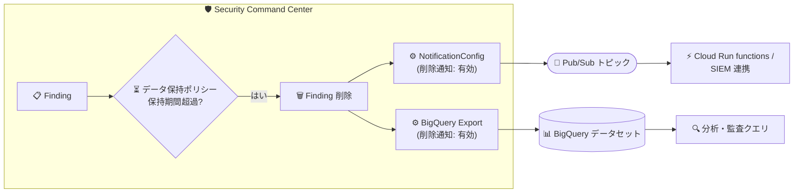

# Security Command Center: データ保持ポリシーによる Finding 削除時の通知機能

**リリース日**: 2026-10-09

**サービス**: Security Command Center

**機能**: データ保持ポリシーにより削除された Finding の Pub/Sub / BigQuery 継続的エクスポート通知

**ステータス**: 一般提供 (GA)

📊 [このアップデートのインフォグラフィックを見る](https://takech9203.github.io/google-cloud-news-summary/20261009-security-command-center-deleted-findings-notifications.html)

## 概要

Security Command Center (SCC) で、データ保持ポリシー (Data Retention Policy) によって Finding (検出結果) が削除された際に、Pub/Sub および BigQuery への継続的エクスポート (Continuous Export) を通じて通知を受け取れるようになりました。設定は gcloud CLI、securitycenter REST API、クライアントライブラリから行えます。

SCC の Finding には種類と状態に応じた保持期間が定められており、保持期間を過ぎた Finding は SCC から自動的に削除されます。例えば、非アクティブな脆弱性 Finding は 7 日、非アクティブな構成ミス Finding は 30 日で削除されます。今回のアップデートにより、こうした削除イベントを外部システムへリアルタイムに伝搬できるようになり、SIEM や独自のセキュリティダッシュボードなど、SCC の Finding を外部にミラーリングしているシステムとのデータ整合性を維持しやすくなります。

対象ユーザーは、SCC の Finding を Pub/Sub 経由で自動対応ワークフローに連携している組織や、BigQuery にエクスポートして長期分析・監査を行っているセキュリティ運用チームです。

**アップデート前の課題**

- 継続的エクスポートは Finding の作成・更新イベントを通知する仕組みであり、データ保持ポリシーによる削除を外部システム側で直接検知する手段がなかった
- SCC 側で保持期間切れにより削除された Finding が、外部の SIEM やダッシュボードには残り続け、データの不整合が発生し得た
- 外部システム側で SCC との整合性を保つには、定期的な全件照合などの独自の突き合わせ処理が必要だった

**アップデート後の改善**

- Pub/Sub 継続的エクスポート (NotificationConfig) で、削除された Finding の通知を有効化できるようになった (`--deletion-notifications-enabled` フラグ)
- BigQuery 継続的エクスポートでも同様に削除通知を有効化できるようになり、BigQuery 上で削除イベントを分析対象にできるようになった
- gcloud CLI / REST API / クライアントライブラリから設定可能になり、既存のエクスポート設定にも `update` コマンドで後から追加できる

## アーキテクチャ図



データ保持ポリシーにより Finding が削除されると、削除通知を有効化した継続的エクスポート設定を通じて Pub/Sub トピックと BigQuery データセットに削除イベントが配信され、下流の自動化や分析に利用できます。

## サービスアップデートの詳細

### 主要機能

1. **Pub/Sub 継続的エクスポートでの削除通知**
   - NotificationConfig に削除通知の有効/無効を指定できるようになった
   - gcloud では `gcloud scc notifications create` / `update` の `--[no-]deletion-notifications-enabled` フラグで制御する
   - 既存のフィルタ機能と組み合わせて、通知対象の Finding を絞り込むことも可能

2. **BigQuery 継続的エクスポートでの削除通知**
   - BigQuery エクスポート設定にも削除通知の有効/無効を指定できるようになった
   - gcloud では `gcloud scc bqexports create` / `update` の `--[no-]deletion-notifications-enabled` フラグで制御する

3. **gcloud CLI / REST API / クライアントライブラリ対応**
   - securitycenter REST API およびクライアントライブラリ (Java、Python、Go など) からも設定可能
   - 組織・フォルダ・プロジェクトの各レベルでエクスポート設定を構成できる

### データ保持ポリシーの概要

今回の通知対象となる「データ保持ポリシーによる削除」は、公式ドキュメントで以下のように定義されています (保持期間は変更される可能性があります)。

| Finding の種類 | 保持期間 |
|------|------|
| 非アクティブな脆弱性 | 7 日 |
| 非アクティブな構成ミス | 30 日 |
| 設計時 (Design-time) の Finding | 30 日 |
| アクティブな Finding (脅威を除く) | Enterprise / Premium: 13 か月、Standard: 35 日 |
| その他のすべての Finding | 90 日 |

保持期間は Finding の Event time から計算され、アクティブな Finding がスキャンで再検出されると Event time が更新されて保持期間がリセットされます。

## 技術仕様

### gcloud コマンドのフラグ

| 項目 | 詳細 |
|------|------|
| 対象コマンド | `gcloud scc notifications create/update`、`gcloud scc bqexports create/update` |
| フラグ | `--deletion-notifications-enabled` (有効化) / `--no-deletion-notifications-enabled` (無効化) |
| 設定レベル | 組織 (`--organization`)、フォルダ (`--folder`)、プロジェクト (`--project`) |
| ロケーション | `--location` (デフォルト: `global`、データレジデンシー有効時は `eu` / `sa` / `us` など) |

### 必要な IAM ロール

| 操作 | 必要なロール |
|------|------|
| 継続的エクスポートの閲覧 | Security Center Admin Viewer (`roles/securitycenter.adminViewer`) |
| 継続的エクスポートの作成・管理 | Security Center Admin Editor (`roles/securitycenter.adminEditor`) |
| NotificationConfig の作成・更新・削除 (API) | Security Center Notification Configurations Editor (`roles/securitycenter.notificationConfigEditor`) |
| Pub/Sub 通知のセットアップ | Security Center Admin (`roles/securitycenter.admin`)、Pub/Sub トピック側のプロジェクトで Project IAM Admin (`roles/resourcemanager.projectIamAdmin`) |

Pub/Sub への通知配信には、自動作成されるサービスアカウント `service-org-ORGANIZATION_ID@gcp-sa-scc-notification.iam.gserviceaccount.com` が使用され、組織レベルで `roles/securitycenter.notificationServiceAgent` が自動付与されます。

## 設定方法

### 前提条件

1. Security Command Center API が有効化されていること (`gcloud services enable securitycenter.googleapis.com`)
2. 通知先の Pub/Sub トピック、またはエクスポート先の BigQuery データセットが作成済みであること
3. 上記の IAM ロールが付与されていること

### 手順

#### ステップ 1: Pub/Sub 継続的エクスポートで削除通知を有効化

```bash
# 新規作成時に削除通知を有効化
gcloud scc notifications create my-deletion-config \
  --organization=ORGANIZATION_ID \
  --pubsub-topic=projects/PROJECT_ID/topics/TOPIC_ID \
  --location=global \
  --deletion-notifications-enabled

# 既存の NotificationConfig を更新して削除通知を有効化
gcloud scc notifications update my-config \
  --organization=ORGANIZATION_ID \
  --location=global \
  --deletion-notifications-enabled
```

`--filter` フラグを併用すると、通知対象の Finding を条件で絞り込めます。

#### ステップ 2: BigQuery 継続的エクスポートで削除通知を有効化

```bash
# 新規作成時に削除通知を有効化
gcloud scc bqexports create my-bq-export \
  --organization=ORGANIZATION_ID \
  --dataset=projects/PROJECT_ID/datasets/DATASET_ID \
  --location=global \
  --deletion-notifications-enabled

# 既存の BigQuery エクスポートを更新して削除通知を有効化
gcloud scc bqexports update my-bq-export \
  --organization=ORGANIZATION_ID \
  --location=global \
  --deletion-notifications-enabled
```

#### ステップ 3: 通知の受信確認

```bash
# Pub/Sub サブスクリプションからメッセージをプル
gcloud pubsub subscriptions pull \
  projects/PROJECT_ID/subscriptions/SUBSCRIPTION_ID
```

通知メッセージは JSON 形式の NotificationMessage として配信され、クライアントライブラリでパースできます。

## メリット

### ビジネス面

- **監査・コンプライアンス対応の強化**: SCC 内のデータライフサイクル (削除イベント) を外部に記録として残せるため、Finding の消失理由を説明しやすくなる
- **外部システムとのデータ品質向上**: SIEM やダッシュボード上に「SCC にはもう存在しない Finding」が残り続けることによる誤判断を防げる

### 技術面

- **整合性維持の自動化**: 定期的な全件照合バッチを組まなくても、削除イベント駆動で外部データストアを最新状態に保てる
- **既存設定への後付けが容易**: `update` コマンドにフラグを追加するだけで、既存の継続的エクスポートに削除通知を組み込める
- **オプトイン方式**: フラグで有効/無効を明示的に制御できるため、削除通知が不要な既存ワークフローへの影響を避けられる

## デメリット・制約事項

### 制限事項

- 設定手段はリリースノート上 gcloud CLI、securitycenter REST API、クライアントライブラリが対象として記載されている
- データレジデンシーが有効な場合、NotificationConfig は作成した SCC ロケーションにのみ保存され、作成後にロケーションを変更できない (変更には削除・再作成が必要)
- Pub/Sub のメッセージストレージポリシーで `enforceInTransit` が有効なトピックは継続的エクスポートと互換性がなく、通知を受信できない場合がある

### 考慮すべき点

- 保持期間 (非アクティブ脆弱性 7 日、非アクティブ構成ミス 30 日など) は変更される可能性があるため、削除イベント量の見積もりは定期的に見直す
- 削除通知を有効化すると配信されるメッセージ量が増えるため、Pub/Sub サブスクライバーや BigQuery 側の処理 (重複排除、状態管理ロジック) が削除イベントを正しく扱えるか確認が必要
- Finding を長期保管したい場合は、従来どおり削除前に BigQuery などの外部ストレージへエクスポートしておくことが前提となる (削除通知は保管の代替ではない)

## ユースケース

### ユースケース 1: SIEM / 外部チケットシステムとの同期

**シナリオ**: SCC の Finding を Pub/Sub 経由で SIEM や外部チケット管理システムに連携している組織で、SCC 側の保持期間切れで削除された Finding が外部システムに残り続けてしまう。

**実装例**:
```bash
gcloud scc notifications update siem-export \
  --organization=123456789 \
  --location=global \
  --deletion-notifications-enabled
```
削除通知を受け取った Cloud Run functions などのサブスクライバーが、SIEM 側の対応レコードをクローズ/アーカイブする。

**効果**: SCC と外部システム間の Finding の不整合を解消し、クローズ漏れによる誤ったアラート対応を防止できる。

### ユースケース 2: BigQuery での Finding ライフサイクル分析

**シナリオ**: BigQuery に Finding をストリーミングして長期のセキュリティ傾向分析を行っているチームが、どの Finding がいつ保持ポリシーで削除されたかを分析に含めたい。

**効果**: 削除イベントも BigQuery に記録されるため、Finding の生成から削除までのライフサイクル全体を SQL で分析でき、監査証跡としても活用できる。

## 料金

削除通知機能に関する固有の追加料金は、リリースノートおよび確認したドキュメントには記載されていません。継続的エクスポート先の Pub/Sub および BigQuery の利用量 (メッセージ配信、ストレージ、クエリなど) には各サービスの料金が適用されます。詳細は以下の料金ページを参照してください。

- [Security Command Center の料金](https://cloud.google.com/security-command-center/pricing)
- [Pub/Sub の料金](https://cloud.google.com/pubsub/pricing)
- [BigQuery の料金](https://cloud.google.com/bigquery/pricing)

## 関連サービス・機能

- **Pub/Sub**: 削除通知を含む Finding 通知の配信先。サブスクリプション経由で下流システムに連携する
- **BigQuery**: 継続的エクスポートの出力先。Finding の削除イベントを含めた分析・監査クエリに利用
- **Cloud Run functions**: Pub/Sub 通知をトリガーに、外部システムの更新や自動修復などの対応を自動化
- **SCC データレジデンシー**: NotificationConfig は SCC ロケーションに保存されるため、データレジデンシー要件がある場合はロケーション指定に注意が必要

## 参考リンク

- 📊 [インフォグラフィック](https://takech9203.github.io/google-cloud-news-summary/20261009-security-command-center-deleted-findings-notifications.html)
- [公式リリースノート](https://docs.cloud.google.com/release-notes#October_09_2026)
- [Enable finding notifications for Pub/Sub](https://docs.cloud.google.com/security-command-center/docs/how-to-notifications)
- [Stream findings to BigQuery for analysis](https://docs.cloud.google.com/security-command-center/docs/how-to-analyze-findings-in-big-query)
- [Creating and managing Notification Configs](https://docs.cloud.google.com/security-command-center/docs/how-to-api-manage-notifications)
- [Data retention (Data security overview)](https://docs.cloud.google.com/security-command-center/docs/concepts-data-security-overview)
- [gcloud scc notifications create リファレンス](https://docs.cloud.google.com/sdk/gcloud/reference/scc/notifications/create)
- [gcloud scc bqexports create リファレンス](https://docs.cloud.google.com/sdk/gcloud/reference/scc/bqexports/create)
- [料金ページ](https://cloud.google.com/security-command-center/pricing)

## まとめ

このアップデートにより、SCC のデータ保持ポリシーによる Finding の削除イベントを Pub/Sub / BigQuery 継続的エクスポート経由で検知できるようになり、SIEM や分析基盤など外部システムとのデータ整合性を自動で維持できるようになりました。SCC の Finding を外部連携している組織は、既存の NotificationConfig / BigQuery エクスポートに `--deletion-notifications-enabled` フラグを追加し、下流システムが削除イベントを処理できるようにワークフローを更新することを推奨します。

---

**タグ**: #SecurityCommandCenter #PubSub #BigQuery #ContinuousExport #DataRetention #SecurityOperations #SIEM
