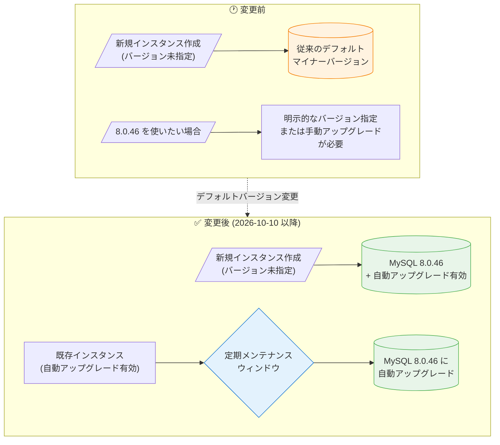

# Cloud SQL for MySQL: MySQL 8.0.46 がデフォルトマイナーバージョンに

**リリース日**: 2026-10-10

**サービス**: Cloud SQL for MySQL

**機能**: MySQL 8.0.46 デフォルトマイナーバージョン化

**ステータス**: GA (変更)

📊 [このアップデートのインフォグラフィックを見る](https://takech9203.github.io/google-cloud-news-summary/20261010-cloud-sql-mysql-8-0-46-default.html)

## 概要

Cloud SQL for MySQL 8.0 のデフォルトマイナーバージョンが MySQL 8.0.46 になった。MySQL 8.0.46 は 2026 年 6 月 18 日に Cloud SQL でサポート開始されたバージョンであり、今回のアップデートによりデフォルトバージョンへ昇格した形となる。

デフォルトマイナーバージョンの変更は、新規インスタンスの作成と既存インスタンスの自動アップグレードの両方に影響する。マイナーバージョンを指定せずに新規作成される MySQL 8.0 インスタンスは 8.0.46 でプロビジョニングされ、自動マイナーバージョンアップグレードが有効なインスタンス (8.0.35 以降で稼働) は、次回の定期メンテナンス時に 8.0.46 へ自動的にアップグレードされる。

MySQL 8.0.46 には InnoDB の FTS インデックス構築時のメモリ最適化、オプティマイザのバグ修正、OpenSSL 3.5.5 へのアップデートなどが含まれており、デフォルト化によってこれらの修正がフリート全体へ展開されていくことになる。

**アップデート前の課題**

- 新規作成した MySQL 8.0 インスタンスは従来のデフォルトバージョンでプロビジョニングされ、8.0.46 を利用するにはインスタンス作成時に明示的なバージョン指定が必要だった
- 自動マイナーバージョンアップグレードが有効なインスタンスの昇格先 (ターゲットバージョン) が 8.0.46 ではなかったため、8.0.46 のバグ修正・セキュリティパッチの適用には手動アップグレードが必要だった

**アップデート後の改善**

- マイナーバージョンを指定せずに作成した新規 MySQL 8.0 インスタンスが 8.0.46 でプロビジョニングされるようになった
- 自動マイナーバージョンアップグレードが有効なインスタンスは、次回の定期メンテナンス時に 8.0.46 へ自動アップグレードされ、手動作業なしで最新のバグ修正・セキュリティパッチが適用される

## アーキテクチャ図



デフォルトマイナーバージョン変更の Before/After を示す。変更後は、新規インスタンスは 8.0.46 でプロビジョニングされ、自動アップグレード有効な既存インスタンスは定期メンテナンス時に 8.0.46 へ引き上げられる。

## サービスアップデートの詳細

### 主要機能

1. **新規インスタンスのデフォルトバージョンが 8.0.46 に**
   - マイナーバージョンを指定せずに MySQL 8.0 インスタンスを作成すると、8.0.46 でプロビジョニングされる
   - バージョン未指定で作成されたインスタンスは、自動マイナーバージョンアップグレードがデフォルトで有効になる

2. **自動マイナーバージョンアップグレードのターゲットが 8.0.46 に**
   - 自動マイナーバージョンアップグレードが有効なインスタンス (MySQL 8.0.35 以降で稼働) は、次回の定期メンテナンス時に 8.0.46 へ自動アップグレードされる
   - アップグレードは定期メンテナンスイベント中にのみ実行され、セルフサービスメンテナンスでは実行されない
   - メンテナンスウィンドウを設定することで、アップグレードが実行される曜日・時間帯を制御できる

3. **Cloud SQL for MySQL 8.0 のマイナーバージョンポリシー**
   - Cloud SQL for MySQL 8.0 は、他のエンジンと異なり「デフォルトマイナーバージョン」でプロビジョニングされ、自動アップグレードが有効なインスタンスのみマイナーバージョンが引き上げられる
   - 8.0.34 以前で稼働しているインスタンスは手動でのマイナーバージョンアップグレードが必要 (8.0.35 以降へ手動アップグレード後に自動アップグレードを有効化できる)

## 技術仕様

### バージョン情報

| 項目 | 詳細 |
|------|------|
| 新しいデフォルトマイナーバージョン | MySQL 8.0.46 |
| Cloud SQL での 8.0.46 サポート開始日 | 2026-06-18 |
| デフォルト化 | 2026-10-10 |
| 自動アップグレード対象 | 自動マイナーバージョンアップグレードが有効な 8.0.35 以降のインスタンス |
| アップグレード実行タイミング | 定期メンテナンスイベント中のみ (セルフサービスメンテナンスでは実行されない) |
| ダウングレード | 不可 (MySQL 8.0 はダウングレード非対応) |
| MySQL 8.0 の延長サポート開始 | 2027-01-01 (Cloud SQL Extended Support) |

### エディション別のダウンタイム

| エディション | マイナーバージョンアップグレード時のダウンタイム |
|------|------|
| Cloud SQL Enterprise | 再起動に伴うダウンタイムが発生 |
| Cloud SQL Enterprise Plus | ほぼゼロダウンタイム (near-zero downtime) |

## 設定方法

### 前提条件

1. Cloud SQL for MySQL 8.0 インスタンスが稼働していること
2. 自動アップグレードを利用する場合、インスタンスが MySQL 8.0.35 以降で稼働していること

### 手順

#### ステップ 1: 自動マイナーバージョンアップグレードの有効化状態を確認

```bash
gcloud sql instances describe INSTANCE_NAME
```

出力でインスタンスの現在のマイナーバージョンと、自動マイナーバージョンアップグレードの有効化状態を確認する。バージョン未指定 (`databaseVersion=MYSQL_8_0`) で作成され、現在 8.0.35 以降で稼働しているインスタンスは、自動マイナーバージョンアップグレードが有効化されている。

#### ステップ 2: メンテナンスウィンドウの設定 (推奨)

```bash
gcloud sql instances patch INSTANCE_NAME \
  --maintenance-window-day=SUN \
  --maintenance-window-hour=3
```

自動アップグレードは定期メンテナンス時に実行されるため、業務影響の少ない時間帯にメンテナンスウィンドウを設定しておく。

#### ステップ 3: 待たずに適用したい場合は手動アップグレード

```bash
# ステージング環境でテスト後、リードレプリカ → プライマリの順に実行
gcloud sql backups create --instance=INSTANCE_NAME

gcloud sql instances patch INSTANCE_NAME \
  --database-version=MYSQL_8_0_46
```

次回メンテナンスを待たずに 8.0.46 を適用したい場合は、手動でマイナーバージョンアップグレードを実行できる。

#### ステップ 4 (任意): 既存インスタンスで自動アップグレードを有効化

8.0.35 以降で稼働している既存インスタンスは、Google Cloud コンソールの「インスタンスのカスタマイズ」セクションで「自動マイナーバージョンアップグレードを有効にする」を選択して有効化できる。有効化しても即時アップグレードは行われず、次回の定期メンテナンスイベントで適用される。

## メリット

### ビジネス面

- **セキュリティ態勢の維持**: 手動作業なしで OpenSSL 3.5.5 を含む最新のセキュリティパッチがフリート全体に適用され、脆弱性対応の運用負荷が軽減される
- **運用コストの削減**: 新規インスタンスが最初から 8.0.46 でプロビジョニングされるため、作成直後のバージョン引き上げ作業が不要になる

### 技術面

- **最新のバグ修正が標準で適用**: InnoDB の FTS インデックス構築時のメモリ最適化、オプティマイザのセミジョイン修正、SQL パーサーのメモリ管理改善などが新規・既存インスタンスに展開される
- **メンテナンスウィンドウによる制御**: 自動アップグレードは定期メンテナンス時のみ実行されるため、メンテナンスウィンドウの設定でタイミングを制御できる
- **Enterprise Plus でのほぼゼロダウンタイム**: Enterprise Plus エディションではマイナーバージョンアップグレードがほぼゼロダウンタイムで完了する

## デメリット・制約事項

### 制限事項

- MySQL 8.0 はダウングレードに対応していないため、8.0.46 へアップグレード後に以前のマイナーバージョンへ戻すことはできない
- 自動マイナーバージョンアップグレードは一度有効化すると無効化できない
- 8.0.34 以前で稼働しているインスタンスは自動アップグレードの対象外であり、手動アップグレードが必要
- セルフサービスメンテナンスではマイナーバージョンアップグレードは実行されない

### 考慮すべき点

- 自動アップグレードが有効なインスタンスは次回の定期メンテナンスで 8.0.46 に引き上げられるため、アプリケーションの互換性を事前に確認しておくこと
- Cloud SQL Enterprise エディションではアップグレード時に再起動に伴うダウンタイムが発生するため、メンテナンスウィンドウを業務影響の少ない時間帯に設定すること
- 特定のマイナーバージョンに固定したい要件がある場合は、インスタンス作成時に明示的にマイナーバージョンを指定する必要がある
- MySQL 8.0 系は 2027 年 1 月 1 日から Cloud SQL の延長サポート (有償) に入るため、MySQL 8.4 以降への移行計画も並行して検討すること

## ユースケース

### ユースケース 1: フリート全体のパッチ適用を自動化している運用チーム

**シナリオ**: 多数の Cloud SQL for MySQL 8.0 インスタンスを運用しており、自動マイナーバージョンアップグレードを有効化してパッチ適用を自動化している場合。

**効果**: 次回の定期メンテナンスで各インスタンスが 8.0.46 へ自動アップグレードされ、OpenSSL 3.5.5 を含むセキュリティ修正と InnoDB/オプティマイザのバグ修正が手動作業なしで全インスタンスに適用される。メンテナンスウィンドウを確認し、アップグレード後の動作確認計画を立てておくことで安全に展開できる。

### ユースケース 2: 新規プロジェクトでのデータベース構築

**シナリオ**: 新規アプリケーション向けに Cloud SQL for MySQL 8.0 インスタンスを作成する場合。

**効果**: マイナーバージョンを指定せずにインスタンスを作成するだけで、最新の修正を含む 8.0.46 でプロビジョニングされ、自動マイナーバージョンアップグレードも有効化される。以降のマイナーバージョン追従が自動化され、構築時・運用時のバージョン管理負荷が最小化される。

## 料金

デフォルトマイナーバージョンの変更およびマイナーバージョンアップグレードに追加料金は発生しない。Cloud SQL の料金はエディション、マシンタイプ、ストレージ、ネットワークに基づいて算出される。

なお、MySQL 8.0 メジャーバージョンは 2027 年 1 月 1 日から延長サポート (Extended Support) 期間に入り、延長サポートには追加料金が発生する点に留意すること。詳細は [Cloud SQL 料金ページ](https://cloud.google.com/sql/pricing) を参照。

## 利用可能リージョン

Cloud SQL for MySQL 8.0.46 は Cloud SQL がサポートする全リージョンで利用可能。

## 関連サービス・機能

- **Cloud SQL Enterprise Plus edition**: ほぼゼロダウンタイムでのマイナーバージョンアップグレードを提供
- **Cloud SQL メンテナンスウィンドウ**: 自動アップグレードが実行される曜日・時間帯の制御に使用
- **Cloud Monitoring**: アップグレード前後のインスタンスパフォーマンス監視に活用
- **Database Center**: 組織内の全 Cloud SQL インスタンスのデータベースバージョンを一覧・確認するのに活用

## 参考リンク

- 📊 [インフォグラフィック](https://takech9203.github.io/google-cloud-news-summary/20261010-cloud-sql-mysql-8-0-46-default.html)
- [公式リリースノート](https://docs.cloud.google.com/release-notes#October_10_2026)
- [Cloud SQL for MySQL データベースバージョンポリシー (MySQL 8.0)](https://docs.cloud.google.com/sql/docs/mysql/db-versions#mysql-8.0)
- [マイナーバージョンアップグレード (自動/手動)](https://docs.cloud.google.com/sql/docs/mysql/upgrade-minor-db-version)
- [Cloud SQL のメンテナンス](https://docs.cloud.google.com/sql/docs/mysql/maintenance)
- [メンテナンスウィンドウの設定](https://docs.cloud.google.com/sql/docs/mysql/set-maintenance-window)
- [MySQL 8.0.46 リリースノート (MySQL コミュニティ)](https://dev.mysql.com/doc/relnotes/mysql/8.0/en/news-8-0-46.html)
- [Cloud SQL 料金ページ](https://cloud.google.com/sql/pricing)
- [関連レポート: MySQL 8.0.46 サポート開始 (2026-06-18)](./2026-06-18-cloud-sql-mysql-8-0-46.md)

## まとめ

MySQL 8.0.46 が Cloud SQL for MySQL 8.0 のデフォルトマイナーバージョンとなり、新規インスタンスは 8.0.46 でプロビジョニングされ、自動マイナーバージョンアップグレードが有効なインスタンスは次回の定期メンテナンスで 8.0.46 へ自動アップグレードされる。自動アップグレード対象のインスタンスを運用している場合は、メンテナンスウィンドウの設定とアプリケーションの互換性確認を事前に行うことを推奨する。MySQL 8.0 はダウングレード非対応であり、2027 年 1 月からは延長サポート (有償) に入るため、MySQL 8.4 以降へのメジャーバージョンアップグレード計画も併せて検討したい。

---

**タグ**: #CloudSQL #MySQL #データベース #デフォルトバージョン #マイナーバージョンアップグレード #メンテナンス #セキュリティ
